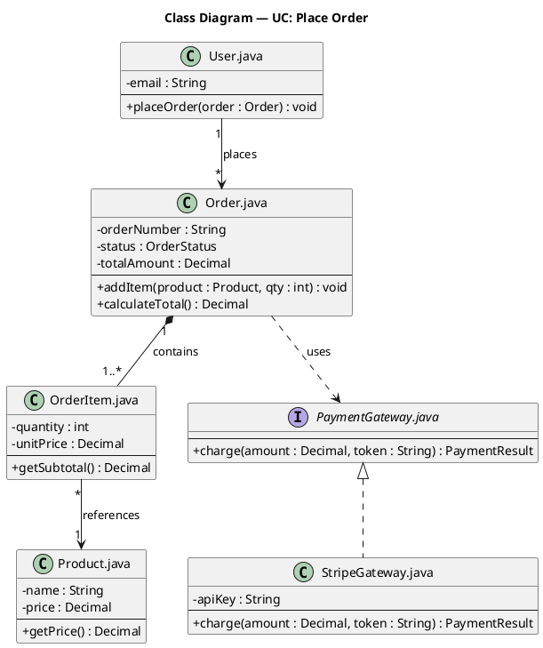

## Use this skill when

- Generating PlantUML class diagrams from source code or a description
- Visualizing classes, interfaces, attributes, methods, and relationships

## Do not use this skill when

- The task is unrelated to class diagrams
- You need sequence or package diagrams (use the corresponding skill)

## Instructions

### RULE 1 — Every block MUST have exactly 3 sections

Every class/interface block has this fixed structure — no exceptions:

```
class "Filename.ext" as Alias {
  section 1: UC-relevant attributes only
  --
  section 2: UC-relevant methods only
}
```

The block header is always the **source filename** (e.g., `"Order.java"`, `"user.service.ts"`). NEVER use class names, icons, stereotypes, or emojis in the header.

**Section 1 — Attributes**: Only attributes that participate in the use case. Use visibility markers (`+` `-` `#` `~`) and type annotations. If the class has no relevant attributes for this UC, leave the section empty above the `--` separator.

**Section 2 — Methods**: Only methods that participate in the use case. Same visibility and type rules. If the class has no relevant methods, leave the section empty below the `--` separator.

The `--` separator between attributes and methods is ALWAYS present, even when one section is empty:

```plantuml
' Has both attributes and methods for this UC
class "Order.java" as Order {
  - status : OrderStatus
  - totalAmount : Decimal
  --
  + calculateTotal() : Decimal
}

' Has no attributes relevant to this UC
class "AuthMiddleware.java" as AuthMiddleware {
  --
  + authenticate(token : String) : boolean
}

' Interface — no attributes, only method signatures
interface "PaymentGateway.java" as PaymentGateway {
  --
  + charge(amount : Decimal) : PaymentResult
}
```

### RULE 2 — Relationship symbols MUST be correct UML notation

Each relationship type has one specific PlantUML symbol. Do NOT mix them up:

| Relationship | PlantUML arrow | Visual meaning |
|---|---|---|
| **Association** | `-->` | solid line, open arrowhead |
| **Dependency** | `..>` | dashed line, open arrowhead |
| **Inheritance** (extends) | `<\|--` | solid line, closed triangle pointing to parent |
| **Realization** (implements) | `<\|..` | dashed line, closed triangle pointing to interface |
| **Aggregation** (has-a, shared) | `o--` | solid line, open diamond on the whole side |
| **Composition** (owns, exclusive) | `*--` | solid line, filled diamond on the owner side |

**Multiplicity**: Add labels where applicable — `"1" --> "*"`, `"0..1" o-- "1..*"`.

**Direction**: The arrow reads left-to-right or top-to-bottom. Parent/interface goes on the LEFT of `<|--` / `<|..`. Owner/whole goes on the LEFT of `*--` / `o--`.

### RULE 3 — Style

- `skinparam classAttributeIconSize 0` — removes icons from attributes and methods
- `skinparam shadowing false`
- Visibility: `+` public, `-` private, `#` protected, `~` package-private
- `{abstract}` for abstract classes/methods, `{static}` for static members
- Title: `title Class Diagram — UC: <Use Case Name>`
- Only include classes and members that participate in the UC

### Output

Write each `.puml` file to `docs/class-diagram/<name>.puml`. Create the folder if it does not exist. Use a descriptive filename based on the UC or module (e.g., `UC_PlaceOrder.puml`).

## Example output


