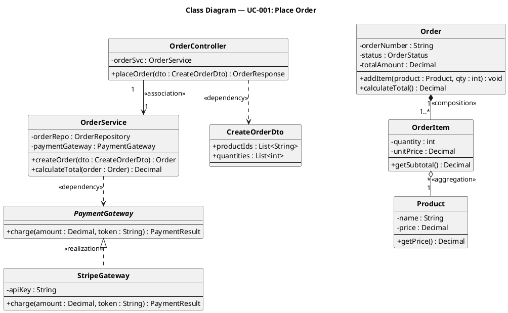

## Use this skill when

- Generating PlantUML class diagrams from source code or a description
- Visualizing classes, interfaces, attributes, methods, and relationships

## Do not use this skill when

- The task is unrelated to class diagrams
- You need sequence or package diagrams (use the corresponding skill)

## Instructions

### RULE 1 — Every block MUST have exactly 3 sections

Every class/interface block has this fixed structure — no exceptions:

```
class "ClassName" as Alias {
  section 1: UC-relevant attributes only
  --
  section 2: UC-relevant methods only
}
```

The block header is always the **class/service name** (e.g., `"OrderService"`, `"AccountEntity"`, `"CreateOrderDto"`). NEVER use source filenames, icons, stereotypes, or emojis in the header.

**Section 1 — Attributes**: List attributes that participate in the use case, including **constructor-injected dependencies** (DI fields). In NestJS, `constructor(private readonly x: X)` creates a class field — show it as `- x : X` in the attributes section. Use visibility markers (`+` `-` `#` `~`) and type annotations. If the class has no relevant attributes for this UC, leave the section empty above the `--` separator.

**Section 2 — Methods**: Only methods that participate in the use case. Same visibility and type rules. If the class has no relevant methods, leave the section empty below the `--` separator.

The `--` separator between attributes and methods is ALWAYS present, even when one section is empty:

```plantuml
' Has both attributes and methods for this UC
class "Order" as Order {
  - status : OrderStatus
  - totalAmount : Decimal
  --
  + calculateTotal() : Decimal
}

' Has no attributes relevant to this UC
class "AuthMiddleware" as AuthMiddleware {
  --
  + authenticate(token : String) : boolean
}

' Interface — no attributes, only method signatures
interface "PaymentGateway" as PaymentGateway {
  --
  + charge(amount : Decimal) : PaymentResult
}
```

### RULE 2 — Relationship symbols MUST be correct UML notation

Each relationship type has one specific PlantUML symbol. Do NOT mix them up:

| Relationship | PlantUML arrow | Visual meaning |
|---|---|---|
| **Association** | `-->` | solid line, open arrowhead |
| **Dependency** | `..>` | dashed line, open arrowhead |
| **Inheritance** (extends) | `<\|--` | solid line, closed triangle pointing to parent |
| **Realization** (implements) | `<\|..` | dashed line, closed triangle pointing to interface |
| **Aggregation** (has-a, shared) | `o--` | solid line, open diamond on the whole side |
| **Composition** (owns, exclusive) | `*--` | solid line, filled diamond on the owner side |

**Multiplicity**: Add labels where applicable — `"1" --> "*"`, `"0..1" o-- "1..*"`.

**Direction**: The arrow reads left-to-right or top-to-bottom. Parent/interface goes on the LEFT of `<|--` / `<|..`. Owner/whole goes on the LEFT of `*--` / `o--`.

### RULE 3 — Style

```
hide circle
skinparam classAttributeIconSize 0
skinparam shadowing false
skinparam linetype ortho
skinparam classFontStyle bold
skinparam classFontSize 14
skinparam nodesep 60
skinparam ranksep 40
```

- `hide circle` — removes the class/interface stereotype icon (the "C" / "I" circle)
- `skinparam classAttributeIconSize 0` — removes icons from attributes and methods
- `skinparam shadowing false` — flat look, no drop shadow
- `skinparam linetype ortho` — orthogonal (right-angle) connector lines
- `skinparam classFontStyle bold` — class name rendered **bold**
- `skinparam classFontSize 14` — class name larger than default body text
- Visibility: `+` public, `-` private, `#` protected, `~` package-private
- `{abstract}` for abstract classes/methods, `{static}` for static members
- Title: `title Class Diagram — UC-NNN: <Use Case Name>`
- Only include classes and members that participate in the UC

### RULE 4 — Choose the correct relationship type and label

Do NOT default to `-->` (association) for every relationship. Pick the one that matches the actual semantics.

**Labels MUST use the UML relationship keyword** — never use informal words like "uses", "calls", "receives", "creates", "contains", or "belongs to". Every relationship label is the keyword in guillemets:

| Situation | Symbol | Label |
|---|---|---|
| Class holds a long-lived reference to another (e.g., NestJS DI injection) | `-->` | `<<association>>` |
| Class uses another only as a parameter, return type, or local variable | `..>` | `<<dependency>>` |
| "Part" cannot exist without the "whole" (e.g., Entity with CASCADE delete FK) | `*--` | `<<composition>>` |
| "Part" can exist independently of the "whole" | `o--` | `<<aggregation>>` |
| Child extends a parent class | `<\|--` | `<<inheritance>>` |
| Class implements an interface | `<\|..` | `<<realization>>` |

Common patterns in NestJS projects:
- **Controller → Service** (DI): `-->` with `<<association>>`
- **Service → Repository** (DI): `-->` with `<<association>>`
- **Service → Service** (DI): `-->` with `<<association>>`
- **Controller ..> DTO**: `..>` with `<<dependency>>`
- **Repository ..> Entity**: `..>` with `<<dependency>>`
- **Parent Entity *-- Child Entity**: `*--` with `<<composition>>`

### Output

Write each `.puml` file to `docs/class-diagram/<name>.puml`. Create the folder if it does not exist. Use a descriptive filename based on the UC or module (e.g., `UC_PlaceOrder.puml`).

## Example output


