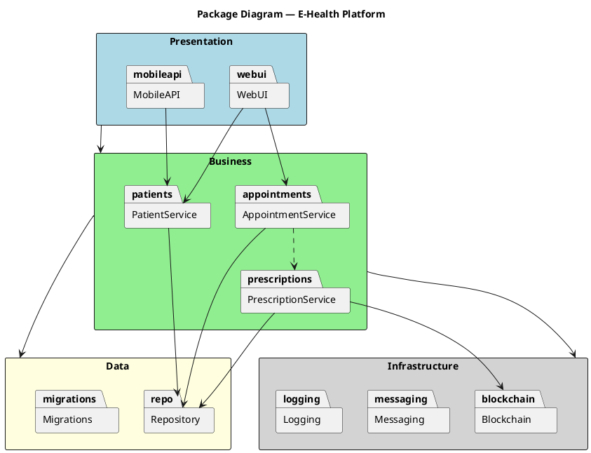

## Use this skill when

- Generating PlantUML package diagrams from a project structure or description
- Visualizing high-level modular structure — packages, sub-packages, and their dependencies

## Do not use this skill when

- The task is unrelated to package diagrams
- You need class or sequence diagrams (use the corresponding skill)

## Instructions

### Gather context

If the user points to specific source code or a project directory, read the relevant files to understand the package/module structure. If the user provides a textual description, use that instead.

### Identify packages and dependencies

- List all top-level packages/modules/namespaces.
- Identify sub-packages or nested modules.
- Map import/dependency relationships between packages.

### Style rules

- Use `skinparam packageStyle rectangle` for clean rectangles
- Color-code packages by layer if applicable (e.g., presentation, business, data)
- Use stereotypes like `<<framework>>`, `<<library>>`, `<<service>>` where helpful
- Keep arrow labels short — one or two words max
- Group related packages with `together { }` blocks when needed
- Add a title: `title Package Diagram — <Project Name>`

### Relationship arrows

| Arrow | Meaning |
|---|---|
| `-->` | Dependency (uses) |
| `..>` | Weak dependency |
| `<\|--` | Inheritance between packages |

### Output

Write each `.puml` file to `docs/package-diagram/<name>.puml`. Create the folder if it does not exist. Use a descriptive filename based on the project or module (e.g., `EHealthPlatform.puml`).

## Example output

