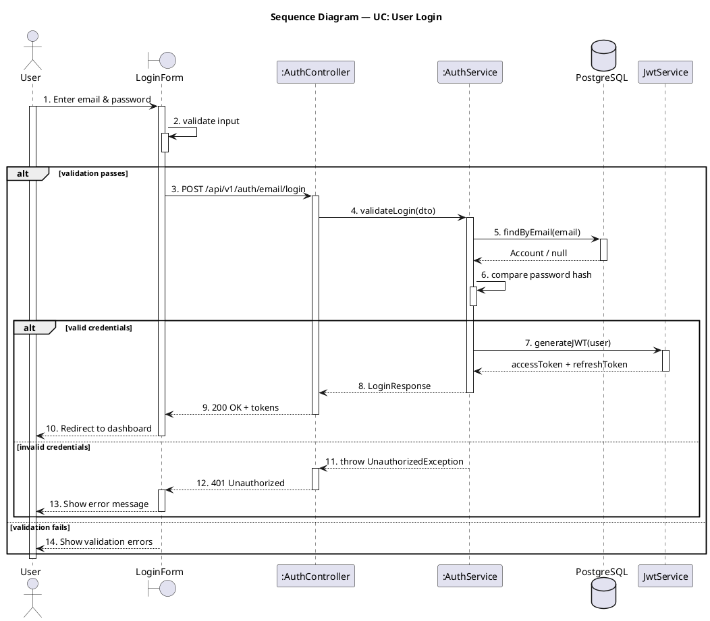

## Use this skill when

- Generating PlantUML sequence diagrams from a use case, API flow, or code path
- Visualizing chronological message flows between actors and components

## Do not use this skill when

- The task is unrelated to sequence diagrams
- You need class or package diagrams (use the corresponding skill)

## Instructions

### Gather context

If the user points to specific code (controller, API endpoint, service method), trace the call chain by reading the relevant files. If the user provides a textual description or use case, use that instead.

### RULE 1 — Numbered steps

Every message MUST be numbered with a continuous sequential number using dot format (`xx.`). No sub-numbering — just 1. 2. 3. 4. etc.:

```
1. action
2. sub-action
3. another action
4. next action
```

### RULE 2 — User activation bar

The actor (User) MUST have an activation bar. `activate user` goes right after the first message from the user. `deactivate user` appears ONLY ONCE at the very last action of the entire diagram. The user stays active through ALL branches (alt/else) — do NOT deactivate user inside branches.

### RULE 3 — Self-call before alt/opt blocks

Before any `alt` or `opt` block, the participant making the decision MUST have a self-call arrow showing what it is checking or validating. Every self-call MUST have a nested `activate`/`deactivate` to render a small activation bar on top of the existing one:

```plantuml
svc -> svc : 6. validate credentials
activate svc
deactivate svc
alt valid
  ...
else invalid
  ...
end
```

### RULE 4 — Correct participant types

| Type | When to use | PlantUML keyword |
|---|---|---|
| `actor` | Human users | `actor` |
| `boundary` | UI components (forms, pages, views) | `boundary` |
| `participant` | Controllers, services, business logic (rectangle box) | `participant` |
| `entity` | Domain entities, models | `entity` |
| `database` | Data stores | `database` |
| `queue` | Message queues | `queue` |

**UI/Frontend** components use `boundary`. **Controllers/Services** use `participant` (renders as a rectangle box). Do NOT use `control` for services.

### RULE 5 — Instance notation with `:`

If a service is a **new instance** created per request/per use case, prefix its name with `:` (UML object notation):

```plantuml
participant ":AuthService" as authSvc
participant ":AccountsService" as accSvc
```

If a service is a **singleton** (one instance handles all requests — e.g., a shared utility or global service), do NOT use `:`:

```plantuml
participant "JwtService" as jwt
database "PostgreSQL" as db
```

### Arrow conventions

| Arrow | Meaning |
|---|---|
| `->` | Synchronous call (solid line) |
| `-->` | Return / response (dashed line) |
| `->>` | Asynchronous message |
| `-->>` | Asynchronous return |

### Control flow blocks

- `alt` / `else` — conditional branches
- `opt` — optional steps
- `loop` — repetition
- `par` — parallel flows
- `group` — logical grouping

### RULE 6 — No note blocks, no separators

Do NOT use `note left of` / `note right of` / `note over`. Do NOT use `== Section ==` separators. Do NOT add parenthetical annotations like `(Zod)`, `(bcryptjs)`, `(async)` in message labels. Keep labels clean — just the action or method name. Keep the diagram as one continuous flow.

### RULE 7 — Activation bars and alt branch order

**Happy path FIRST**: Always put the happy/longer path as the FIRST `alt` branch and the error/shorter path as the `else` branch.

**Keep bars alive for else**: If a participant was active BEFORE an `alt` and is needed in the `else` branch, do NOT deactivate it at its last return in the happy path. Its bar will naturally continue into the `else` branch. Deactivate it in the `else` AFTER its last message.

**Deactivate after sending, activate after receiving in else**: In `else` branches, the error propagation chain follows this pattern — the sender deactivates AFTER sending, the receiver activates AFTER receiving:

```plantuml
else error case
  svc --> ctrl : 9. throw Exception
  deactivate svc
  activate ctrl
  ctrl --> form : 10. 422 error
  deactivate ctrl
  activate form
  form --> user : 11. Show error message
end
```

**Re-activate only when needed**: If a participant was deactivated earlier in the happy path (e.g., it finished its own work and returned), then it DOES need `activate` in the `else` branch before it can send/receive. Only participants whose bar was kept alive (not deactivated) skip the re-activate.

**Short-lived participants**: Participants that complete their work within a single call sequence (like `db`, `jwt`) should deactivate immediately after their return — they are not part of the alt-spanning chain.

**Follow real code logic**: Each participant's activation bar should match when that service is actually processing in the real code. If a service returns and is no longer doing work, deactivate it. If it's still involved, keep it active.

```plantuml
' CORRECT — accSvc active before alt and needed in else,
' so do NOT deactivate it in the happy path
accSvc -> accSvc : 8. check duplicates
activate accSvc
deactivate accSvc
alt no duplicates
  accSvc -> db : 9. save(Account)
  activate db
  db --> accSvc : Account
  deactivate db
  accSvc --> authSvc : 11. Account
  deactivate accSvc
  ' ... happy path continues ...
  authSvc --> ctrl : 18. response
  deactivate authSvc
  ctrl --> form : 19. 201 Created
  deactivate ctrl
  form --> user : 20. success
  deactivate form
else email already exists
  ' accSvc still has a bar here (was active before alt)
  accSvc --> authSvc : 28. throw UnprocessableEntityException
  deactivate accSvc
  activate authSvc
  authSvc --> ctrl : 29. 422 error
  deactivate authSvc
  activate ctrl
  ctrl --> form : 30. error response
  deactivate ctrl
  activate form
  form --> user : 31. Show error message
end

' WRONG — deactivating accSvc kills its bar in else
alt no duplicates
  accSvc --> authSvc : 11. Account
  deactivate accSvc      ' <-- kills bar in else!
else email already exists
  accSvc --> authSvc : 28. throw   ' <-- accSvc has no bar!
end
```

### RULE 8 — No duplicate step numbers across alt branches

Each step number is used exactly ONCE across the entire diagram. The `else` branch continues numbering from where the previous branch left off — do NOT restart or reuse numbers.

### RULE 9 — Return values must not be null

Return messages (`-->`) must always show a meaningful value or type, never `null`. Use the actual return type (e.g., `Account`, `UserProfile`, `Token`) or a result description. If a query may return empty, show `Account / null` to indicate both possibilities.

### Style rules

- Use `activate` / `deactivate` to show lifelines during processing
- Add a title: `title Sequence Diagram — UC: <Use Case Name>`

### Output

Write each `.puml` file to `docs/sequence-diagram/<name>.puml`. Create the folder if it does not exist. Use a descriptive filename based on the UC or flow (e.g., `UC_Signup.puml`).

## Example output



Note: In the `else` branch, each participant is deactivated AFTER sending and the receiver is activated AFTER receiving. `svc` was active before the inner alt so its bar continues into the else without re-activate. `auth` and `form` were active before the inner alt too, but `svc` deactivates them in the happy path — so they need `activate` in the else. In the outer `else validation fails`, `form` keeps its bar from the outer scope.
