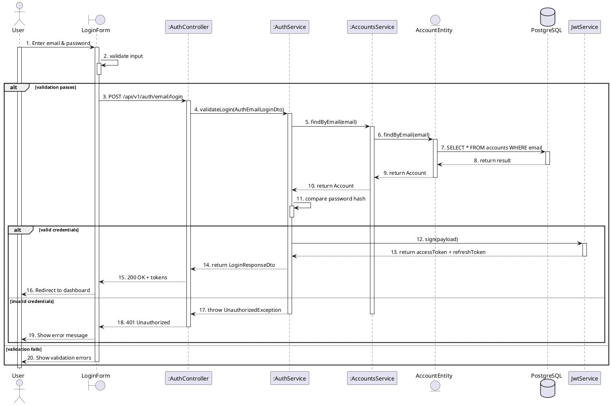

## Use this skill when

- Generating PlantUML sequence diagrams from a use case, API flow, or code path
- Visualizing chronological message flows between actors and components

## Do not use this skill when

- The task is unrelated to sequence diagrams
- You need class or package diagrams (use the corresponding skill)

## Instructions

### Gather context

If the user points to specific code (controller, API endpoint, service method), trace the call chain by reading the relevant files. If the user provides a textual description or use case, use that instead.

### RULE 1 — Numbered steps (ALL messages)

Every message — both forward calls (`->`) AND return/response messages (`-->`) — MUST be numbered with a continuous sequential number using dot format (`xx.`). No sub-numbering — just 1. 2. 3. 4. etc. There must be NO gaps and NO unnumbered messages:

```
5. findByEmail(email)        ← forward call
6. return Account             ← return message (also numbered!)
7. validatePassword(hash)    ← next forward call
```

Return messages (`-->`) MUST describe the actual data being returned — never use `void` and never use `/ null`. Use one of:
- The entity/type name: `return Account`, `return TokenEntity`
- A result description: `return deleted (affectedRows: 1)`, `return updated Account`
- For delete/update operations that don't return data: `return success`, `return acknowledged`
- For operations returning nothing meaningful: `return ok`

**WRONG:**
```
return Account     ← never use / null
```

**WRONG:**
```
db --> svc : void
svc --> ctrl : void
```

**CORRECT:**
```
6. return OtpToken
8. return verified Account
12. return deleted (affectedRows: 1)
```

### RULE 2 — Activation bar lifetime (activate once, deactivate once)

Every participant has exactly **ONE `activate`** and **ONE `deactivate`** (per alt branch that inherits the bar). The deactivate goes at the participant's **last use**.

**User/Actor**: `activate user` right after the first message. `deactivate user` ONLY ONCE at the very end. The user stays active through ALL branches.

**Boundary (UI)**: Activate when the user first interacts with it. Deactivate ONLY in the outermost `else validation fails`. Do NOT deactivate in any inner else.

**Controllers & Services**: Activate on the FIRST incoming call. Each participant has a single continuous bar — no gaps, no re-activation.

Where to deactivate depends on whether the participant is used in an `else` branch:
- **Used in an else**: Do NOT deactivate in the happy path. The bar carries into the else, and you deactivate there after its last send.
- **Not used in any else** (e.g., finished before the alt starts, or no alt at all): Deactivate after its last use in the normal flow.
- **Multiple participants called again later**: Keep bar running — no deactivate between calls.
- **Carried into an else branch but NOT used there**: Deactivate at the very START of that else branch (before any messages). PlantUML carries the bar in from the happy path, so you must explicitly close it even if the participant sends nothing in that branch.
- **Last use is inside an `opt` block**: NEVER deactivate inside the opt. Place `deactivate` AFTER the `opt end` keyword so the bar closes correctly whether or not the opt executes.

```plantuml
' CORRECT — accSvc last used inside opt; deactivate is AFTER end
opt attempts >= 5
  authSvc -> accSvc : 49. lockAccount(accountId, reason)
  ...
  accSvc --> authSvc : 54. return Account
end
deactivate accSvc   ← AFTER opt end, not inside

' WRONG
opt attempts >= 5
  accSvc --> authSvc : 54. return Account
  deactivate accSvc   ← WRONG: bar stays open when opt is skipped
end
```

```plantuml
' CORRECT — participant carried in but unused; deactivate at branch start
else account is LOCKED or SUSPENDED
  deactivate accSvc   ← carried in from happy path but not used here; close it first
  authSvc --> ctrl : 58. throw UnprocessableEntityException
  deactivate authSvc
  ctrl --> form : 59. 422 accountIsLOCKED
  deactivate ctrl
  form --> user : 60. Show account locked message
end
```

```plantuml
' CORRECT — authSvc and ctrl deactivate ONLY in else, not in happy path
alt account found
  authSvc -> jwt : 12. sign(payload)
  activate jwt
  jwt --> authSvc : 13. return token
  deactivate jwt

  authSvc --> ctrl : 14. return LoginResponseDto
  ' NO deactivate authSvc — bar carries to else

  ctrl --> form : 15. 200 OK
  ' NO deactivate ctrl — bar carries to else

  form --> user : 16. Navigate to dashboard
else account not found
  authSvc --> ctrl : 17. throw UnprocessableEntityException
  deactivate authSvc  ' deactivate HERE — last use

  ctrl --> form : 18. 422 error
  deactivate ctrl     ' deactivate HERE — last use

  form --> user : 19. Show error
  ' NO deactivate form — carries to outer else
end
```

```plantuml
' CORRECT — accSvc finishes BEFORE the alt, so deactivate immediately
accSvc --> authSvc : 10. return Account
deactivate accSvc  ' OK: accSvc not used in any else branch
```

```plantuml
' WRONG — deactivating in happy path AND else (double deactivate)
authSvc --> ctrl : 14. return LoginResponseDto
deactivate authSvc    ← WRONG: deactivating in happy path
...
else account not found
  authSvc --> ctrl : 17. throw
  deactivate authSvc  ← WRONG: second deactivate
```

```plantuml
' WRONG — re-activating in else (bars carry automatically)
else account not found
  activate authSvc    ← WRONG: bar already carries from happy path
  authSvc --> ctrl : 17. throw
```

**Database**: Activate per query, deactivate immediately after each response. One activate/deactivate pair per DB call.

**Entity**: Same as database — activate per call, deactivate after response. Short-lived participant.

**External services** (JwtService, ConfigService, etc.): Same as database — activate per call, deactivate after response. Short-lived participants.

### RULE 3 — Self-call before alt/opt blocks

Before any `alt` or `opt` block, the participant making the decision MUST have a self-call arrow showing what it is checking or validating. Every self-call MUST have a nested `activate`/`deactivate` to render a small activation bar on top of the existing one:

```plantuml
svc -> svc : 6. validate credentials
activate svc
deactivate svc
alt valid
  ...
else invalid
  ...
end
```

### RULE 4 — Correct participant types

| Type | When to use | PlantUML keyword |
|---|---|---|
| `actor` | Human users | `actor` |
| `boundary` | UI components (forms, pages, views) | `boundary` |
| `participant` | Controllers, services, business logic (rectangle box) | `participant` |
| `entity` | Domain entities, models | `entity` |
| `database` | Data stores | `database` |
| `queue` | Message queues | `queue` |

**UI/Frontend** components use `boundary`. **Controllers/Services** use `participant` (renders as a rectangle box). Do NOT use `control` for services.

### RULE 5 — Instance notation with `:`

If a service is a **new instance** created per request/per use case, prefix its name with `:` (UML object notation):

```plantuml
participant ":AuthService" as authSvc
participant ":AccountsService" as accSvc
```

If a service is a **singleton** (one instance handles all requests — e.g., a shared utility or global service), do NOT use `:`:

```plantuml
participant "JwtService" as jwt
database "PostgreSQL" as db
```

### RULE 10 — Boundary as gateway (User never calls Controller)

The User NEVER sends a message directly to a Controller or Service. All user actions go to the Boundary (UI component), then the Boundary forwards HTTP requests to the Controller:

```plantuml
' CORRECT flow
user -> form : 1. Enter email & password
user -> form : 2. Click "Sign In"
form -> ctrl : 3. POST /api/v1/...
ctrl --> form : 4. 200 OK
form --> user : 5. Show success

' WRONG — user directly calling controller
user -> ctrl : 1. POST /api/v1/...    ← NEVER DO THIS
ctrl --> user : 2. 200 OK             ← NEVER DO THIS
```

Similarly, Controller responses MUST return through the Boundary to the User. There are NO exceptions — never use `->> user` from a service.

### RULE 12 — Two user actions for every form submission

Every form interaction requires two sequential messages from User to Boundary:
1. **Fill/enter data**: `user -> form : 1. Enter email & password`
2. **Click submit button**: `user -> form : 2. Click "Sign In"`

Then the form validates and sends to the controller. Examples:
- Signup: "Fill firstName, lastName, email..." then "Click 'Sign Up'"
- OTP verification: "Input OTP" then "Click 'Verify OTP'"
- KYC submission: "Upload ID document" then "Click 'Submit KYC'"

### RULE 13 — Async email sends are self-calls, never arrows to user

Sending an email or notification is a side-effect of the service — it MUST be modeled as a self-call with activate/deactivate, NOT as an async arrow to the user actor:

```plantuml
' CORRECT
authSvc -> authSvc : 30. Send confirmation email
activate authSvc
deactivate authSvc

' WRONG
authSvc ->> user : 30. Send confirmation email   ← NEVER DO THIS
```

### RULE 14 — One use case per diagram (no collapsed flows)

A sequence diagram covers exactly ONE use case. If a UC page shows both "View List" and "View Detail", create separate diagrams. The list view diagram ends when the list is displayed to the user — do NOT append the detail flow as an `opt` or additional steps in the same diagram.

Similarly, view-list diagrams complete in a single round trip (user → controller → DB → controller → user) with no `opt` block at the bottom.

### RULE 11 — Entity always sits between Service and Database

In NestJS with TypeORM, there is no separate Repository or DAO layer. The Entity acts as the intermediary between Service and Database for ALL operations (reads AND writes). The architectural flow is:

**Boundary → Controller → Service → Entity → Database**

Every database interaction MUST pass through an Entity participant. Service NEVER calls Database directly.

Declare participants in this order: `actor → boundary → participant (controllers) → participant (services) → entity (entities) → database`.

Entities activate/deactivate per call (short-lived, same as database):

```plantuml
entity "AccountEntity" as accEntity
database "PostgreSQL" as db

' READ operation — service queries through entity
accSvc -> accEntity : 6. findByEmail(email)
activate accEntity
accEntity -> db : 7. SELECT * FROM accounts WHERE email
activate db
db --> accEntity : 8. return result
deactivate db
accEntity --> accSvc : 9. return Account
deactivate accEntity

' WRITE operation — service saves through entity
accSvc -> accEntity : 14. save(email, passwordHash, role, status)
activate accEntity
accEntity -> db : 15. INSERT INTO accounts
activate db
db --> accEntity : 16. return saved row
deactivate db
accEntity --> accSvc : 17. return Account
deactivate accEntity
```

```plantuml
' WRONG — service calling database directly (no entity)
accSvc -> db : 6. findByEmail(email)    ← NEVER DO THIS
db --> accSvc : 7. return Account        ← NEVER DO THIS
```

**DTOs**: DTOs are data-transfer objects passed as parameters in messages — they do NOT need their own participant. Show them in message labels: `ctrl -> svc : 4. register(AuthRegisterLoginDto)`.

### Arrow conventions

| Arrow | Meaning |
|---|---|
| `->` | Synchronous call (solid line) |
| `-->` | Return / response (dashed line) |
| `->>` | Asynchronous message |
| `-->>` | Asynchronous return |

### Control flow blocks

- `alt` / `else` — conditional branches
- `opt` — optional steps
- `loop` — repetition
- `par` — parallel flows
- `group` — logical grouping

### RULE 6 — No note blocks, no separators

Do NOT use `note left of` / `note right of` / `note over`. Do NOT use `== Section ==` separators. Do NOT add parenthetical annotations like `(Zod)`, `(bcryptjs)`, `(async)` in message labels. Keep labels clean — just the action or method name. Keep the diagram as one continuous flow.

### RULE 7 — Alt branch order and bar carrying

**Happy path FIRST**: Always put the happy/longer path as the FIRST `alt` branch and the error/shorter path as the `else` branch.

**PlantUML carries bars from happy path into else**: PlantUML carries the FIRST branch's END activation state into the `else` branch. Since bars are kept continuous (RULE 2), all participants that are still active at the end of the happy path automatically have bars in the `else` — no `activate` needed there.

**Else branches — deactivation only, no activation**: In else branches, NEVER write `activate`. Bars carry from the happy path. Only write `deactivate` after the participant's last send in that branch. See RULE 2 for which participants deactivate where.

**Nested alt**: With nested `alt` blocks, each `else` at each level must deactivate the participants whose bars carry into it:

```plantuml
alt account found
  alt password matches
    ... happy path — NO deactivation of authSvc, ctrl ...
    form --> user : 16. Navigate to dashboard
  else password does not match
    authSvc --> ctrl : 17. throw
    deactivate authSvc
    ctrl --> form : 18. 422 error
    deactivate ctrl
    form --> user : 19. Show error
  end
else account not found
  authSvc --> ctrl : 20. throw
  deactivate authSvc
  ctrl --> form : 21. 422 error
  deactivate ctrl
  form --> user : 22. Show error
end
' form still active — carries into:
else validation fails
  form --> user : 23. Show validation errors
  deactivate form
end
```

### RULE 8 — No duplicate step numbers across alt branches

Each step number is used exactly ONCE across the entire diagram. The `else` branch continues numbering from where the previous branch left off — do NOT restart or reuse numbers.

### RULE 9 — Return values must not be null or void

Return messages (`-->`) must always show a meaningful value or type, never `null`, never `void`, and never `/ null`. Use the actual return type (e.g., `return Account`, `return UserProfile`, `return Token`) or a result description. For write operations, describe what was written (e.g., `return saved Account`, `return deleted (affectedRows: 1)`). See RULE 1 for full return message formatting requirements.

### Style rules

- Use `activate` / `deactivate` to show lifelines during processing
- Do NOT add a `title` line — the diagram has no title

### Output

Write each `.puml` file to `docs/sequence-diagram/<name>.puml`. Create the folder if it does not exist. Use a descriptive filename based on the UC or flow (e.g., `UC_Signup.puml`).

## Example output



Key points demonstrated:
- No `title` line
- User → Boundary → Controller (never User → Controller directly)
- Controller → Boundary → User for responses (never Controller → User)
- Entity sits between Service and Database: `accSvc → accEntity → db → accEntity → accSvc`
- `accSvc` stays active from step 5 (no deactivate at step 10) — deactivated only in else
- `svc` and `auth` stay active until deactivated in the `else` branch
- `accEntity` and `db` activate/deactivate per call (short-lived)
- `form` bar carries into `else validation fails` (not deactivated in inner alt)
- All messages numbered sequentially with no gaps or reuse across branches
