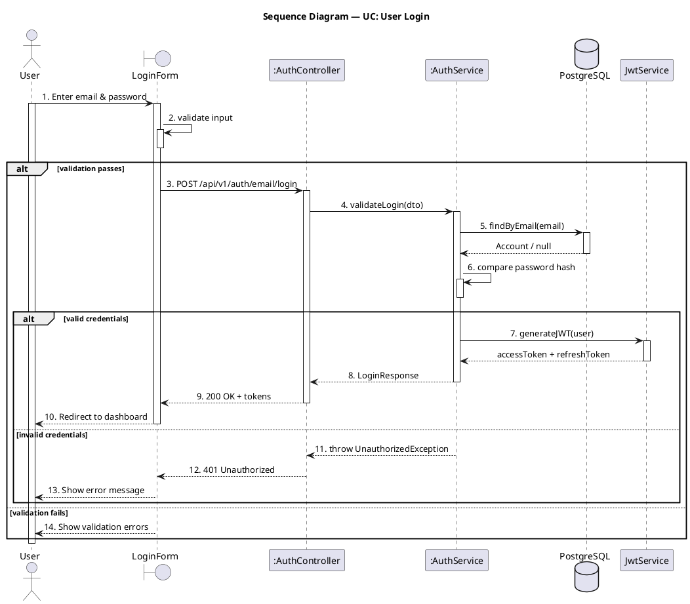

## Use this skill when

- Generating PlantUML sequence diagrams from a use case, API flow, or code path
- Visualizing chronological message flows between actors and components

## Do not use this skill when

- The task is unrelated to sequence diagrams
- You need class or package diagrams (use the corresponding skill)

## Instructions

### Gather context

If the user points to specific code (controller, API endpoint, service method), trace the call chain by reading the relevant files. If the user provides a textual description or use case, use that instead.

### RULE 1 — Numbered steps

Every message MUST be numbered with a continuous sequential number using dot format (`xx.`). No sub-numbering — just 1. 2. 3. 4. etc.:

```
1. action
2. sub-action
3. another action
4. next action
```

### RULE 2 — User activation bar

The actor (User) MUST have an activation bar. `activate user` goes right after the first message from the user. `deactivate user` appears ONLY ONCE at the very last action of the entire diagram. The user stays active through ALL branches (alt/else) — do NOT deactivate user inside branches.

### RULE 3 — Self-call before alt/opt blocks

Before any `alt` or `opt` block, the participant making the decision MUST have a self-call arrow showing what it is checking or validating. Every self-call MUST have a nested `activate`/`deactivate` to render a small activation bar on top of the existing one:

```plantuml
svc -> svc : 6. validate credentials
activate svc
deactivate svc
alt valid
  ...
else invalid
  ...
end
```

### RULE 4 — Correct participant types

| Type | When to use | PlantUML keyword |
|---|---|---|
| `actor` | Human users | `actor` |
| `boundary` | UI components (forms, pages, views) | `boundary` |
| `participant` | Controllers, services, business logic (rectangle box) | `participant` |
| `entity` | Domain entities, models | `entity` |
| `database` | Data stores | `database` |
| `queue` | Message queues | `queue` |

**UI/Frontend** components use `boundary`. **Controllers/Services** use `participant` (renders as a rectangle box). Do NOT use `control` for services.

### RULE 5 — Instance notation with `:`

If a service is a **new instance** created per request/per use case, prefix its name with `:` (UML object notation):

```plantuml
participant ":AuthService" as authSvc
participant ":AccountsService" as accSvc
```

If a service is a **singleton** (one instance handles all requests — e.g., a shared utility or global service), do NOT use `:`:

```plantuml
participant "JwtService" as jwt
database "PostgreSQL" as db
```

### Arrow conventions

| Arrow | Meaning |
|---|---|
| `->` | Synchronous call (solid line) |
| `-->` | Return / response (dashed line) |
| `->>` | Asynchronous message |
| `-->>` | Asynchronous return |

### Control flow blocks

- `alt` / `else` — conditional branches
- `opt` — optional steps
- `loop` — repetition
- `par` — parallel flows
- `group` — logical grouping

### RULE 6 — No note blocks, no separators

Do NOT use `note left of` / `note right of` / `note over`. Do NOT use `== Section ==` separators. Do NOT add parenthetical annotations like `(Zod)`, `(bcryptjs)`, `(async)` in message labels. Keep labels clean — just the action or method name. Keep the diagram as one continuous flow.

### RULE 7 — Activation bars and alt branch order

**Happy path FIRST**: Always put the happy/longer path as the FIRST `alt` branch and the error/shorter path as the `else` branch.

**PlantUML activation rule**: PlantUML carries the FIRST branch's END activation state into the `else` branch. If you `deactivate` a participant in the first branch, it has NO bar in the else. This applies at EVERY nesting level.

**Keep bars alive for else**: If a participant is needed in any `else` branch, its LAST activation in the first branch must NOT be followed by a `deactivate`. The bar carries naturally into the else.

**Nested alt — continuous bars**: When the happy path has multiple request-response cycles (e.g., booking + notification) inside nested alt blocks, do NOT deactivate and re-activate participants between cycles. Keep their bars continuous from first activation to the end. This ensures bars carry into ALL nested else branches:

```plantuml
' CORRECT — continuous bars through nested alt
ctrl -> svc : 4. create(dto)
activate svc

svc -> svc : 6. check condition
activate svc
deactivate svc
alt condition met
  svc -> db : 7. INSERT
  activate db
  db --> svc : Entity
  deactivate db

  svc --> ctrl : 8. Entity
  ' DON'T deactivate svc — keep bar for else

  ctrl --> form : 9. 201 Created
  ' DON'T deactivate ctrl — keep bar for else

  form --> user : 10. Show success
  ' DON'T deactivate form — keep bar for validation fails

  user -> ctrl : 11. POST follow-up request
  ' ctrl already active — NO activate needed

  ctrl -> svc : 12. doFollowUp()
  ' svc already active — NO activate needed

  svc --> ctrl : 13. result
  deactivate svc     ' deactivate at the very end

  ctrl --> user : 14. 200 OK
  deactivate ctrl    ' deactivate at the very end

  deactivate form    ' deactivate at the very end
else condition not met
  ' svc, ctrl, form all have bars (carried from first branch)
  svc --> ctrl : 15. throw Exception
  deactivate svc
  ctrl --> form : 16. 400 error
  deactivate ctrl
  form --> user : 17. Show error
  deactivate form
end

' WRONG — deactivate-reactivate kills bars in else
alt condition met
  svc --> ctrl : 8. Entity
  deactivate svc      ' kills bar
  ctrl --> form : 9. response
  deactivate ctrl     ' kills bar
  ...
  ctrl -> svc : 12. follow-up
  activate svc        ' re-activate creates new bar
  ...
  deactivate svc      ' end state: deactivated = no bar in else!
else condition not met
  svc --> ctrl : throw  ' svc has NO bar here!
end
```

**Deactivate after sending, activate after receiving in else**: In `else` branches where a participant already has a bar (carried from happy path), just deactivate it after its last send — no `activate` needed:

```plantuml
else error case
  svc --> ctrl : 9. throw Exception
  deactivate svc
  ctrl --> form : 10. 422 error
  deactivate ctrl
  form --> user : 11. Show error message
  deactivate form
end
```

**Re-activate only for participants that DON'T carry a bar**: If a participant was fully deactivated before the alt started (not part of the happy-path chain), it DOES need `activate` in the else.

**Short-lived participants**: Participants that complete their work within a single call (like `db`, `jwt`, `config`) should deactivate immediately after their return — they are not part of the alt-spanning chain.

**Form carries to validation fails**: Do NOT deactivate `form` (or the boundary) in the last else branch before `validation fails`. Its bar must carry into the outermost `else validation fails` block.

**Follow real code logic**: Each participant's activation bar should match when that service is actually processing in the real code. If a service returns and is no longer doing work, deactivate it — unless it's needed in an else branch.

### RULE 8 — No duplicate step numbers across alt branches

Each step number is used exactly ONCE across the entire diagram. The `else` branch continues numbering from where the previous branch left off — do NOT restart or reuse numbers.

### RULE 9 — Return values must not be null

Return messages (`-->`) must always show a meaningful value or type, never `null`. Use the actual return type (e.g., `Account`, `UserProfile`, `Token`) or a result description. If a query may return empty, show `Account / null` to indicate both possibilities.

### Style rules

- Use `activate` / `deactivate` to show lifelines during processing
- Add a title: `title Sequence Diagram — UC: <Use Case Name>`

### Output

Write each `.puml` file to `docs/sequence-diagram/<name>.puml`. Create the folder if it does not exist. Use a descriptive filename based on the UC or flow (e.g., `UC_Signup.puml`).

## Example output



Note: In the `else` branch, each participant is deactivated AFTER sending and the receiver needs no `activate` if its bar was carried from the first branch. `svc` was active before the inner alt so its bar continues into the else without re-activate. In the outer `else validation fails`, `form` keeps its bar from the outer scope.
