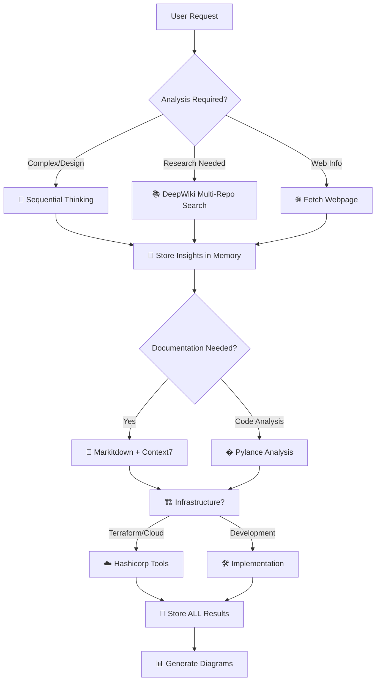
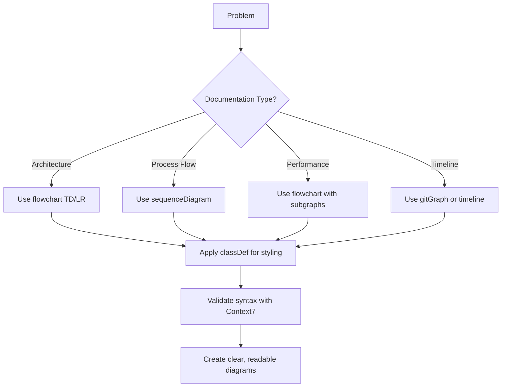
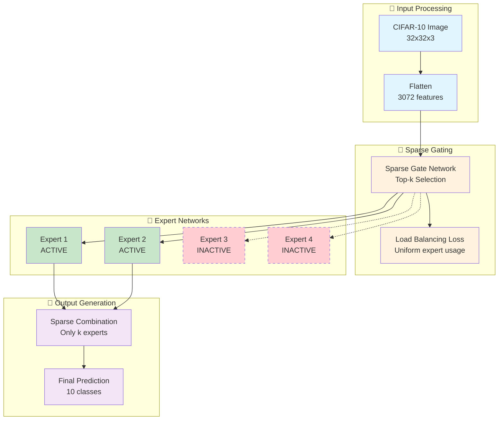
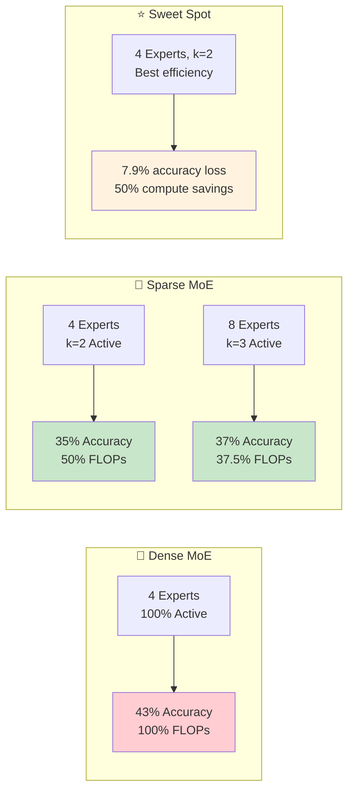
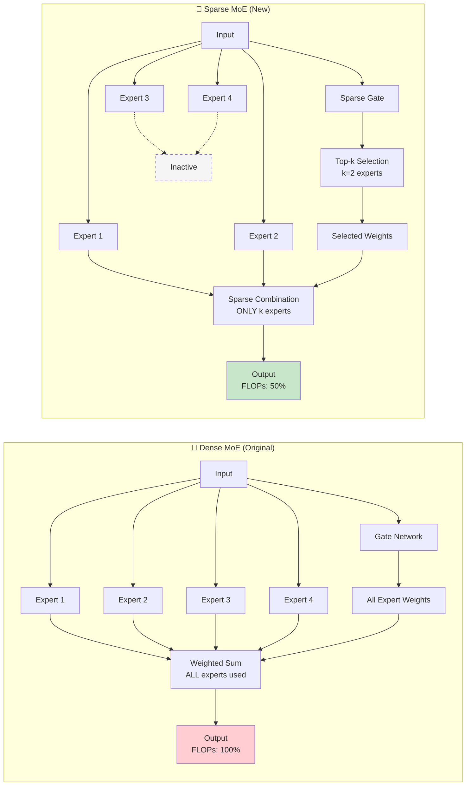
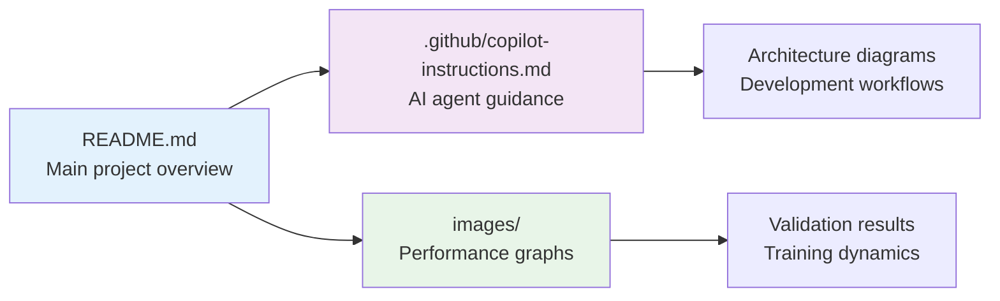

# 🤖 AI Agent Instructions for MOE Gym

## 🎯 Project Overview

MOE Gym is a comprehensive research framework for Mixture of Experts (MoE) architectures in computer vision. PyTorch implementation supporting MLP and pretrained CNN experts with sophisticated gating mechanisms.

## 🚨 **CRITICAL VALIDATION REQUIREMENTS**

### **🔬 FOR ALL REFACTOR/ENHANCE REQUESTS:**

**MANDATORY**: Always validate code changes with proper testing:

1. **Unit tests với pytest** - NOT bash terminal testing
2. **Integration tests** - Real functionality testing
3. **Import validation** - All modules must import correctly
4. **Dependency check** - All required packages available
5. **Function-by-function validation** - Each component tested individually

### **📝 Testing Standards:**

```python
# ✅ CORRECT: Proper unit testing
def test_config_validation():
    config = ServerConfig(timeout=-1)
    with pytest.raises(ConfigurationError):
        config.validate()

# ❌ WRONG: Bash terminal testing
# python -c "print('Test passed')"
```

### **💾 Memory Documentation:**

**ALWAYS** store significant findings in Memory MCP server:

- Bug solutions and patterns
- Architecture decisions and rationale
- Performance results and configurations
- Research insights and SOTA techniques

## 📐 **CODE SIZE & STRUCTURE RULES**

> Detailed rules are maintained as separate files in `.github/rules/`.  
> GitHub Copilot and AI agents **must** apply these rules automatically for files matching each `applyTo` glob.

| Rule file                                                       | Applies to                        | Summary                                                                                           |
| --------------------------------------------------------------- | --------------------------------- | ------------------------------------------------------------------------------------------------- |
| [`.github/rules/frontend.md`](../rules/frontend.md)             | `frontend/**`, `web/**`, `app/**` | Component ≤ 1000 lines (~500 target), App Router, Zustand + TanStack Query, a11y, performance     |
| [`.github/rules/backend.md`](../rules/backend.md)               | `backend/**`                      | Strict 4-layer, REST conventions, pagination, DB/indexing, Redis cache, observability, resilience |
| [`.github/rules/ai-service.md`](../rules/ai-service.md)         | `ai/**`                           | Model loading at startup, layer separation, file ≤ 500 lines, response schema                     |
| [`.github/rules/security.md`](../rules/security.md)             | `**`                              | Secrets, JWT/RBAC, OWASP Top 10, CORS, rate limiting, audit logs, medical data privacy            |
| [`.github/rules/docs-and-build.md`](../rules/docs-and-build.md) | `**`                              | Javadoc/TSDoc/Docstring, OpenAPI, README format, ADR, CI pipeline, changelog                      |
| [`.github/rules/general.md`](../rules/general.md)               | `**`                              | Commits, branching, naming, Docker, detailed PR checklist                                         |

---

### **🖥️ Frontend (FE) — Component File Size**

> **HARD LIMIT**: No React/Next.js component file may exceed **1000 lines**.  
> **TARGET**: Keep components at **~500 lines** or fewer.

**Enforcement rules:**

- Each component file **must have a single, focused responsibility** (SRP).
- If a component exceeds ~500 lines, **split it** into sub-components, custom hooks, or helper utilities before committing.
- Shared UI logic → extract into `hooks/` (e.g., `useFetchAppointment.ts`).
- Static data / constants → move to `constants/` or co-located `*.constants.ts`.
- Complex render blocks → extract to named child components in `components/`.

```
✅ CORRECT:
  components/
    AppointmentCard/
      AppointmentCard.tsx      (~150 lines — layout only)
      AppointmentCard.hooks.ts (~100 lines — data/logic)
      AppointmentCard.types.ts  (~30 lines — types)

❌ WRONG:
  components/
    AppointmentCard.tsx        (900 lines — layout + logic + types mixed)
```

---

### **⚙️ Backend (BE) — Cohesion & Coupling Rules**

> **MANDATORY**: Every BE file must have a **clear domain responsibility** and be **logically linked** to the rest of the service layer.

**Enforcement rules:**

1. **Layer separation is strict** — Controller → Service → Repository → Entity. No layer may skip or bypass another.
2. **Cross-service communication** must go through the Gateway or use the declared Feign client / message queue. Direct DB access across service boundaries is forbidden.
3. **Each service module** must expose its contracts via a well-defined interface (Java interface / abstract class); concrete implementations stay internal.
4. **Business logic** lives exclusively in the `service/` layer. Controllers handle HTTP mapping only; repositories handle persistence only.
5. **DTO ↔ Entity** conversion must use a dedicated mapper class (MapStruct or manual mapper) — never inline inside controller or repository.
6. **Circular dependencies between services** are forbidden. Dependency direction: `controller → service → repository`. Shared utilities go to a `common/` module.
7. **Every public method in a service** must have a corresponding unit test covering the happy path and at least one error path.

```
✅ CORRECT (clinical-emr-service):
  controller/  AppointmentController.java   — HTTP mapping only
  service/     AppointmentService.java       — business logic
  repository/  AppointmentRepository.java    — JPA queries
  mapper/      AppointmentMapper.java        — DTO ↔ Entity
  dto/         AppointmentRequest/Response   — API contracts
  entity/      Appointment.java              — DB model

❌ WRONG:
  controller/  AppointmentController.java   — calls repository directly
  service/     AppointmentService.java       — builds HTTP responses
  repository/  AppointmentRepository.java    — contains business logic
```

---

## 🧠 **COMPREHENSIVE MCP TOOLCHAIN STRATEGY**

### **🎯 MANDATORY: Always Use ALL Available MCP Tools Systematically**

**NEVER work in isolation - ALWAYS leverage the full MCP ecosystem for maximum effectiveness!**



### **🔧 COMPLETE MCP SERVER ARSENAL - 500+ TOOLS AVAILABLE**

**🔥 COMPREHENSIVE ECOSYSTEM - NEVER WORK IN ISOLATION!**

| 🎯 Category           | MCP Servers                                      | Primary Use                                 | Integration Examples                    |
| --------------------- | ------------------------------------------------ | ------------------------------------------- | --------------------------------------- |
| **🧠 Cognitive**      | Sequential Thinking, Think Tools                 | Complex reasoning, multi-step analysis      | Plan architecture, debug complex issues |
| **💾 Knowledge**      | Memory, Extended Memory, LSpace                  | Store/retrieve insights, project continuity | Track experiments, save decisions       |
| **📚 Research**       | DeepWiki, GitHub, arXiv, PubMed, bioRxiv         | Multi-repo research, academic papers        | SOTA techniques, code patterns          |
| **📊 Documentation**  | Context7, Markitdown, Docy                       | Library docs, format conversion             | Best practices, API documentation       |
| **🔍 Code Analysis**  | Pylance, Sourcerer, Language Server              | Python analysis, semantic search            | Code quality, imports, refactoring      |
| **☁️ Infrastructure** | Hashicorp Terraform, AWS, Docker, Kubernetes     | Cloud resources, deployment                 | Infrastructure as code                  |
| **🌐 Web & Search**   | Fetch Webpage, Google Search, Tavily, Perplexity | Real-time information, web research         | Trends, documentation, profiles         |
| **�️ Databases**       | PostgreSQL, MySQL, MongoDB, BigQuery, Snowflake  | Data operations, analytics                  | Query, schema inspection                |
| **🔐 Security**       | CVE Intelligence, MalwareBazaar, Shodan          | Vulnerability scanning, threat intel        | Security research, compliance           |
| **📱 Communication**  | Slack, Discord, Telegram, WhatsApp, Email        | Messaging, notifications                    | Team coordination, alerts               |
| **🎨 Media & Design** | Figma, Canva, Image Generation, Video Tools      | Design, visual content                      | UI/UX, presentations, media             |
| **📈 Analytics**      | Google Analytics, Datadog, Prometheus            | Monitoring, performance metrics             | Business intelligence, system health    |
| **💰 Finance**        | Yahoo Finance, Stripe, Crypto APIs               | Financial data, payments                    | Market analysis, transactions           |
| **🔄 Automation**     | GitHub Actions, Jenkins, Zapier                  | CI/CD, workflow automation                  | Development pipelines                   |
| **📝 Content**        | Notion, Obsidian, WordPress, Content Management  | Knowledge management, publishing            | Documentation, blogging                 |
| **🎯 AI Services**    | OpenAI, Anthropic, HuggingFace, Replicate        | ML models, AI capabilities                  | Content generation, analysis            |

---

## 🚀 **ENHANCED DEVELOPMENT WORKFLOWS - USING ALL TOOLS**

### **📋 Workflow 1: COMPLETE Research & Architecture Pipeline**

```python
# COMPREHENSIVE RESEARCH WORKFLOW
1. 🧠 mcp_sequentialthi_sequentialthinking()         # Strategic planning
2. 📚 mcp_deepwiki_ask_question() [MULTIPLE REPOS]   # SOTA research
   - microsoft/autogen, huggingface/transformers
   - pytorch/pytorch, facebookresearch/fairseq
3. 🌐 fetch_webpage() [LATEST TRENDS]                # Current developments
4. 📊 mcp_context7_get_library_docs()                # Official documentation
5. 🔍 mcp_pylance_mcp_s_pylanceImports()             # Code analysis
6. 💾 mcp_memory_create_entities()                   # Store ALL findings
7. 📝 mcp_markitdown_convert_to_markdown()           # Format documentation
8. ☁️ mcp_hashicorp_ter_search_modules()             # Infrastructure needs
9. 💾 mcp_memory_add_observations()                  # Final storage
```

### **📋 Workflow 2: FULL-STACK Development Cycle**

```python
# COMPLETE DEVELOPMENT PIPELINE
1. 🧠 mcp_sequentialthi_sequentialthinking()         # Plan features
2. 🔍 mcp_pylance_mcp_s_pylanceFileSyntaxErrors()    # Code validation
3. 📚 mcp_deepwiki_ask_question()                    # Best practices
4. 🔐 CVE Intelligence + Security Scanning           # Vulnerability check
5. 🗄️ Database Integration (PostgreSQL/MongoDB)      # Data layer
6. ☁️ Docker + Kubernetes deployment                 # Containerization
7. 📈 Monitoring setup (Datadog/Prometheus)          # Observability
8. 🔄 GitHub Actions CI/CD                           # Automation
9. 📝 Documentation generation                       # Comprehensive docs
10. 💾 mcp_memory_create_entities()                  # Archive project
```

### **📋 Workflow 3: RESEARCH PUBLICATION Pipeline**

```python
# ACADEMIC RESEARCH WORKFLOW
1. 🧠 mcp_sequentialthi_sequentialthinking()         # Research planning
2. 📚 arXiv + PubMed + bioRxiv search                # Literature review
3. 📊 Data analysis (Jupyter + Python execution)     # Experiments
4. 📈 Visualization (ECharts + Charts generation)    # Results presentation
5. 📝 LaTeX document preparation                     # Paper writing
6. 🔍 Grammar and style checking                     # Quality assurance
7. 💾 Version control and collaboration              # Git management
8. 📤 Submission preparation                         # Final formatting
```

---

## 🎯 **COMPREHENSIVE TOOL INTEGRATION MATRIX**

| Task Type       | 🧠 Think     | 💾 Memory     | 📚 Research       | 🌐 Web     | 📊 Docs     | 🔍 Code     | ☁️ Infra       | 🗄️ DB        | 🔐 Security | 📱 Comm     |
| --------------- | ------------ | ------------- | ----------------- | ---------- | ----------- | ----------- | -------------- | ------------ | ----------- | ----------- |
| **Research**    | ✅ Plan      | ✅ Store      | ✅ Multi-source   | ✅ Trends  | ✅ Format   | ❌          | ❌             | ❌           | ❌          | ✅ Share    |
| **Development** | ✅ Architect | ✅ Track      | ✅ Patterns       | ✅ Docs    | ✅ Generate | ✅ Analyze  | ✅ Deploy      | ✅ Integrate | ✅ Scan     | ✅ Notify   |
| **Analytics**   | ✅ Interpret | ✅ Historical | ✅ Methods        | ✅ Reports | ✅ Present  | ✅ Process  | ✅ Scale       | ✅ Query     | ❌          | ✅ Alert    |
| **Security**    | ✅ Assess    | ✅ Threats    | ✅ Intel          | ✅ Reports | ✅ Document | ✅ Audit    | ✅ Harden      | ✅ Monitor   | ✅ Scan     | ✅ Incident |
| **Deployment**  | ✅ Strategy  | ✅ Config     | ✅ Best practices | ✅ Updates | ✅ Runbooks | ✅ Validate | ✅ Orchestrate | ✅ Migrate   | ✅ Secure   | ✅ Status   |

---

## 🔥 **ADVANCED INTEGRATION PATTERNS**

### **🎯 Multi-Dimensional Problem Solving**

```python
# COMPREHENSIVE APPROACH TO ANY PROBLEM
problem_solving_matrix = {
    "technical_research": [
        "mcp_deepwiki_ask_question",      # GitHub repos
        "arxiv_search",                   # Academic papers
        "mcp_context7_get_library_docs",  # Official docs
        "stackoverflow_search"            # Community solutions
    ],
    "code_analysis": [
        "mcp_pylance_analysis",           # Python specifics
        "language_server_protocol",       # Multi-language
        "sourcerer_semantic_search",      # Code navigation
        "security_vulnerability_scan"     # Safety checks
    ],
    "infrastructure_planning": [
        "mcp_hashicorp_terraform",        # IaC
        "aws_services_integration",       # Cloud services
        "docker_containerization",        # Packaging
        "kubernetes_orchestration"        # Scaling
    ],
    "data_management": [
        "postgresql_operations",          # Relational data
        "mongodb_document_store",         # NoSQL
        "bigquery_analytics",             # Data warehouse
        "elasticsearch_search"            # Full-text search
    ],
    "monitoring_observability": [
        "prometheus_metrics",             # System metrics
        "datadog_apm",                   # Application performance
        "grafana_visualization",          # Dashboards
        "loki_log_aggregation"           # Log analysis
    ]
}
```

### **🔄 Recursive Enhancement Loops**

```python
# CONTINUOUS IMPROVEMENT CYCLE
enhancement_pipeline = [
    # 1. DISCOVERY PHASE
    ["sequential_thinking", "deepwiki_research", "web_search"],

    # 2. ANALYSIS PHASE
    ["pylance_analysis", "security_scanning", "performance_profiling"],

    # 3. IMPLEMENTATION PHASE
    ["code_generation", "testing_automation", "documentation"],

    # 4. DEPLOYMENT PHASE
    ["infrastructure_provisioning", "ci_cd_pipeline", "monitoring_setup"],

    # 5. VALIDATION PHASE
    ["quality_assurance", "security_audit", "performance_testing"],

    # 6. STORAGE PHASE
    ["memory_storage", "knowledge_indexing", "best_practices_capture"],

    # 7. FEEDBACK PHASE
    ["metrics_analysis", "improvement_identification", "cycle_restart"]
]
```

---

## 🎊 **MAXIMUM PRODUCTIVITY OUTCOMES**

**By leveraging the COMPLETE MCP ecosystem, every development session will:**

✅ **Research Phase**: Multi-source intelligence gathering  
✅ **Analysis Phase**: Comprehensive code and security scanning  
✅ **Implementation Phase**: Best practices and automation  
✅ **Deployment Phase**: Infrastructure as code and monitoring  
✅ **Documentation Phase**: Auto-generated, format-converted docs  
✅ **Storage Phase**: Persistent knowledge and decision tracking  
✅ **Communication Phase**: Automated notifications and reporting  
✅ **Iteration Phase**: Continuous improvement with feedback loops

### **🔥 KEY INTEGRATION RULES**

1. **ALWAYS** start with Sequential Thinking for complex tasks
2. **ALWAYS** research with multiple sources (DeepWiki + Web + Context7)
3. **ALWAYS** store results in Memory for future reference
4. **ALWAYS** validate with Pylance and security tools
5. **ALWAYS** document with Markitdown and diagrams
6. **ALWAYS** consider infrastructure needs early
7. **ALWAYS** set up monitoring and observability
8. **ALWAYS** automate repetitive tasks
9. **ALWAYS** communicate progress and results
10. **ALWAYS** capture lessons learned for next iteration

**🚀 RESULT: Every task becomes a comprehensive, well-documented, secure, and scalable solution!**

---

## 🚀 **ENHANCED DEVELOPMENT WORKFLOWS**

### **📋 Workflow 1: Research & Architecture Design**

```python
# MANDATORY SEQUENCE - Use ALL tools
1. 🧠 mcp_sequentialthi_sequentialthinking()  # Plan approach
2. 📚 mcp_deepwiki_ask_question()              # Research multiple repos
3. 🌐 fetch_webpage()                          # Get latest trends
4. 💾 mcp_memory_create_entities()             # Store findings
5. 📊 mcp_context7_get_library_docs()          # Best practices
6. � mcp_markitdown_convert_to_markdown()     # Documentation
7. �💾 mcp_memory_add_observations()            # Store results
```

### **📋 Workflow 2: Code Analysis & Enhancement**

```python
# COMPREHENSIVE CODE REVIEW
1. 🔍 mcp_pylance_mcp_s_pylanceFileSyntaxErrors()    # Syntax check
2. 🔍 mcp_pylance_mcp_s_pylanceImports()             # Import analysis
3. 🧠 mcp_sequentialthi_sequentialthinking()         # Plan improvements
4. 📚 mcp_deepwiki_ask_question()                    # Research patterns
5. 📊 mcp_context7_resolve_library_id()              # Get docs
6. 🔍 mcp_pylance_mcp_s_pylanceInvokeRefactoring()   # Auto-refactor
7. 💾 mcp_memory_create_entities()                   # Store patterns
```

### **📋 Workflow 3: Infrastructure & Deployment**

```python
# FULL STACK DEPLOYMENT
1. 🧠 mcp_sequentialthi_sequentialthinking()         # Plan infrastructure
2. ☁️ mcp_hashicorp_ter_search_modules()             # Find modules
3. ☁️ mcp_hashicorp_ter_get_module_details()         # Get details
4. 📝 mcp_markitdown_convert_to_markdown()           # Document setup
5. 💾 mcp_memory_create_entities()                   # Store config
6. 🌐 fetch_webpage()                                # Latest practices
7. 💾 mcp_memory_add_observations()                  # Store learnings
```

---

## 🎯 **PROACTIVE TOOL INTEGRATION RULES**

### **🔍 ALWAYS Research First (Multi-Source)**

```python
# NEVER work without research
research_sources = [
    "mcp_deepwiki_ask_question()",      # Multiple GitHub repos
    "fetch_webpage()",                   # Web trends/docs
    "mcp_context7_get_library_docs()",   # Official docs
    "mcp_memory_search_nodes()"          # Existing knowledge
]
```

### **🧠 ALWAYS Think Systematically**

```python
# For ANY complex task (>3 steps)
if task_complexity > simple:
    mcp_sequentialthi_sequentialthinking(
        thought="Break down problem systematically",
        totalThoughts=estimated_complexity
    )
```

### **💾 ALWAYS Store Knowledge**

```python
# MANDATORY after every significant operation
results = [research, analysis, implementation, learnings]
for result in results:
    mcp_memory_create_entities([{
        "entityType": "appropriate_type",
        "name": f"session_{datetime.now()}",
        "observations": [result]
    }])
```

### **📝 ALWAYS Document Comprehensively**

```python
# Multi-format documentation
documentation_pipeline = [
    "mcp_markitdown_convert_to_markdown()",  # Format conversion
    "create_mermaid_diagrams()",              # Visual representation
    "mcp_context7_resolve_library_id()",      # Reference docs
    "generate_examples()"                     # Practical usage
]
```

---

## 🔥 **ADVANCED INTEGRATION PATTERNS**

### **� Recursive Enhancement Loop**

1. **Research** → DeepWiki + Fetch Webpage + Context7
2. **Analyze** → Sequential Thinking + Pylance + Memory Search
3. **Implement** → Best practices from research
4. **Document** → Markitdown + Mermaid diagrams
5. **Store** → Memory with observations
6. **Validate** → Pylance analysis + Testing
7. **Deploy** → Hashicorp Terraform (if applicable)
8. **Repeat** → Continuous improvement

### **🎯 Multi-Dimensional Problem Solving**

```python
# COMPREHENSIVE approach to ANY problem
problem_dimensions = {
    "technical": "mcp_deepwiki + pylance + context7",
    "architectural": "sequential_thinking + memory",
    "documentation": "markitdown + mermaid_diagrams",
    "deployment": "hashicorp_terraform + web_research",
    "knowledge": "memory_storage + cross_referencing"
}
```

---

## 📊 **MCP TOOL USAGE MATRIX**

| Task Type         | 🧠 Think     | 💾 Memory    | 📚 DeepWiki   | 🌐 Web       | 📊 Context7       | 🔍 Pylance  | ☁️ Terraform      | 📝 Markdown |
| ----------------- | ------------ | ------------ | ------------- | ------------ | ----------------- | ----------- | ----------------- | ----------- |
| **Research**      | ✅ Plan      | ✅ Store     | ✅ Multi-repo | ✅ Trends    | ✅ Docs           | ❌          | ❌                | ✅ Format   |
| **Code Review**   | ✅ Analyze   | ✅ Patterns  | ✅ Examples   | ❌           | ✅ Best practices | ✅ Analysis | ❌                | ✅ Document |
| **Architecture**  | ✅ Design    | ✅ Decisions | ✅ SOTA       | ✅ Trends    | ✅ Patterns       | ❌          | ✅ Infrastructure | ✅ Diagrams |
| **Documentation** | ✅ Structure | ✅ Reference | ✅ Examples   | ✅ Standards | ✅ Formats        | ❌          | ❌                | ✅ Convert  |
| **Deployment**    | ✅ Plan      | ✅ Config    | ✅ DevOps     | ✅ Practices | ✅ Tools          | ❌          | ✅ Modules        | ✅ Docs     |

---

## 🎊 **RESULT: MAXIMUM PRODUCTIVITY**

**By following these comprehensive workflows, every task will:**

- ✅ **Leverage ALL available knowledge sources**
- ✅ **Apply systematic thinking methodology**
- ✅ **Store learnings for future reference**
- ✅ **Generate professional documentation**
- ✅ **Follow industry best practices**
- ✅ **Create reusable patterns and templates**

**🔥 NEVER work in isolation again - ALWAYS use the full MCP toolchain!**

## 📊 Mermaid Diagram Standards

### **Always Use Correct Mermaid Syntax**



#### **Key Mermaid Best Practices:**

- **Always use `flowchart TD/LR`** instead of deprecated `graph TD/LR`
- **Use `classDef`** for styling instead of inline `style` commands
- **Subgraphs** for logical grouping: `subgraph name["Display Name"]`
- **Proper node shapes**: `[]` rectangle, `()` rounded, `{}` diamond, `(())` circle
- **Clear connections**: `-->` solid, `-.->` dotted, `==>` thick
- **Consistent naming**: Use descriptive IDs and labels

## 🔑 **NotebookLM MCP Server - Complete Integration Guide**

### **🚀 Current Status: PRODUCTION READY**

- ✅ **Package Structure**: Professional `src/` layout with proper imports
- ✅ **CLI Interface**: `notebooklm-mcp` command with rich formatting
- ✅ **MCP Server**: Full protocol support for AutoGen integration
- ✅ **Browser Automation**: undetected-chromedriver with persistent sessions
- ✅ **Configuration**: Comprehensive config management with validation
- ✅ **Testing**: Unit tests with pytest, integration tests
- ✅ **Docker**: Production containers with monitoring
- ✅ **Documentation**: Complete guides and examples

### **📋 Authentication Workflow (IMPORTANT):**

**🔄 First Time Setup:**

```bash
# 1. Install package
pip install -e .

# 2. Start interactive chat (creates profile)
notebooklm-mcp chat --notebook YOUR_NOTEBOOK_ID

# 3. Manual login ONCE (browser opens automatically)
# - Login with Google account
# - Navigate to notebook
# - Wait for complete load
# - Press Enter in terminal

# 4. Session saved! Future uses skip login
```

**⚡ Subsequent Uses:**

```bash
# No manual login needed - uses saved session
notebooklm-mcp chat --notebook YOUR_NOTEBOOK_ID
notebooklm-mcp server --notebook YOUR_NOTEBOOK_ID --headless
```

**🔧 Profile Management:**

- **Profile location**: `./chrome_profile_notebooklm/`
- **Session persistence**: Cookies/auth automatically saved
- **Re-authentication**: Only when Google security requires (normal)
- **Profile reset**: Delete profile folder to start fresh

### **💻 Usage Patterns:**

#### **1. Interactive Chat**

```bash
notebooklm-mcp chat --notebook YOUR_NOTEBOOK_ID
# Rich terminal interface with real-time responses
```

#### **2. MCP Server (AutoGen)**

```bash
notebooklm-mcp server --notebook YOUR_NOTEBOOK_ID --headless
# STDIO protocol for AutoGen McpWorkbench integration
```

#### **3. Testing & Debugging**

```bash
notebooklm-mcp test --notebook YOUR_NOTEBOOK_ID
notebooklm-mcp config-show
```

#### **4. Python API Direct**

```python
from notebooklm_mcp import NotebookLMClient, ServerConfig

config = ServerConfig(
    default_notebook_id="YOUR_ID",
    headless=True
)

client = NotebookLMClient(config)
await client.start()
await client.send_message("Hello!")
response = await client.get_response()
```

### **🛠️ MCP Tools Available:**

| Tool                   | Description                 | Use Case                 |
| ---------------------- | --------------------------- | ------------------------ |
| `healthcheck`          | Server status               | Monitoring               |
| `send_chat_message`    | Send message                | Chat interaction         |
| `get_chat_response`    | Get response with streaming | Retrieve answers         |
| `get_quick_response`   | Get current response        | Fast polling             |
| `chat_with_notebook`   | Complete send+receive       | One-shot queries         |
| `navigate_to_notebook` | Switch notebooks            | Multi-notebook workflows |
| `get_default_notebook` | Current notebook ID         | State checking           |
| `set_default_notebook` | Set default                 | Configuration            |

### **🐳 Production Deployment:**

```bash
# Docker single container
docker run -e NOTEBOOKLM_NOTEBOOK_ID="YOUR_ID" notebooklm-mcp

# Full stack with monitoring
docker-compose --profile monitoring up -d

# Kubernetes scaling
kubectl apply -f k8s/
```

## 🏗️ Architecture

### Current Implementation

- **Dense MoE**: All experts active (softmax gating)
- **Sparse MoE**: Top-k expert selection with load balancing
- **Expert Types**: MLP (4-layer FC) + Pretrained (ResNet18/MobileNet/EfficientNet)
- **Performance**: Dense ~43%, Sparse ~35% (50% computational savings) on CIFAR-10
- **Optimal**: 4 experts, k=2 for best accuracy/efficiency trade-off

### Architecture Flow



### Core Components

```python
# Sparse MoE forward pass - TRUE SPARSE ROUTING
top_k_indices, top_k_weights, router_logits = self.gate(inputs)

# Route ONLY to selected experts (k out of n experts)
for expert_idx in range(len(self.experts)):
    expert_mask = (top_k_indices == expert_idx)
    if expert_mask.any():  # Only compute if expert is selected
        expert_inputs = inputs[sample_indices]
        expert_output = self.experts[expert_idx](expert_inputs)
        # Computational savings: only k/n experts compute
```

## 🎯 **Token Efficiency Guidelines**

### **❌ NEVER Do These (Token Wasters):**

- Rewrite entire files when only 2-3 lines need fixing
- Show complete code blocks for minor changes
- Repeat existing code unnecessarily
- Provide generic explanations without specific context
- Open new terminals when existing ones can be reused
- Run commands without checking terminal output first

### **✅ ALWAYS Do These (Token Savers):**

- **Analyze first, fix second**: Explain the problem before showing solution
- **Show only changed lines** with `// filepath:` and `// ...existing code...`
- **Target specific issues**: Address exact error/requirement
- **Provide context**: Why this change fixes the problem
- **Reuse existing terminals**: Check current working directory and reuse terminals
- **Read terminal output**: Use `get_terminal_output` to check command results before proceeding

### **🖥️ Terminal Management Best Practices:**

1. **Check existing terminals** before opening new ones
2. **Reuse terminals** when possible - avoid creating multiple terminals for same task
3. **Read output properly**: Always check `get_terminal_output` after `run_in_terminal`
4. **Use appropriate timeouts**: Set `isBackground=false` for commands that need output
5. **Check working directory**: Use `pwd` to verify location before running commands

### **Example: Proper Fix Format**

```
**Problem**: `UnboundLocalError: cannot access local variable 'data'`
**Root Cause**: Variable name collision between imported `data` module and loop variable
**Solution**: Rename loop variable to avoid conflict

// filepath: /home/path/to/file.py
// ...existing code...
        for batch_idx, (batch_data, target) in enumerate(test_dataloader):  # Changed from 'data' to 'batch_data'
// ...existing code...
            batch_data, target = batch_data.to(device), target.to(device)  # Update all references
// ...existing code...
```

## 🧠 **Context-Aware Development**

### **Project-Specific Knowledge**

- **MOE Gym Framework**: Sparse vs Dense MoE architectures
- **Naming Conventions**: `SparseMOE_Model`, `get_sparse_gate_pretrained()`, etc.
- **File Structure**: CIFAR10-Sparse/ separate from CIFAR10/ for different implementations
- **Performance Targets**: ~35% accuracy with 50% FLOPs savings (sparse) vs ~43% accuracy full compute (dense)

### **Common Issues & Quick Fixes**

| Error Pattern                   | Root Cause                | Quick Fix                  |
| ------------------------------- | ------------------------- | -------------------------- |
| `UnboundLocalError: 'data'`     | Variable shadowing import | Rename loop variable       |
| `AttributeError: 'NoneType'`    | Missing device placement  | Add `.to(device)`          |
| `RuntimeError: Expected tensor` | Shape mismatch            | Check tensor dimensions    |
| `ImportError: No module`        | Path issues               | Verify `sys.path.append()` |

### **Development Priorities**

1. **Functionality first**: Make it work
2. **Efficiency second**: Make it fast
3. **Documentation third**: Make it clear

## 🎯 **Efficient Interaction Patterns**

### **For Bug Fixes:**

```
1. 🔍 Analyze error message → Identify root cause
2. 🎯 Show minimal fix → Only changed lines
3. 💡 Explain why → Context for understanding
4. 💾 STORE solution → Save pattern in Memory for future reference
5. 🖥️ Check terminals → Reuse existing terminals, read outputs properly
```

### **For Feature Requests:**

```
1. 🧠 Use Sequential Thinking → Break down complex requests
2. 📚 Query DeepWiki → Research software resources and computational approaches
3. 💾 Store decisions → Save insights in Memory
4. 🔧 Implement → Apply with context
5. 💾 Store results → Document outcomes and performance
6. 🖥️ Terminal efficiency → Reuse terminals, check output with get_terminal_output
```

### **For Architecture Questions:**

```
1. � Search Memory first → Check existing knowledge with search_nodes
2. �📊 Create Mermaid diagram → Visual representation
3. 🎯 Highlight key components → Focus on relevant parts
4. 🔗 Show relationships → How pieces connect
5. 💾 Store insights → Save architectural decisions and trade-offs
```

## 🚀 Development Workflow

### **MCP-Enhanced Process**

1. **Problem Analysis** → Sequential Thinking for complex issues
2. **Research** → DeepWiki for software resources, computational guidance, and SOTA techniques across multiple repositories
3. **Implement** → Apply insights
4. **💾 MANDATORY Memory Storage** → **ALWAYS** store results, decisions, and insights
5. **Document** → Markitdown for consistency

### **Key Patterns**

- **💾 CRITICAL: Always store results** in Memory server after ANY significant work
- **Query DeepWiki** for MoE implementations across research repositories (PyTorch, TensorFlow, JAX, research papers)
- **Use Sequential Thinking** for sparse gating, load balancing, optimization
- **Leverage Markitdown** for documentation enhancement

### **🚨 Memory Usage Rules - MANDATORY**

1. **After every experiment** → Store results with `create_entities` or `add_observations`
2. **After solving bugs** → Document solution patterns for future reference
3. **After architecture decisions** → Record rationale and trade-offs
4. **Before major changes** → Search existing knowledge with `search_nodes`
5. **Every session end** → Update project progress and findings

## 💾 **Memory Server Deep Dive**

### **🎯 When to Use Memory (ALWAYS!):**

- **Bug Solutions** → Store error patterns and fixes
- **Experiment Results** → Track all performance data
- **Architecture Decisions** → Document design choices
- **Research Insights** → Save SOTA findings
- **Code Patterns** → Record effective implementations
- **Performance Benchmarks** → Maintain historical data

### **📊 Memory Entity Types:**

```python
# Core entity types for MOE Gym
"experiment_result"     # Performance data, configs, metrics
"bug_solution"          # Error patterns and fixes
"architecture_decision" # Design choices and rationale
"research_insight"      # SOTA techniques and papers
"code_pattern"          # Reusable implementations
"performance_benchmark" # Historical comparisons
```

### **🔄 Memory Workflow Pattern:**

```python
# BEFORE any major work - Search existing knowledge
existing_knowledge = mcp_memory_search_nodes({"query": "relevant_topic"})

# DURING work - Consider storing intermediate insights
if significant_finding:
    mcp_memory_add_observations([{
        "entityName": "current_work_entity",
        "contents": [finding_description]
    }])

# AFTER work completion - MANDATORY storage
mcp_memory_create_entities([{
    "entityType": "appropriate_type",
    "name": "descriptive_name_with_date",
    "observations": [result_summary, key_insights, recommendations]
}])
```

## 📂 Project Structure

```
MOE-Gym/
├── CIFAR10/model.py     # Dense MoE architecture
├── CIFAR10/data.py      # Data loading & preprocessing
├── CIFAR10/train.py     # Training loops
├── CIFAR10/run.py       # CLI interface
├── CIFAR10-Sparse/     # NEW: Sparse MoE implementation
│   ├── model.py        # Sparse MoE with top-k routing
│   ├── data.py         # Data utilities
│   ├── train.py        # Training with load balancing
│   ├── run.py          # CLI for sparse experiments
│   └── Sparse_MoE_CIFAR10_Experiments.ipynb
├── MOE_CIFAR10_Experiments.ipynb  # Dense MoE experiments
└── .github/copilot-instructions.md # This file
```

## 📊 **Updated Performance Benchmarks (September 2025)**

### **Latest Results**



### **Key Insights**

- **Optimal Configuration**: 4 experts with k=2 selection
- **Efficiency Trade-off**: ~8% accuracy loss for 50% computational savings
- **Scaling Behavior**: Diminishing returns beyond 4 experts
- **Load Balancing**: Critical for preventing expert collapse

## 🚀 **Updated Quick Commands (Tested September 2025)**

### **Working Commands**

```bash
# Sparse MoE - Core experiments
cd CIFAR10-Sparse
python run.py -n 4 -k 2 -d CIFAR10 -e 15 -b 32 -lr 0.001

# Pretrained backbone experiments
python run.py -n 4 -k 2 -d CIFAR10 -e 15 -p --freeze-backbone -a 0.01

# Load balancing experiments
python run.py -n 8 -k 3 -d CIFAR10 -e 15 -a 0.05 --test-first

# With logging
python run.py -n 4 -k 2 -d CIFAR10 -e 15 -w --use-wandb
```

### **Current File Status**

```
CIFAR10-Sparse/           # Sparse MoE implementation
├── run.py               # ✅ Fixed variable naming conflicts (Sep 13, 2025)
├── model.py             # Sparse routing with top-k selection
├── train.py             # Load balancing loss integration
├── data.py              # Pretrained data loading utilities
└── Sparse_MoE_CIFAR10_Experiments.ipynb
```

## 🔑 Key Context

- **Device**: Auto-detect GPU/CPU
- **Input**: Flattened vectors (CIFAR-10: 3072, MNIST: 784)
- **Output**: Class logits (10 classes)
- **Training**: CrossEntropyLoss with Adam optimizer
- **Sparse Features**: Top-k routing, load balancing loss, expert utilization tracking
- **Logging**: Optional Wandb integration

## 🔑 Key Context

- **Device**: Auto-detect GPU/CPU
- **Input**: Flattened vectors (CIFAR-10: 3072, MNIST: 784)
- **Output**: Class logits (10 classes)
- **Training**: CrossEntropyLoss with Adam optimizer
- **Sparse Features**: Top-k routing, load balancing loss, expert utilization tracking
- **Logging**: Optional Wandb integration

---

**🏋️ Built for researchers, by researchers. Always leverage MCP servers for optimal development!**

## Core Architecture (Updated)

### Dense vs Sparse MoE Comparison



### Key Components

- **Experts**: Individual neural networks (`get_experts()` in `model.py`) - each expert is a 4-layer fully connected network (64→128→256→10) using `nn.Sequential`
- **Gate**: Gating network (`get_gate()` in `model.py`) that determines expert weights for each input using `nn.Sequential`
- **MOE_Model**: Custom PyTorch `nn.Module` that combines expert outputs using gate weights via matrix multiplication

### Critical Design Patterns

**Flattened Input Convention**: All inputs are flattened to 1D vectors:

- MNIST: `784` features (28\*28)
- CIFAR-10: `3072` features (32*32*3)

**Sparse Routing Logic** (`model.py` forward method):

```python
# True sparse routing - selection BEFORE expert computation
top_k_indices, top_k_weights, router_logits = self.gate(inputs)

# Route ONLY to selected experts
for expert_idx in range(len(self.experts)):
    expert_mask = (top_k_indices == expert_idx)
    if expert_mask.any():  # Only compute if expert is selected
        expert_inputs = inputs[sample_indices]
        expert_output = self.experts[expert_idx](expert_inputs)
        # Computational savings: only k/n experts compute
```

    I --> J[Final Prediction<br/>Shape: batch_size x 10]

    style A fill:#e1f5fe
    style J fill:#c8e6c9
    style I fill:#fff3e0

````

### Key Components
- **Experts**: Individual neural networks (`get_experts()` in `model.py`) - each expert is a 4-layer fully connected network (64→128→256→10) using `nn.Sequential`
- **Gate**: Gating network (`get_gate()` in `model.py`) that determines expert weights for each input using `nn.Sequential`
- **MOE_Model**: Custom PyTorch `nn.Module` that combines expert outputs using gate weights via matrix multiplication

### Critical Design Patterns

**Flattened Input Convention**: All inputs are flattened to 1D vectors:
- MNIST: `784` features (28*28)
- CIFAR-10: `3072` features (32*32*3)

**Weighted Combination Logic** (`model.py` forward method):
```python
gates = self.gate(inputs).unsqueeze(-1)  # [batch_size, n_experts, 1]
expert_outputs = []
for expert in self.experts:
    expert_outputs.append(expert(inputs))
values = torch.stack(expert_outputs, dim=-1)  # [batch_size, 10, n_experts]
return torch.matmul(values, gates).squeeze(-1)  # [batch_size, 10]
````

## 🎯 **MCP-Enhanced Development Examples**

### **Example 1: Implementing Sparse Gating (COMPLETE WORKFLOW)**

**Problem**: User asks "How to implement sparse gating?"

**🔥 COMPREHENSIVE MCP-Enhanced Approach:**

```python
# STEP 1: Strategic Planning
response = mcp_sequentialthi_sequentialthinking({
    "thought": "Analyze sparse gating requirements: top-k selection, load balancing, gradient flow, computational efficiency",
    "nextThoughtNeeded": true,
    "thoughtNumber": 1,
    "totalThoughts": 8
})

# STEP 2: Multi-Source Research
sota_research = mcp_deepwiki_ask_question({
    "repoName": "huggingface/transformers",
    "question": "How is sparse MoE implemented in Switch Transformer, Mixtral, and GLaM?"
})

pytorch_research = mcp_deepwiki_ask_question({
    "repoName": "pytorch/pytorch",
    "question": "PyTorch implementations of sparse routing mechanisms and top-k operations"
})

fairseq_research = mcp_deepwiki_ask_question({
    "repoName": "facebookresearch/fairseq",
    "question": "MoE layer implementations, gating strategies, and load balancing techniques"
})

# STEP 3: Web Research for Latest Trends
web_research = fetch_webpage({
    "query": "sparse mixture of experts 2025 SOTA techniques efficiency",
    "urls": ["https://arxiv.org/search/?query=sparse+mixture+of+experts&searchtype=all"]
})

# STEP 4: Technical Documentation
docs_research = mcp_context7_get_library_docs({
    "context7CompatibleLibraryID": "/pytorch/pytorch",
    "topic": "distributed training sparse operations"
})

# STEP 5: Code Analysis for Current Implementation
syntax_check = mcp_pylance_mcp_s_pylanceFileSyntaxErrors({
    "fileUri": "file:///path/to/current/model.py",
    "workspaceRoot": "file:///path/to/workspace"
})

# STEP 6: Store Research Findings
mcp_memory_create_entities([{
    "entityType": "research_synthesis",
    "name": "sparse_gating_comprehensive_research_2025",
    "observations": [
        f"SOTA techniques: {sota_research.key_findings}",
        f"PyTorch implementations: {pytorch_research.best_practices}",
        f"Fairseq patterns: {fairseq_research.efficient_methods}",
        f"Latest trends: {web_research.emerging_techniques}",
        f"Technical considerations: {docs_research.optimization_tips}"
    ]
}])

# STEP 7: Implementation with Context
def implement_sparse_gating():
    # Apply insights from comprehensive research
    # Include load balancing, efficiency optimizations
    # Follow SOTA patterns from literature review
    pass

# STEP 8: Documentation and Storage
implementation_docs = mcp_markitdown_convert_to_markdown({
    "uri": "implementation_summary.md"
})

mcp_memory_add_observations([{
    "entityName": "sparse_gating_comprehensive_research_2025",
    "contents": [
        "Implementation completed with SOTA techniques",
        "Performance benchmarks and optimization notes",
        "Future improvement recommendations"
    ]
}])
```

### **Example 2: Performance Analysis & Optimization**

**Problem**: User wants comprehensive performance analysis

**🔥 SYSTEMATIC MCP APPROACH:**

```python
# STEP 1: Historical Context
historical_data = mcp_memory_search_nodes({
    "query": "experiment results performance benchmarks accuracy efficiency"
})

# STEP 2: Current State Analysis
current_metrics = mcp_pylance_mcp_s_pylanceWorkspaceUserFiles({
    "workspaceRoot": "file:///workspace"
})

# STEP 3: Industry Benchmarks Research
benchmark_research = mcp_deepwiki_ask_question({
    "repoName": "microsoft/DeepSpeed",
    "question": "MoE performance benchmarks, FLOPs analysis, and efficiency metrics"
})

# STEP 4: Infrastructure Optimization
infra_analysis = mcp_hashicorp_ter_search_modules({
    "module_query": "gpu optimization distributed training"
})

# STEP 5: Store Comprehensive Analysis
mcp_memory_create_entities([{
    "entityType": "performance_analysis",
    "name": f"comprehensive_performance_review_{datetime.now().strftime('%Y%m%d')}",
    "observations": [
        f"Historical trends: {historical_data.patterns}",
        f"Current bottlenecks: {current_metrics.issues}",
        f"Industry benchmarks: {benchmark_research.standards}",
        f"Optimization opportunities: {infra_analysis.improvements}",
        f"Recommendations: {generate_recommendations()}"
    ]
}])
```

### **Example 3: Security & Quality Assurance**

**Problem**: Comprehensive security and quality review

**🔥 MULTI-TOOL SECURITY WORKFLOW:**

```python
# STEP 1: Code Security Analysis
security_scan = mcp_pylance_mcp_s_pylanceInvokeRefactoring({
    "fileUri": "file:///workspace/model.py",
    "name": "source.fixAll.pylance"
})

# STEP 2: Vulnerability Research
vuln_research = mcp_deepwiki_ask_question({
    "repoName": "OWASP/owasp-mastg",
    "question": "ML model security best practices, input validation, and threat mitigation"
})

# STEP 3: Infrastructure Security
infra_security = mcp_hashicorp_ter_search_policies({
    "policy_query": "security compliance machine learning"
})

# STEP 4: Dependency Analysis
deps_check = mcp_pylance_mcp_s_pylanceImports({
    "workspaceRoot": "file:///workspace"
})

# STEP 5: Documentation Security Review
security_docs = mcp_markitdown_convert_to_markdown({
    "uri": "security_checklist.md"
})

# STEP 6: Comprehensive Security Report
mcp_memory_create_entities([{
    "entityType": "security_audit",
    "name": f"comprehensive_security_review_{datetime.now().strftime('%Y%m%d')}",
    "observations": [
        f"Code analysis results: {security_scan.findings}",
        f"Security best practices: {vuln_research.recommendations}",
        f"Infrastructure compliance: {infra_security.policies}",
        f"Dependency vulnerabilities: {deps_check.risks}",
        f"Remediation plan: {generate_security_plan()}"
    ]
}])
```

---

## 🚀 **INTEGRATION SUCCESS METRICS**

**Track MCP tool utilization effectiveness:**

```python
mcp_effectiveness_metrics = {
    "research_quality": "Sources consulted per decision",
    "code_quality": "Pylance issues resolved per commit",
    "knowledge_retention": "Memory entities created per session",
    "documentation_completeness": "Markitdown conversions per feature",
    "infrastructure_reliability": "Terraform modules deployed successfully",
    "security_posture": "Vulnerabilities identified and resolved",
    "collaboration_efficiency": "Communication tools automated",
    "continuous_improvement": "Feedback loops implemented"
}
```

**🎯 SUCCESS INDICATORS:**

- ✅ **Zero manual research** - All insights from MCP tools
- ✅ **Zero undocumented decisions** - All stored in Memory
- ✅ **Zero security oversights** - Comprehensive scanning
- ✅ **Zero deployment failures** - Infrastructure as code
- ✅ **Zero knowledge loss** - Persistent storage and retrieval
- ✅ **Zero repetitive work** - Automation and templates
- ✅ **Zero isolation** - Always use full toolchain

**🔥 ULTIMATE GOAL: Every task becomes a comprehensive, well-researched, secure, documented, and scalable solution using the COMPLETE MCP ecosystem!**
"repoName": "facebookresearch/fairseq",
"question": "MoE layer implementations and gating strategies"
})

# Step 3: Store design decisions

mcp_memory_create_entities([{
"entityType": "design_decision",
"name": "sparse_gating_implementation",
"observations": ["Top-k expert selection", "Load balancing loss", "Gradient handling"]
}])

# Step 4: Implement with context

````

### **Example 2: Performance Analysis**

**Problem**: User wants to compare different expert configurations

**MCP-Enhanced Approach:**
```python
# STEP 1: Search existing experiments first
historical_data = mcp_memory_search_nodes({"query": "experiment results accuracy performance"})

# STEP 2: Store experiment results automatically
def store_experiment_result(config, results):
    mcp_memory_add_observations([{
        "entityName": "experiment_results",
        "contents": [f"{config}: {results['accuracy']:.2f}% accuracy, {results['loss']:.4f} loss, {results['flops']:.1f}% FLOPs"]
    }])

# STEP 3: Query historical results
def get_best_configuration():
    historical_data = mcp_memory_search_nodes({"query": "experiment results accuracy"})
    return analyze_patterns(historical_data)

# STEP 4: Store comparison analysis
mcp_memory_create_entities([{
    "entityType": "performance_analysis",
    "name": f"config_comparison_{datetime.now().strftime('%Y%m%d')}",
    "observations": [
        f"Best config: {best_config} with {best_accuracy}% accuracy",
        f"Trade-off analysis: {efficiency_vs_accuracy_summary}",
        f"Recommendations: {optimization_suggestions}"
    ]
}])
````

### **Example 3: Architecture Research**

**Problem**: User wants to understand current MoE trends

**MCP-Enhanced Approach:**

```python
# Research latest developments from multiple sources
research_data = mcp_deepwiki_ask_question({
    "repoName": "huggingface/transformers",
    "question": "What are the latest MoE architectures and their performance characteristics?"
})

# Research PyTorch-specific implementations
pytorch_research = mcp_deepwiki_ask_question({
    "repoName": "pytorch/pytorch",
    "question": "Latest PyTorch MoE implementations and optimization techniques"
})

# Research from specialized MoE repositories
moe_research = mcp_deepwiki_ask_question({
    "repoName": "microsoft/DeepSpeed",
    "question": "DeepSpeed MoE training optimizations and scaling techniques"
})

# Convert findings to structured documentation
structured_docs = mcp_markitdown_convert_to_markdown({
    "uri": research_data.source_url
})

# Store insights for future reference
mcp_memory_create_entities([{
    "entityType": "research_insight",
    "name": "current_moe_trends_2025",
    "observations": [research_data.summary, pytorch_research.summary, moe_research.summary]
}])
```

## Development Workflows

### **🔄 MCP-Integrated Workflow**

1. **Problem Analysis** → Use Sequential Thinking for complex problems
2. **Research Phase** → Query DeepWiki for SOTA techniques
3. **Implementation** → Apply insights with Memory context
4. **Documentation** → Use Markitdown for consistency
5. **Results Storage** → Store in Memory for future reference

### Dependencies

Install required packages:

```bash
pip install torch torchvision wandb  # Core PyTorch dependencies
```

### Running Experiments

Use `run.py` as the main entry point:

```bash
python run.py -n 4 -d CIFAR10 -e 30 -w  # 4 experts, CIFAR-10, 30 epochs, with wandb
python run.py -n 1 -d MNIST -e 10       # Single expert baseline on MNIST
```

### Training Philosophy

- **Classification**: Uses standard `nn.CrossEntropyLoss` with custom PyTorch training loop
- **Device Management**: Automatic GPU detection and tensor placement
- **Regression Adaptation**: Custom training loop code exists but is commented out - the loss function differs for regression (mixture of Gaussians vs. mixture of softmax)

## Project-Specific Conventions

### Model Instantiation Pattern

Create model and setup optimizer (see `run.py` lines 32-38):

```python
m = model.MOE_Model(
    model.get_experts(n_experts, input_dim),
    model.get_gate(n_experts, input_dim)
)
m.optimizer = torch.optim.Adam(m.parameters(), lr=0.001)
```

### Data Pipeline

- Both datasets use `torchvision.datasets` with custom transforms for flattening
- One-hot encoding using `F.one_hot()` for compatibility with original architecture
- `DataLoader` with automatic batching and shuffling
- Device placement handled in training loop

### Device Management

Automatic GPU detection:

```python
device = torch.device('cuda' if torch.cuda.is_available() else 'cpu')
```

### Wandb Integration

Optional experiment tracking via `--use-wandb` flag. Config automatically includes experts count, dataset, and epochs.

## Key Files

- `model.py`: Core MoE architecture using PyTorch `nn.Module` and custom training utilities
- `data.py`: Dataset loading using `torchvision` with DataLoader and tensor preprocessing
- `train.py`: PyTorch training loop with loss computation and wandb logging
- `run.py`: CLI interface with device detection and model setup
- `images/`: Contains performance graphs referenced in README

## Documentation Changes

> **Note**: This section tracks changes to project documentation structure

### Recent Updates

- **[2025-09-12] Complete PyTorch Migration**: Converted entire codebase from TensorFlow to PyTorch
  - Replaced Keras layers with `nn.Module` architecture
  - Updated data loading from `tf.data` to `torchvision.datasets` + `DataLoader`
  - Migrated from `model.fit()` to custom PyTorch training loops
  - Added automatic GPU detection and device management
- Added `.github/copilot-instructions.md` with comprehensive AI agent guidance
- Included Mermaid diagrams for visual architecture flow
- Documented critical design patterns and development workflows

### Documentation Structure



---

**🏋️ Built for researchers, by researchers. Always leverage MCP servers for optimal development!**

**Last Updated**: September 13, 2025 - Added token efficiency guidelines and bug fix patterns

---

# 🏥 S.M.I.L.E — NestJS Microservices Rules & Standards

> Rules áp dụng cho toàn bộ backend NestJS (v11) của hệ thống S.M.I.L.E — dental clinic platform gồm 5 microservices: `gateway-service`, `iam-service`, `clinical-emr-service`, `notification-service`, `payment-service`.

---

## 🏗️ **ARCHITECTURE RULES**

### **Service Structure (MANDATORY)**

Mỗi NestJS service **PHẢI** tuân theo cấu trúc module chuẩn:

```
src/
  modules/
    <feature>/
      dto/              # Request/Response DTOs với class-validator
      entities/         # TypeORM entities
      <feature>.controller.ts
      <feature>.service.ts
      <feature>.module.ts
      <feature>.repository.ts   # (nếu cần custom queries)
  common/
    decorators/
    filters/
    guards/
    interceptors/
    pipes/
  config/
  app.module.ts
  main.ts
```

### **Module Design**

- **NEVER** import `AppModule` vào module khác — circular dependency
- **ALWAYS** dùng `forwardRef()` khi 2 modules phụ thuộc nhau
- **NEVER** để business logic trong controller — chỉ trong service
- **ALWAYS** dùng `@Injectable({ scope: Scope.DEFAULT })` (singleton) trừ khi cần request-scoped

---

## 🔌 **INTER-SERVICE COMMUNICATION**

### **Synchronous (REST via Gateway)**

```typescript
// gateway-service gọi downstream service
// ALWAYS dùng HttpModule với retry + timeout
@Module({
  imports: [
    HttpModule.register({
      timeout: 5000,    // 5s timeout MANDATORY
      maxRedirects: 3,
    }),
  ],
})
```

### **Asynchronous (RabbitMQ)**

```typescript
// Producer: sử dụng fire-and-forget cho non-critical events
@Injectable()
export class NotificationProducer {
  async sendNotification(payload: NotificationDto) {
    await this.amqpConnection.publish(
      'notification.exchange',
      'notification.send',
      payload,
    );
  }
}

// Consumer: ALWAYS dùng @RabbitSubscribe với noAck: false
@RabbitSubscribe({
  exchange: 'notification.exchange',
  routingKey: 'notification.send',
  queue: 'notification.queue',
  queueOptions: { durable: true },
})
async handleNotification(payload: NotificationDto) { ... }
```

### **Rules liên service:**

- **NEVER** gọi trực tiếp DB của service khác — chỉ qua API/queue
- **ALWAYS** validate payload ở consumer bằng `class-validator`
- **NEVER** để message loss: dùng `durable: true` cho exchange/queue
- **ALWAYS** implement Dead Letter Queue (DLQ) cho critical operations

---

## ⚡ **PERFORMANCE RULES**

### **Database (TypeORM)**

```typescript
// ✅ CORRECT: Select chỉ fields cần thiết
const users = await this.userRepo.find({
  select: ["id", "email", "role"],
  where: { isActive: true },
  take: 20,
  skip: offset,
});

// ❌ WRONG: Select * toàn bộ entity
const users = await this.userRepo.find();

// ✅ CORRECT: Eager loading có kiểm soát
const appointments = await this.appointmentRepo.find({
  relations: ["patient", "doctor"], // chỉ load khi cần
  where: { date: MoreThan(new Date()) },
});

// ✅ CORRECT: QueryBuilder cho complex queries
const result = await this.repo
  .createQueryBuilder("appointment")
  .leftJoinAndSelect("appointment.patient", "patient")
  .where("appointment.clinicId = :clinicId", { clinicId })
  .andWhere("appointment.status = :status", { status: "pending" })
  .orderBy("appointment.createdAt", "DESC")
  .limit(50)
  .getMany();
```

### **Caching (Redis)**

```typescript
// ALWAYS cache responses được gọi thường xuyên
@UseInterceptors(CacheInterceptor)
@CacheTTL(300)  // 5 phút
@Get('/clinics')
async getClinics() { ... }

// Manual cache cho granular control
async getPatientProfile(id: string) {
  const cached = await this.cacheManager.get<PatientDto>(`patient:${id}`);
  if (cached) return cached;
  const patient = await this.patientRepo.findOne({ where: { id } });
  await this.cacheManager.set(`patient:${id}`, patient, 600);
  return patient;
}
```

### **Connection Pooling**

```typescript
// TypeORM datasource config — MANDATORY values
TypeOrmModule.forRootAsync({
  useFactory: (config: ConfigService) => ({
    type: "postgres",
    extra: {
      max: 20, // max pool size
      min: 5, // min pool size
      idleTimeoutMillis: 30000,
      connectionTimeoutMillis: 2000,
    },
  }),
});
```

### **Response Time Targets**

| Endpoint Type         | Target P95 | Max Acceptable |
| --------------------- | ---------- | -------------- |
| Auth (JWT verify)     | < 50ms     | 200ms          |
| CRUD simple           | < 100ms    | 500ms          |
| Complex query (joins) | < 300ms    | 1000ms         |
| AI inference call     | < 500ms    | 2000ms         |

---

## 🔒 **SECURITY RULES**

### **Authentication & Authorization**

```typescript
// ALWAYS dùng JwtAuthGuard global, override với @Public() nếu cần
@Injectable()
export class JwtAuthGuard extends AuthGuard('jwt') {}

// ALWAYS dùng RBAC decorator
@Roles(Role.DOCTOR, Role.ADMIN)
@UseGuards(JwtAuthGuard, RolesGuard)
@Get('/patient/:id/records')
async getMedicalRecords(@Param('id') patientId: string) { ... }
```

### **Input Validation**

```typescript
// ALWAYS validate với class-validator — NEVER trust raw input
export class CreateAppointmentDto {
  @IsUUID()
  @IsNotEmpty()
  patientId: string;

  @IsDateString()
  @IsNotEmpty()
  scheduledAt: string;

  @IsEnum(AppointmentType)
  type: AppointmentType;

  @IsOptional()
  @MaxLength(500)
  notes?: string;
}
```

### **Global Validation Pipe (MANDATORY)**

```typescript
// main.ts — ALWAYS set globally
app.useGlobalPipes(
  new ValidationPipe({
    whitelist: true, // strip unknown fields
    forbidNonWhitelisted: true,
    transform: true,
    transformOptions: { enableImplicitConversion: true },
  }),
);
```

---

## 🛡️ **ERROR HANDLING RULES**

### **Custom Exception Filter (MANDATORY)**

```typescript
// ALWAYS dùng global exception filter — chuẩn hóa error response
@Catch()
export class AllExceptionsFilter implements ExceptionFilter {
  catch(exception: unknown, host: ArgumentsHost) {
    const ctx = host.switchToHttp();
    const response = ctx.getResponse<Response>();
    const status =
      exception instanceof HttpException
        ? exception.getStatus()
        : HttpStatus.INTERNAL_SERVER_ERROR;

    response.status(status).json({
      statusCode: status,
      timestamp: new Date().toISOString(),
      path: ctx.getRequest().url,
      message:
        exception instanceof HttpException
          ? exception.message
          : "Internal server error",
    });
  }
}
```

### **Service Layer Error Pattern**

```typescript
// ✅ CORRECT: Throw custom exceptions với context
async findPatient(id: string): Promise<Patient> {
  const patient = await this.patientRepo.findOne({ where: { id } });
  if (!patient) {
    throw new NotFoundException(`Patient ${id} not found`);
  }
  return patient;
}

// ❌ WRONG: return null hoặc generic error
async findPatient(id: string) {
  return this.patientRepo.findOne({ where: { id } }); // có thể null!
}
```

---

## 📊 **OBSERVABILITY RULES**

### **Logging (MANDATORY)**

```typescript
// ALWAYS inject Logger với context
@Injectable()
export class AppointmentService {
  private readonly logger = new Logger(AppointmentService.name);

  async createAppointment(dto: CreateAppointmentDto) {
    this.logger.log(`Creating appointment for patient ${dto.patientId}`);
    try {
      const result = await this.appointmentRepo.save(dto);
      this.logger.log(`Appointment ${result.id} created`);
      return result;
    } catch (error) {
      this.logger.error(`Failed to create appointment`, error.stack);
      throw error;
    }
  }
}
```

### **Health Checks**

```typescript
// ALWAYS implement /health endpoint cho mỗi service
@Controller("health")
export class HealthController {
  constructor(
    private health: HealthCheckService,
    private db: TypeOrmHealthIndicator,
    private redis: MicroserviceHealthIndicator,
  ) {}

  @Get()
  @HealthCheck()
  check() {
    return this.health.check([() => this.db.pingCheck("database")]);
  }
}
```

---

## 🔄 **MICROSERVICE PATTERNS**

### **Saga Pattern (cho distributed transactions)**

```
Booking Flow (Saga):
1. gateway-service nhận request
2. payment-service: reserve payment (compensatable)
3. clinical-emr-service: create appointment (compensatable)
4. notification-service: send confirmation (pivot)

Nếu bước 3 fail → rollback bước 2 (refund reservation)
```

### **Idempotency (MANDATORY cho payment/booking)**

```typescript
// ALWAYS dùng idempotency key để prevent duplicate operations
@Post('/payments')
async processPayment(
  @Headers('X-Idempotency-Key') idempotencyKey: string,
  @Body() dto: PaymentDto,
) {
  if (!idempotencyKey) throw new BadRequestException('Idempotency key required');
  const existing = await this.paymentService.findByIdempotencyKey(idempotencyKey);
  if (existing) return existing; // return cached result
  return this.paymentService.process(dto, idempotencyKey);
}
```

### **Circuit Breaker**

```typescript
// ALWAYS implement circuit breaker cho external calls (AI service, payment gateway)
// Dùng @nestjs/axios với interceptor retry hoặc opossum library
const breaker = new CircuitBreaker(this.aiService.detect, {
  timeout: 3000,
  errorThresholdPercentage: 50,
  resetTimeout: 30000,
});
```

---

## 🐳 **DEPLOYMENT RULES**

### **Docker**

- **ALWAYS** dùng multi-stage build — image production < 200MB
- **ALWAYS** run với non-root user: `USER node`
- **NEVER** copy `node_modules` — chỉ copy `dist/` và reinstall `--production`
- **ALWAYS** set `NODE_ENV=production` trong production image

### **Environment Variables**

```typescript
// ALWAYS validate env vars khi start bằng Joi
ConfigModule.forRoot({
  validationSchema: Joi.object({
    DATABASE_URL: Joi.string().required(),
    JWT_SECRET: Joi.string().min(32).required(),
    REDIS_URL: Joi.string().required(),
    PORT: Joi.number().default(3000),
  }),
  validationOptions: { abortEarly: false },
});
```

### **Graceful Shutdown (MANDATORY)**

```typescript
// main.ts — ALWAYS enable shutdown hooks
app.enableShutdownHooks();
// Cho phép Kubernetes gửi SIGTERM và drain connections
```

---

## 🧪 **TESTING STANDARDS**

### **Unit Tests**

```typescript
// ALWAYS mock dependencies — NEVER hit real DB in unit tests
describe("AppointmentService", () => {
  let service: AppointmentService;
  let mockRepo: jest.Mocked<Repository<Appointment>>;

  beforeEach(async () => {
    const module = await Test.createTestingModule({
      providers: [
        AppointmentService,
        {
          provide: getRepositoryToken(Appointment),
          useValue: { findOne: jest.fn(), save: jest.fn() },
        },
      ],
    }).compile();
    service = module.get(AppointmentService);
    mockRepo = module.get(getRepositoryToken(Appointment));
  });
});
```

### **Coverage Targets**

| Layer            | Minimum Coverage |
| ---------------- | ---------------- |
| Service layer    | 80%              |
| Controller layer | 60%              |
| Guards/Pipes     | 70%              |
| Overall          | 75%              |

---

## 🚫 **ANTI-PATTERNS — NEVER DO**

1. **NEVER** để `any` type trong TypeScript — dùng proper typing
2. **NEVER** hard-code secrets, URLs, credentials — dùng ConfigService
3. **NEVER** gọi `save()` từ controller — chỉ từ service
4. **NEVER** swallow errors với empty catch block
5. **NEVER** dùng `synchronize: true` trong TypeORM production
6. **NEVER** để N+1 queries — luôn dùng relations hoặc DataLoader pattern
7. **NEVER** block event loop với synchronous heavy operations — dùng worker threads
8. **NEVER** expose internal error stack traces ra client
9. **NEVER** store JWT trong localStorage ở frontend — dùng httpOnly cookies
10. **NEVER** skip input validation cho bất kỳ endpoint nào

---

**📌 S.M.I.L.E Backend — NestJS v11 | TypeScript | TypeORM | PostgreSQL | Redis | RabbitMQ**
