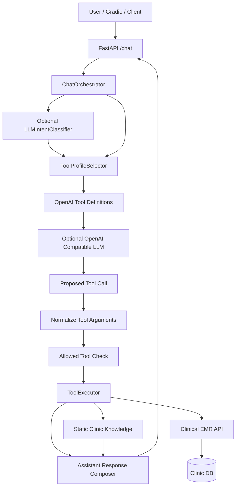

# AI Booking Orchestrator - Current Flow

Last updated: 2026-05-28

This document summarizes the current implementation of the AI Booking flow in
`ai/booking_orchestrator`. It is a code-level overview for development,
debugging, testing, and future refactoring.

## 1. Purpose

The Booking Orchestrator is a FastAPI service that receives chat messages and
routes them to a constrained set of backend tools for dental appointment
workflows.

Main goals:

- Support Vietnamese dental appointment chat.
- Keep the LLM untrusted.
- Expose only tools allowed by the current intent/profile.
- Validate every tool argument with Pydantic before execution.
- Send all appointment writes to Clinical EMR instead of mutating data locally.
- Preserve safety boundaries for medical/triage messages.

Current supported workflow groups:

- Clinic information.
- Service information and duration.
- Appointment booking.
- Appointment rescheduling.
- Appointment cancellation.
- Waitlist.
- Safety/handoff.

## 2. Runtime Components

Main files:

| File | Responsibility |
| --- | --- |
| `src/main.py` | FastAPI app, dependency wiring, HTTP endpoints. |
| `src/config.py` | Environment-based settings. |
| `src/schemas/chat.py` | `/chat` request and response models. |
| `src/agent/chat_orchestrator.py` | Main orchestration flow. |
| `src/agent/intent_classifier.py` | Optional LLM-based semantic intent classifier. |
| `src/agent/tool_router.py` | Deterministic profile and tool selection. |
| `src/agent/conversation_state.py` | Trusted state schema and routing decision schema. |
| `src/tools/schemas.py` | Pydantic schemas for all tool inputs and OpenAI tool definitions. |
| `src/tools/executor.py` | Tool validation and execution against static knowledge or Clinical EMR. |
| `src/llm/client.py` | OpenAI-compatible LLM client and tool-call parser. |
| `src/llm/fake.py` | Test LLM client for deterministic tool-call tests. |
| `src/knowledge/static.py` | Static clinic/service knowledge. |
| `src/ui/gradio_app.py` | Local Gradio UI for manual testing. |

## 3. High-Level Architecture



The important safety property is that the LLM never directly changes
appointments. It can only propose a tool call. The router decides which tools
are exposed, Pydantic validates arguments, and Clinical EMR owns all writes.

## 4. API Entrypoints

Defined in `src/main.py`.

### Health

```http
GET /health
```

Returns:

```json
{"status":"healthy","service":"booking_orchestrator"}
```

### Chat

```http
POST /chat
```

Request model from `src/schemas/chat.py`:

```python
class ChatRequest(BaseModel):
    session_id: str = Field(min_length=1, max_length=255)
    message: str = Field(min_length=1, max_length=2000)
    conversation_state: dict[str, Any] = Field(default_factory=dict)
```

Response model:

```python
class ChatResponse(BaseModel):
    session_id: str
    assistant_response: str
    selected_profile: str
    exposed_tools: list[str]
    metadata: dict[str, Any] = Field(default_factory=dict)
```

### Direct Proxy Endpoints

These are convenience/test endpoints that call Clinical EMR through
`ClinicalEmrToolClient`:

- `GET /services`
- `GET /slots`
- `POST /slots/{slot_id}/hold`
- `POST /bookings/confirm`
- `POST /appointments/{appointment_id}/cancel`
- `POST /appointments/{appointment_id}/reschedule`
- `POST /waitlist`

## 5. Configuration

Defined in `src/config.py`.

```python
class Settings(BaseSettings):
    app_name: str = "S.M.I.L.E Booking Orchestrator"
    app_port: int = 7777
    llm_base_url: str = "http://localhost:8000/v1"
    llm_api_key: str = "local-dev-key"
    llm_model: str = "smile-agent"
    llm_enabled: bool = False
    llm_temperature: float = 0.0
    llm_max_tokens: int = 256
    clinical_emr_base_url: str = "http://localhost:3004"
    clinical_emr_api_prefix: str = "/api/v1"
    clinical_emr_internal_token: str | None = None
```

Important runtime modes:

- `LLM_ENABLED=false`: `/chat` performs deterministic routing and exposes
  selected tool schemas, but does not call the LLM and does not execute normal
  non-safety tool calls from chat. Direct proxy endpoints still work.
- `LLM_ENABLED=true`: `/chat` can call the OpenAI-compatible model for intent
  classification and tool-call selection. Tool execution remains gated by the
  router and Pydantic schemas.

## 6. Conversation State

Defined in `src/agent/conversation_state.py`.

The orchestrator treats `conversation_state` as trusted context from the client
or UI. It is used to resolve multi-turn follow-ups such as "giữ slot đó" or
"xác nhận lịch này".

Current fields:

```python
class ConversationState(BaseModel):
    active_intent: str | None = None
    last_profile: str | None = None
    service_id: str | None = None
    selected_slot_id: str | None = None
    hold_id: str | None = None
    appointment_id: str | None = None
    clinic_id: str | None = None
    dentist_id: str | None = None
    preferred_date: str | None = None
    patient_session_id: str | None = None
    changed_by: str | None = None
    cancelled_by: str | None = None
    cancellation_reason: str | None = None
    patient: PatientState = Field(default_factory=PatientState)
    pending_action: str | None = None
```

Required booking confirmation fields:

```python
def has_complete_booking_confirmation(self) -> bool:
    return bool(
        self.hold_id
        and self.service_id
        and self.patient.has_required_contact()
    )
```

The router returns a `RoutingDecision` in metadata:

```python
class RoutingDecision(BaseModel):
    decision: Literal[
        "ALLOW_TOOL_PROFILE",
        "ASK_FOR_MISSING_INFO",
        "SAFETY_OVERRIDE",
        "FALLBACK_INFO",
    ]
    reason: str
    confidence: Literal["HIGH", "MEDIUM", "LOW"]
    pending_action: str | None = None
    missing_fields: list[str] = Field(default_factory=list)
    state_update: dict[str, Any] = Field(default_factory=dict)
    blocked_tools: list[str] = Field(default_factory=list)
```

## 7. Intent Classification

Defined in `src/agent/intent_classifier.py`.

The semantic classifier is optional and only exists when `LLM_ENABLED=true`.
It asks the LLM for a JSON-only intent result.

Allowed intents:

```python
IntentName = Literal[
    "info",
    "service",
    "booking",
    "reschedule",
    "cancel",
    "waitlist",
    "safety",
    "out_of_scope",
    "unknown",
]
```

Classifier output:

```python
class IntentClassification(BaseModel):
    intent: IntentName = "unknown"
    confidence: float = Field(default=0.0, ge=0.0, le=1.0)
    requires_clinical_triage: bool = False
    reason: str = ""

    @property
    def is_actionable(self) -> bool:
        return self.confidence >= 0.55 and self.intent != "unknown"
```

Prompt direction:

- Return JSON only.
- Choose exactly one intent.
- Classify by supported capability, not fixed entities or examples.
- Use `safety` when medical handoff or clinical triage is needed.
- Use `out_of_scope` only when the request cannot be handled by appointment,
  clinic info, service, waitlist, or safety handoff capabilities.

PII handling:

- The classifier currently sends only `{"message": message}` to the LLM.
- It does not send the full patient state.

Triage override:

```python
if (
    payload.get("requires_clinical_triage") is True
    and payload.get("intent") != "out_of_scope"
):
    payload = {**payload, "intent": "safety"}
```

## 8. Tool Profiles

Defined in `src/agent/tool_router.py`.

Current profiles:

```python
class ToolProfile(str, Enum):
    INFO = "INFO_PROFILE"
    SERVICE = "SERVICE_PROFILE"
    BOOKING = "BOOKING_PROFILE"
    RESCHEDULE = "RESCHEDULE_PROFILE"
    CANCEL = "CANCEL_PROFILE"
    WAITLIST = "WAITLIST_PROFILE"
    SAFETY = "SAFETY_PROFILE"
```

Profile-to-tool matrix:

| Profile | Exposed tools |
| --- | --- |
| `INFO_PROFILE` | `get_clinic_info`, `search_clinic_knowledge` |
| `SERVICE_PROFILE` | `get_services`, `estimate_service_duration` |
| `BOOKING_PROFILE` | `get_services`, `estimate_service_duration`, `get_available_slots`, `hold_slot`, `confirm_booking`, `release_hold` |
| `RESCHEDULE_PROFILE` | `get_available_slots`, `hold_slot`, `reschedule_appointment`, `release_hold`, `send_email_notification` |
| `CANCEL_PROFILE` | `cancel_appointment`, `check_waitlist_matches`, `send_email_notification` |
| `WAITLIST_PROFILE` | `add_to_waitlist`, `check_waitlist_matches`, `send_email_notification` |
| `SAFETY_PROFILE` | `classify_medical_risk`, `create_handoff_ticket`, `summarize_for_dentist`, `send_email_notification` |

Current router behavior:

1. Parse trusted `conversation_state`.
2. Use semantic `detected_intent` when available and actionable.
3. Route `out_of_scope` to fallback info with no tools exposed.
4. Route `safety` to safety override.
5. Use deterministic workflow gates for cancel/reschedule/waitlist/booking.
6. Use active multi-turn intent from state when present.
7. Fall back to service/info/booking keyword hints.
8. Fall back to `INFO_PROFILE` with low confidence.

The router no longer uses hardcoded subject guards such as human/object/animal
classification. Scope and triage are intended to come from the semantic
classifier, with deterministic state gates for workflow safety.

## 9. Tool Schemas

Defined in `src/tools/schemas.py`.

Current registered tools:

```python
TOOL_SCHEMAS = {
    "get_clinic_info": GetClinicInfoInput,
    "search_clinic_knowledge": SearchClinicKnowledgeInput,
    "get_services": GetServicesInput,
    "estimate_service_duration": EstimateServiceDurationInput,
    "get_available_slots": GetAvailableSlotsInput,
    "hold_slot": HoldSlotInput,
    "confirm_booking": ConfirmBookingInput,
    "release_hold": ReleaseHoldInput,
    "reschedule_appointment": RescheduleAppointmentInput,
    "cancel_appointment": CancelAppointmentInput,
    "add_to_waitlist": AddToWaitlistInput,
    "check_waitlist_matches": CheckWaitlistMatchesInput,
    "send_email_notification": SendEmailNotificationInput,
    "classify_medical_risk": ClassifyMedicalRiskInput,
    "create_handoff_ticket": CreateHandoffTicketInput,
    "summarize_for_dentist": SummarizeForDentistInput,
}
```

Validation examples:

- UUID fields use a strict UUID regex.
- `HoldSlotInput.ttl_seconds` must be `60 <= ttl_seconds <= 600`.
- `ConfirmBookingPatientInput.phone` accepts only phone-safe characters.
- Email fields must contain `@` when provided.
- Date strings from LLM can be coerced from ISO datetime to date for
  `get_available_slots`.

OpenAI tool definitions are generated from these schemas:

```python
def openai_tool_definitions(tool_names: list[str]) -> list[dict[str, Any]]:
    definitions = []
    for name in tool_names:
        schema = TOOL_SCHEMAS[name]
        definitions.append({
            "type": "function",
            "function": {
                "name": name,
                "description": f"Công cụ backend đã được xác thực: {name}",
                "parameters": schema.model_json_schema(),
            },
        })
    return definitions
```

## 10. Main `/chat` Flow

Implemented by `ChatOrchestrator.process()`.

Pseudo-flow:

```python
def process(request: ChatRequest) -> ChatResponse:
    intent_classification = self._classify_intent(request)

    selection = self.profile_selector.select_profile(
        latest_user_message=request.message,
        conversation_state=request.conversation_state,
        detected_intent=(
            intent_classification.intent
            if intent_classification and intent_classification.is_actionable
            else None
        ),
    )

    tool_definitions = openai_tool_definitions(selection.tools)

    metadata = {
        "tool_schemas": tool_definitions,
        "matched_keywords": selection.matched_keywords,
        "routing": selection.routing.model_dump(),
        "llm": {"used": False},
    }

    if selection.profile != ToolProfile.SAFETY and LLM is enabled:
        llm_response = llm.chat(...)
        tool_call = llm.parse_tool_call(llm_response)
        tool_call = normalize_tool_call(tool_call, request)
        if not tool_call:
            tool_call = deterministic_tool_call(selection.tools, request)
        if tool_call:
            metadata["tool_result"] = execute_allowed_tool(
                tool_call,
                allowed_tools=selection.tools,
            )

    if selection.profile == ToolProfile.SAFETY:
        execute bounded safety tools
        compose safety response
    else:
        compose response from tool result
        or return default assistant response
```

Important gates:

- Safety profile does not call the LLM for tool execution.
- Non-safety tool calls execute only when `LLM_ENABLED=true` and an LLM client
  exists.
- Tool calls outside the selected profile are rejected with `TOOL_NOT_ALLOWED`.
- Missing required workflow fields block mutating tools.

## 11. LLM Tool Calling

Defined in `src/llm/client.py`.

The LLM client supports:

- Standard OpenAI-compatible `tool_calls`.
- Qwen-style or text fallback `<tool_call>...</tool_call>` JSON payloads.
- JSON string arguments and dict arguments.

Request shape:

```python
payload = {
    "model": self.model,
    "messages": messages,
    "temperature": self.temperature,
    "max_tokens": self.max_tokens,
}
if tools:
    payload["tools"] = tools
    payload["tool_choice"] = tool_choice
```

Tool-call normalization:

```python
return {
    "name": name,
    "arguments": arguments,
}
```

System prompt constraints from `ChatOrchestrator`:

- The assistant is a dental appointment assistant.
- Only choose one tool from the exposed list.
- Do not invent UUIDs or internal IDs.
- Use `null` or omit unknown fields.
- Use `YYYY-MM-DD` for dates.
- For initial booking, call `get_available_slots` or `get_services` first.
- Do not call `hold_slot` without `slot_id`.
- Do not call `confirm_booking` without `hold_id` and complete patient info.

Trusted state is sent separately as a system message:

```python
{
    "conversation_state": conversation_state,
    "routing": routing,
}
```

## 12. Tool Execution

Defined in `src/tools/executor.py`.

Execution flow:

1. Check tool exists in `TOOL_SCHEMAS`.
2. Validate arguments with Pydantic.
3. Execute static tools in-process.
4. Execute scheduling/mutating tools through Clinical EMR.
5. Return a normalized `ToolOutput`.

Static/in-process tools:

- `get_clinic_info`
- `search_clinic_knowledge`
- `get_services`
- `estimate_service_duration`
- `classify_medical_risk`
- `summarize_for_dentist`

Clinical EMR tools:

| Tool | Clinical EMR call |
| --- | --- |
| `get_available_slots` | `GET /slots` |
| `hold_slot` | `POST /slots/{slot_id}/hold` |
| `confirm_booking` | `POST /bookings/confirm` |
| `release_hold` | `POST /holds/release` |
| `cancel_appointment` | `POST /appointments/{appointment_id}/cancel` |
| `reschedule_appointment` | `POST /appointments/{appointment_id}/reschedule` |
| `add_to_waitlist` | `POST /waitlist` |
| `check_waitlist_matches` | `GET /waitlist/matches/{slot_id}` |
| `send_email_notification` | `POST /agent/email-notifications` |
| `create_handoff_ticket` | `POST /agent/handoff-tickets` |

`ClinicalEmrToolClient` prepends the configured API prefix:

```python
f"{base_url}{api_prefix}{normalized_path}"
```

## 13. Booking Flow

### 13.1 Initial Search

User example:

```text
Tôi muốn đặt lịch cạo vôi răng ngày 22/06/2026
```

Expected routing:

- Profile: `BOOKING_PROFILE`
- Tools: `get_services`, `estimate_service_duration`, `get_available_slots`
- Pending action: `search_slots_or_services`

With LLM enabled, the model should call:

```json
{
  "name": "get_available_slots",
  "arguments": {
    "clinic_id": "...",
    "service_id": "...",
    "date": "2026-06-22"
  }
}
```

The response composer returns up to the first three available slots:

```text
Mình tìm thấy các khung giờ còn trống: 2026-06-22 lúc 09:00:00 (slot_id: ...)
```

### 13.2 Hold Slot

User example:

```text
Giữ slot đó giúp tôi
```

Required trusted state:

```json
{
  "active_intent": "booking",
  "selected_slot_id": "slot uuid",
  "patient_session_id": "session id"
}
```

Router behavior:

- If `selected_slot_id` is missing, block `hold_slot`.
- If `selected_slot_id` exists, expose only `hold_slot`.

Deterministic fallback can create the tool call when the LLM skips it:

```python
{
    "name": "hold_slot",
    "source": "deterministic_router",
    "arguments": {
        "slot_id": state.selected_slot_id,
        "patient_session_id": state.patient_session_id or request.session_id,
        "ttl_seconds": 300,
    },
}
```

### 13.3 Confirm Booking

User example:

```text
Xác nhận lịch này giúp tôi
```

Required trusted state:

```json
{
  "active_intent": "booking",
  "hold_id": "hold uuid",
  "service_id": "service uuid",
  "patient": {
    "full_name": "Tran Dai Nhan",
    "phone": "0900000000",
    "email": "nhantd.dev@gmail.com"
  }
}
```

Missing fields block confirmation:

- `hold_id`
- `service_id`
- `patient.full_name`
- `patient.phone`

Confirm tool call:

```python
{
    "name": "confirm_booking",
    "source": "deterministic_router",
    "arguments": {
        "hold_id": state.hold_id,
        "patient_session_id": state.patient_session_id or request.session_id,
        "service_id": state.service_id,
        "patient": state.patient.model_dump(exclude_none=True),
    },
}
```

Assistant response:

```text
Lịch hẹn đã được xác nhận. Mã lịch hẹn: APT-..., ngày YYYY-MM-DD lúc HH:MM:SS.
```

## 14. Reschedule Flow

User intent examples:

- `đổi lịch`
- `dời lịch`
- `reschedule`

State gates:

- Missing `appointment_id` blocks `reschedule_appointment`.
- If an appointment exists but no new slot is held, the router exposes
  `get_available_slots` or `hold_slot` depending on state.
- Final reschedule requires:
  - `appointment_id`
  - `hold_id`
  - `patient_session_id`
  - `changed_by`

Clinical EMR owns transaction safety. If the new hold is invalid, the old
appointment remains unchanged.

## 15. Cancel Flow

User intent examples:

- `hủy lịch`
- `huỷ lịch`
- `cancel`

Required state:

- `appointment_id`
- `cancelled_by`

When ready, exposed tools:

- `cancel_appointment`
- `check_waitlist_matches`
- `send_email_notification`

Clinical EMR is responsible for marking the appointment cancelled, releasing
the slot, checking waitlist matches, and queueing notifications.

## 16. Waitlist Flow

User intent examples:

- `waitlist`
- `danh sách chờ`

Required state for `add_to_waitlist`:

- `patient.full_name`
- `patient.phone`
- `clinic_id`
- `service_id`
- `preferred_date`

If the user asks for matching slots and `selected_slot_id` exists, the router
exposes:

- `check_waitlist_matches`

## 17. Safety Flow

Safety routing currently depends on semantic intent classification when the
LLM classifier is enabled.

When selected:

- Profile: `SAFETY_PROFILE`
- Decision: `SAFETY_OVERRIDE`
- Pending action: `create_handoff_ticket`
- LLM tool execution is skipped.

Executed in-process:

```python
risk = tool_executor.execute("classify_medical_risk", {"message": request.message})
summary = tool_executor.execute("summarize_for_dentist", {"message": request.message})
```

Current risk implementation:

```python
def _classify_medical_risk(self, message: str) -> ToolOutput:
    return ToolOutput(
        success=True,
        data={
            "risk_level": "LOW",
            "matched_keywords": [],
        },
    )
```

If semantic classifier says `requires_clinical_triage=true`, the orchestrator
elevates risk metadata to:

```json
{
  "risk_level": "HIGH",
  "matched_keywords": ["semantic_intent_classifier"]
}
```

Assistant safety response:

```text
Triệu chứng của bạn cần được nhân viên phòng khám xem xét. Mình không thể chẩn
đoán hoặc kê thuốc trong chat; nếu tình trạng có dấu hiệu khẩn cấp hoặc diễn
tiến nặng, bạn nên liên hệ phòng khám/cấp cứu ngay.
```

## 18. Response Composition

`ChatOrchestrator` composes deterministic Vietnamese responses for known tool
results:

- `get_services`: list service names and durations.
- `get_available_slots`: list first three slots.
- `hold_slot`: return hold ID and expiry.
- `confirm_booking`: return appointment code/date/time.
- `get_clinic_info`: return clinic name/address/phone.
- `search_clinic_knowledge`: map static knowledge to a natural response.

If no tool result is available, default response:

```text
Mình có thể hỗ trợ đặt lịch nha khoa. Mọi thao tác thay đổi lịch hẹn sẽ chỉ
được thực hiện qua công cụ backend đã xác thực.
```

Out-of-scope response:

```text
Mình chỉ hỗ trợ đặt lịch, thông tin dịch vụ/phòng khám và chuyển tiếp an toàn
trong phạm vi nha khoa. Với nội dung ngoài phạm vi này, bạn nên liên hệ đơn vị
chuyên môn phù hợp.
```

## 19. Gradio Test UI

Defined in `src/ui/gradio_app.py`.

Run:

```bash
python -m src.ui.gradio_app --api-base-url http://127.0.0.1:7777 --port 7860
```

Default test user:

```json
{
  "patient_session_id": "nhan-dev-session",
  "changed_by": "50000000-0000-0000-0000-000000000001",
  "cancelled_by": "50000000-0000-0000-0000-000000000001",
  "patient": {
    "full_name": "Tran Dai Nhan",
    "phone": "0900000000",
    "email": "nhantd.dev@gmail.com"
  }
}
```

UI features:

- Chat with `/chat`.
- Manual state JSON editing.
- Routing metadata view.
- Exposed tools view.
- Raw response view.
- Quick prompts and state presets for booking, hold, confirm, reschedule,
  waitlist, and safety.

## 20. Current Test Coverage

Current tests cover:

- Chat orchestration and LLM tool call handling.
- Vietnamese service responses.
- Semantic safety routing.
- Out-of-scope routing.
- Vietnamese relative date normalization.
- Hold/confirm deterministic fallback.
- Profile selection for booking, reschedule, cancel, waitlist, info, service,
  safety, and out-of-scope.
- Conversation state parsing.
- Clinical EMR client path prefixing.
- Tool schema validation.
- OpenAI-compatible and Qwen-style tool-call parsing.
- Gradio UI helper functions.

Latest local verification:

```text
python -m pytest
62 passed

python -m compileall src
OK

pip check
No broken requirements found.
```

## 21. Manual Full-Flow Verification

Verified with local services:

- Postgres Docker on `55432`.
- Clinical EMR on `http://127.0.0.1:3014/api/v1`.
- Booking Orchestrator on `http://127.0.0.1:7777`.
- Gradio UI on `http://127.0.0.1:7860`.

End-to-end backend booking path was verified:

1. Search available slots.
2. Hold selected slot.
3. Confirm booking.

Example successful appointment from test run:

```json
{
  "appointment_code": "APT-20260528-0ORE",
  "appointment_date": "2026-06-22",
  "appointment_time": "09:00:00",
  "appointment_id": "4a79e74e-810a-4f70-b94e-28609cbaa7b4"
}
```

Note: this mutates the test database because confirming a booking creates real
test appointments.

## 22. Known Current Limitations

### LLM server dependency

The semantic classifier and live LLM tool selection require an
OpenAI-compatible server at `LLM_BASE_URL`, normally:

```text
http://localhost:8000/v1
```

If the model server is down and `LLM_ENABLED=false`, `/chat` will still route
and expose tools, but normal non-safety tool execution through chat will not
run.

### Static service knowledge

`src/knowledge/static.py` has static service examples:

- Cạo vôi răng.
- Khám răng tổng quát.
- Trám răng.

This may diverge from Clinical EMR service IDs unless synchronized.

### Router still has lightweight workflow keywords

The router no longer hardcodes subject ontology guards, but it still uses
small workflow keyword hints for local fallback, such as:

- `giữ slot`
- `xác nhận`
- `hủy`
- `đổi lịch`
- `dịch vụ`
- `giờ mở cửa`
- `đặt lịch`

These are fallback hints, not the long-term semantic routing mechanism.

### Safety tool does not yet persist handoff automatically

The safety profile computes risk and summary, but current orchestrator behavior
does not automatically execute `create_handoff_ticket` through Clinical EMR in
the safety branch. It marks `pending_action=create_handoff_ticket` and returns
bounded safety text.

### Client-managed state

Multi-turn context depends on the caller passing back `conversation_state`.
The Gradio UI merges `metadata.routing.state_update`, but a production client
needs a durable session store.

## 23. Recommended Next Architecture Step

For a stronger production/paper-ready design, the next step should be replacing
keyword fallback routing with a structured semantic routing layer:

1. LLM classifier returns a strict JSON intent, confidence, required fields,
   safety flag, and out-of-scope flag.
2. Deterministic policy layer validates whether required fields exist.
3. Tool-profile layer exposes only safe tools for the policy state.
4. Tool argument extractor fills candidate arguments but never bypasses policy.
5. State manager persists slot/service/hold/patient fields server-side.
6. Evaluation suite measures routing accuracy across Vietnamese multi-turn
   scenarios.

Target production pipeline:

```text
Message
-> Semantic intent classifier
-> Deterministic policy/state gate
-> Tool profile exposure
-> LLM tool argument proposal
-> Schema validation
-> Backend transaction
-> Deterministic response composer
-> State update
```

This keeps the flexible language understanding in the model while keeping all
safety, authorization, and write operations deterministic.

