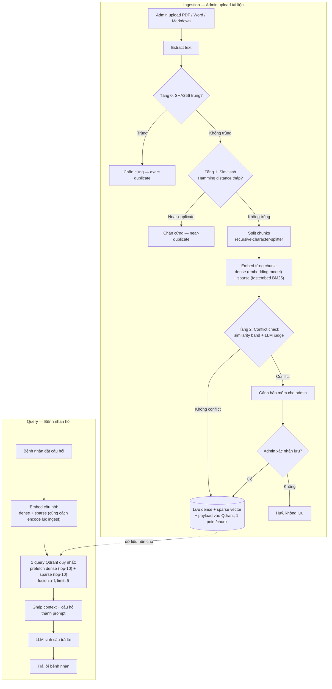

# AI Booking Agent — Brainstorm Notes

## Description
> SM.AI - Agent hỗ trợ đặt lịch

## Painpoint (phía bệnh nhân)
- Không biết cần khám chuyên khoa nào khi chỉ mô tả triệu chứng
- Muốn hỏi/đặt lịch ngoài giờ hành chính, không gọi được lễ tân
- Muốn hỏi trước chi phí, thời gian, mức độ đau trước khi tới
- Không rõ nên chọn phòng khám/chi nhánh nào

## Feature

### 1. Đặt lịch
- Bot tự suy ra loại ý định: theo chuyên khoa / theo bác sĩ cụ thể / ngoài giờ.
- Luôn xác nhận lại thông tin trước khi chốt đặt lịch, không tự động book khi chưa rõ.
- Trùng tên bác sĩ → hỏi lại để phân biệt (chuyên khoa/chi nhánh), không tự đoán.
- Khách vãng lai (chưa đăng nhập): bot dùng tài khoản RECEPTIONIST riêng để tạo hồ sơ mới (tên + SĐT) rồi đặt lịch. Khách đã đăng nhập → bot dùng token của chính họ.
  - Tài khoản RECEPTIONIST này tên **SM.AI**; email tạo theo cùng format (vd. `sm.ai@smile.com`).
- Đặt lịch hộ người khác (vd. đặt cho con): **ngoài phạm vi v1** — mặc định người nhắn tin = người được khám.

### 2. Huỷ lịch
- Đã đăng nhập: bot tra lịch hẹn sắp tới theo `patient_id` (actor-JWT thật) để gợi ý chọn. Đây là dữ liệu scheduling, không phải lịch sử khám lâm sàng.
- Khách vãng lai: không có `patient_id` → không tự gợi ý. Xác minh bằng 2 yếu tố: mã lịch hẹn + SĐT đã dùng lúc đặt (so khớp với `patients.phone`).

### 3. Hỏi đáp policy
- Loại 1 — trả lời trực tiếp (dữ liệu cố định): giờ mở cửa, địa chỉ chi nhánh, có cần đặt lịch trước không.
- Loại 2 — chuyển liên hệ admin: giá cụ thể, bảo hành, "trường hợp của tôi có chữa được không". Liên hệ: SĐT `09XXXXX` (placeholder), email `recep.levan@smile.com`.
- Đã rà tài liệu nội quy phòng khám: chỉ Điều 1 (giờ hoạt động → Loại 1) và Điều 7 (giá niêm yết → vẫn thuộc Loại 2) là dùng được.

## Lưu ý:
- Không Tra cứu lịch sử khám / dữ liệu khám cũ.
- Bot chỉ được thấy giờ trống/bận của bác sĩ, không thấy ai đã đặt slot đó.

## Data / Knowledge base
- Admin có 2 thao tác: **Update** (thay tài liệu cũ) và **Upload mới**.
- Định dạng: PDF / Word / Markdown, không xử lý ảnh.
- Upload mới bị **near-duplicate** → chặn cứng, không cho lưu.
- Upload mới bị **conflict** (mâu thuẫn nội dung) → chỉ cảnh báo mềm, admin tự quyết.
- Chỉ **admin** có quyền upload/update tài liệu (manager không có quyền).
- Cập nhật phải phản ánh ngay sau khi embedding xong — không batch/cache theo lịch.

## TechStack
- Langchain / LangGraph (tool-calling, streaming qua `astream_events()`)
- FastAPI — AI agent service riêng, stream response qua SSE, gọi sang backend NestJS (nơi chạy API thật) để thực thi tool
- recursive-character-splitter
- LLM chat chính: `gpt-4o-mini` (OpenAI)
- LLM judge (conflict): `gpt-oss-120b` qua NVIDIA NIM API — phán mọi ứng viên cùng chủ đề, không qua entity-diff/NLI nào trước
- Embedding (dense): đang cân nhắc `text-embedding-3-small` (OpenAI) vs `nvidia/nv-embed-v1` — **chưa chốt**, cần benchmark recall@k trên câu hỏi tiếng Việt trước khi chọn; lưu ý config `EMBEDDING_PROVIDER` hiện đang mâu thuẫn với `EMBEDDING_MODEL`/`EMBEDDING_BASE_URL`, cần rà lại code đọc biến nào. Dùng thư viện (`langchain-openai`/`langchain-nvidia-ai-endpoints`) gọi API thật, không tự viết.
- Sparse/lexical (BM25): **`fastembed`** (model `Qdrant/bm25`) — tính sparse vector từ text cho cả ingest lẫn query, tích hợp sẵn với `qdrant-client`. **Đã thêm vào dependency và test thật** — xem mục "Hybrid Search" để biết giới hạn (chưa hỗ trợ stemmer tiếng Việt).
- Qdrant (collection riêng cho knowledge base) — chỉ lưu/search/fuse vector (dense + sparse qua RRF), không tự tokenize/hiểu text.

## Cấu trúc thư mục
> Chia theo feature (mỗi agent/tính năng tự chứa router + logic + prompt riêng), tách `shared/` cho phần dùng chung — dễ gắn thêm agent mới sau này mà không đụng code cũ.
- Giải pháp:
```
app/
├── main.py                       # FastAPI entrypoint, mount router từng feature
├── core/                         # cấu hình toàn app
│   ├── config.py                  # đọc env (Pydantic BaseSettings)
│   └── logging.py
│
├── shared/                       # dùng chung giữa nhiều feature/agent
│   ├── llm/
│   │   ├── chat_model.py          # factory tạo LLM chat chính (gpt-4o-mini)
│   │   └── judge_model.py         # factory tạo LLM judge (gpt-oss-120b qua NVIDIA NIM)
│   ├── embeddings/
│   │   └── embedding_client.py    # wrapper embedding model
│   ├── vectorstore/
│   │   └── qdrant_client.py       # kết nối Qdrant, collection smile_kb
│   ├── backend_clients/           # gọi sang NestJS backend thật
│   │   ├── appointment_client.py  # book/cancel appointment
│   │   ├── patient_client.py      # tạo hồ sơ vãng lai qua RECEPTIONIST
│   │   └── doctor_client.py       # search bác sĩ, check lịch trống
│   ├── auth/
│   │   └── token_resolver.py      # chọn JWT thật hay token RECEPTIONIST (SM.AI)
│   └── utils/
│       ├── hashing.py             # SHA256 + SimHash/Hamming distance
│       └── text_extract.py        # extract text PDF/Word/Markdown
│
├── features/
│   ├── booking_agent/             # Đặt lịch / Huỷ lịch
│   │   ├── router.py               # endpoint chat, stream SSE
│   │   ├── graph.py                 # LangGraph: state machine của agent
│   │   ├── state.py                  # Booking Slot State schema (Pydantic)
│   │   ├── tools.py                   # @tool: book_appointment, cancel_appointment, search_doctors, check_doctor_availability
│   │   └── prompts.py                  # prompt phân loại ý định + 4 loại appointment
│   │
│   ├── policy_qa/                  # Hỏi đáp policy (RAG query side)
│   │   ├── router.py
│   │   ├── graph.py                 # retrieve → generate
│   │   └── retriever.py             # hybrid search / multi-query nếu áp dụng
│   │
│   └── document_ingestion/         # Admin upload/update (RAG ingestion side)
│       ├── router.py                # endpoint upload/update cho admin
│       ├── pipeline.py               # orchestrator: extract → SHA256 → SimHash → chunk → embed → conflict check → lưu Qdrant
│       ├── duplicate_detector.py       # exact + near-duplicate
│       └── conflict_detector.py         # similarity band + NLI + LLM judge
│
└── tests/
    ├── booking_agent/
    ├── policy_qa/
    └── document_ingestion/
```
  - `shared/` chỉ chứa thứ nhiều feature cùng cần — không đặt logic nghiệp vụ riêng của 1 feature vào đây.
  - `features/<tên>/` tự chứa toàn bộ router + logic + prompt riêng — thêm agent mới sau này chỉ cần tạo folder mới cùng hình dạng, không sửa code feature cũ.
  - `router.py` của từng feature được `main.py` include vào — dễ bật/tắt từng feature độc lập.


## AGENTIC RAG



## Duplicate tài liệu
> Admin upload tài liệu mới trùng hoặc gần trùng tài liệu đã có, gây lãng phí dung lượng.
- Giải pháp:
  - Trùng y hệt: so SHA256 hash toàn bộ text → trùng thì chặn ngay, không chạy embedding.
  - Gần giống (near-duplicate): SimHash 64-bit + Hamming distance, không cần embedding, rẻ và nhanh. Distance nhỏ (vd. ≤3/64 bit) → chặn cứng.

## Conflict nội dung tài liệu
> Hai tài liệu cùng chủ đề nhưng khẳng định khác nhau (vd. giờ mở cửa 8h-20h vs 8h-18h), agent không biết tin bản nào.
- Giải pháp:
  - Lọc ứng viên cùng chủ đề bằng similarity band embedding (~0.75–0.92).
  - Mọi ứng viên đưa thẳng cho **LLM judge dùng gpt-oss-120b (open-weight, qua NVIDIA NIM API)** phán mâu thuẫn hay không.
  - Phát hiện conflict → chỉ cảnh báo mềm cho admin, không chặn cứng.

## Hybrid Search (Semantic + Lexical) qua RRF
> Semantic search một mình dễ mờ với từ khoá chính xác (tên bác sĩ, giờ, giá); cần kết hợp thêm lexical để bù nhau. RRF là thuật toán **gộp nhiều danh sách kết quả**, nên bắt buộc phải có ≥2 loại vector mới có gì để gộp — chỉ dense thôi thì không có hybrid, không có RRF.
- **Đã triển khai và test thật trên Qdrant** (không phải chỉ thiết kế):
  - Qdrant là vector database thuần — chỉ nhận số, không tự tokenize/hiểu text. Dense dùng embedding model (OpenAI/NVIDIA); sparse (BM25) dùng **`fastembed`** (model `Qdrant/bm25`) — cả 2 tính bên ngoài Qdrant rồi mới gửi vào.
  - **Collection đặt tên theo provider**: `{qdrant_collection}__openai` / `{qdrant_collection}__nvidia` (dim dense khác nhau — 1536 vs 4096 — không gộp chung được 1 collection). Mỗi point = 1 chunk, có sẵn 1 dense vector mặc định (không tên) + 1 sparse vector tên `bm25`.
  - **Giới hạn đã phát hiện khi test thật**: Qdrant **không cho thêm sparse vector vào collection đã tồn tại** (`update_collection` báo lỗi "Not existing vector name") — sparse chỉ khai báo được lúc `create_collection`. Nếu collection cũ chỉ có dense, phải xoá + tạo lại + nhúng lại toàn bộ chunk (đã làm 1 lần cho 2 collection thật `smile_kb__openai`/`smile_kb__nvidia`, không mất dữ liệu vì text gốc còn trong payload).
  - **Payload không có collection registry riêng** — `sha256`/`simhash`/`filename`/`uploaded_at` nằm ngay trên payload từng chunk (field: `doc_id`, `content`, `chunk_index`), trùng với schema tối giản đã có sẵn trong data thật, không tạo schema song song.
  - **Query**: câu hỏi tính cả dense + sparse, gửi **1 request duy nhất** lên Qdrant (`prefetch` dense limit=10 + sparse limit=10, `fusion: rrf`, `limit: 5`) — đã verify bằng câu hỏi thật, trả đúng chunk liên quan nhất (score 1.0).
  - **Hạn chế còn tồn tại**: `fastembed`'s BM25 stemmer không hỗ trợ tiếng Việt (chỉ có các ngôn ngữ Âu/Ả Rập/Tamil/Turkish) — đang chạy bằng tokenizer mặc định (không stem, không lọc stopword tiếng Việt), vẫn bắt được khớp từ khoá/số liệu chính xác nhưng chưa tối ưu ngữ pháp tiếng Việt. Muốn tốt hơn cần bộ tách từ tiếng Việt riêng (underthesea, pyvi) đặt trước fastembed.

## Trích xuất field từ câu nói bệnh nhân
> Cần xác định field nào phải lấy được từ câu nói để đủ thông tin đặt lịch, tuỳ theo 4 loại appointment (phòng khám / chuyên khoa / bác sĩ / ngoài giờ).
- Giải pháp:
  - Field chung luôn cần: họ tên + SĐT (nếu khách vãng lai), ngày/khung giờ mong muốn.
  - Field riêng theo loại: chi nhánh (bắt buộc ở loại phòng khám), chuyên khoa (bắt buộc ở loại chuyên khoa), tên bác sĩ (bắt buộc ở loại bác sĩ — trùng tên phải hỏi thêm chuyên khoa/chi nhánh), khám mới/tái khám (quan trọng ở loại bác sĩ).
  - Loại "theo phòng khám" là loại lỏng nhất — nếu suy luận được chuyên khoa từ triệu chứng thì nên hỏi chuyển sang loại "theo chuyên khoa".

## Quản lý state hội thoại dài
> Hội thoại đặt lịch có thể kéo dài nhiều lượt — dựa vào LLM tự nhớ qua lịch sử chat thô dễ bị loãng context, tốn token, quên/nhầm field đã chốt.
- Giải pháp:
  - Tách riêng "Booking Slot State" (JSON các field) khỏi lịch sử chat thô — mỗi lượt chỉ update field vừa nhắc tới, giữ nguyên field khác.
  - Lưu state hoàn toàn ở client, backend stateless, không Redis/DB phụ — reload/rời đi là mất, chỉ sống trong 1 lần đặt lịch.
  - Đổi ý giữa chừng (đổi loại ý định) → tự động reset field không còn áp dụng.
  - Chốt state ở bước xác nhận cuối trước khi book.

## Thực thi đặt lịch qua Function Calling
> Sau khi Booking Slot State đủ field và đã qua bước xác nhận, agent cần gọi API thật để đặt/huỷ lịch thay vì chỉ trả lời text.
- Giải pháp:
  - Định nghĩa tool bằng `@tool` (hoặc `StructuredTool.from_function`) của LangChain: `book_appointment`, `cancel_appointment`, `search_doctors`, `check_doctor_availability` — mỗi tool có `args_schema` (Pydantic) khớp đúng bảng field đã trích xuất.
  - `.bind_tools([...])` gắn danh sách tool vào LLM, dùng native function-calling của model để nó tự quyết định gọi tool nào với tham số gì.
  - Vòng lặp thực thi tool: LangGraph `create_react_agent` (trong `langgraph.prebuilt`) hoặc tự dựng bằng `ToolNode` — nhận tool call, chạy hàm thật, trả kết quả lại cho LLM.
  - Tách 2 loại tool theo rủi ro: tool đọc (search, check availability) agent gọi tự do trong hội thoại; tool ghi (`book_appointment`, `cancel_appointment`) chỉ được gọi sau bước xác nhận cuối.
  - Auth (JWT thật của khách đã đăng nhập, hoặc token RECEPTIONIST cho khách vãng lai) gắn ở lớp thực thi tool tại backend — LLM không cần biết/thấy token này.
  - Trích xuất field mỗi lượt chat dùng `with_structured_output(BookingSlotSchema)`, tách biệt với tool call hành động.

