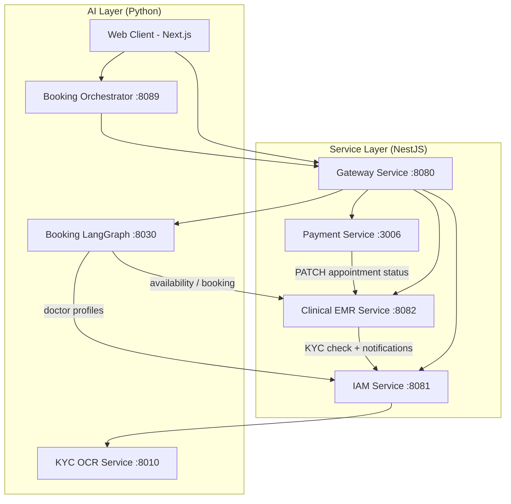

# S.M.I.L.E Architecture Documentation

> Canonical diagram source: [docs/diagrams/architecture.puml](diagrams/architecture.puml)

## 1. High-Level Architecture Overview

S.M.I.L.E is built upon a **Microservices Architecture** orchestrated via Docker Compose (NestJS backend services + Python AI services).

Communication between components is **synchronous HTTP/REST only**:
- Client → Gateway → services (reverse proxy).
- A small number of direct service-to-service HTTP calls (see 2.4).
- **There is no message broker.** RabbitMQ/Kafka are not part of the running system; anything async-looking (e.g. appointment notifications) is a fire-and-forget HTTP call.

## 2. Component Deep Dive

### 2.1 API Gateway
- Reverse proxy (`http-proxy-middleware`) routing `/api/v1/*` prefixes to services (`gateway-service/src/config/services.config.ts`).
- Verifies HS256 JWT and injects a trusted-actor header downstream.
- Aggregates each service's `/docs-json` into one Swagger UI.
- Intended single public entry point for the frontend (internal service-to-service calls bypass it — see 2.4).

### 2.2 Microservices
The backend follows the **Database-per-Service** pattern to maintain loose coupling:
1. **IAM Service**: Consolidated identity domain — auth, JWT, Google OAuth, user profiles/RBAC, KYC, notifications, audit logs.
2. **Clinical/EMR Service**: Consolidated clinic and medical record domain — appointments, schedules, medical records, examinations, prescriptions, dental images.
3. **Payment Service**: Mock VNPay transactions and payment records.

### 2.2.1 Consolidation Note (Phase 1)
- Runtime/process consolidation is preferred first.
- Data stores remain separated to reduce migration risk (two logical DBs per consolidated service):
  - `auth_service_db` and `account_service_db` for IAM
  - `core_medical_service_db` and `core_clinic_service_db` for Clinical/EMR
- API routes remain backward compatible through the gateway route mapping.

### 2.3 AI Layer (Python)
- **Booking LangGraph Service (:8030)**: LLM booking chatbot. Calls Clinical EMR (availability, book/cancel/reschedule) and IAM (doctor profiles) over HTTP. Persists confirmation tokens and conversation state in Redis (its only consumer — DB index 2, key prefix `booking_langgraph:`).
- **Booking Orchestrator (:8089, standalone — no longer in docker-compose)**: alternative chatbot; talks to the backend **through the gateway** and stores its own data in `booking_orchestrator_db`.
- **KYC OCR Service (:8010)**: YOLOv8 + VietOCR extraction of Vietnamese CCCD identity documents; stateless; called by IAM over HTTP.

### 2.4 Direct service-to-service calls (bypass the gateway)
| Caller | Callee | Purpose |
|---|---|---|
| Clinical EMR | IAM | KYC eligibility check before booking (`x-internal-api-key`); doctor notifications |
| Payment | Clinical EMR | PATCH appointment `payment_status` after payment |
| IAM | KYC OCR | CCCD OCR (multipart upload) |
| Booking LangGraph | Clinical EMR, IAM | Availability, booking actions, doctor profiles |

## 3. Storage Strategy
- **PostgreSQL 16** (single instance, `:5432`): six logical databases created by `docker/init-db.sql` — `auth_service_db`, `account_service_db`, `core_medical_service_db`, `core_clinic_service_db`, `payment_service_db`, `booking_orchestrator_db`. **No physical foreign keys cross database boundaries** — services reference each other's records by UUID (logical FK); referential integrity is enforced at the application layer (e.g. `AppointmentsService.resolveBookingPatientId` validates the patient before booking).
- **Redis 7** (single instance): used only by the Booking LangGraph service for booking confirmation tokens (idempotency/replay protection) and conversation state, isolated under DB index 2 and the `booking_langgraph:` prefix. Sessions, OTP and refresh tokens live in PostgreSQL (IAM), not Redis.
- **MailDev**: local SMTP sink for development email delivery.

## 4. Security
- **Authentication**: JWT-based (HS256, shared secret across services) with Role-Based Access Control (RBAC); Google OAuth 2.0 for social login.
- **Internal calls**: trusted-actor header injected by the gateway; internal API key (`x-internal-api-key`) for the EMR→IAM KYC check.
- **Data Protection**:
  - Rest: hashed credentials.
  - Transit: TLS across public boundaries.
