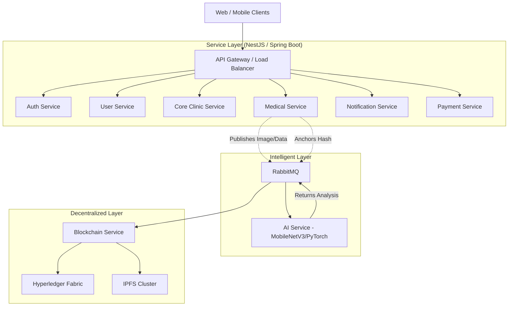

# S.M.I.L.E Architecture Documentation

## 1. High-Level Architecture Overview

S.M.I.L.E is built upon a **Microservices Architecture** orchestrated via Docker Compose. The system integrates standard healthcare application components with advanced technologies like Hyperledger Fabric (Blockchain) and PyTorch (AI). 

Communication between components happens through:
- **Synchronous HTTP/REST**: For client-to-gateway and gateway-to-service communication.
- **Asynchronous Message Queuing (RabbitMQ)**: For background, heavy processing, and decoupling services (e.g., AI inference, Blockchain anchoring).

## 2. Component Deep Dive

### 2.1 API Gateway
- Routes all incoming requests to the appropriate microservices.
- Handles SSL termination, CORS, Rate Limiting, Request/Response Logging, and Centralized Exception Handling.
- Serves as the single entry point for all frontend applications.

### 2.2 Microservices
The backend follows the **Database-per-Service** pattern to maintain loose coupling:
1. **IAM Service (Phase 1 target)**: Consolidated identity domain that combines auth and user profile/RBAC capabilities.
2. **Clinical/EMR Service (Phase 1 target)**: Consolidated clinic and medical record domain for operational and clinical workflows.
3. **Notification Service**: Manages email, SMS, and push templates/deliveries.
4. **Payment Service**: Processes VNPay transactions, refunds, and manages invoices.

### 2.2.1 Consolidation Note (Phase 1)
- Runtime/process consolidation is preferred first.
- Data stores remain separated in Phase 1 to reduce migration risk:
  - `auth_service_db` and `account_service_db` for IAM
  - `core_clinic_service_db` and `core_medical_service_db` for Clinical/EMR
- API routes remain backward compatible through the gateway route mapping.

### 2.3 Intelligent Layer (AI Service)
- **Model**: Custom deep learning network (e.g., MobileNetV3-Large or HybridEncoder).
- **Function**: Simultaneous multi-objective analysis processing (Segmentation of teeth, pathology detection, cephalometric landmark prediction).
- **Communication**: Consumes image data asynchronously via RabbitMQ to prevent blocking the medical service during inference.

### 2.4 Decentralized Layer (Blockchain & Storage)
- **Blockchain Service**: Connects to Hyperledger Fabric. 
- **Anchoring**: Rather than storing raw PII on-chain, it computes a hash of the examination record and anchors this hash to the ledger, establishing immutable proof of origin and integrity.
- **Off-chain Storage**: Large binary files like DICOM X-rays are uploaded to IPFS. The resulting CID is paired with the record metadata.

## 3. Storage Strategy
- **PostgreSQL**: Primary relational datastore. Each service gets a dedicated logical database/schema (e.g., auth_db, clinic_db).
- **Redis**: Used for high-speed caching and temporary session data.
- **IPFS**: Decentralized storage for medical imaging.
- **Hyperledger Fabric**: Immutable ledger for audit trails and consent forms.

## 4. Security
- **Authentication**: JWT-based with Role-Based Access Control (RBAC).
- **Data Protection**: 
  - Rest: DB encryption and hashed credentials.
  - Transit: TLS across public boundaries.
- **Key Management**: HashiCorp Vault manages the keys used for signing transactions to the blockchain.
