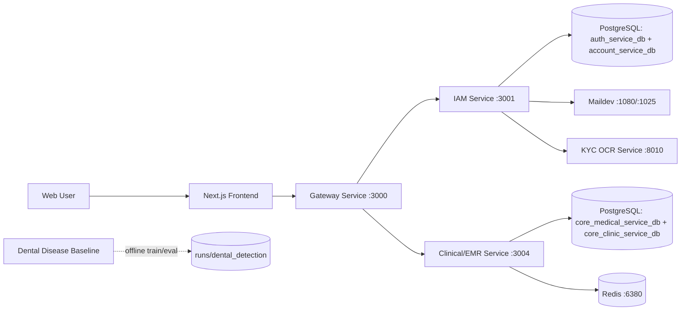

# S.M.I.L.E Current System Overview

Last updated: 2026-06-16

## 1. Purpose

S.M.I.L.E, short for Smart Medical Intelligent Ledger for E-health, is a dental healthcare management platform. The current implementation focuses on a practical demo-ready system for clinic operations, patient identity verification, clinical workflows, and AI-assisted dental disease detection.

The system currently combines:

- Web application for patients, admins, and clinic staff workflows.
- API gateway as the single backend entry point.
- IAM service for authentication, profiles, roles, permissions, KYC, audit, and account management.
- Clinical/EMR service for clinics, appointments, schedules, services, patients, medical records, examinations, dental images, and related clinical data.
- KYC OCR service for Vietnamese CCCD identity verification.
- Dental disease detection baseline using YOLO11n on a Roboflow object-detection dataset.
- PostgreSQL and Redis as the main runtime infrastructure.

Older documents still mention broader blockchain, payment, and AI analytics directions. Those remain part of the project vision, but the runtime described below reflects the active local system.

## 2. High-Level Architecture



## 3. Runtime Components

| Component | Technology | Default Port | Current Role |
|---|---|---:|---|
| Frontend Web | Next.js 15, React 19, TypeScript, Tailwind CSS | 3005 for local dev | Main UI for dashboard and feature flows |
| Gateway Service | NestJS / Node.js | 3000 | Aggregates and proxies backend APIs |
| IAM Service | NestJS / Node.js | 3001 | Auth, account, RBAC, KYC, audit logs |
| Clinical/EMR Service | NestJS / Node.js | 3004 | Clinic, appointment, schedule, service, patient, EMR, examination workflows |
| KYC OCR Service | Python FastAPI, YOLO ONNX, VietOCR | 8010 | OCR and verification for CCCD front/back images |
| Dental Disease Service | Python, Ultralytics YOLO | offline scripts | Research baseline for dental disease object detection |
| PostgreSQL | Postgres 16 Alpine | 5434, 5435 | IAM and Clinical databases |
| Redis | Redis 7 Alpine | 6380 | Clinical worker/cache backend |
| Maildev | Maildev | 1080, 1025 | Local email testing |

## 4. Backend Services

### 4.1 Gateway Service

The gateway is the public API entry point for the frontend. It routes requests to IAM and Clinical/EMR services while preserving route compatibility for older frontend paths.

Key responsibilities:

- Central API entry point on port `3000`.
- Proxy requests to IAM and Clinical/EMR services.
- Support CORS for local frontend ports, including `3000`, `3005`, and `5173`.
- Provide Swagger aggregation for backend service APIs.

Main environment mappings:

| Variable | Value in Docker compose |
|---|---|
| `IAM_SERVICE_URL` | `http://iam-service:3001` |
| `CLINICAL_EMR_SERVICE_URL` | `http://clinical-emr-service:3004` |
| `AI_SERVICE_URL` | `http://ai-service:7777` |
| `PAYMENT_SERVICE_URL` | `http://payment-service:3006` |
| `BLOCKCHAIN_SERVICE_URL` | `http://blockchain-service:3007` |

Payment, blockchain, and analytics endpoints are still reserved in configuration, but not all are active runtime services in the current local compose.

### 4.2 IAM Service

IAM is the phase-1 consolidation target for the previous auth and account domains.

Current scope:

- Login, register, logout, refresh token, current user.
- Account and user profile management.
- Roles, permissions, and user-role assignment.
- KYC submission, OCR processing, approve/reject workflow, history, and file handling.
- Audit logs and security-related tracking.
- Google authentication support.
- Notification preference/template surfaces where implemented.

Data strategy:

- `auth_service_db` stores authentication/session/OAuth-related data.
- `account_service_db` stores profile, RBAC, signature, audit, and KYC-related data.
- Both databases are initialized in the IAM PostgreSQL container and intentionally remain separate for phase 1.

Important runtime integrations:

- Uses `KYC_OCR_URL=http://kyc-ocr-service:8010`.
- Stores private KYC files under `/app/storage/kyc`.
- Uses Maildev for local email delivery.

### 4.3 Clinical/EMR Service

Clinical/EMR is the phase-1 consolidation target for clinic operations and medical workflows.

Current scope:

- Clinic and treatment room management.
- Appointment lifecycle.
- Schedule, doctor schedule, and leave management.
- Service and specialty management.
- Patient management.
- Medical records and medical history.
- Dental images, categories, and annotations.
- Examination sessions.
- Diagnoses, symptoms, prescriptions, treatment plans, clinical orders, imaging/lab orders, and related clinical artifacts where implemented.
- Reporting/dashboard endpoints where implemented.

Data strategy:

- `core_clinic_service_db` stores clinic, appointment, schedule, room, specialty, and service data.
- `core_medical_service_db` stores patient, medical record, examination, image, diagnosis, prescription, and clinical data.
- The service is one runtime process, but the databases remain separate to avoid high-risk migration during phase 1.

Runtime dependencies:

- PostgreSQL on the `clinical-postgres` container.
- Redis on the `clinical-redis` container.
- IAM internal API for identity-aware workflows.

## 5. Frontend Web Application

The frontend is a Next.js application under:

```text
frontend/web
```

Main stack:

- Next.js `15.5.2`
- React `19.1.0`
- TypeScript
- Tailwind CSS
- TanStack Query and TanStack Table
- React Hook Form and Zod
- Recharts
- Zustand
- Sonner

Current UI scope includes:

- Authentication-related screens.
- Dashboard/profile surfaces.
- Admin management screens, including users, roles, and KYC management.
- Appointment screens.
- Clinic screens.
- Schedule screens.
- Service screens.
- Patient and medical record screens.
- Examination screens.
- Dental images and clinical workflow surfaces where implemented.

Local frontend development normally runs on port `3005`:

```powershell
cd frontend\web
npm run dev -- -p 3005
```

The frontend is currently being improved toward a consistent, professional clinic-management UI. Some screens use real API data where available and demo/fallback data where backend endpoints are incomplete.

## 6. AI Components

### 6.1 KYC OCR Service

The KYC OCR service is used by IAM to verify Vietnamese CCCD documents.

Current pipeline:

1. Front image: YOLOv11 ONNX detects CCCD fields.
2. Front image crops are read by VietOCR.
3. Back image: fixed ROI extraction for issue date and MRZ.
4. Back image crops are read by VietOCR.
5. Parser normalizes fields and MRZ output.
6. Service compares front/back identity data and submitted expected values.
7. Quality analyzer checks blur, resolution, brightness, glare, and screenshot-like borders.
8. Response includes fields, document checks, and risk level.

Main endpoint:

```text
POST /v1/ocr/cccd
```

Docker runtime:

```text
kyc-ocr-service :8010
```

Privacy rules:

- Do not log real CCCD numbers or raw OCR payloads in shared logs.
- Do not commit CCCD images, debug overlays, crop outputs, or model weights.
- Model weights are stored in ignored `models/` paths or provisioned in Docker.

### 6.2 Dental Disease Detection Baseline

The dental disease service is currently a research baseline, not a production API.

Location:

```text
ai/dental_disease_service
```

Current model:

- YOLO11n object detection baseline.
- Dataset: Roboflow `oral-diseases-5ctay`, version 1.
- Dataset is stored outside the repository:

```text
D:\DAI_NHAN\roboflow\oral-diseases-5ctay
```

Detected classes:

| ID | Class |
|---:|---|
| 0 | calculus |
| 1 | caries |
| 2 | gingivitis |
| 3 | hypodontia |
| 4 | tooth_discoloration |
| 5 | ulcer |

Baseline result on test split:

| Class | Images | Instances | Precision | Recall | mAP50 | mAP50-95 |
|---|---:|---:|---:|---:|---:|---:|
| all | 999 | 6,422 | 0.745 | 0.744 | 0.792 | 0.407 |
| calculus | 203 | 816 | 0.662 | 0.582 | 0.646 | 0.306 |
| caries | 370 | 1,156 | 0.788 | 0.806 | 0.853 | 0.445 |
| gingivitis | 217 | 1,115 | 0.709 | 0.515 | 0.606 | 0.275 |
| hypodontia | 143 | 260 | 0.738 | 0.796 | 0.837 | 0.362 |
| tooth_discoloration | 429 | 2,725 | 0.707 | 0.854 | 0.864 | 0.551 |
| ulcer | 184 | 350 | 0.867 | 0.911 | 0.944 | 0.504 |

Current interpretation:

- The YOLO11n baseline is strong enough as the first lightweight benchmark.
- `ulcer`, `tooth_discoloration`, and `caries` perform best.
- `gingivitis` and `calculus` need more error analysis because recall and strict-IoU metrics are weaker.
- The model is fast enough for demo and future inference service experiments.

Detailed results are maintained in:

```text
ai/dental_disease_service/reports/yolo11n_baseline_results.md
```

## 7. Data and Storage

| Data Area | Storage |
|---|---|
| IAM auth/session data | `auth_service_db` |
| User profile/RBAC/KYC/audit data | `account_service_db` |
| Clinic, appointment, schedule, service data | `core_clinic_service_db` |
| Patient, medical record, examination, image data | `core_medical_service_db` |
| Clinical cache/worker data | Redis |
| KYC private files | Docker volume `smile_iam_kyc_storage` |
| KYC OCR debug overlays | `.debug/kyc-ocr` local bind mount |
| Dental AI dataset | Outside repo under `D:\DAI_NHAN\roboflow` |
| Dental AI runs/weights | Ignored `runs/` and `*.pt` paths |

## 8. Main User Roles

| Role | Main Responsibilities |
|---|---|
| Patient | Book appointments, view own profile/medical information, submit KYC, access patient-facing flows |
| Dentist/Doctor | View schedules, access patient information, perform examination-related workflows, create diagnoses/prescriptions/treatment plans |
| Nurse/Assistant | Support clinical workflow and patient handling where enabled |
| Receptionist | Manage appointments, schedules, check-in, patient coordination, and operational data |
| Admin | Manage users, roles, KYC review, clinics, services, specialties, and system-level records |

For demo and QA, role restrictions may be temporarily relaxed so testers can access all major feature screens.

## 9. Key Workflows

### 9.1 Login and Profile

1. User signs in through the frontend.
2. Frontend calls gateway authentication endpoints.
3. Gateway forwards to IAM.
4. IAM issues access/refresh tokens.
5. Frontend stores session state and loads role/profile data.

### 9.2 KYC Verification

1. Patient submits CCCD front/back images through IAM-facing UI.
2. IAM stores encrypted/private files.
3. IAM schedules OCR processing.
4. KYC OCR service extracts fields and document checks.
5. IAM stores OCR result and KYC history.
6. Admin reviews automated checks and approves/rejects KYC.

### 9.3 Appointment and Clinical Flow

1. User creates or views appointment through frontend.
2. Gateway routes request to Clinical/EMR service.
3. Clinical/EMR resolves clinic, specialty, doctor, schedule, and patient context.
4. Appointment status can be managed through lifecycle actions.
5. Completed appointment can lead to examination, medical records, diagnosis, prescription, treatment plan, and dental image workflows.

### 9.4 Dental Disease Baseline Workflow

1. Dataset is downloaded from Roboflow outside the repo.
2. Dataset YAML is prepared with `prepare_dataset.py`.
3. YOLO training runs through Docker or local Python if dependencies are installed.
4. Evaluation runs on validation/test splits.
5. Metrics are recorded in Markdown reports.
6. Future work can expose best weights through an inference API.

## 10. Local Runtime

### 10.1 Backend Docker Compose

Current compose file:

```powershell
docker compose -f docker-compose.swagger.yaml up -d --build
```

Useful service URLs:

| Service | URL |
|---|---|
| Gateway | `http://localhost:3000` |
| IAM Service | `http://localhost:3001` |
| Clinical/EMR Service | `http://localhost:3004` |
| KYC OCR Health | `http://localhost:8010/health` |
| Maildev UI | `http://localhost:1080` |

### 10.2 Frontend

```powershell
cd frontend\web
npm run dev -- -p 3005
```

### 10.3 Dental AI Baseline

Prepare dataset:

```powershell
python ai\dental_disease_service\scripts\prepare_dataset.py `
  --dataset-root D:\DAI_NHAN\roboflow\oral-diseases-5ctay
```

Train baseline through Docker:

```powershell
.\ai\dental_disease_service\scripts\run_yolo_overnight.ps1 `
  -DatasetRoot D:\DAI_NHAN\roboflow\oral-diseases-5ctay `
  -RunName yolo11n_oral_diseases_b16_e30 `
  -Epochs 30 `
  -Patience 7 `
  -Batch 16 `
  -Workers 4
```

Evaluate baseline through Docker:

```powershell
.\ai\dental_disease_service\scripts\evaluate_yolo_docker.ps1 `
  -DatasetRoot D:\DAI_NHAN\roboflow\oral-diseases-5ctay `
  -Weights runs\dental_detection\yolo11n_oral_diseases_b16_e30\weights\best.pt `
  -Split test `
  -Batch 16
```

## 11. Current Limitations

- Some older documents still describe planned or legacy services that are not active in the current local runtime.
- Payment, blockchain, and analytics integrations are part of the project direction but are not the main active runtime path in the current compose file.
- Some frontend screens may still use demo/fallback data if the corresponding API endpoint is incomplete or not wired.
- Dental disease detection is currently a research baseline and not yet exposed as a production inference API.
- Roboflow labels are public dataset annotations; any academic report should clearly describe dataset source and limitations.
- Model weights, private documents, datasets, debug images, and run outputs must remain untracked.

## 12. Recommended Next Steps

1. Compare YOLO11n against YOLO11s for dental disease detection.
2. Add sample prediction visualizations and error analysis for weak classes.
3. Add a formal dental AI inference API only after selecting the best baseline.
4. Continue UI/API consistency work for appointment, clinic, schedule, service, patient, medical record, and examination flows.
5. Keep KYC OCR privacy and redaction rules strict during demos and reports.
6. Update legacy architecture documents after each major consolidation milestone.
