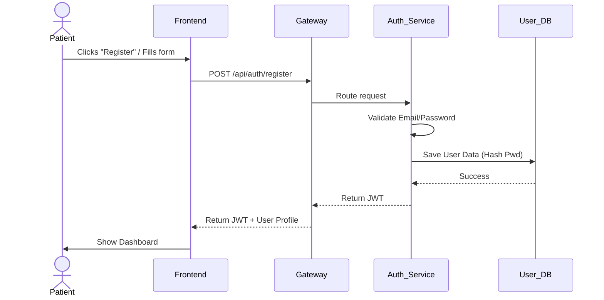
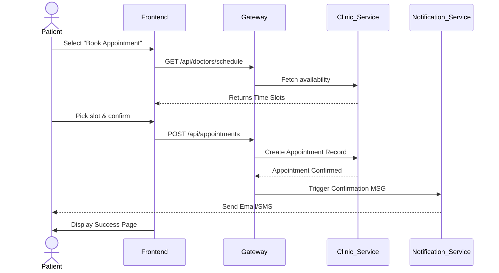
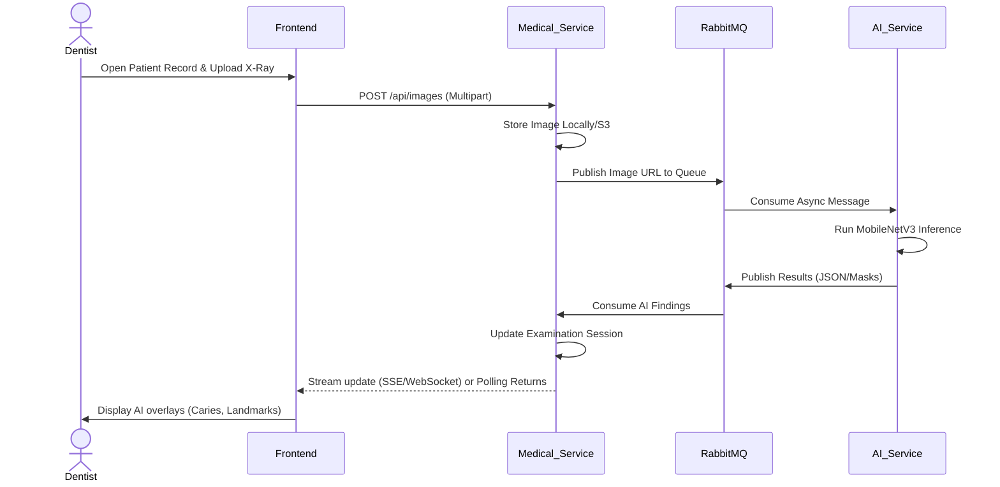
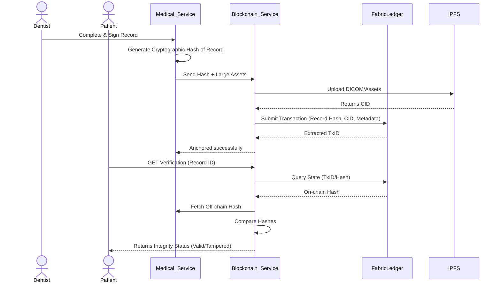
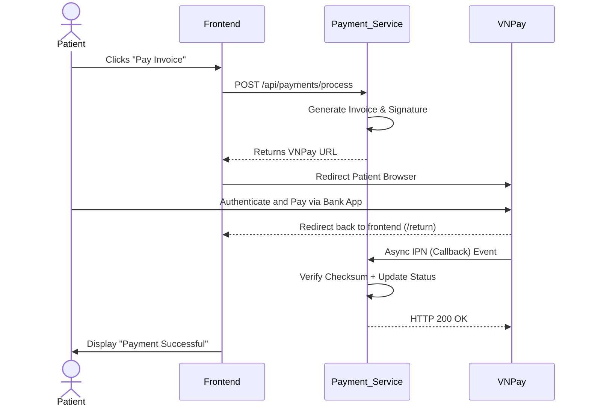

# S.M.I.L.E User Flows

This document details the step-by-step user flows for the primary personas traversing the S.M.I.L.E platform.

## 1. User Personas

| Persona | Primary Goals |
| :--- | :--- |
| **Patient** | Book clinic appointments, view medical history & digital prescriptions, pay invoices securely, manage data consent. |
| **Dentist** | View daily schedule, process examination sessions, upload X-rays for AI analysis, create treatment plans, sign off records representing immutable truth. |
| **Receptionist** | Manage patient check-ins/check-outs, mediate scheduling conflicts, oversee clinic payment statuses. |
| **Administrator**| System configuration, staff account management, clinic data management, oversee system health and audit logs. |

---

## 2. Key User Flows

### 2.1 Patient Registration & Authentication Flow

### 2.2 Appointment Booking Flow (Patient)

### 2.3 Examination & AI Analysis Flow (Dentist)

### 2.4 Blockchain Record Anchoring & Verification

### 2.5 Payment Flow

