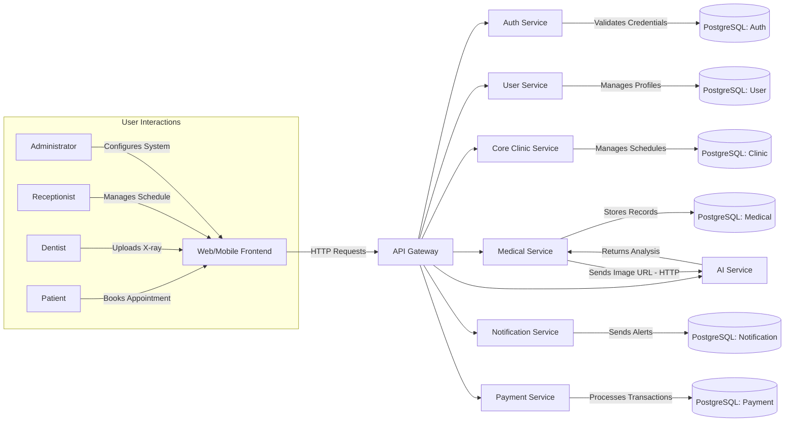

# S.M.I.L.E: Smart Medical Intelligent Ledger for E-health
## Project Workflow and Service Documentation

## 📋 Project Overview
S.M.I.L.E is a next-generation Dental Practice Management System (DPMS) that bridges traditional healthcare operations with modern digital technologies. It integrates a secure medical records framework and **Artificial Intelligence** for diagnostic assistance to ensure data integrity, patient privacy, and operational excellence.

## 🏗️ High-Level Architecture
S.M.I.L.E utilizes a **Microservices Architecture** orchestrated by Docker Compose. Communication is synchronous (REST via the API Gateway) between clients and services.



## 🔧 Backend Services Details

> Transition note (Phase 1 consolidation):
> - Legacy `auth-service` and `user-service` were decommissioned after consolidating into `iam-service`.
> - Legacy `core-clinic-service` and `medical-service` were decommissioned after consolidating into `clinical-emr-service`.
> - Database boundaries remain unchanged in this phase (DB-per-service retained).

### 1. IAM Service (`backend/service/iam-service`)
- **Purpose**: Consolidates identity and access management responsibilities from legacy auth/user domains, including authentication, account security, profile administration, RBAC, digital signatures, and audit trails.
- **Technology**: NestJS with dual PostgreSQL connections (`auth_service_db` + `account_service_db`), URI versioning, validation pipeline, and Swagger documentation.
- **Key Responsibilities**:
  - User registration and login flows
  - JWT issuance and refresh handling
  - OAuth provider integration
  - Role and permission management
  - User profile and user-role management
  - Digital signature and audit log management

### 2. Clinical/EMR Service (`backend/service/clinical-emr-service`)
- **Purpose**: Consolidates clinic operations and medical record workflows into one runtime, including appointments, scheduling, prescriptions, diagnostic orders, patient records, imaging, and treatment histories.
- **Technology**: NestJS with dual PostgreSQL connections (`core_medical_service_db` + `core_clinic_service_db`), URI versioning, validation pipeline, and Swagger documentation.
- **Key Responsibilities**:
  - Clinic, treatment room, specialty, and service catalog management
  - Appointment, doctor schedule, leave, and work shift management
  - Patient and medical record management
  - Prescriptions, treatment plans, and diagnostic orders
  - Dental imaging, annotations, and examination sessions
  - Clinical order and record export flows

### 3. Notification Service (`backend/service/notification-service`)
- **Purpose**: Manages notification delivery systems including notification templates, user preferences, and multi-channel notification services (email, SMS, push).
- **Technology**: NestJS with global validation pipe, API prefix configuration, Swagger documentation, and bearer token authentication.
- **Key Responsibilities**:
  - Notification template management
  - User preference handling (opt-in/opt-out)
  - Multi-channel delivery (email, SMS, push)
  - Delivery tracking and reporting
  - Template rendering and personalization

### 4. Payment Service (`backend/service/payment-service`)
- **Purpose**: Processes financial transactions including payment processing, checkout flows, refunds, and payment method management.
- **Technology**: NestJS REST API boilerplate with TypeORM/Mongoose support, seeding, config service, mailing, email/password auth, social sign-in, role-based access, I18N, file uploads, Swagger, testing, Docker, and CI/CD.
- **Key Responsibilities**:
  - Payment gateway integration (VNPay)
  - Checkout flow management
  - Refund processing
  - Payment method storage (tokenized)
  - Transaction reconciliation
  - Invoice generation
  - Payment status tracking

### 5. AI Service (`ai-service/`)
- **Purpose**: Provides dental disease classification using AI/ML models (MobileNetV3-Large) for analyzing dental images.
- **Technology**: Python/FastAPI service with PyTorch/TensorFlow inference, Dockerized for deployment.
- **Key Responsibilities**:
  - Dental X-ray image analysis
  - Pathology detection (caries, periapical lesions, etc.)
  - Cephalometric landmark prediction
  - Tooth segmentation and numbering
  - Uncertainty quantification for diagnostics
  - Model serving via REST API

### 6. Gateway Service (`backend/service/gateway-service`)
- **Purpose**: Acts as a unified API gateway that routes requests to appropriate downstream microservices (IAM, Clinical/EMR, Notification, Payment, AI) while providing centralized Swagger documentation and cross-cutting concerns like logging and exception handling.
- **Technology**: NestJS with global validation pipe, custom exception filters, logging interceptors, CORS configuration, and comprehensive service routing documentation.
- **Key Responsibilities**:
  - Request routing and load balancing
  - SSL termination
  - Authentication and authorization enforcement
  - Rate limiting and throttling
  - Request/response logging
  - Centralized exception handling
  - API documentation aggregation
  - CORS and security headers

## 🔄 Example Workflows

### Workflow 1: Patient Registration and Authentication
1. Patient accesses frontend and clicks "Register"
2. Frontend sends registration data to Gateway Service
3. Gateway routes to IAM Service
4. IAM Service validates input, creates user record, hashes password
5. IAM Service returns JWT token to frontend via Gateway
6. Frontend stores token for subsequent requests
7. On login, similar flow validates credentials and issues new JWT

### Workflow 2: Appointment Booking
1. Patient logs in (JWT sent with request)
2. Frontend requests available time slots via Gateway → Clinical/EMR Service
3. Clinical/EMR checks doctor schedules, returns available slots
4. Patient selects slot, frontend sends booking request
5. Gateway → Clinical/EMR Service creates appointment
6. Clinical/EMR validates doctor availability, creates appointment record
7. Appointment confirmed, notification triggered via Gateway → Notification Service
8. Patient receives confirmation email/SMS

### Workflow 3: Dental X-ray Analysis with AI
1. Dentist uploads X-ray via frontend to Gateway → Clinical/EMR Service
2. Clinical/EMR stores image, creates examination session
3. Clinical/EMR sends image URL to AI Service over HTTP
4. AI Service processes image using DentalMultiTaskNet model
5. AI Service returns analysis results (pathology, landmarks, segmentation)
6. Clinical/EMR Service updates examination record with AI findings
7. Dentist views results in frontend via Gateway → Clinical/EMR Service

### Workflow 4: Payment Processing
1. Patient completes treatment, frontend requests invoice via Gateway → Payment Service
2. Payment Service generates invoice, calculates amount
3. Patient selects payment method, submits payment details
4. Payment Service:
   - Validates payment details
   - Creates secure payment URL via VNPay integration
   - Returns URL to frontend
5. Patient redirected to VNPay portal, completes payment
6. VNPay redirects to frontend return URL
7. Frontend sends payment confirmation to Gateway → Payment Service
8. Payment Service:
   - Verifies VNPay callback signature
   - Updates payment status to completed
   - Triggers receipt generation
9. Payment Service publishes payment confirmation event
10. Notification Service consumes event, sends payment receipt to patient

## ⚙️ Cross-Cutting Concerns and Patterns

### Communication Patterns
- **Synchronous**: RESTful APIs for real-time user interactions (gateway → services) and service-to-AI calls

### Data Management
- **Database-per-Service**: Each service owns its PostgreSQL database schema
- **Polyglot Persistence**: 
  - PostgreSQL for relational data (users, appointments, records)
  - Redis for caching and session storage
  - Object storage for large binary medical images

### Security Implementation
- **Authentication**: JWT tokens issued by IAM Service, validated by gateway and services
- **Authorization**: Role-based access control enforced at service level
- **Data Encryption**: 
  - At rest: PostgreSQL encryption, file system encryption
  - In transit: TLS termination at gateway
  - Key management: HashiCorp Vault for encryption keys
- **Audit Logging**: Comprehensive access logs in IAM Service and service-specific audit trails

### Observability
- **Logging**: Structured logging across all services, centralized via Docker logging drivers
- **Health Checks**: Each service implements liveness/readiness endpoints
- **Monitoring**: Prometheus metrics exposed by services (where implemented)
- **Tracing**: OpenTelemetry instrumentation planned for distributed tracing

### Deployment and DevOps
- **Containerization**: All services Dockerized with multi-stage builds
- **Orchestration**: Docker Compose for local development, Kubernetes manifests for production
- **Configuration**: Environment-specific .env files, centralized config service where applicable
- **CI/CD**: GitHub Actions workflows for building, testing, and deploying services
- **Versioning**: URI versioning (/api/v1/) for backward compatibility

## 📡 API Gateway Endpoints Summary

Consolidation-compatible mapping (Phase 1):

- IAM route group: `/api/v1/auth/*`, `/api/v1/user-profiles/*`, `/api/v1/roles/*`, `/api/v1/permissions/*`, `/api/v1/user-roles/*`, `/api/v1/digital-signatures/*`, `/api/v1/audit-logs/*`
- Clinical/EMR route group: `/api/v1/clinics/*`, `/api/v1/treatment-rooms/*`, `/api/v1/specialties/*`, `/api/v1/service-categories/*`, `/api/v1/services/*`, `/api/v1/doctor-specialties/*`, `/api/v1/work-shifts/*`, `/api/v1/doctor-schedules/*`, `/api/v1/doctor-leaves/*`, `/api/v1/appointments/*`, `/api/v1/symptoms/*`, `/api/v1/treatment-plans/*`, `/api/v1/prescriptions/*`, `/api/v1/diagnostic-orders/*`, `/api/v1/patients/*`, `/api/v1/medical-records/*`, `/api/v1/dental-images/*`, `/api/v1/image-categories/*`, `/api/v1/image-annotations/*`, `/api/v1/examination-sessions/*`, `/api/v1/clinical-orders/*`, `/api/v1/medical-history/*`, `/api/v1/dental-charts/*`, `/api/v1/diagnoses/*`, `/api/v1/treatment-history/*`, `/api/v1/prescription-items/*`, `/api/v1/lab-test-results/*`, `/api/v1/pacs-sync-logs/*`, `/api/v1/record-exports/*`

| Service | Base URL | Key Endpoints |
|---------|----------|---------------|
| IAM | `http://iam-service:3001` | `/api/v1/auth/*`, `/api/v1/user-profiles/*`, `/api/v1/roles/*`, `/api/v1/permissions/*`, `/api/v1/user-roles/*`, `/api/v1/digital-signatures/*`, `/api/v1/audit-logs/*` |
| Clinical/EMR | `http://clinical-emr-service:3004` | `/api/v1/clinics/*`, `/api/v1/appointments/*`, `/api/v1/diagnostic-orders/*`, `/api/v1/patients/*`, `/api/v1/medical-records/*` |
| Notification | `http://notification-service:3005` | `/api/notifications/templates`, `/api/notifications/preferences`, `/api/notifications/send` |
| Payment | `http://payment-service:3006` | `/api/payments/invoice`, `/api/payments/process`, `/api/payments/refund` |
| AI | `http://ai-service:7777` | `/api/dental-image/analyze`, `/api/dental-image/segment` |

## 🚀 Getting Started

### Prerequisites
- Docker Desktop (with Kubernetes enabled recommended for production)
- Node.js 18+ (for NestJS services)
- Python 3.9+ (for AI service)
- PostgreSQL client (for direct database access if needed)

### Development Setup
1. Clone repository: `git clone https://github.com/your-org/S.M.I.L.E.git`
2. Copy environment examples: 
   ```bash
   cp backend/service/*/.env.example backend/service/*/.env
   cp ai-service/.env.example ai-service/.env
   ```
3. Start infrastructure and services:
   ```bash
   docker-compose -f docker-compose.dev.yml up -d --build
   ```
4. Access points:
   - Frontend: `http://localhost:3000`
   - API Gateway: `http://localhost:3000`
   - Service APIs: Available via gateway at `http://localhost:3000/api/{service}`

### Production Considerations
- Use Kubernetes Helm charts for production deployment
- Enable HTTPS termination at ingress controller
- Configure external secrets management (HashiCorp Vault/AWS Secrets Manager)
- Set up monitoring stack (Prometheus, Grafana, ELK)
- Implement automated backup strategies for all databases
- Conduct regular security audits and penetration testing

---
*Document generated based on codebase analysis as of March 2026*
