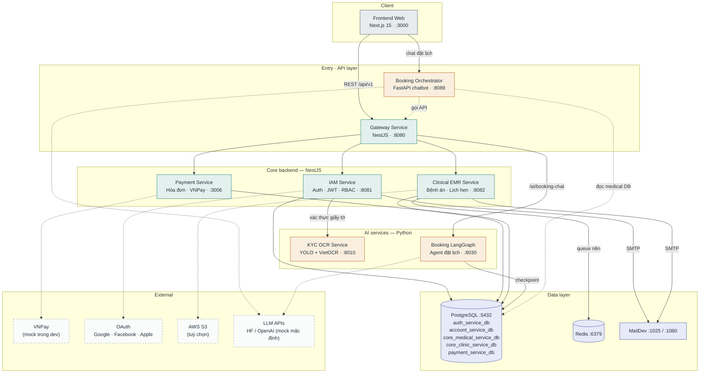

# Sơ đồ khối kiến trúc hệ thống S.M.I.L.E

Tổng quan: **8 service** (1 frontend, 4 NestJS backend, 3 Python AI) · **5 database logic** trong **1 PostgreSQL instance** · Redis · MailDev.

Nguồn sự thật: `docker-compose.yml`, `.env.example` của từng service, `backend/service/gateway-service/src/config/services.config.ts`.

## Chi tiết từng service

Mỗi service có file kiến trúc riêng (diagram + database + bảng kết nối) trong [`docs/architecture/`](architecture/):

| Service | File chi tiết |
|---|---|
| Frontend Web | [architecture/frontend-web.md](architecture/frontend-web.md) |
| Gateway Service | [architecture/gateway-service.md](architecture/gateway-service.md) |
| IAM Service | [architecture/iam-service.md](architecture/iam-service.md) |
| Clinical EMR Service | [architecture/clinical-emr-service.md](architecture/clinical-emr-service.md) |
| Payment Service | [architecture/payment-service.md](architecture/payment-service.md) |
| Booking Orchestrator | [architecture/booking-orchestrator.md](architecture/booking-orchestrator.md) |
| KYC OCR Service | [architecture/kyc-ocr-service.md](architecture/kyc-ocr-service.md) |
| Booking LangGraph | [architecture/booking-langgraph-service.md](architecture/booking-langgraph-service.md) |

## Bảng tóm tắt service

| Service | Stack | Port | Vai trò | Database |
|---|---|---|---|---|
| Frontend Web | Next.js 15 + React 19 | 3000 | Giao diện web bệnh nhân / phòng khám / admin | — |
| Gateway Service | NestJS | 8080 | API Gateway, điểm vào duy nhất, proxy `/api/v1/*` | — (chỉ proxy) |
| IAM Service | NestJS + TypeORM | 8081 | Xác thực, JWT, RBAC, hồ sơ user, OAuth, KYC | `auth_service_db`, `account_service_db` |
| Clinical EMR Service | NestJS + TypeORM | 8082 | Bệnh án, lịch hẹn, khám bệnh, đơn thuốc | `core_medical_service_db`, `core_clinic_service_db` |
| Payment Service | NestJS + TypeORM | 3006 | Hóa đơn, thanh toán VNPay, hoàn tiền | `payment_service_db` |
| Booking Orchestrator | FastAPI (Python) | 8089 | Chatbot đặt lịch (mock LLM) | đọc `core_medical_service_db` |
| KYC OCR Service | FastAPI + YOLO + VietOCR | 8010 | OCR giấy tờ, xác minh KYC | — (stateless) |
| Booking LangGraph | FastAPI + LangGraph | 8030 | Agent đặt lịch nhiều bước | PostgreSQL (checkpoint) |

## Data store

- **PostgreSQL :5432** — 1 instance duy nhất, tách 5 database theo service (pattern database-per-service). Biến thể tách instance riêng từng service nằm ở `docker-compose.swagger.yaml`.
- **Redis :6379** — queue job nền của Clinical EMR (`WORKER_HOST=redis://redis:6379/1`).
- **MailDev :1025 (SMTP) / :1080 (Web UI)** — mail server cho môi trường dev, nhận mail từ IAM và EMR.
- **PGAdmin :5050** — tuỳ chọn, bật bằng `--profile monitoring`.

## Ghi chú

- Docker Compose có profile bật/tắt: `frontend` (web :3000), `chatbot` (orchestrator :8089), `monitoring` (PGAdmin). Mặc định chạy core: gateway, IAM, EMR, payment, postgres, redis, maildev.
- Gateway proxy tới Booking LangGraph qua route `/api/v1/ai/booking-chat` (xem `services.config.ts`); service này hiện chưa có trong `docker-compose.yml` chính, chạy riêng ở `localhost:8030`.
- VNPay và LLM chạy **mock mode** mặc định trong dev (`VNPAY_MOCK=true`).
