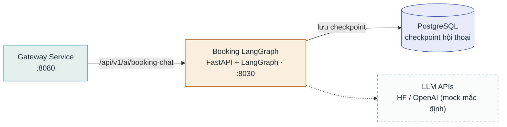

# Booking LangGraph Service

**Stack:** FastAPI + LangGraph (Python) · **Port:** `8030` · **Vị trí:** `ai/booking_langgraph_service/`

Agent đặt lịch nhiều bước — quản lý state hội thoại phức tạp bằng LangGraph, lưu checkpoint hội thoại vào PostgreSQL. Nhận traffic từ Gateway qua route `/api/v1/ai/booking-chat`.

> ⚠️ Chưa có trong `docker-compose.yml` chính — chạy riêng, Gateway trỏ mặc định về `http://localhost:8030`.

## Kết nối

| Chiều | Đích | Giao thức / route | Ghi chú |
|---|---|---|---|
| Vào | Gateway Service | proxy `/api/v1/ai/booking-chat` → `BOOKING_LANGGRAPH_SERVICE_URL` | Xem `gateway-service/src/config/services.config.ts` |
| Ra | PostgreSQL | `:5432` | Lưu checkpoint state hội thoại LangGraph |
| Ra | LLM APIs | HTTPS (tuỳ chọn) | Mặc định mock mode |

## Database

Dùng PostgreSQL làm **checkpoint storage** cho state hội thoại (không có database nghiệp vụ riêng).
