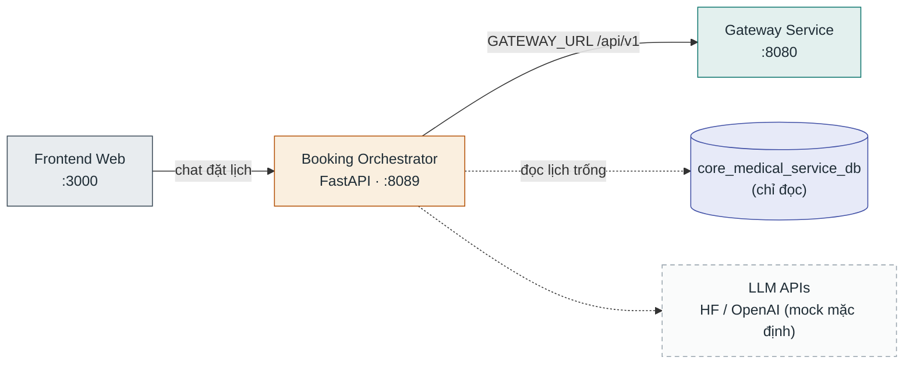

# Booking Orchestrator

**Stack:** FastAPI (Python) · **Port:** `8089` · **Vị trí:** `ai/booking_orchestrator/` · **Profile compose:** `chatbot`

Chatbot đặt lịch hội thoại — nhận chat trực tiếp từ frontend (không qua gateway), mặc định chạy mock LLM.

## Kết nối

| Chiều | Đích | Giao thức / route | Ghi chú |
|---|---|---|---|
| Vào | Frontend Web | HTTP `:8089` | Chat gọi thẳng, không qua gateway |
| Ra | Gateway Service | REST `GATEWAY_URL=http://gateway:8080/api/v1` | Tra lịch trống, thông tin phòng khám |
| Ra | PostgreSQL | đọc `core_medical_service_db` | Không sở hữu database |
| Ra | LLM APIs | HTTPS (tuỳ chọn) | Hugging Face / OpenAI, mặc định mock mode |

## Database

Không sở hữu database riêng — chỉ **đọc** `core_medical_service_db` (thuộc [Clinical EMR Service](clinical-emr-service.md)).
