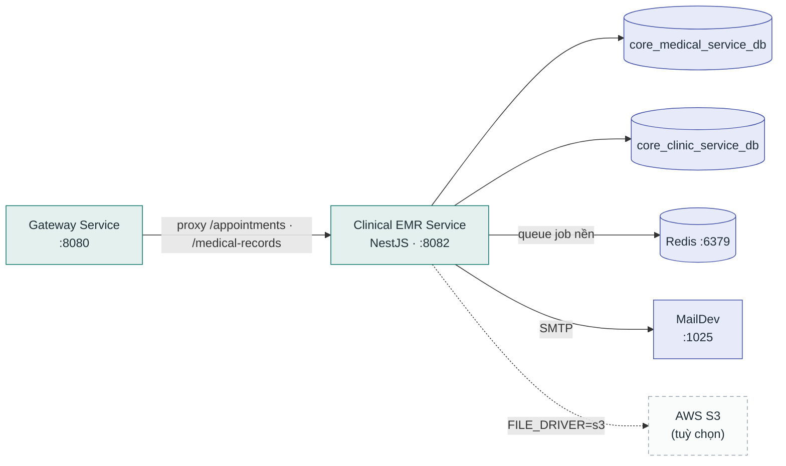

# Clinical EMR Service

**Stack:** NestJS + TypeORM · **Port:** `8082` · **Vị trí:** `backend/service/clinical-emr-service/`

Bệnh án điện tử và vận hành phòng khám — lịch hẹn, phiên khám, đơn thuốc, hồ sơ y tế, lịch làm việc nhân viên.

## Kết nối

| Chiều | Đích | Giao thức / route | Ghi chú |
|---|---|---|---|
| Vào | Gateway Service | proxy `/api/v1/appointments`, medical-records... | |
| Ra | PostgreSQL | TypeORM `:5432` | 2 database bên dưới |
| Ra | Redis | `WORKER_HOST=redis://redis:6379/1` | Queue job nền |
| Ra | MailDev | SMTP `:1025` | Nhắc lịch hẹn, thông báo (dev) |
| Ra | AWS S3 | HTTPS (tuỳ chọn) | Lưu file/ảnh khi `FILE_DRIVER=s3` |

Lưu ý: `core_medical_service_db` còn được **Booking Orchestrator đọc** để tra lịch trống.

## Database

| Database | Vai trò |
|---|---|
| `core_medical_service_db` | Bệnh án (`medical_records`), phiên khám, đơn thuốc |
| `core_clinic_service_db` | Phòng khám, lịch làm việc, nhân viên |

Migration: `src/database/migrations/`.
