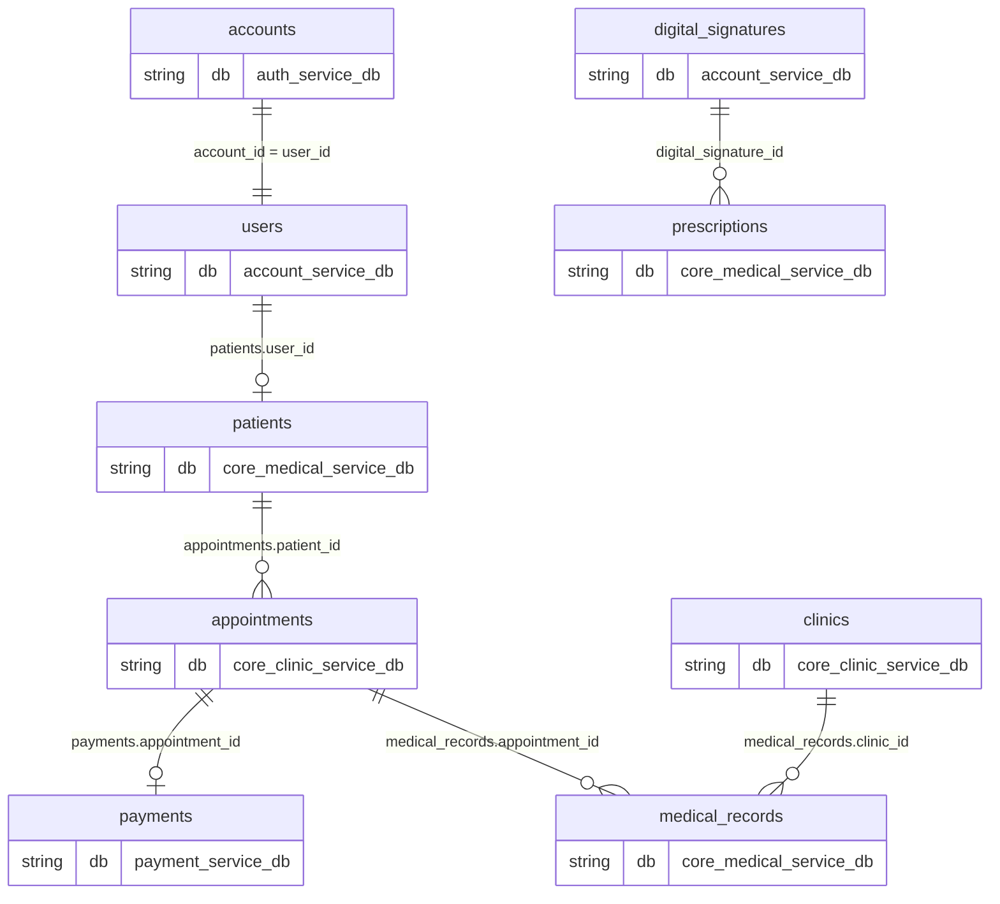
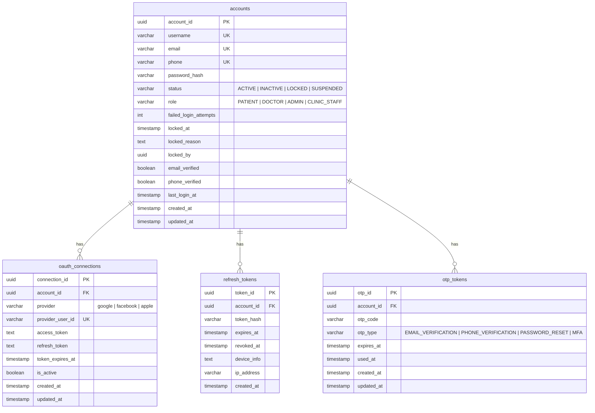
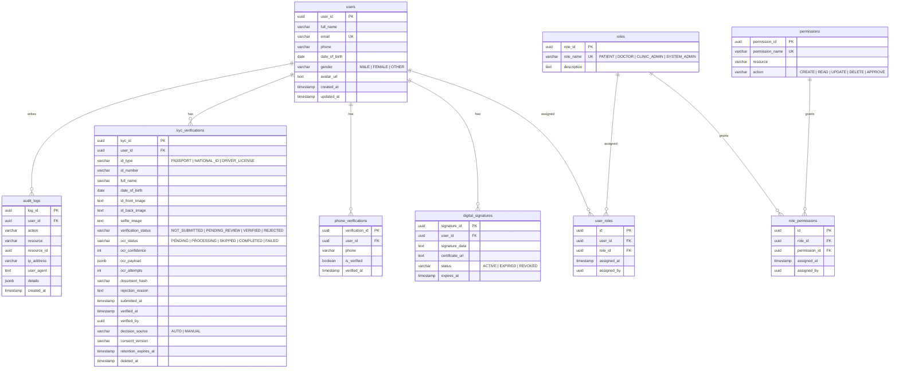
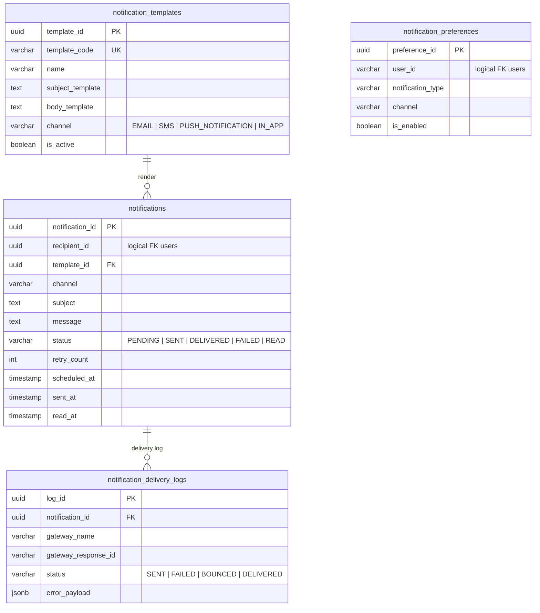
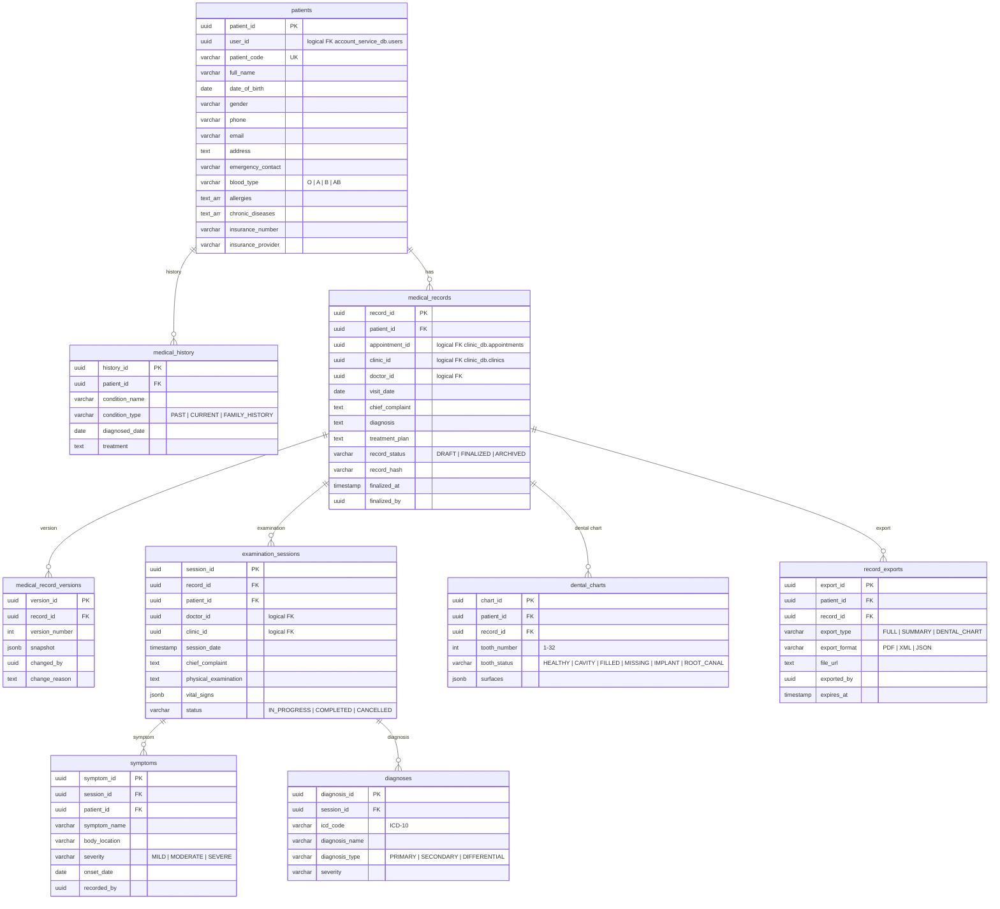
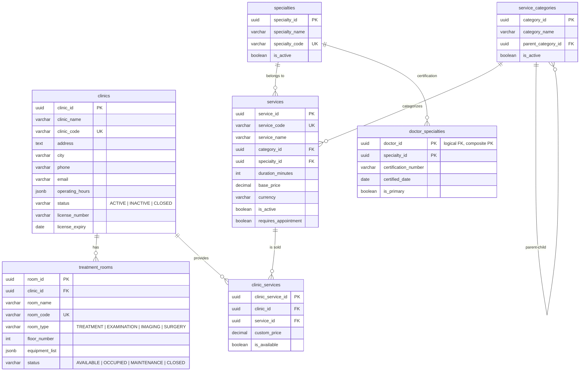
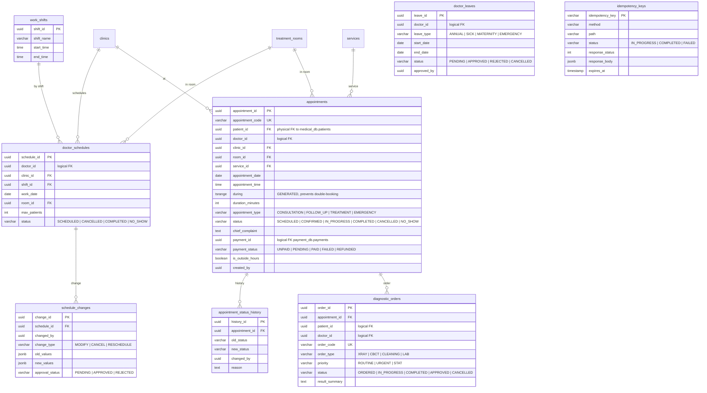
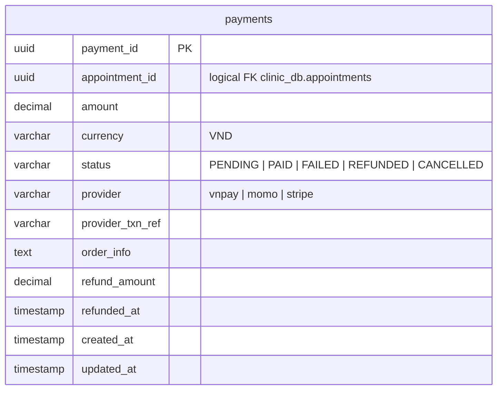

# ERD — S.M.I.L.E Database Relationship Diagram

5 logical databases in 1 PostgreSQL instance, split per service (database-per-service). Source of truth: each service's TypeORM migration files (paths noted at the start of every section).

| Database | Owning service | Main tables |
|---|---|---|
| [`auth_service_db`](#1-auth_service_db--iam-service) | IAM | 4 |
| [`account_service_db`](#2-account_service_db--iam-service) | IAM | 12 |
| [`core_medical_service_db`](#3-core_medical_service_db--clinical-emr-service) | Clinical EMR | 18 |
| [`core_clinic_service_db`](#4-core_clinic_service_db--clinical-emr-service) | Clinical EMR | 14 |
| [`payment_service_db`](#5-payment_service_db--payment-service) | Payment | 1 |

## Cross-database relationships (logical FK)

Databases are separate, so there are no physical FKs between them — links are by UUID (logical FK):



---

## 1. auth_service_db — IAM Service

Migration: `backend/service/iam-service/src/database/migrations/`



---

## 2. account_service_db — IAM Service

Migration: `backend/service/iam-service/src/database/user-migrations/`

### Users, RBAC & KYC



### Notifications



---

## 3. core_medical_service_db — Clinical EMR Service

Migration: `backend/service/clinical-emr-service/src/database/migrations/`

### Patients, medical records & examination sessions



### Treatment, prescriptions, orders & dental imaging

```mermaid
erDiagram
    patients ||--o{ treatment_plans : "has"
    patients ||--o{ treatment_history : "has"
    patients ||--o{ prescriptions : "has"
    patients ||--o{ clinical_orders : "has"
    patients ||--o{ dental_images : "has"
    prescriptions ||--o{ prescription_items : "contains"
    clinical_orders ||--o{ lab_test_results : "result"
    image_categories ||--o{ dental_images : "categorizes"
    dental_images ||--o{ image_annotations : "annotation"
    dental_images ||--o{ pacs_sync_logs : "PACS sync"

    patients {
        uuid patient_id PK
    }
    treatment_plans {
        uuid plan_id PK
        uuid patient_id FK
        uuid record_id FK
        varchar plan_name
        text objectives
        int duration_weeks
        varchar status "ACTIVE | COMPLETED | ABANDONED | ON_HOLD"
        varchar sent_via "EMAIL | SMS | PRINT"
        uuid created_by
    }
    treatment_history {
        uuid treatment_id PK
        uuid record_id FK
        uuid patient_id FK
        date treatment_date
        int_arr tooth_numbers
        varchar procedure_code
        varchar procedure_name
        decimal cost
        varchar status "PLANNED | IN_PROGRESS | COMPLETED | CANCELLED"
        uuid performed_by
    }
    prescriptions {
        uuid prescription_id PK
        uuid record_id FK
        uuid patient_id FK
        uuid doctor_id "logical FK"
        date prescription_date
        varchar status "ACTIVE | FILLED | EXPIRED | CANCELLED"
        uuid digital_signature_id "logical FK account_db.digital_signatures"
    }
    prescription_items {
        uuid item_id PK
        uuid prescription_id FK
        varchar medication_name
        varchar medication_code
        varchar dosage
        varchar route "ORAL | IV | IM | TOPICAL | INHALATION"
        varchar frequency
        int duration_days
        int quantity
    }
    clinical_orders {
        uuid order_id PK
        uuid record_id FK
        uuid patient_id FK
        uuid ordered_by
        varchar order_type "LAB | IMAGING | XRAY | CONE_BEAM_CT"
        varchar test_type
        int_arr teeth_numbers
        varchar urgency "ROUTINE | URGENT | STAT"
        varchar status "ORDERED | SCHEDULED | COMPLETED | CANCELLED | APPROVED"
        text result_url
    }
    lab_test_results {
        uuid result_id PK
        uuid order_id FK
        varchar test_name
        text result_value
        varchar result_unit
        varchar reference_range
        boolean is_abnormal
    }
    image_categories {
        uuid category_id PK
        varchar category_name
    }
    dental_images {
        uuid image_id PK
        uuid patient_id FK
        uuid record_id FK
        uuid category_id FK
        varchar image_type "INTRAORAL | EXTRAORAL | XRAY | CBCT | PHOTO"
        text image_url
        text thumbnail_url
        varchar file_format "JPG | PNG | DICOM"
        int_arr tooth_numbers
        jsonb metadata
        varchar pacs_id
        uuid uploaded_by
        boolean is_archived
    }
    image_annotations {
        uuid annotation_id PK
        uuid image_id FK
        uuid annotated_by
        varchar annotation_type "MEASUREMENT | MARKING | DIAGNOSIS | NOTE"
        jsonb annotation_data
    }
    pacs_sync_logs {
        uuid sync_id PK
        uuid image_id FK
        varchar sync_type "UPLOAD | DOWNLOAD | DELETE | SYNC"
        varchar status "PENDING | SYNCED | FAILED"
    }
```



> Note: migration `1715028537217-CreateUser.ts` also creates a set of legacy boilerplate tables (`user`, `session`, `role`, `status`, `file`) — leftover from the NestJS template, not part of the business domain.

---

## 4. core_clinic_service_db — Clinical EMR Service

Migration: `backend/service/clinical-emr-service/src/database/clinic-migrations/`

### Clinics, services & staff



### Work schedules & appointments



Notable constraint: `appointments` has an `appt_no_double_booking` constraint — `EXCLUDE (doctor_id WITH =, during WITH &&)` rules out overlapping bookings for the same doctor (except cancelled/no_show statuses).

---

## 5. payment_service_db — Payment Service

Migration: `backend/service/payment-service/src/database/migrations/`



---

## General notes

- Most tables have `created_at`, `updated_at` (some also have `created_by`, `updated_by` as UUID logical FKs) — omitted from the diagrams for brevity.
- **Logical FK** = a UUID column pointing to a table in another database, with no physical FK constraint (due to database-per-service split). No exceptions: the physical FK `appointments.patient_id → patients` was previously removed (migration `1730000000004-DropAppointmentPatientForeignKey.ts`) because Postgres does not support cross-database FKs; integrity is checked at the application layer (`AppointmentsService.resolveBookingPatientId` → `PatientsService.findOne`).
- The Booking LangGraph service uses PostgreSQL as checkpoint storage for conversation state (tables managed by LangGraph itself, not part of the business schema).
```
