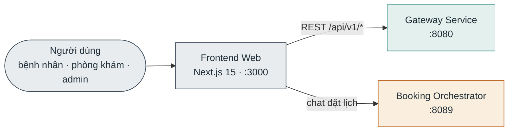

# Frontend Web

**Stack:** Next.js 15 + React 19 + TypeScript · **Port:** `3000` · **Profile compose:** `frontend`

Giao diện web cho bệnh nhân, phòng khám và admin. Client thuần — không có database riêng; mọi dữ liệu lấy qua API.

## Kết nối

| Chiều | Đích | Giao thức / route | Ghi chú |
|---|---|---|---|
| Ra | Gateway Service | REST `NEXT_PUBLIC_GATEWAY_URL` → `:8080/api/v1` | Mọi API nghiệp vụ |
| Ra | Booking Orchestrator | HTTP `NEXT_PUBLIC_CHATBOT_URL` → `:8089` | Chat đặt lịch, gọi thẳng không qua gateway |

## Database

Không có — client-side, state nằm trên trình duyệt.
