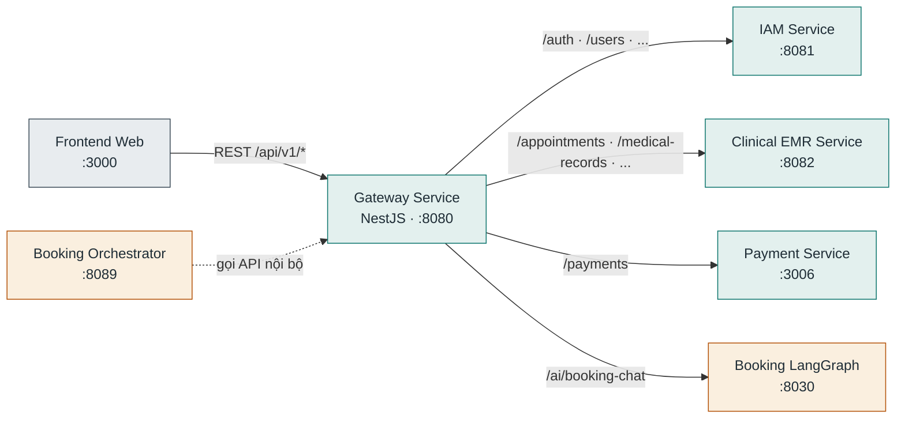

# Gateway Service

**Stack:** NestJS · **Port:** `8080` · **Vị trí:** `backend/service/gateway-service/`

API Gateway — điểm vào duy nhất của hệ thống, proxy request `/api/v1/*` tới các service phía sau và gom Swagger của toàn bộ downstream (`/swagger`). Không có database riêng (chỉ proxy).

## Kết nối

| Chiều | Đích | Giao thức / route | Ghi chú |
|---|---|---|---|
| Vào | Frontend Web | REST `/api/v1/*` | Điểm vào duy nhất |
| Vào | Booking Orchestrator | REST `GATEWAY_URL` | Chatbot tra lịch trống, thông tin phòng khám |
| Ra | IAM Service | proxy → `IAM_SERVICE_URL` (`:8081`) | `/api/v1/auth`, users, roles... |
| Ra | Clinical EMR Service | proxy → `CLINICAL_EMR_SERVICE_URL` (`:8082`) | Lịch hẹn, bệnh án... |
| Ra | Payment Service | proxy → `PAYMENT_SERVICE_URL` (`:3006`) | `/api/v1/payments` |
| Ra | Booking LangGraph | proxy → `BOOKING_LANGGRAPH_SERVICE_URL` (`:8030`) | `/api/v1/ai/booking-chat` |

Bảng route đầy đủ: `src/config/services.config.ts`.

## Database

Không có — stateless proxy, cấu hình route bằng env.
