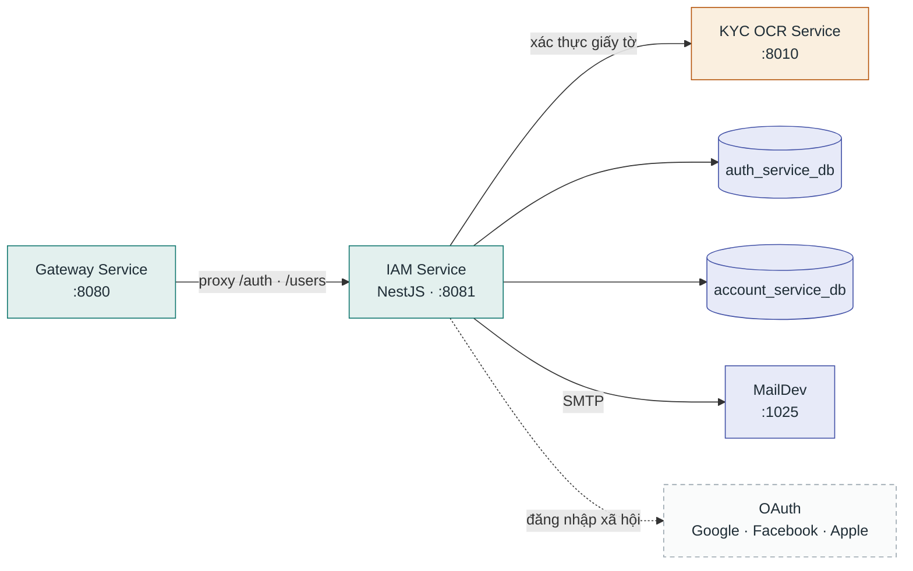

# IAM Service

**Stack:** NestJS + TypeORM · **Port:** `8081` · **Vị trí:** `backend/service/iam-service/`

Identity & Access Management — xác thực (JWT, OAuth), phân quyền RBAC, hồ sơ người dùng và xác minh danh tính KYC.

## Kết nối

| Chiều | Đích | Giao thức / route | Ghi chú |
|---|---|---|---|
| Vào | Gateway Service | proxy `/api/v1/auth`, users, roles... | Không nhận traffic trực tiếp từ client |
| Ra | KYC OCR Service | HTTP `KYC_OCR_URL` (`:8010`) | Đọc CCCD/giấy tờ khi đăng ký KYC |
| Ra | PostgreSQL | TypeORM `:5432` | 2 database bên dưới |
| Ra | MailDev | SMTP `:1025` | Mail xác nhận, thông báo (dev) |
| Ra | OAuth providers | HTTPS | Google / Facebook / Apple login |

## Database

| Database | Vai trò |
|---|---|
| `auth_service_db` | Phiên đăng nhập, credential, refresh token, KYC (`kyc_verifications.document_hash`) |
| `account_service_db` | Tài khoản, hồ sơ người dùng, vai trò |

Migration: `src/database/user-migrations/`. ERD chi tiết: [erd.md](erd.md#1-auth_service_db--iam-service).
