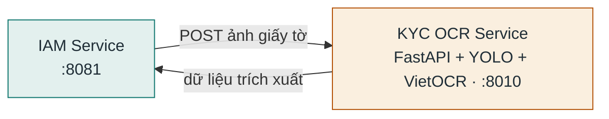

# KYC OCR Service

**Stack:** FastAPI + OpenCV + YOLO + VietOCR (Python) · **Port:** `8010` · **Vị trí:** `ai/kyc_ocr_service/`

OCR giấy tờ tùy thân — nhận ảnh CCCD/giấy tờ từ IAM Service, phát hiện vùng bằng YOLO, đọc chữ bằng VietOCR, trả dữ liệu trích xuất để xác minh KYC. Hoàn toàn stateless.

## Kết nối

| Chiều | Đích | Giao thức / route | Ghi chú |
|---|---|---|---|
| Vào | IAM Service | HTTP `KYC_OCR_URL=http://kyc-ocr-service:8010` | Duy nhất IAM gọi tới |

## Database

Không có — stateless, xử lý ảnh trong request rồi trả kết quả, không lưu trữ.
