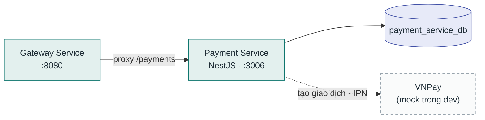

# Payment Service

**Stack:** NestJS + TypeORM · **Port:** `3006` · **Vị trí:** `backend/service/payment-service/`

Xử lý thanh toán — hóa đơn, tích hợp cổng VNPay, hoàn tiền.

## Kết nối

| Chiều | Đích | Giao thức / route | Ghi chú |
|---|---|---|---|
| Vào | Gateway Service | proxy `/api/v1/payments` | |
| Ra | PostgreSQL | TypeORM `:5432` | `payment_service_db` |
| Ra | VNPay | HTTPS | `VNPAY_MOCK=true` mặc định trong dev |

## Database

| Database | Vai trò |
|---|---|
| `payment_service_db` | Hóa đơn, giao dịch thanh toán, hoàn tiền |
