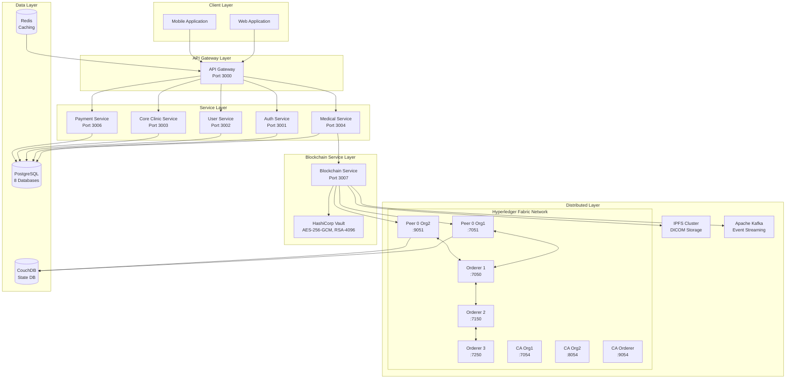
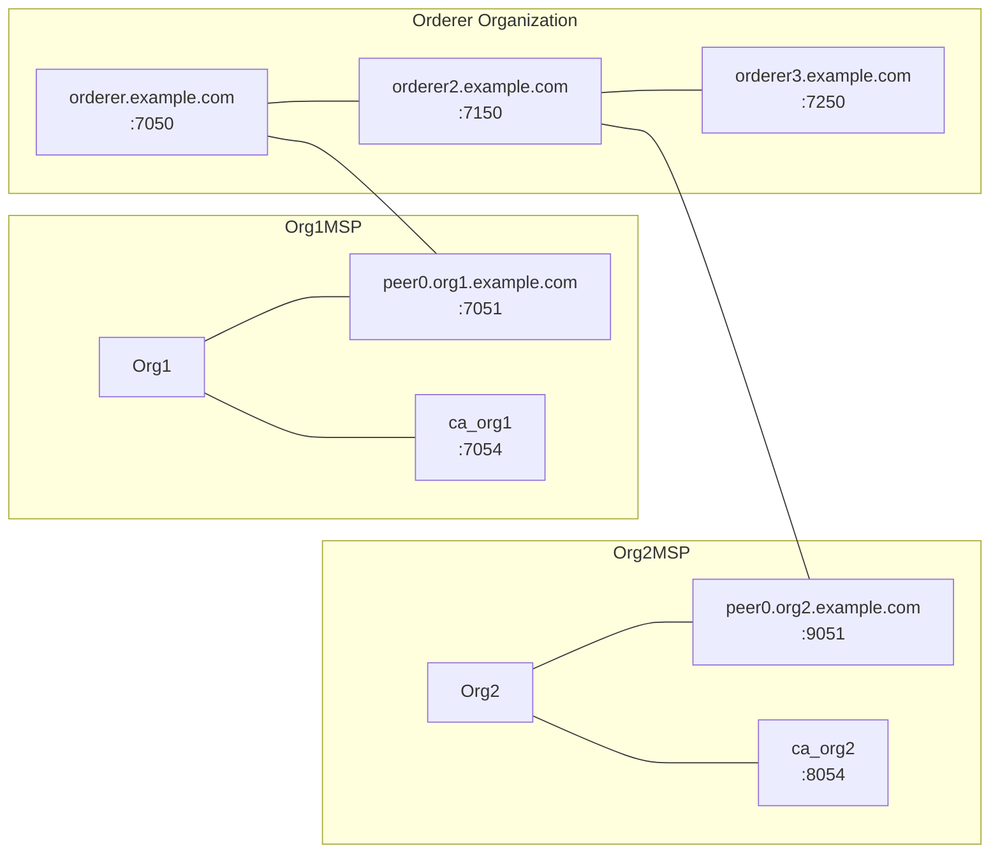
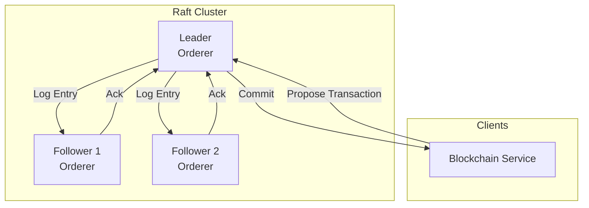
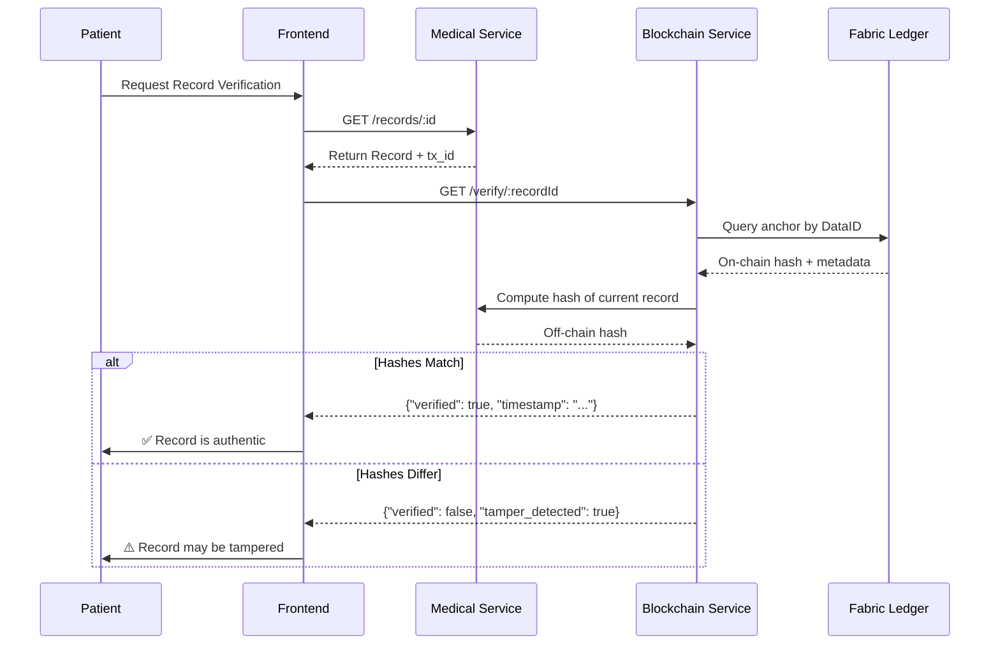
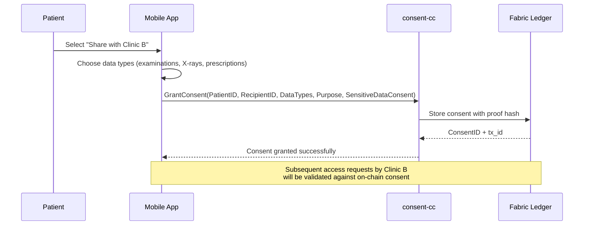
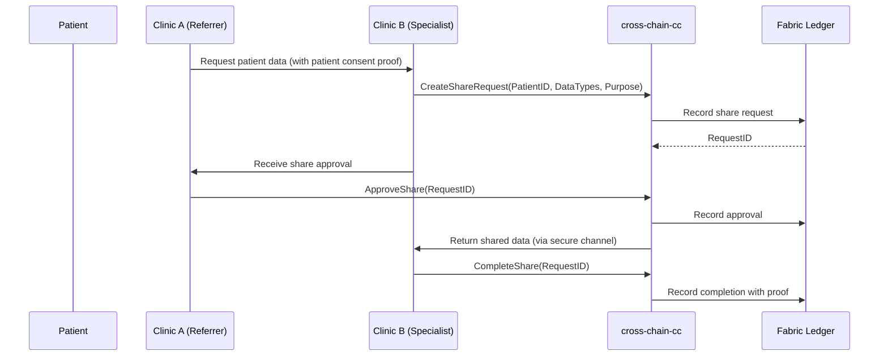
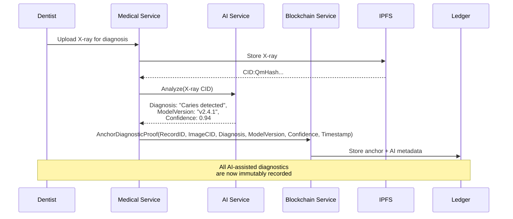
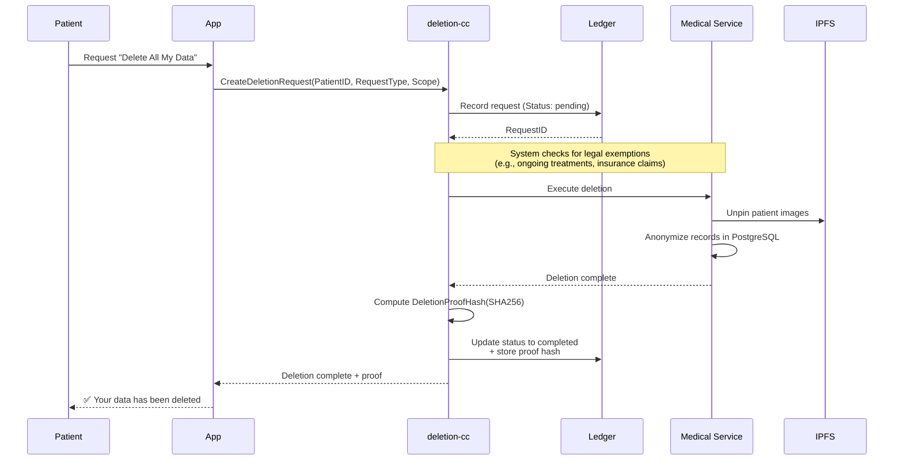

# S.M.I.L.E Blockchain Whitepaper

## A Permissioned Blockchain Framework for Dental Healthcare Data Integrity and Privacy

---

## Table of Contents

1. [Abstract](#abstract)
2. [Problem Statement](#problem-statement)
3. [Proposed Solution](#proposed-solution)
4. [System Overview](#system-overview)
5. [Consensus Mechanism](#consensus-mechanism)
6. [Use Cases](#use-cases)
7. [Technology Stack](#technology-stack)
8. [Regulatory Compliance](#regulatory-compliance)
9. [Roadmap](#roadmap)
10. [Conclusion](#conclusion)

---

## 1. Abstract

S.M.I.L.E (Smart Medical Intelligent Ledger for E-health) is a next-generation Dental Practice Management System (DPMS) that combines traditional healthcare operations with modern decentralized technologies. This whitepaper presents the blockchain component of S.M.I.L.E, built on **Hyperledger Fabric v2.5**, designed to ensure medical data integrity, patient consent enforcement, and regulatory compliance.

The blockchain layer serves as the "truth layer" of S.M.I.L.E, anchoring cryptographic hashes of medical records while keeping Protected Health Information (PHI) off-chain. This design preserves patient privacy while providing immutable proof of data authenticity. Seven specialized smart contracts (chaincodes) handle medical data anchoring, consent management, access control, key management, data lineage, right-to-erasure, and cross-chain interoperability.

This document outlines the technical architecture, consensus mechanism, use cases, and future roadmap for the S.M.I.L.E blockchain layer.

---

## 2. Problem Statement

### 2.1 Data Integrity and Tampering Risks

Traditional Electronic Medical Record (EMR) systems store data in centralized databases vulnerable to unauthorized modification. Without cryptographic integrity guarantees, malicious actors or insider threats can alter:
- Examination records
- Treatment histories
- AI diagnostic results
- Prescription data

The lack of tamper-evident records creates legal liability and erodes patient trust.

### 2.2 Fragmented Consent Management

In multi-clinic healthcare ecosystems, patient consent is often:
- Stored in siloed systems per clinic
- Lacking standardization across organizations
- Difficult to audit and verify
- Prone to inconsistencies when patients transfer between providers

This fragmentation makes it challenging to demonstrate compliance with GDPR Article 7 and HIPAA Privacy Rule requirements.

### 2.3 Inadequate Audit Trails

Healthcare regulations (HIPAA Security Rule §164.312, GDPR Article 30) mandate comprehensive audit trails. Traditional systems often:
- Store logs in editable databases
- Lack cryptographic proof of log integrity
- Provide insufficient detail about data access events
- Offer no standardized format for compliance reporting

### 2.4 Lack of Interoperability

Dental practices operate independent systems with no standardized data exchange protocol. This results in:
- Patients repeating medical histories at each clinic
- Inefficient referrals between specialists
- No unified record of care continuity
- Barriers to cross-institutional research

### 2.5 AI Provenance Challenges

S.M.I.L.E integrates AI-powered dental disease detection. However, AI diagnostics require:
- Verifiable provenance of the input images
- Immutable records of model version used
- Audit trails for AI-assisted decisions
- Ability to reproduce diagnostic results

---

## 3. Proposed Solution

### 3.1 Permissioned Blockchain Architecture

S.M.I.L.E employs **Hyperledger Fabric**, a permissioned blockchain framework ideal for healthcare because:

| Feature | Benefit |
|---------|---------|
| Permissioned network | Known participants, reduced attack surface |
| Modular consensus | Configurable Raft ordering for performance |
| Channel isolation | Separate data domains per use case |
| Private data collections | Need-to-know basis for sensitive information |
| Endorsement policies | Customizable validation rules |

### 3.2 Hash Anchoring Strategy

Instead of storing raw PHI on-chain, S.M.I.L.E employs a **hash anchoring** pattern:

```
Off-Chain Data (PostgreSQL/IPFS)
           │
           ▼
    SHA-256 Hash
           │
           ▼
    On-Chain Anchor Record
    (contains: hash, timestamp, owner, metadata)
```

This approach provides:
- **Integrity verification**: Any modification to off-chain data changes the hash
- **Privacy preservation**: No PHI leaves the secure off-chain database
- **Storage efficiency**: Blockchain stores only 64-byte hashes
- **Regulatory compliance**: Meets GDPR "right to be forgotten" by not duplicating data on-chain

### 3.3 Seven Specialized Chaincodes

The S.M.I.L.E blockchain layer implements seven purpose-built smart contracts:

| Chaincode | Purpose |
|-----------|---------|
| `medical-anchor-cc` | Immutable proof-of-existence for medical records |
| `consent-cc` | Patient consent lifecycle (grant, update, withdraw) |
| `access-control-cc` | Tamper-evident access audit trails |
| `key-mgmt-cc` | Encryption key metadata registry with rotation |
| `data-lineage-cc` | Complete data provenance and ownership chain |
| `deletion-cc` | GDPR right-to-erasure implementation |
| `cross-chain-cc` | Inter-organization data sharing bridge |

---

## 4. System Overview

### 4.1 High-Level Architecture



### 4.2 Network Topology



### 4.3 Channel Architecture

S.M.I.L.E operates two Fabric channels:

| Channel | Purpose | Participants | Data Types |
|---------|---------|--------------|------------|
| `MedicalRecordsChannel` | Primary data anchoring | Org1, Org2 | Medical record hashes, AI diagnostic proofs, treatment histories |
| `ConsentChannel` | Privacy isolation | Org1, Org2 | Consent grants, withdrawals, consent proofs |

---

## 5. Consensus Mechanism

### 5.1 Raft Consensus (etcdraft)

S.M.I.L.E uses **Raft consensus** (implemented as etcdraft in Hyperledger Fabric), a crash-fault tolerant ordering service.



### 5.2 Raft Characteristics

| Property | Value |
|----------|-------|
| **Consensus Type** | Crash-Fault Tolerant (CFT) |
| **Node Count** | 3 orderers |
| **Tolerated Failures** | 1 out of 3 |
| **Leader Election** | Randomized timeout-based |
| **Log Replication** | Pipeline-based |
| **Transaction Ordering** | SBFT-style total order |

### 5.3 Endorsement Policy

Transactions require endorsement from a **MAJORITY** of peers:

```
AND('Org1MSP.peer', 'Org2MSP.peer') 
  → Requires at least 1 endorsement from each organization
```

This ensures:
- **Cross-organizational validation**: Both organizations verify the transaction
- ** Byzantine fault tolerance**: Tolerates up to f < n/3 malicious nodes
- **Transaction integrity**: No single org can unilaterally modify state

### 5.4 Why Raft for Healthcare

| Criterion | Raft | PoW | PoS |
|-----------|------|-----|-----|
| Transaction throughput | High | Low | Medium |
| Latency | Low | High | Medium |
| Energy efficiency | High | Low | Medium |
| Finality | Instant | Slow (6+ blocks) | Medium |
| Permissioned | Yes | No | Optional |
| Regulatory alignment | High | Low | Medium |

Raft provides the ideal balance of performance, finality, and energy efficiency for healthcare use cases where network participants are known and trusted.

---

## 6. Use Cases

### 6.1 Use Case 1: Medical Record Integrity Verification

**Scenario**: A patient returns to a clinic after 2 years and requests their original examination records. The clinic wants to verify the records haven't been tampered with.



**Value**:
- Cryptographic proof of record integrity
- Timestamp of original creation
- Immutable audit trail

---

### 6.2 Use Case 2: Patient Consent Management

**Scenario**: A patient wants to grant Clinic B access to share their historical records from Clinic A.



**Value**:
- GDPR Article 7 compliant consent records
- Granular permission control per data type
- Immutable proof of consent grant/withdraw
- Real-time consent status queries

---

### 6.3 Use Case 3: Cross-Clinic Data Sharing

**Scenario**: A patient is referred from Clinic A (general dentist) to Clinic B (specialist orthodontist). Clinic B needs access to the patient's X-rays and treatment history.



**Value**:
- Standardized inter-organizational data exchange
- Consent-verified transfers
- Full audit trail of data sharing events
- Proof of data transfer integrity

---

### 6.4 Use Case 4: AI Diagnostic Provenance

**Scenario**: A dentist uses S.M.I.L.E's AI to analyze a dental X-ray. Later, the patient questions the AI-assisted diagnosis. The clinic needs to prove:
- The exact input image used
- The AI model version
- The diagnostic result at that time



**Value**:
- Reproducible AI diagnostics
- Model version tracking for regulatory compliance
- Immutable input/output records
- Confidence scoring for liability management

---

### 6.5 Use Case 5: Right to Erasure (GDPR Article 17)

**Scenario**: A patient exercises their right to be forgotten under GDPR. The system must:
1. Accept the deletion request
2. Verify no legal holds apply
3. Anonymize/delete data across all systems
4. Provide proof of deletion



**Value**:
- GDPR Article 17 compliance
- Immutable proof of deletion
- Patient notification workflow
- Legal exemption handling

---

## 7. Technology Stack

### 7.1 Blockchain Components

| Component | Technology | Version |
|-----------|------------|---------|
| Blockchain Framework | Hyperledger Fabric | 2.5 |
| Ordering Service | Raft (etcdraft) | - |
| Smart Contract Language | Go | 1.20+ |
| Contract API | fabric-contract-api-go | 1.2.0 |
| State Database | CouchDB | 3.3 |
| Certificate Authority | Fabric CA | 1.5 |
| Client SDK | Fabric Gateway SDK | 1.0 |

### 7.2 Integration Components

| Component | Technology | Purpose |
|-----------|------------|---------|
| Key Management | HashiCorp Vault | AES-256-GCM, RSA-4096 key storage |
| Decentralized Storage | IPFS (Kubo) | Medical image storage |
| Event Streaming | Apache Kafka | Blockchain event propagation |
| Message Queue | RabbitMQ | Async service communication |

### 7.3 Backend Stack

| Layer | Technology |
|-------|------------|
| API Gateway | NestJS |
| Microservices | NestJS (9 services) |
| Database | PostgreSQL 16 |
| Cache | Redis 7 |
| Container Orchestration | Docker Compose (dev), Kubernetes (prod) |

---

## 8. Regulatory Compliance

### 8.1 HIPAA (United States)

| HIPAA Requirement | S.M.I.L.E Implementation |
|------------------|-------------------------|
| §164.312(d) - Authentication | X.509 certificates, MSP identity |
| §164.312(e)(1) - Transmission security | TLS 1.3, encrypted channels |
| §164.312(e)(2) - Encryption | AES-256-GCM for data at rest |
| §164.312(b) - Audit controls | access-control-cc immutable audit trail |
| §164.508 - Consent | consent-cc consent management |

### 8.2 GDPR (European Union)

| GDPR Article | S.M.I.L.E Implementation |
|--------------|--------------------------|
| Article 7 - Consent | consent-cc grant/withdraw functions |
| Article 17 - Right to erasure | deletion-cc with proof hashes |
| Article 30 - Records of processing | data-lineage-cc full provenance |
| Article 32 - Security | HashiCorp Vault, encryption, access control |
| Article 35 - DPIA | Privacy by design (hash-only anchoring) |

### 8.3 Vietnamese Decree 13/2023

| Decree 13 Requirement | S.M.I.L.E Implementation |
|----------------------|---------------------------|
| Article 27 - Encryption | AES-256-GCM, RSA-4096 |
| Article 28 - Key management | key-mgmt-cc with rotation |
| Article 29 - Personal data protection | Consent-first architecture |
| Article 30 - Cross-border transfer | cross-chain-cc with verification |

---

## 9. Roadmap

### Phase 1: Foundation (Completed ✅)

- [x] Hyperledger Fabric 2.5 network deployment
- [x] 3-node Raft cluster configuration
- [x] Medical anchor chaincode implementation
- [x] Basic hash verification API

### Phase 2: Privacy Framework (Completed ✅)

- [x] Consent management chaincode
- [x] Access control audit chaincode
- [x] GDPR-compliant deletion workflow
- [x] Data lineage tracking

### Phase 3: Enterprise Features (Current)

- [ ] Key management chaincode with Vault integration
- [ ] Cross-chain interoperability protocol
- [ ] Advanced endorsement policies
- [ ] Multi-channel support

### Phase 4: Performance Optimization

- [ ] CouchDB indexing optimization
- [ ] Kafka event streaming implementation
- [ ] Caching layer for frequent queries
- [ ] Load testing with Hyperledger Caliper

### Phase 5: Ecosystem Expansion

- [ ] Integration with national health blockchain
- [ ] Insurance claim processing module
- [ ] Research data sharing framework
- [ ] Public benchmark publication

---

## 10. Conclusion

S.M.I.L.E's blockchain layer provides a secure, privacy-preserving foundation for dental healthcare data management. By leveraging Hyperledger Fabric's permissioned architecture, the system achieves:

- **Data Integrity**: Cryptographic hash anchoring ensures medical records remain unaltered
- **Patient Sovereignty**: First-class consent management gives patients control over their data
- **Regulatory Compliance**: Built-in compliance with HIPAA, GDPR, and Vietnamese Decree 13/2023
- **Interoperability**: Cross-chain protocols enable seamless data sharing between clinics
- **Auditability**: Immutable, verifiable audit trails satisfy legal and regulatory requirements

The modular chaincode design allows future extension while maintaining focus on healthcare-specific requirements. As the system evolves, performance optimization and ecosystem integration will expand the network's utility for the broader healthcare community.

---

## References

1. Hyperledger Fabric Documentation v2.5. https://hyperledger-fabric.readthedocs.io/
2. GDPR Text. https://eur-lex.europa.eu/legal-content/EN/TXT/?uri=CELEX%3A32016R0679
3. HIPAA Security Rule. 45 CFR Part 164, Subpart C.
4. Vietnamese Decree 13/2023/ND-CP on Personal Data Protection.
5. Ethereum Whitepaper. https://ethereum.org/whitepaper/
6. Raft Consensus Algorithm. https://raft.github.io/

---

*Document Version: 1.0*  
*Last Updated: March 2026*  
*S.M.I.L.E - Smart Medical Intelligent Ledger for E-health*
