# S.M.I.L.E Blockchain System Architecture

## Technical Deep-Dive into the Hyperledger Fabric Infrastructure

---

## Table of Contents

1. [Network Topology](#1-network-topology)
2. [Node Architecture](#2-node-architecture)
3. [Channel Architecture](#3-channel-architecture)
4. [Integration Layer](#4-integration-layer)
5. [Storage Architecture](#5-storage-architecture)
6. [Event Streaming](#6-event-streaming)
7. [High Availability](#7-high-availability)
8. [Security Architecture](#8-security-architecture)
9. [Deployment Configuration](#9-deployment-configuration)

---

## 1. Network Topology

### 1.1 Fabric Network Overview

The S.M.I.L.E blockchain network is built on **Hyperledger Fabric v2.5** with a permissioned, Raft-based ordering service.

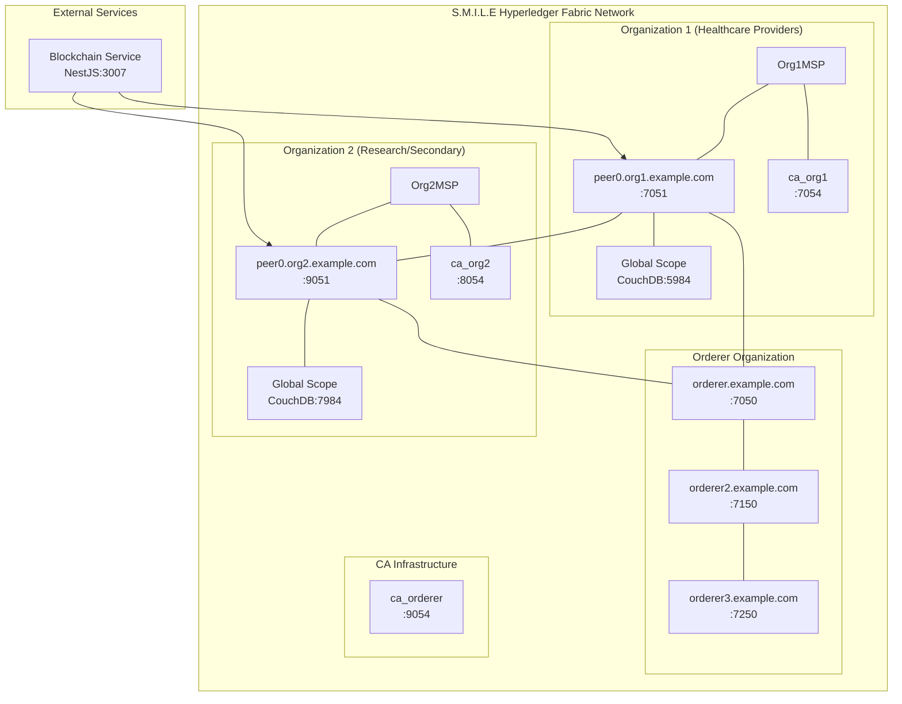

### 1.2 Node Specifications

| Node Type | Hostname | Ports | Organization | TLS |
|-----------|----------|-------|--------------|-----|
| Orderer | orderer.example.com | 7050 (grpc), 9443 (metrics) | OrdererMSP | Enabled |
| Orderer | orderer2.example.com | 7150, 9444 | OrdererMSP | Enabled |
| Orderer | orderer3.example.com | 7250, 9445 | OrdererMSP | Enabled |
| Peer | peer0.org1.example.com | 7051 (grpc), 7052 (events), 9446 (metrics) | Org1MSP | Enabled |
| Peer | peer0.org2.example.com | 9051 (grpc), 9052 (events), 9447 (metrics) | Org2MSP | Enabled |
| CA | ca_org1 | 7054 (http), 7055 (https) | Org1MSP | TLS optional |
| CA | ca_org2 | 8054, 8055 | Org2MSP | TLS optional |
| CA | ca_orderer | 9054, 9055 | OrdererMSP | TLS optional |

### 1.3 Network Connectivity Matrix

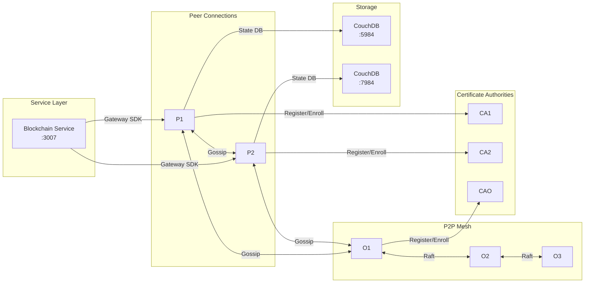

---

## 2. Node Architecture

### 2.1 Orderer Node Components

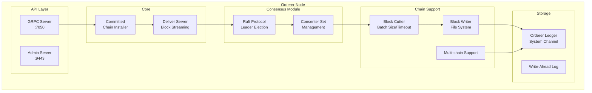

**Orderer Responsibilities**:
- Transaction ordering (Raft consensus)
- Block cutting (batch size: 500, absolute max: 1020)
- Block distribution to peers via Deliver service
- Channel management (create, join, update)
- System channel maintenance

### 2.2 Peer Node Components

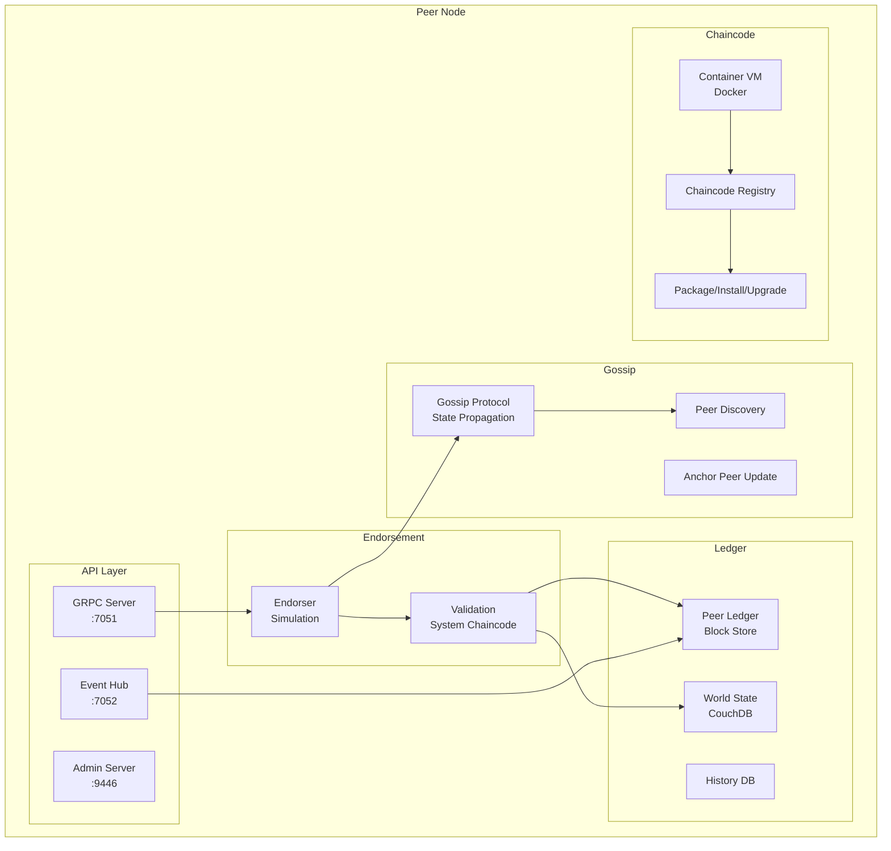

**Peer Responsibilities**:
- Endorsement policy validation
- Transaction simulation
- Ledger maintenance (blocks + state)
- Chaincode execution (in Docker containers)
- Gossip-based state propagation
- Block event generation

### 2.3 Certificate Authority Architecture

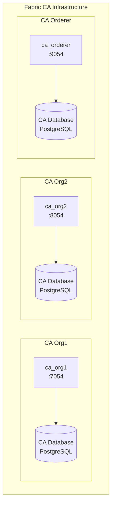

**CA Functions**:
- Identity registration
- Certificate issuance (ECerts for transactions, ICerts for TLS)
- Certificate revocation
- Attribute-based access control (future)

---

## 3. Channel Architecture

### 3.1 Channel Overview

S.M.I.L.E operates two Fabric channels for logical data separation:

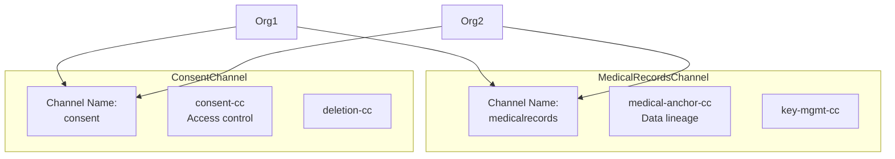

### 3.2 Channel Configuration

| Property | MedicalRecordsChannel | ConsentChannel |
|----------|----------------------|----------------|
| **Channel Name** | `medicalrecords` | `consent` |
| **Block Validation** | | |
| - Validation | true | true |
| - Max Transaction Count | 500 | 500 |
| - Absolute Max Bytes | 10 MB | 10 MB |
| - Preferred Max Bytes | 2 MB | 2 MB |
| **Ordering Service** | | |
| - Type | raft | raft |
| - Consenters | 3 orderers | 3 orderers |
| **Organizations** | | |
| - Org1MSP | Member | Member |
| - Org2MSP | Member | Member |
| **Anchor Peers** | | |
| - Org1 | peer0.org1:7051 | peer0.org1:7051 |
| - Org2 | peer0.org2:9051 | peer0.org2:9051 |

### 3.3 Channel Creation Flow

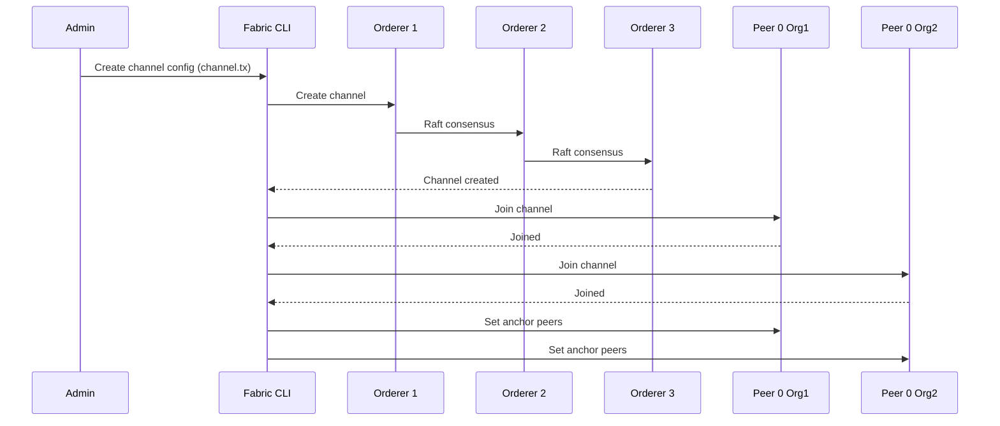

---

## 4. Integration Layer

### 4.1 Blockchain Service Architecture

The **Blockchain Service** (NestJS, port 3007) serves as the bridge between the S.M.I.L.E microservices and the Hyperledger Fabric network.

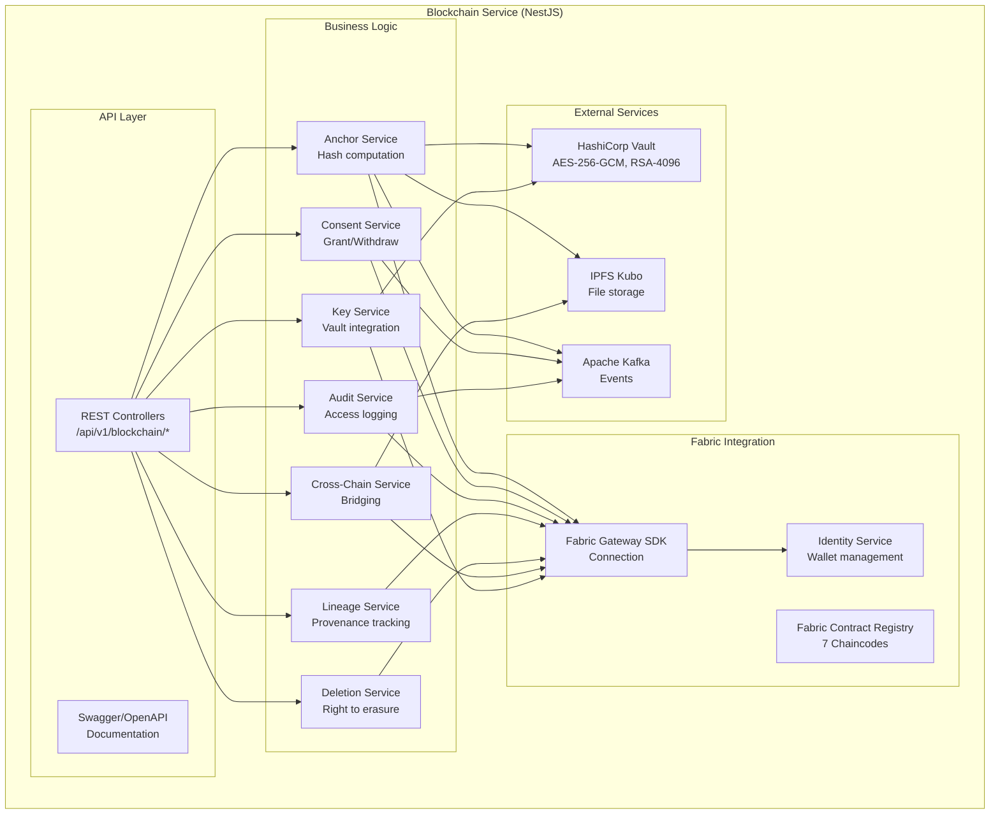

### 4.2 Fabric Gateway SDK Integration

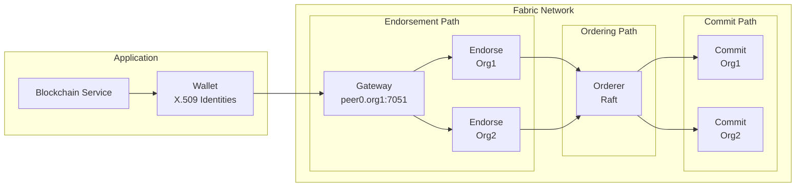

### 4.3 API Endpoints Summary

| Module | Endpoint | Method | Description |
|--------|----------|--------|-------------|
| **Anchors** | `/api/v1/blockchain/anchors` | POST | Anchor medical data hash |
| | `/api/v1/blockchain/anchors/:id` | GET | Get anchor by ID |
| | `/api/v1/blockchain/anchors/patient/:patientId` | GET | Get anchors by patient |
| | `/api/v1/blockchain/anchors/:id/verify` | POST | Verify data integrity |
| **Consents** | `/api/v1/blockchain/consents` | POST | Grant consent |
| | `/api/v1/blockchain/consents/:id` | GET | Get consent |
| | `/api/v1/blockchain/consents/patient/:patientId` | GET | Get patient's consents |
| | `/api/v1/blockchain/consents/:id/withdraw` | POST | Withdraw consent |
| **Audits** | `/api/v1/blockchain/audits` | POST | Record access audit |
| | `/api/v1/blockchain/audits/:id` | GET | Get audit record |
| | `/api/v1/blockchain/audits/user/:userId` | GET | Get audits by user |
| | `/api/v1/blockchain/audits/resource/:resourceType/:resourceId` | GET | Get audits by resource |
| **Lineage** | `/api/v1/blockchain/lineage` | POST | Record lineage |
| | `/api/v1/blockchain/lineage/:id` | GET | Get lineage |
| | `/api/v1/blockchain/lineage/data/:dataId` | GET | Get lineage by data |
| **Deletion** | `/api/v1/blockchain/deletion` | POST | Create deletion request |
| | `/api/v1/blockchain/deletion/:id` | GET | Get deletion request |
| | `/api/v1/blockchain/deletion/:id/complete` | POST | Complete deletion |
| **Key Mgmt** | `/api/v1/blockchain/keys` | POST | Register key metadata |
| | `/api/v1/blockchain/keys/:id` | GET | Get key metadata |
| | `/api/v1/blockchain/keys/:id/rotate` | POST | Rotate key |
| **Cross-Chain** | `/api/v1/blockchain/shares` | POST | Create share request |
| | `/api/v1/blockchain/shares/:id/approve` | POST | Approve share |
| | `/api/v1/blockchain/shares/:id/complete` | POST | Complete share |
| **Network** | `/api/v1/blockchain/network/health` | GET | Network health check |
| | `/api/v1/blockchain/network/channels` | GET | List channels |
| | `/api/v1/blockchain/network/peers` | GET | List peers |

---

## 5. Storage Architecture

### 5.1 Multi-Layer Storage Model

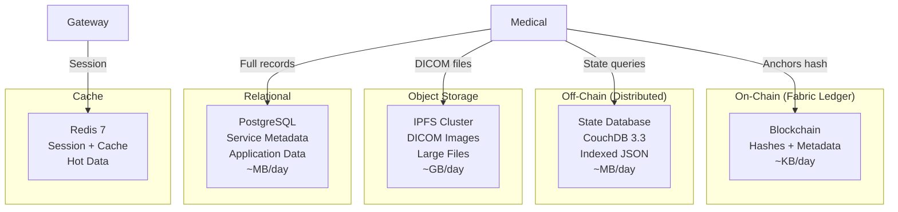

### 5.2 CouchDB State Database

Each peer maintains a CouchDB instance for rich query support:

| Database | Documents | Indexes |
|----------|-----------|---------|
| `_users` | User credentials | Primary |
| `_replicator` | Replication jobs | Primary |
| `medicalrecords_anchor` | Medical anchors | By patientID, dataID, timestamp |
| `consent_registry` | Consent records | By patientID, recipientID, status |
| `access_audit` | Audit trails | By userID, resourceID, timestamp |
| `data_lineage` | Lineage records | By dataID, ownerID |
| `deletion_requests` | Deletion requests | By patientID, status |
| `key_metadata` | Key registry | By keyID, creatorID |

### 5.3 IPFS Integration

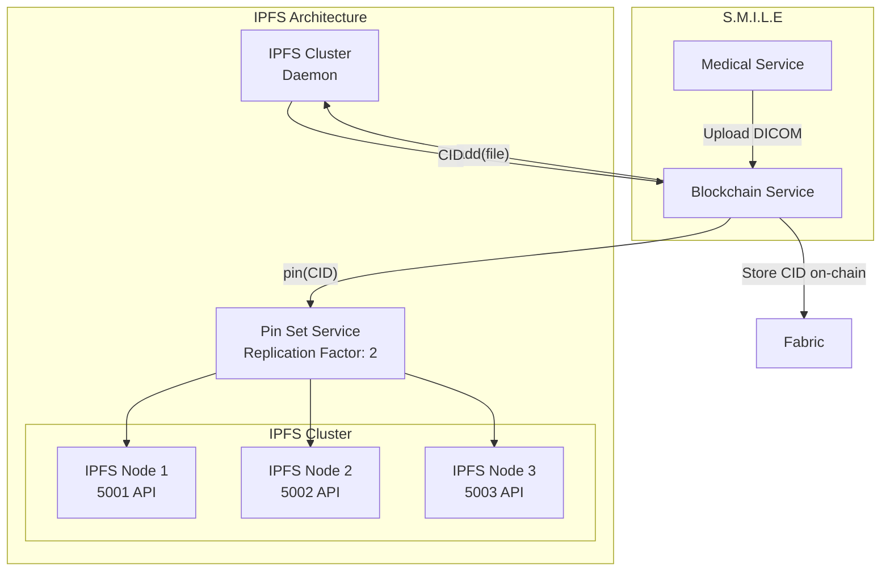

**IPFS Configuration**:
- Cluster with 3 nodes
- Replication factor: 2
- Pinning strategy: Patient consent-based
- Garbage collection: Monthly
- Content routing: DHT

---

## 6. Event Streaming

### 6.1 Kafka Event Architecture

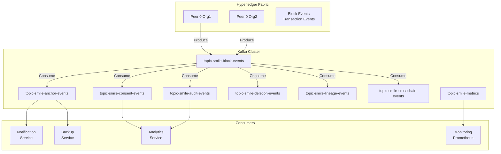

### 6.2 Kafka Topics

| Topic | Partitions | Retention | Description |
|-------|------------|-----------|-------------|
| `topic-smile-block-events` | 6 | 7 days | Raw Fabric block events |
| `topic-smile-anchor-events` | 3 | 30 days | Medical data anchoring events |
| `topic-smile-consent-events` | 3 | 30 days | Consent grant/withdraw events |
| `topic-smile-audit-events` | 6 | 90 days | Access audit trail events |
| `topic-smile-deletion-events` | 3 | 90 days | Deletion request lifecycle |
| `topic-smile-lineage-events` | 3 | 30 days | Data provenance events |
| `topic-smile-crosschain-events` | 3 | 30 days | Cross-org sharing events |
| `topic-smile-metrics` | 1 | 7 days | Performance metrics |

---

## 7. High Availability

### 7.1 Raft Consensus HA

```mermaid
graph TB
    subgraph "Raft Cluster"
        subgraph "Leader"
            L[Orderer 1<br/>Leader<br/>Writes]
        end
        
        subgraph "Followers"
            F1[Orderer 2<br/>Follower<br/>Replicates]
            F2[Orderer 3<br/>Follower<br/>Replicates]
        end
    end

    Client[Blockchain Service] -->|"Propose"| L
    L -->|"Append Entries"| F1
    L -->|"Append Entries"| F2
    F1 -->|"Ack"| L
    F2 -->|"Ack"| L
    L -->|"Commit"| Client

    Note over L,F1: If Leader fails:<br/>Election timeout →<br/>New leader elected
```

### 7.2 Failure Scenarios

| Scenario | Detection | Recovery |
|----------|-----------|----------|
| Single orderer failure | Raft heartbeat timeout | Auto-elect new leader from remaining 2 |
| Network partition | Majority unreachable | Cluster becomes unavailable until partition heals |
| Peer failure | Health check + gossip | Traffic rerouted to surviving peer |
| CouchDB failure | Connection check | Peer continues with cached state |
| CA failure | TLS cert expiry | Manual intervention required |

---

## 8. Security Architecture

### 8.1 TLS Configuration

| Component | TLS Version | Cipher Suites |
|-----------|-------------|---------------|
| Orderer ↔ Orderer | TLS 1.3 | TLS_AES_256_GCM_SHA384 |
| Peer ↔ Orderer | TLS 1.3 | TLS_AES_256_GCM_SHA384 |
| Client ↔ Peer | TLS 1.3 | TLS_AES_256_GCM_SHA384 |
| Peer ↔ Peer (gossip) | TLS 1.2 | TLS_ECDHE_RSA_WITH_AES_256_GCM_SHA384 |
| CouchDB ↔ Peer | TLS 1.2 | TLS_ECDHE_RSA_WITH_AES_256_GCM_SHA384 |

### 8.2 Certificate Hierarchy

```mermaid
graph TB
    RootCA[Root CA<br/>(External)]
    OrdererCA[Orderer TLS CA<br/>Intermediate]
    Org1CA[Org1 TLS CA<br/>Intermediate]
    Org2CA[Org2 TLS CA<br/>Intermediate]
    
    OrdererCA -.-> RootCA
    Org1CA -.-> RootCA
    Org2CA -.-> RootCA
    
    OrdererTLS[Orderer<br/>TLS Cert]
    Org1TLS[Org1<br/>TLS Cert]
    Org2TLS[Org2<br/>TLS Cert]
    
    OrdererTLS --> OrdererCA
    Org1TLS --> Org1CA
    Org2TLS --> Org2CA
    
    O1[Orderer 1]
    O2[Orderer 2]
    O3[Orderer 3]
    P1[Peer Org1]
    P2[Peer Org2]
    
    O1 --> OrdererTLS
    O2 --> OrdererTLS
    O3 --> OrdererTLS
    P1 --> Org1TLS
    P2 --> Org2TLS
```

### 8.3 MSP Structure

Each organization has an MSP (Membership Service Provider) with:

```
msp/
├── config.yaml          # NodeOUs for identity categorization
├── cacerts/             # CA certificates
├── intermediatecerts/   # Intermediate CA certificates
├── tlscacerts/          # TLS CA certificates
├── crls/                # Certificate revocation lists
├── keystore/            # Signing keys (NOT in production)
└── signcerts/           # Enrolled certificates
```

---

## 9. Deployment Configuration

### 9.1 Docker Compose Configuration

The Fabric network is deployed using Docker Compose:

```yaml
# Key excerpts from docker-compose-fabric.yml
services:
  orderer.example.com:
    image: hyperledger/fabric-orderer:2.5
    environment:
      - ORDERER_GENERAL_LISTENADDRESS=0.0.0.0
      - ORDERER_GENERAL_TLS_ENABLED=true
      - ORDERER_GENERAL_CLUSTER_CLIENTCERT=...
      - ORDERER_GENERAL_CLUSTER_CLIENTKEY=...
      - ORDERER_GENERAL_CLUSTER_ROOTCAS=[...]
    volumes:
      - ./channel-artifacts:/var/hyperledger/orderer/orderer.genesis.block
      - ./crypto-config:/var/hyperledger/orderer/msp
    networks:
      - smile-fabric-network

  peer0.org1.example.com:
    image: hyperledger/fabric-peer:2.5
    environment:
      - CORE_PEER_ID=peer0.org1.example.com
      - CORE_PEER_ADDRESS=peer0.org1.example.com:7051
      - CORE_PEER_GOSSIP_BOOTSTRAP=peer0.org2.example.com:9051
      - CORE_PEER_GOSSIP_ORGLEADER=false
      - CORE_LEDGER_STATE_COUCHDBCONFIG_COUCHDBADDRESS=couchdb0:5984
      - CORE_PEER_TLS_ENABLED=true
    volumes:
      - /var/run:/var/run
      - ./crypto-config:/etc/hyperledger/fabric
```

### 9.2 Resource Requirements

| Component | CPU | Memory | Disk | Network |
|-----------|-----|--------|------|---------|
| Orderer | 2 cores | 2 GB | 50 GB | 1 Gbps |
| Peer | 2 cores | 4 GB | 100 GB | 1 Gbps |
| CouchDB | 1 core | 2 GB | 50 GB | 1 Gbps |
| CA | 1 core | 1 GB | 10 GB | 1 Gbps |

---

## Appendix: Network Configuration Files

### A.1 Core Configuration Locations

| File | Path | Purpose |
|------|------|---------|
| Docker Compose | `blockchain/network/docker-compose-fabric.yml` | Network definition |
| Crypto Material | `blockchain/network/crypto-config/` | Certificates & keys |
| Channel Artifacts | `blockchain/network/channel-artifacts/` | Genesis block, channel tx |
| Chaincode | `blockchain/chaincode/` | All 7 Go chaincodes |
| Connection Profile | `blockchain/network/connection-org1.yaml` | Gateway connection |

---

*Document Version: 1.0*  
*Last Updated: March 2026*  
*S.M.I.L.E - Smart Medical Intelligent Ledger for E-health*
