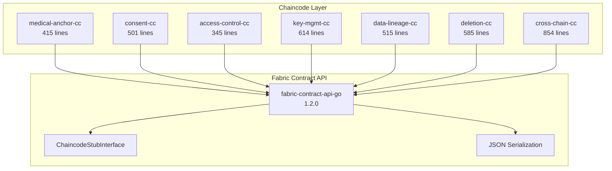
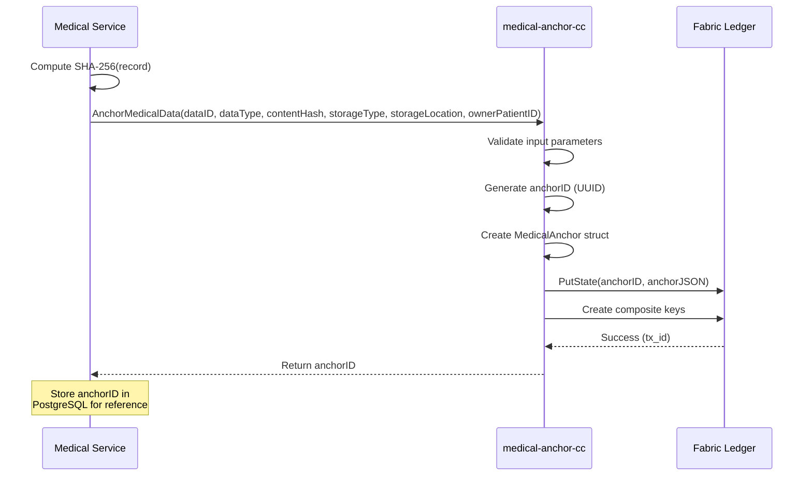
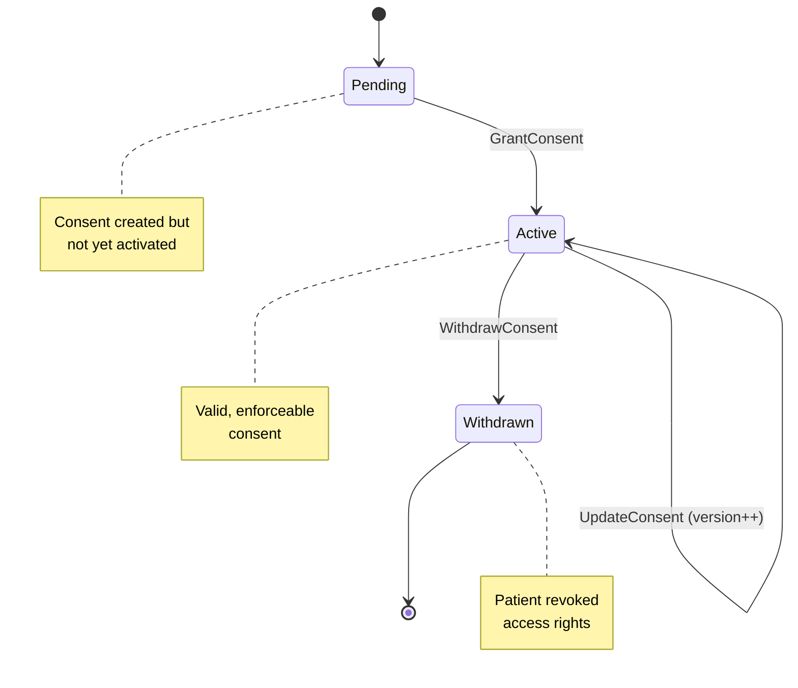
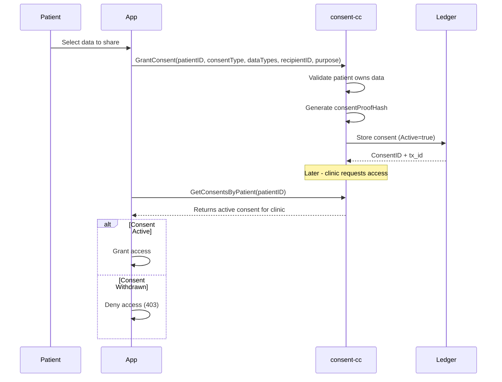
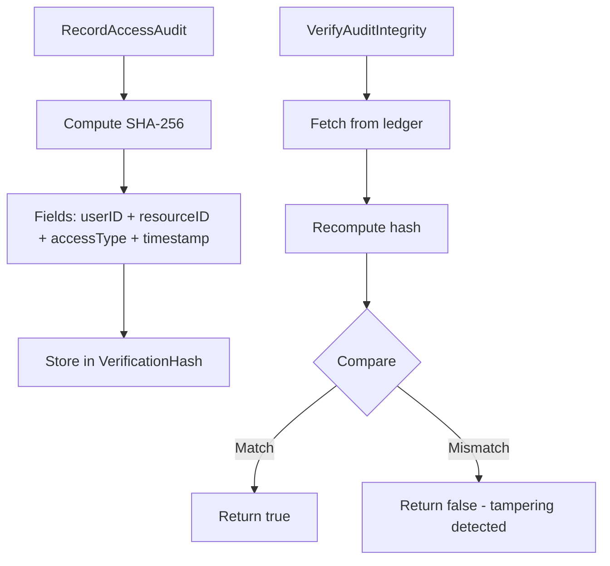
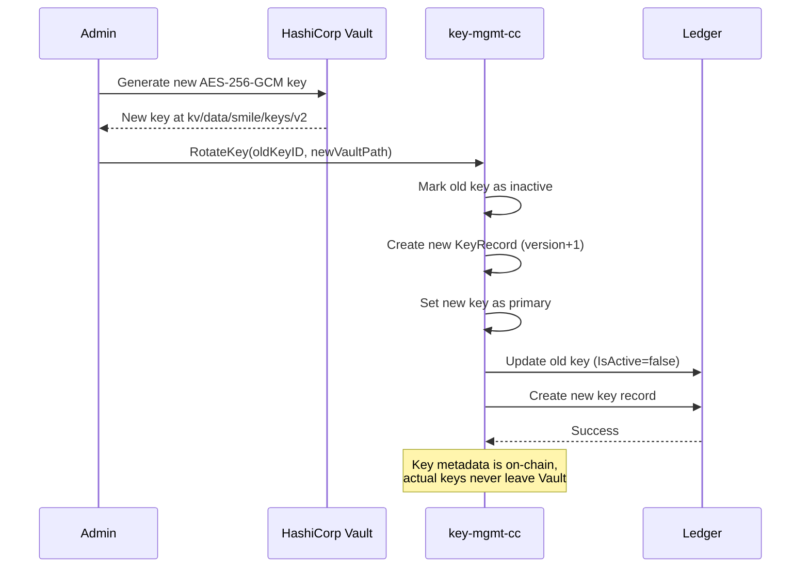
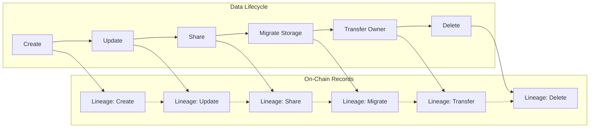
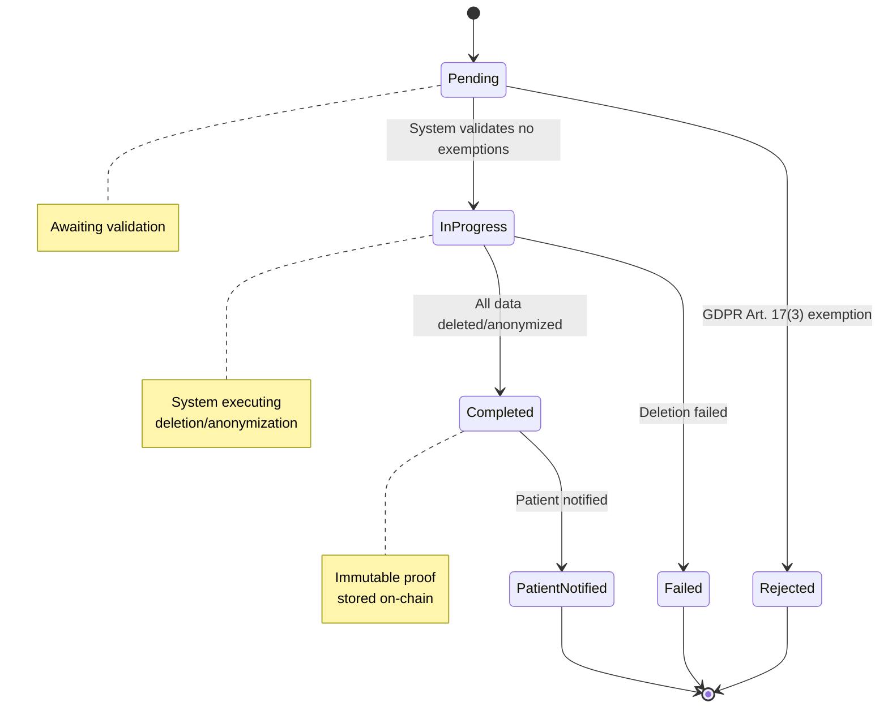
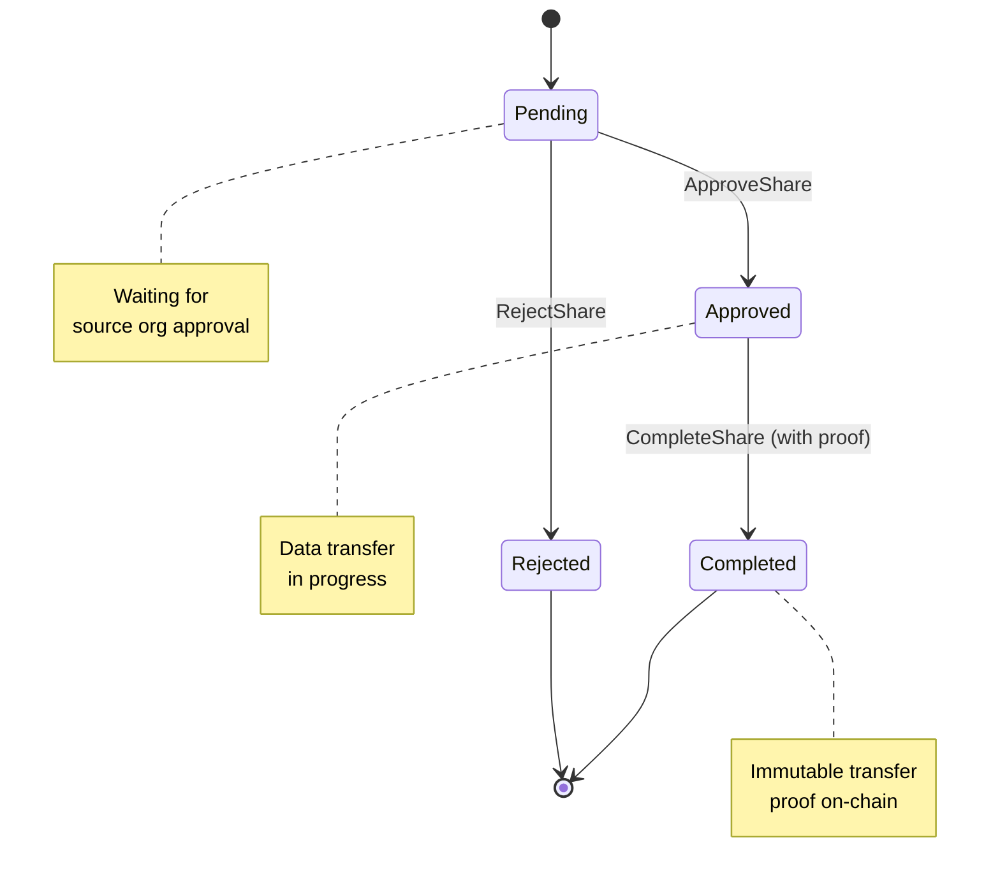

# S.M.I.L.E Smart Contract Design

## Detailed Specification of All Seven Hyperledger Fabric Chaincodes

---

## Table of Contents

1. [Overview](#1-overview)
2. [medical-anchor-cc](#2-medical-anchor-cc)
3. [consent-cc](#3-consent-cc)
4. [access-control-cc](#4-access-control-cc)
5. [key-mgmt-cc](#5key-mgmt-cc)
6. [data-lineage-cc](#6-data-lineage-cc)
7. [deletion-cc](#7-deletion-cc)
8. [cross-chain-cc](#8-cross-chain-cc)

---

## 1. Overview

### 1.1 Chaincode Architecture

The S.M.I.L.E blockchain layer consists of seven specialized smart contracts (chaincodes) implemented in Go using the Hyperledger Fabric Contract API:



### 1.2 Chaincode Comparison

| Chaincode | Purpose | LOC | State Variables | Functions | Events |
|-----------|---------|-----|-----------------|-----------|--------|
| `medical-anchor-cc` | Medical data integrity | 415 | 1 | 7 | 1 |
| `consent-cc` | Patient consent management | 501 | 1 | 8 | 2 |
| `access-control-cc` | Access audit trails | 345 | 1 | 6 | 1 |
| `key-mgmt-cc` | Encryption key metadata | 614 | 2 | 7 | 2 |
| `data-lineage-cc` | Data provenance | 515 | 1 | 7 | 1 |
| `deletion-cc` | Right to erasure | 585 | 1 | 8 | 2 |
| `cross-chain-cc` | Inter-org sharing | 854 | 3 | 9 | 3 |

---

## 2. medical-anchor-cc

### 2.1 Purpose

The **medical-anchor-cc** chaincode provides immutable proof-of-existence for medical records. It stores SHA-256 hashes of examination records, AI diagnostic results, and treatment histories on the Fabric ledger without storing the actual PHI on-chain.

### 2.2 State Structure

```go
// Source: blockchain/chaincode/medical-anchor-cc/main.go

type MedicalAnchor struct {
    AnchorID           string   `json:"anchor_id"`
    DataID             string   `json:"data_id"`
    DataType           string   `json:"data_type"` // examination, diagnosis, prescription, image_analysis
    ContentHash        string   `json:"content_hash"`
    HashAlgorithm      string   `json:"hash_algorithm"` // SHA-256
    StorageType        string   `json:"storage_type"` // ipfs, postgres
    StorageLocation    string   `json:"storage_location"` // CID or table reference
    OwnerPatientID     string   `json:"owner_patient_id"`
    CreatedBy          string   `json:"created_by"`
    CreatedAt          string   `json:"created_at"`
    UpdatedAt          string   `json:"updated_at"`
    IsRevoked          bool     `json:"is_revoked"`
    TxID               string   `json:"tx_id"`
}
```

### 2.3 Functions

| Function | Signature | Description |
|----------|-----------|-------------|
| `AnchorMedicalData` | `AnchorMedicalData(ctx ContractContext, dataID, dataType, contentHash, storageType, storageLocation, ownerPatientID string) (string, error)` | Stores anchor record on ledger |
| `GetAnchor` | `GetAnchor(ctx ContractContext, anchorID string) (*MedicalAnchor, error)` | Retrieves anchor by ID |
| `GetAnchorsByDataID` | `GetAnchorsByDataID(ctx ContractContext, dataID string) ([]*MedicalAnchor, error)` | Queries anchors by data ID |
| `GetAnchorsByPatient` | `GetAnchorsByPatient(ctx ContractContext, patientID string) ([]*MedicalAnchor, error)` | Queries all anchors for a patient |
| `VerifyAnchor` | `VerifyAnchor(ctx ContractContext, anchorID, providedHash string) (bool, error)` | Verifies hash integrity |
| `RevokeAnchor` | `RevokeAnchor(ctx ContractContext, anchorID string) error` | Soft-deletes anchor |
| `GetAnchorHistory` | `GetAnchorHistory(ctx ContractContext, anchorID string) ([]HistoryQueryResult, error)` | Returns ledger history |

### 2.4 Composite Key Design

```
Anchor~DataID~DataType~Timestamp
Anchor~PatientID~DataType~Timestamp
```

### 2.5 Interaction Flow



---

## 3. consent-cc

### 3.1 Purpose

The **consent-cc** chaincode manages the complete lifecycle of patient consent as required by GDPR Article 7, HIPAA Privacy Rule, and Vietnamese Decree 13/2023. It supports grant, update, withdraw, and verify operations.

### 3.2 State Structure

```go
// Source: blockchain/chaincode/consent-cc/main.go

type ConsentRecord struct {
    ConsentID              string   `json:"consent_id"`
    PatientID              string   `json:"patient_id"`
    ConsentType            string   `json:"consent_type"` // data_sharing, treatment, research
    DataTypes              []string `json:"data_types"` // examinations, xrays, prescriptions, etc.
    RecipientID           string   `json:"recipient_id"` // clinic/organization UUID
    RecipientName         string   `json:"recipient_name"`
    Purpose               string   `json:"purpose"` // continuity_of_care, research, billing
    Scope                 string   `json:"scope"` // full, partial, specific_data_types
    IsActive              bool     `json:"is_active"`
    SensitiveDataConsent  bool     `json:"sensitive_data_consent"` // HIV, mental health, etc.
    ConsentProofHash      string   `json:"consent_proof_hash"`
    GrantedAt             string   `json:"granted_at"`
    ExpiresAt             string   `json:"expires_at,omitempty"`
    WithdrawnAt           string   `json:"withdrawn_at,omitempty"`
    Version               int      `json:"version"` // Increment on update
    CreatedBy             string   `json:"created_by"`
    UpdatedAt             string   `json:"updated_at"`
    TxID                  string   `json:"tx_id"`
}
```

### 3.3 Functions

| Function | Signature | Description |
|----------|-----------|-------------|
| `GrantConsent` | `GrantConsent(ctx ContractContext, patientID, consentType, dataTypesJSON, recipientID, recipientName, purpose, scope string, sensitiveDataConsent bool, expiresAt string) (string, error)` | Creates new consent |
| `UpdateConsent` | `UpdateConsent(ctx ContractContext, consentID, newDataTypesJSON, newPurpose, newScope string) error` | Updates existing consent (version++) |
| `WithdrawConsent` | `WithdrawConsent(ctx ContractContext, consentID string) error` | GDPR Art. 7(3) withdrawal |
| `GetConsent` | `GetConsent(ctx ContractContext, consentID string) (*ConsentRecord, error)` | Retrieves consent by ID |
| `GetConsentsByPatient` | `GetConsentsByPatient(ctx ContractContext, patientID string) ([]*ConsentRecord, error)` | All consents for a patient |
| `GetConsentsByRecipient` | `GetConsentsByRecipient(ctx ContractContext, recipientID string) ([]*ConsentRecord, error)` | All consents granted to recipient |
| `VerifyConsent` | `VerifyConsent(ctx ContractContext, consentID string) (bool, string, error)` | Validates consent proof hash |
| `GetConsentHistory` | `GetConsentHistory(ctx ContractContext, consentID string) ([]HistoryQueryResult, error)` | Returns ledger history |

### 3.4 State Machine



### 3.5 Interaction Flow



---

## 4. access-control-cc

### 4.1 Purpose

The **access-control-cc** chaincode provides tamper-evident audit trails for all data access events, satisfying HIPAA Security Rule §164.312(b) requirements.

### 4.2 State Structure

```go
// Source: blockchain/chaincode/access-control-cc/main.go

type AccessAuditRecord struct {
    AuditID            string   `json:"audit_id"`
    UserID             string   `json:"user_id"`
    UserRole           string   `json:"user_role"` // patient, doctor, admin, researcher
    ResourceType       string   `json:"resource_type"` // examination, prescription, image
    ResourceID         string   `json:"resource_id"`
    AccessType         string   `json:"access_type"` // read, create, update, delete, export
    AccessGranted      bool     `json:"access_granted"`
    DenialReason       string   `json:"denial_reason,omitempty"`
    VerificationHash   string   `json:"verification_hash"`
    IPAddress          string   `json:"ip_address"`
    UserAgent          string   `json:"user_agent"`
    SessionID          string   `json:"session_id"`
    RequestedAt        string   `json:"requested_at"`
    ProcessedAt        string   `json:"processed_at"`
    TxID               string   `json:"tx_id"`
}
```

### 4.3 Functions

| Function | Signature | Description |
|----------|-----------|-------------|
| `RecordAccessAudit` | `RecordAccessAudit(ctx ContractContext, userID, userRole, resourceType, resourceID, accessType string, accessGranted bool, denialReason string, ipAddress, userAgent, sessionID string) (string, error)` | Records access attempt |
| `GetAuditRecord` | `GetAuditRecord(ctx ContractContext, auditID string) (*AccessAuditRecord, error)` | Retrieves audit by ID |
| `GetAuditsByUser` | `GetAuditsByUser(ctx ContractContext, userID string) ([]*AccessAuditRecord, error)` | All audits for user |
| `GetAuditsByResource` | `GetAuditsByResource(ctx ContractContext, resourceType, resourceID string) ([]*AccessAuditRecord, error)` | All access to resource |
| `VerifyAuditIntegrity` | `VerifyAuditIntegrity(ctx ContractContext, auditID string) (bool, error)` | Validates audit hash |
| `GetAuditHistory` | `GetAuditHistory(ctx ContractContext, auditID string) ([]HistoryQueryResult, error)` | Returns ledger history |

### 4.4 Verification Logic



---

## 5. key-mgmt-cc

### 5.1 Purpose

The **key-mgmt-cc** chaincode manages encryption key metadata for the S.M.I.L.E system. It maintains an auditable registry of key lifecycle events while the actual cryptographic keys remain securely stored in HashiCorp Vault.

### 5.2 State Structures

```go
// Source: blockchain/chaincode/key-mgmt-cc/main.go

type KeyRecord struct {
    KeyID           string   `json:"key_id"`
    KeyName         string   `json:"key_name"`
    KeyType         string   `json:"key_type"` // aes, rsa
    Algorithm       string   `json:"algorithm"` // AES-256-GCM, RSA-4096
    KeyLength       int      `json:"key_length"` // 256, 4096
    KeyVersion      int      `json:"key_version"`
    IsActive        bool     `json:"is_active"`
    IsPrimary       bool     `json:"is_primary"` // Current active key
    VaultPath       string   `json:"vault_path"` // kv/data/smile/keys/...
    CreatedBy       string   `json:"created_by"`
    CreatedAt       string   `json:"created_at"`
    ExpiresAt       string   `json:"expires_at,omitempty"`
    DeactivatedAt   string   `json:"deactivated_at,omitempty"`
    DeactivationReason string `json:"deactivation_reason,omitempty"`
    TxID            string   `json:"tx_id"`
}

type KeyAccessRecord struct {
    AccessID        string   `json:"access_id"`
    KeyID           string   `json:"key_id"`
    AccessedBy      string   `json:"accessed_by"`
    AccessType      string   `json:"access_type"` // encrypt, decrypt, sign, verify
    AccessResult    string   `json:"access_result"` // success, failure
    FailureReason   string   `json:"failure_reason,omitempty"`
    IPAddress       string   `json:"ip_address"`
    AccessedAt      string   `json:"accessed_at"`
    TxID            string   `json:"tx_id"`
}
```

### 5.3 Functions

| Function | Signature | Description |
|----------|-----------|-------------|
| `RegisterKey` | `RegisterKey(ctx ContractContext, keyName, keyType, algorithm string, keyLength int, vaultPath, expiresAt string) (string, error)` | Registers new key metadata |
| `GetKey` | `GetKey(ctx ContractContext, keyID string) (*KeyRecord, error)` | Retrieves key metadata |
| `GetKeysByCreator` | `GetKeysByCreator(ctx ContractContext, creatorID string) ([]*KeyRecord, error)` | Keys created by user |
| `GetKeysByType` | `GetKeysByType(ctx ContractContext, keyType string) ([]*KeyRecord, error)` | Keys by type (AES/RSA) |
| `RotateKey` | `RotateKey(ctx ContractContext, oldKeyID, newVaultPath string) (string, error)` | Key rotation (version++) |
| `DeactivateKey` | `DeactivateKey(ctx ContractContext, keyID, reason string) error` | Mark key inactive |
| `RecordKeyAccess` | `RecordKeyAccess(ctx ContractContext, keyID, accessedBy, accessType, accessResult, ipAddress string) error` | Audit key usage |
| `GetKeyHistory` | `GetKeyHistory(ctx ContractContext, keyID string) ([]HistoryQueryResult, error)` | Returns ledger history |

### 5.4 Key Rotation Flow



---

## 6. data-lineage-cc

### 6.1 Purpose

The **data-lineage-cc** chaincode provides complete data provenance tracking, satisfying GDPR Article 30 requirement for records of processing activities and enabling full audit trails of data transformations.

### 6.2 State Structure

```go
// Source: blockchain/chaincode/data-lineage-cc/main.go

type LineageRecord struct {
    LineageID              string   `json:"lineage_id"`
    DataID                 string   `json:"data_id"`
    DataType               string   `json:"data_type"` // examination, diagnosis, image
    OriginMemberID         string   `json:"origin_member_id"` // Organization that created
    PreviousLineageID      string   `json:"previous_lineage_id,omitempty"` // For updates
    TransformationType     string   `json:"transformation_type"` // create, update, share, migrate, delete
    TransformationDetails  string   `json:"transformation_details"` // JSON metadata
    CurrentOwnerID          string   `json:"current_owner_id"` // Current custodian
    PreviousOwnerID        string   `json:"previous_owner_id,omitempty"`
    CurrentStorageType     string   `json:"current_storage_type"` // postgres, ipfs
    CurrentStorageLocation string   `json:"current_storage_location"` // Table/CID
    ProofHash              string   `json:"proof_hash"`
    CreatedBy              string   `json:"created_by"`
    CreatedAt              string   `json:"created_at"`
    TxID                   string   `json:"tx_id"`
}
```

### 6.3 Functions

| Function | Signature | Description |
|----------|-----------|-------------|
| `RecordLineage` | `RecordLineage(ctx ContractContext, dataID, dataType, originMemberID, transformationType, transformationDetails, currentOwnerID, storageType, storageLocation string) (string, error)` | Records new lineage entry |
| `UpdateLineageStorage` | `RecordLineageStorageUpdate(ctx ContractContext, lineageID, newStorageType, newStorageLocation string) error` | Tracks storage migration |
| `TransferOwnership` | `TransferLineageOwnership(ctx ContractContext, lineageID, newOwnerID string) error` | Transfers data custodianship |
| `GetLineage` | `GetLineage(ctx ContractContext, lineageID string) (*LineageRecord, error)` | Retrieves lineage by ID |
| `GetLineageByDataID` | `GetLineageByDataID(ctx ContractContext, dataID string) ([]*LineageRecord, error)` | All entries for data |
| `GetLineageByOwner` | `GetLineageByOwner(ctx ContractContext, ownerID string) ([]*LineageRecord, error)` | Data under owner |
| `VerifyLineageProof` | `VerifyLineageProof(ctx ContractContext, lineageID string) (bool, error)` | Validates proof hash |
| `GetLineageHistory` | `GetLineageHistory(ctx ContractContext, lineageID string) ([]HistoryQueryResult, error)` | Returns ledger history |

### 6.4 Data Lifecycle Tracking



---

## 7. deletion-cc

### 7.1 Purpose

The **deletion-cc** chaincode implements GDPR Article 17 (Right to Erasure) and Vietnamese Decree 13/2023 requirements. It manages the complete deletion/anonymization request lifecycle with immutable proof of completion.

### 7.2 State Structure

```go
// Source: blockchain/chaincode/deletion-cc/main.go

type DeletionRequest struct {
    RequestID              string   `json:"request_id"`
    PatientID              string   `json:"patient_id"`
    RequestType            string   `json:"request_type"` // deletion, anonymization
    Scope                  string   `json:"scope"` // full, partial, specific_data_types
    DataTypes              []string `json:"data_types"` // If partial/specific
    SpecificDataIDs        []string `json:"specific_data_ids,omitempty"`
    Status                 string   `json:"status"` // pending, in_progress, completed, failed, rejected
    Reason                 string   `json:"reason,omitempty"` // Patient request, legal
    ExemptionReason        string   `json:"exemption_reason,omitempty"` // GDPR Art. 17(3)
    CreatedBy              string   `json:"created_by"`
    CreatedAt              string   `json:"created_at"`
    StartedAt              string   `json:"started_at,omitempty"`
    CompletedAt            string   `json:"completed_at,omitempty"`
    DeletionProofHash     string   `json:"deletion_proof_hash,omitempty"`
    PatientNotified        bool     `json:"patient_notified"`
    PatientNotifiedAt      string   `json:"patient_notified_at,omitempty"`
    RejectionReason       string   `json:"rejection_reason,omitempty"`
    Version                int      `json:"version"`
    TxID                   string   `json:"tx_id"`
}
```

### 7.3 Functions

| Function | Signature | Description |
|----------|-----------|-------------|
| `CreateDeletionRequest` | `CreateDeletionRequest(ctx ContractContext, patientID, requestType, scope string, dataTypesJSON, specificDataIDsJSON, reason string) (string, error)` | Creates deletion request |
| `UpdateDeletionStatus` | `UpdateDeletionStatus(ctx ContractContext, requestID, newStatus string) error` | Updates request status |
| `CompleteDeletion` | `CompleteDeletion(ctx ContractContext, requestID string) error` | Marks deletion complete |
| `RejectDeletion` | `RejectDeletion(ctx ContractContext, requestID, reason string) error` | Rejects with GDPR exemption |
| `NotifyPatient` | `NotifyPatient(ctx ContractContext, requestID string) error` | Records patient notification |
| `GetDeletionRequest` | `GetDeletionRequest(ctx ContractContext, requestID string) (*DeletionRequest, error)` | Retrieves request |
| `GetDeletionRequestsByPatient` | `GetDeletionRequestsByPatient(ctx ContractContext, patientID string) ([]*DeletionRequest, error)` | Requests for patient |
| `GetDeletionRequestsByStatus` | `GetDeletionRequestsByStatus(ctx ContractContext, status string) ([]*DeletionRequest, error)` | Requests by status |
| `VerifyDeletionProof` | `VerifyDeletionProof(ctx ContractContext, requestID string) (bool, error)` | Validates proof hash |
| `GetDeletionHistory` | `GetDeletionHistory(ctx ContractContext, requestID string) ([]HistoryQueryResult, error)` | Returns ledger history |

### 7.4 State Machine



### 7.5 GDPR Article 17(3) Exemptions

The chaincode supports rejecting deletion requests for:

| Exemption | Reason Code |
|-----------|-------------|
| Legal obligation | `legal_obligation` |
| Public health | `public_health` |
| Archiving in public interest | `public_interest` |
| Establishment of legal claims | `legal_claims` |
| Defense of legal claims | `legal_defense` |

---

## 8. cross-chain-cc

### 8.1 Purpose

The **cross-chain-cc** chaincode enables inter-organizational data sharing between different healthcare providers and potentially external blockchains. It provides a bridge pattern for secure, consent-verified data transfers.

### 8.2 State Structures

```go
// Source: blockchain/chaincode/cross-chain-cc/main.go

type BridgeRecord struct {
    BridgeID           string   `json:"bridge_id"`
    BridgeName         string   `json:"bridge_name"`
    SourceOrgID        string   `json:"source_org_id"`
    TargetOrgID        string   `json:"target_org_id"`
    TargetEndpoint     string   `json:"target_endpoint"` // External chain URL
    BridgeType         string   `json:"bridge_type"` // internal, external
    Status             string   `json:"status"` // active, suspended, decommissioned
    CreatedBy          string   `json:"created_by"`
    CreatedAt          string   `json:"created_at"`
    TxID               string   `json:"tx_id"`
}

type ShareRequestRecord struct {
    RequestID          string   `json:"request_id"`
    BridgeID           string   `json:"bridge_id"`
    PatientID          string   `json:"patient_id"`
    RequestingOrgID    string   `json:"requesting_org_id"`
    DataTypes          []string `json:"data_types"`
    Purpose            string   `json:"purpose"`
    Status             string   `json:"status"` // pending, approved, rejected, completed
    ConsentProofID     string   `json:"consent_proof_id"` // Reference to consent-cc
    ApprovedBy         string   `json:"approved_by,omitempty"`
    ApprovedAt         string   `json:"approved_at,omitempty"`
    RejectedBy         string   `json:"rejected_by,omitempty"`
    RejectedAt         string   `json:"rejected_at,omitempty"`
    RejectionReason    string   `json:"rejection_reason,omitempty"`
    CompletedAt        string   `json:"completed_at,omitempty"`
    TransferProofHash  string   `json:"transfer_proof_hash,omitempty"`
    CreatedBy          string   `json:"created_by"`
    CreatedAt          string   `json:"created_at"`
    Version            int      `json:"version"`
    TxID               string   `json:"tx_id"`
}

type SharedDataRecord struct {
    DataID             string   `json:"data_id"`
    RequestID           string   `json:"request_id"`
    BridgeID           string   `json:"bridge_id"`
    PatientID          string   `json:"patient_id"`
    DataType           string   `json:"data_type"`
    SourceOrgID        string   `json:"source_org_id"`
    TargetOrgID        string   `json:"target_org_id"`
    StorageType        string   `json:"storage_type"`
    StorageLocation    string   `json:"storage_location"`
    VerificationHash   string   `json:"verification_hash"`
    SharedAt           string   `json:"shared_at"`
    TxID               string   `json:"tx_id"`
}
```

### 8.3 Functions

| Function | Signature | Description |
|----------|-----------|-------------|
| `RegisterBridge` | `RegisterBridge(ctx ContractContext, bridgeName, sourceOrgID, targetOrgID, targetEndpoint, bridgeType string) (string, error)` | Creates bridge connection |
| `GetBridge` | `GetBridge(ctx ContractContext, bridgeID string) (*BridgeRecord, error)` | Retrieves bridge |
| `CreateShareRequest` | `CreateShareRequest(ctx ContractContext, bridgeID, patientID, requestingOrgID string, dataTypesJSON, purpose, consentProofID string) (string, error)` | Creates share request |
| `ApproveShare` | `ApproveShare(ctx ContractContext, requestID, approvedBy string) error` | Approves share request |
| `RejectShare` | `RejectShare(ctx ContractContext, requestID, rejectedBy, reason string) error` | Rejects share request |
| `CompleteShare` | `CompleteShare(ctx ContractContext, requestID, transferProofHash string) error` | Marks share complete |
| `RecordSharedData` | `RecordSharedData(ctx ContractContext, requestID, dataType, storageType, storageLocation, verificationHash string) error` | Records shared data |
| `GetShareRequest` | `GetShareRequest(ctx ContractContext, requestID string) (*ShareRequestRecord, error)` | Gets share request |
| `GetSharesByPatient` | `GetSharesByPatient(ctx ContractContext, patientID string) ([]*ShareRequestRecord, error)` | Shares for patient |
| `GetSharesByBridge` | `GetSharesByBridge(ctx ContractContext, bridgeID string) ([]*ShareRequestRecord, error)` | Shares via bridge |
| `VerifySharedData` | `VerifySharedData(ctx ContractContext, dataID string) (bool, error)` | Verifies data integrity |
| `GetShareHistory` | `GetShareHistory(ctx ContractContext, requestID string) ([]HistoryQueryResult, error)` | Returns ledger history |

### 8.4 Share Request Lifecycle



### 8.5 Cross-Organization Data Flow

```mermaid
sequenceDiagram
    participant Patient
    participant ClinicA as Clinic A (Source)
    participant ClinicB as Clinic B (Target)
    participant CrossCC as cross-chain-cc
    participant ConsentCC as consent-cc
    participant Ledger

    Note over Patient, CrossCC: Step 1: Verify consent exists
    
    Patient->>ClinicB: Request data from Clinic A
    ClinicB->>ConsentCC: VerifyConsent(patientID, ClinicA)
    ConsentCC-->>ClinicB: Consent verified
    
    ClinicB->>CrossCC: CreateShareRequest(bridgeID, patientID, dataTypes, purpose)
    CrossCC->>Ledger: Store request (pending)
    
    ClinicA->>CrossCC: ApproveShare(requestID)
    CrossCC->>Ledger: Update status (approved)
    
    ClinicA->>ClinicB: Transfer data (secure channel)
    
    ClinicB->>CrossCC: CompleteShare(
        requestID,
        transferProofHash
    )
    CrossCC->>Ledger: Store completion proof
    
    CrossCC-->>Patient: Data transfer complete
```

---

## Appendix: Common Chaincode Patterns

### A.1 Error Handling

All chaincodes follow a consistent error pattern:

```go
// Validation errors return standard Fabric errors
if patientID == "" {
    return "", fmt.Errorf("patient ID is required")
}

// Success returns anchor ID
return anchorID, nil
```

### A.2 Logging

```go
// Use shim logging
stub := ctx.GetStub()
stub.Logf("INFO", "Anchoring medical data: %s", dataID)
```

### A.3 Composite Key Creation

```go
func createAnchorKey(dataID, dataType, timestamp string) string {
    return "_anchor" + "~" + dataID + "~" + dataType + "~" + timestamp
}
```

---

*Document Version: 1.0*  
*Last Updated: March 2026*  
*S.M.I.L.E - Smart Medical Intelligent Ledger for E-health*
