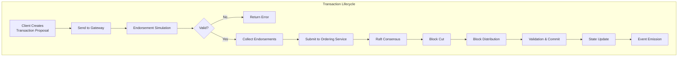
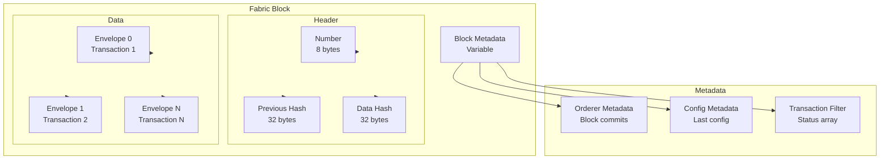
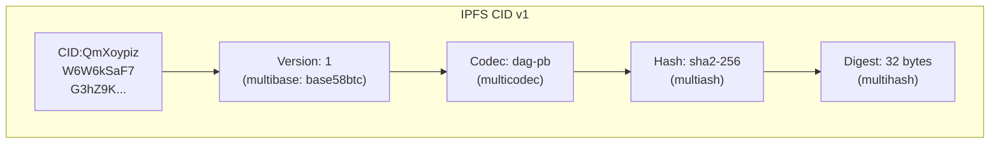
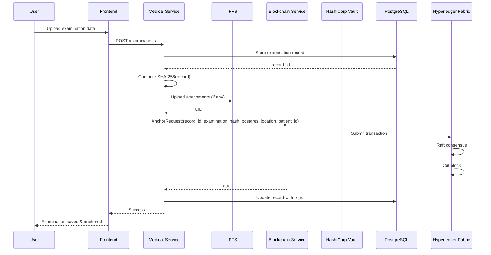
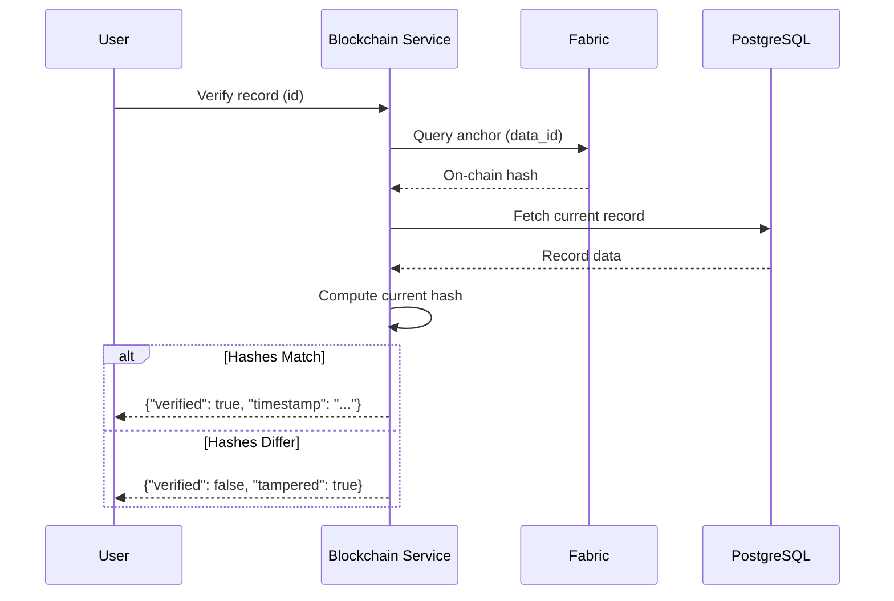
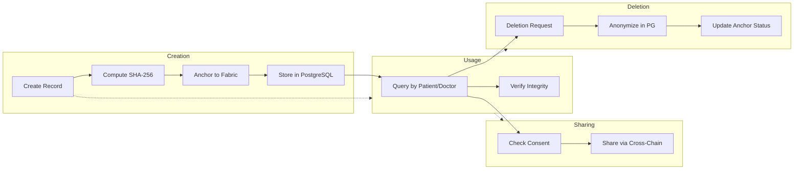

# S.M.I.L.E Data Model Documentation

## Blockchain Data Structures, Storage, and Transaction Flow

---

## Table of Contents

1. [On-Chain Data Structures](#1-on-chain-data-structures)
2. [Transaction Format and Lifecycle](#2-transaction-format-and-lifecycle)
3. [Block Structure](#3-block-structure)
4. [Composite Key Design](#4-composite-key-design)
5. [Off-Chain Data Model](#5-off-chain-data-model)
6. [IPFS Storage Model](#6-ipfs-storage-model)
7. [State Database (CouchDB)](#7-state-database-couchdb)
8. [Data Flow Diagrams](#8-data-flow-diagrams)

---

## 1. On-Chain Data Structures

### 1.1 Medical Anchor

```json
{
  "anchor_id": "anchor-uuid-001",
  "data_id": "exam-uuid-123",
  "data_type": "examination",
  "content_hash": "a1b2c3d4e5f6... (SHA-256)",
  "hash_algorithm": "SHA-256",
  "storage_type": "postgres",
  "storage_location": "medical_service.examinations:id=123",
  "owner_patient_id": "patient-uuid-456",
  "created_by": "doctor-uuid-789",
  "created_at": "2024-03-15T10:30:00Z",
  "updated_at": "2024-03-15T10:30:00Z",
  "is_revoked": false,
  "tx_id": "0x1a2b3c4d5e6f..."
}
```

### 1.2 Consent Record

```json
{
  "consent_id": "consent-uuid-001",
  "patient_id": "patient-uuid-456",
  "consent_type": "data_sharing",
  "data_types": ["examinations", "prescriptions", "xrays"],
  "recipient_id": "clinic-b-uuid-001",
  "recipient_name": "Downtown Dental Clinic",
  "purpose": "continuity_of_care",
  "scope": "full",
  "is_active": true,
  "sensitive_data_consent": false,
  "consent_proof_hash": "b2c3d4e5f6g7...",
  "granted_at": "2024-03-15T10:30:00Z",
  "expires_at": "2025-03-15T10:30:00Z",
  "withdrawn_at": null,
  "version": 1,
  "created_by": "patient-uuid-456",
  "updated_at": "2024-03-15T10:30:00Z",
  "tx_id": "0x2b3c4d5e6f7g..."
}
```

### 1.3 Access Audit Record

```json
{
  "audit_id": "audit-uuid-001",
  "user_id": "doctor-uuid-789",
  "user_role": "doctor",
  "resource_type": "examination",
  "resource_id": "exam-uuid-123",
  "access_type": "read",
  "access_granted": true,
  "denial_reason": null,
  "verification_hash": "c3d4e5f6g7h8...",
  "ip_address": "192.168.1.100",
  "user_agent": "Mozilla/5.0...",
  "session_id": "session-uuid-abc",
  "requested_at": "2024-03-15T11:00:00Z",
  "processed_at": "2024-03-15T11:00:00.050Z",
  "tx_id": "0x3c4d5e6f7g8h..."
}
```

### 1.4 Key Record

```json
{
  "key_id": "key-uuid-001",
  "key_name": "patient-record-encryption-key",
  "key_type": "aes",
  "algorithm": "AES-256-GCM",
  "key_length": 256,
  "key_version": 2,
  "is_active": true,
  "is_primary": true,
  "vault_path": "kv/data/smile/keys/patient-records/v2",
  "created_by": "admin-uuid-001",
  "created_at": "2024-01-01T00:00:00Z",
  "expires_at": "2025-01-01T00:00:00Z",
  "deactivated_at": null,
  "deactivation_reason": null,
  "tx_id": "0x4d5e6f7g8h9i..."
}
```

### 1.5 Lineage Record

```json
{
  "lineage_id": "lineage-uuid-001",
  "data_id": "exam-uuid-123",
  "data_type": "examination",
  "origin_member_id": "org1-msp",
  "previous_lineage_id": null,
  "transformation_type": "create",
  "transformation_details": "{\"action\": \"initial_creation\", \"clinic\": \"smile-dental\"}",
  "current_owner_id": "org1-msp",
  "previous_owner_id": null,
  "current_storage_type": "postgres",
  "current_storage_location": "medical_service.examinations:id=123",
  "proof_hash": "d4e5f6g7h8i9...",
  "created_by": "doctor-uuid-789",
  "created_at": "2024-03-15T10:30:00Z",
  "tx_id": "0x5e6f7g8h9i0j..."
}
```

### 1.6 Deletion Request

```json
{
  "request_id": "deletion-uuid-001",
  "patient_id": "patient-uuid-456",
  "request_type": "deletion",
  "scope": "full",
  "data_types": null,
  "specific_data_ids": null,
  "status": "completed",
  "reason": "patient_request",
  "exemption_reason": null,
  "created_by": "patient-uuid-456",
  "created_at": "2024-03-20T09:00:00Z",
  "started_at": "2024-03-20T09:05:00Z",
  "completed_at": "2024-03-20T09:10:00Z",
  "deletion_proof_hash": "e5f6g7h8i9j0...",
  "patient_notified": true,
  "patient_notified_at": "2024-03-20T09:11:00Z",
  "rejection_reason": null,
  "version": 1,
  "tx_id": "0x6f7g8h9i0j1k..."
}
```

### 1.7 Share Request

```json
{
  "request_id": "share-uuid-001",
  "bridge_id": "bridge-uuid-001",
  "patient_id": "patient-uuid-456",
  "requesting_org_id": "org2-msp",
  "data_types": ["examinations", "xrays"],
  "purpose": "orthodontic_consultation",
  "status": "completed",
  "consent_proof_id": "consent-uuid-001",
  "approved_by": "doctor-uuid-789",
  "approved_at": "2024-03-18T14:00:00Z",
  "rejected_by": null,
  "rejected_at": null,
  "rejection_reason": null,
  "completed_at": "2024-03-18T15:00:00Z",
  "transfer_proof_hash": "f6g7h8i9j0k1...",
  "created_by": "org2-user-uuid",
  "created_at": "2024-03-18T13:00:00Z",
  "version": 1,
  "tx_id": "0x7g8h9i0j1k2l..."
}
```

---

## 2. Transaction Format and Lifecycle

### 2.1 Fabric Transaction Anatomy



### 2.2 Transaction Proposal Structure

```
PROPOSAL {
  header: {
    channel_header: {
      type: ENDORSER_TRANSACTION
      version: 1
      timestamp: 2024-03-15T10:30:00Z
      channel_id: "medicalrecords"
      tx_id: "0x1a2b3c4d5e6f..."
    }
    signature_header: {
      creator: {
        msp_id: "Org1MSP"
        id_bytes: [x509 cert]
      }
      nonce: [random bytes]
    }
  }
  payload: {
    chaincode_proposal_payload: {
      input: [function name, args JSON]
      transient_map: {
        "patient_data": [encrypted]
      }
    }
  }
  signature: [ECDSA signature by client]
}
```

### 2.3 Endorsement Response Structure

```
ENDORSEMENT {
  proposal_response: {
    payload: {
      results: [read-write set]
      events: [chaincode events]
    }
    response: {
      status: 200
      message: "OK"
    }
  }
  endorsement: {
    endorser: {
      msp_id: "Org1MSP"
      id_bytes: [x509 cert]
    }
    signature: [ECDSA signature]
  }
}
```

### 2.4 Block Structure

```
BLOCK {
  header: {
    number: 42
    previous_hash: "0xabc123..."
    data_hash: "0xdef456..."
  }
  data: {
    data_count: 5
    data[0]: {
      payload: {
        header: { channel_id, tx_id }
        data: { actions: [transaction] }
      }
      signature: [block signature]
    }
  }
  metadata: {
    metadata[0]: [orderer metadata - block commits]
    metadata[1]: [last config block num]
    metadata[2]: [transaction filter - VALID/INVALID]
  }
}
```

### 2.5 Read-Write Set

```json
{
  "ns_rwset": [
    {
      "namespace": "medical-anchor-cc",
      "rwset": {
        "reads": [
          {
            "key": "anchor~data123",
            "version": { "block_num": 10, "tx_num": 3 }
          }
        ],
        "writes": [
          {
            "key": "anchor~data456",
            "value": { "anchor_id": "...", "content_hash": "..." }
          }
        ],
        "range_queries_info": []
      }
    }
  ]
}
```

---

## 3. Block Structure

### 3.1 Fabric Block Format



### 3.2 Block Size Parameters

| Parameter | Value | Description |
|-----------|-------|-------------|
| `AbsoluteMaxBytes` | 10 MB | Hard limit per block |
| `PreferredMaxBytes` | 2 MB | Target block size |
| `MaxMessageCount` | 500 | Max transactions per block |
| `Timeout` | 2s | Block cut timeout |

### 3.3 Ledger Storage

```
/var/hyperledger/production/
├── chains/
│   └── channels/
│       └── medicalrecords/
│           ├── blockfile_000000
│           ├── blockfile_000001
│           └── ...
└── index/
    └── channel/
        └── medicalrecords/
            └── indexFile
```

---

## 4. Composite Key Design

### 4.1 Key Schema Patterns

| Chaincode | Composite Key Pattern | Example |
|-----------|----------------------|---------|
| `medical-anchor-cc` | `anchor~dataID~type~timestamp` | `anchor~exam-123~examination~1707830400` |
| `medical-anchor-cc` | `anchor~patient~type~timestamp` | `anchor~patient-456~examination~1707830400` |
| `consent-cc` | `consent~patient~recipient~status` | `consent~patient-456~clinic-b~active` |
| `consent-cc` | `consent~recipient~type` | `consent~clinic-b~data_sharing` |
| `access-control-cc` | `audit~user~timestamp` | `audit~doctor-789~1707913200` |
| `access-control-cc` | `audit~resource~type` | `audit~exam-123~read` |
| `key-mgmt-cc` | `key~creator~type~version` | `key~admin-001~aes~2` |
| `key-mgmt-cc` | `key~type~active` | `key~aes~true` |
| `data-lineage-cc` | `lineage~data~owner` | `lineage~exam-123~org1-msp` |
| `data-lineage-cc` | `lineage~owner~type` | `lineage~org1-msp~examination` |
| `deletion-cc` | `deletion~patient~status` | `deletion~patient-456~completed` |
| `cross-chain-cc` | `share~bridge~status` | `share~bridge-001~completed` |

### 4.2 CouchDB Index Definitions

```json
{
  "index": {
    "fields": [
      "dataID",
      "dataType",
      "timestamp"
    ]
  },
  "name": "anchor-data-index",
  "type": "json"
}
```

```json
{
  "index": {
    "fields": [
      "patientID",
      "isActive",
      "grantedAt"
    ]
  },
  "name": "consent-patient-active-index",
  "type": "json"
}
```

---

## 5. Off-Chain Data Model

### 5.1 PostgreSQL Database Schema

The `blockchain_medical_service_db` database mirrors on-chain state for query performance:

```sql
-- Medical Data Anchors (mirrors medical-anchor-cc)
CREATE TABLE medical_data_anchors (
    anchor_id UUID PRIMARY KEY,
    data_id UUID NOT NULL,
    data_type VARCHAR(50) NOT NULL,
    content_hash VARCHAR(64) NOT NULL,
    hash_algorithm VARCHAR(20) DEFAULT 'SHA-256',
    storage_type VARCHAR(20) NOT NULL,
    storage_location TEXT,
    owner_patient_id UUID NOT NULL,
    created_by UUID NOT NULL,
    created_at TIMESTAMP NOT NULL,
    updated_at TIMESTAMP NOT NULL,
    is_revoked BOOLEAN DEFAULT FALSE,
    tx_id VARCHAR(100),
    
    INDEX idx_data_id (data_id),
    INDEX idx_patient_id (owner_patient_id),
    INDEX idx_created_at (created_at)
);

-- Patient Consents (mirrors consent-cc)
CREATE TABLE patient_consents (
    consent_id UUID PRIMARY KEY,
    patient_id UUID NOT NULL,
    consent_type VARCHAR(50) NOT NULL,
    data_types JSONB NOT NULL,
    recipient_id UUID NOT NULL,
    recipient_name VARCHAR(255),
    purpose VARCHAR(100),
    scope VARCHAR(20),
    is_active BOOLEAN DEFAULT TRUE,
    sensitive_data_consent BOOLEAN DEFAULT FALSE,
    consent_proof_hash VARCHAR(64),
    granted_at TIMESTAMP,
    expires_at TIMESTAMP,
    withdrawn_at TIMESTAMP,
    version INT DEFAULT 1,
    created_by UUID NOT NULL,
    updated_at TIMESTAMP NOT NULL,
    tx_id VARCHAR(100),
    
    INDEX idx_patient_id (patient_id),
    INDEX idx_recipient_id (recipient_id),
    INDEX idx_is_active (is_active)
);

-- Data Lineage
CREATE TABLE data_lineage (
    lineage_id UUID PRIMARY KEY,
    data_id UUID NOT NULL,
    data_type VARCHAR(50) NOT NULL,
    origin_member_id VARCHAR(50) NOT NULL,
    previous_lineage_id UUID,
    transformation_type VARCHAR(50) NOT NULL,
    transformation_details JSONB,
    current_owner_id VARCHAR(50) NOT NULL,
    previous_owner_id VARCHAR(50),
    current_storage_type VARCHAR(20),
    current_storage_location TEXT,
    proof_hash VARCHAR(64),
    created_by UUID NOT NULL,
    created_at TIMESTAMP NOT NULL,
    tx_id VARCHAR(100),
    
    INDEX idx_data_id (data_id),
    INDEX idx_owner_id (current_owner_id)
);

-- Encryption Keys Metadata
CREATE TABLE encryption_keys (
    key_id UUID PRIMARY KEY,
    key_name VARCHAR(100) NOT NULL,
    key_type VARCHAR(20) NOT NULL,
    algorithm VARCHAR(30) NOT NULL,
    key_length INT NOT NULL,
    key_version INT DEFAULT 1,
    is_active BOOLEAN DEFAULT TRUE,
    is_primary BOOLEAN DEFAULT FALSE,
    vault_path VARCHAR(255) NOT NULL,
    created_by UUID NOT NULL,
    created_at TIMESTAMP NOT NULL,
    expires_at TIMESTAMP,
    deactivated_at TIMESTAMP,
    deactivation_reason VARCHAR(255),
    tx_id VARCHAR(100),
    
    INDEX idx_key_type (key_type),
    INDEX idx_creator (created_by)
);

-- Smart Contracts Registry
CREATE TABLE smart_contracts (
    contract_id UUID PRIMARY KEY,
    contract_name VARCHAR(100) NOT NULL,
    version VARCHAR(20) NOT NULL,
    channel_name VARCHAR(50) NOT NULL,
    package_id VARCHAR(100),
    installed_by UUID NOT NULL,
    installed_at TIMESTAMP NOT NULL,
    upgraded_at TIMESTAMP,
    tx_id VARCHAR(100),
    
    INDEX idx_name_version (contract_name, version),
    INDEX idx_channel (channel_name)
);

-- Compliance Reports
CREATE TABLE compliance_reports (
    report_id UUID PRIMARY KEY,
    report_type VARCHAR(50) NOT NULL,
    period_start DATE NOT NULL,
    period_end DATE NOT NULL,
    generated_by UUID NOT NULL,
    generated_at TIMESTAMP NOT NULL,
    summary JSONB,
    details JSONB,
    tx_id VARCHAR(100),
    
    INDEX idx_report_type (report_type),
    INDEX idx_period (period_start, period_end)
);
```

---

## 6. IPFS Storage Model

### 6.1 CID Structure



### 6.2 Content Types

| Content Type | Example | Size Range |
|--------------|---------|------------|
| Dental X-ray (JPEG) | `QmXoypiz...image1.jpg` | 500KB - 5MB |
| DICOM | `QmXoypiz...scan1.dcm` | 5MB - 500MB |
| PDF Report | `QmXoypiz...report1.pdf` | 100KB - 10MB |
| JSON Metadata | `QmXoypiz...meta1.json` | 1KB - 100KB |

### 6.3 Pinning Strategy

```json
{
  "pins": [
    {
      "cid": "QmXoypiz...",
      "name": "patient-456-xray-20240315",
      "type": "recursive",
      " origins": []
    }
  ],
  "replications": {
    "desired": 2,
    "min": 1,
    "max": 3
  }
}
```

### 6.4 IPFS-Pinning Metadata (stored in PostgreSQL)

```sql
CREATE TABLE ipfs_pinning (
    pin_id UUID PRIMARY KEY,
    patient_id UUID NOT NULL,
    data_type VARCHAR(50) NOT NULL,
    ipfs_cid VARCHAR(100) NOT NULL,
    file_size BIGINT,
    mime_type VARCHAR(100),
    original_filename VARCHAR(255),
    pin_status VARCHAR(20) DEFAULT 'pinned',
    consent_id UUID,
    pinned_at TIMESTAMP DEFAULT NOW(),
    unpinned_at TIMESTAMP,
    
    INDEX idx_patient_id (patient_id),
    INDEX idx_ipfs_cid (ipfs_cid),
    INDEX idx_consent_id (consent_id)
);
```

---

## 7. State Database (CouchDB)

### 7.1 CouchDB Document Structure

```json
{
  "_id": "anchor~exam-123~examination~1707830400",
  "_rev": "2-abcd1234...",
  "anchor_id": "anchor-uuid-001",
  "data_id": "exam-123",
  "data_type": "examination",
  "content_hash": "a1b2c3d4...",
  ...
}
```

### 7.2 Query Patterns

| Query | Mango Query | Use Case |
|-------|-------------|----------|
| Anchors by patient | `{ "selector": { "owner_patient_id": "patient-456" } }` | Get all anchors for patient |
| Active consents | `{ "selector": { "is_active": true } }` | All active consents |
| Recent audits | `{ "selector": { "requested_at": { "$gte": "2024-03-01" } } }` | Audit logs for period |

---

## 8. Data Flow Diagrams

### 8.1 Complete Data Anchoring Flow



### 8.2 Verification Flow



### 8.3 Data Lifecycle



---

*Document Version: 1.0*  
*Last Updated: March 2026*  
*S.M.I.L.E - Smart Medical Intelligent Ledger for E-health*
