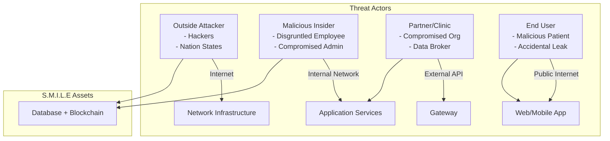
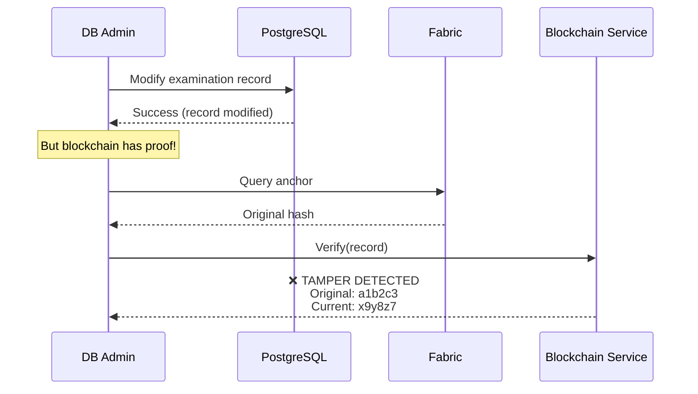
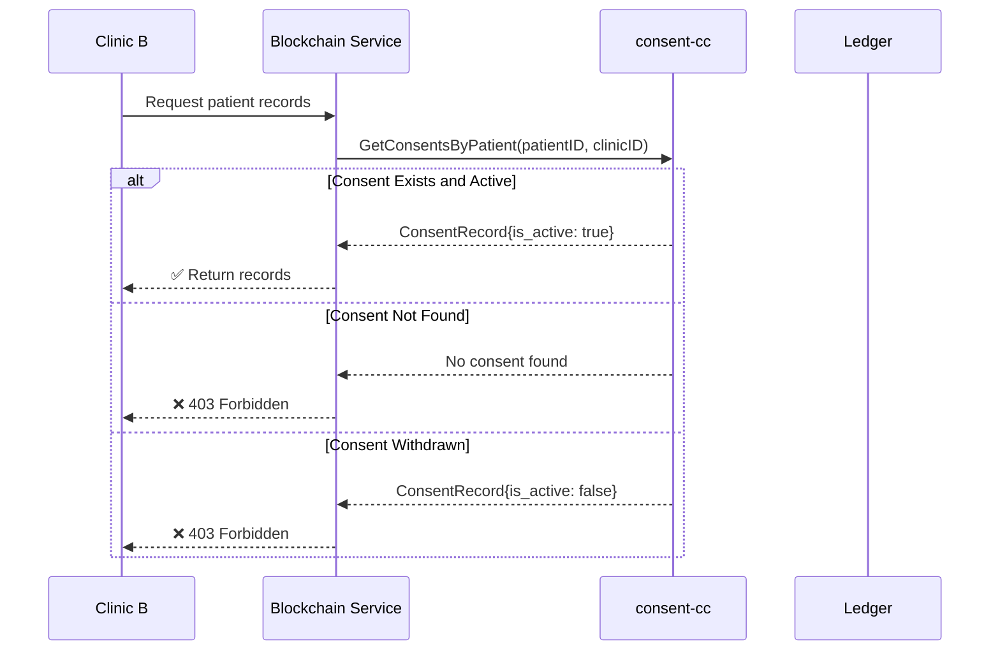
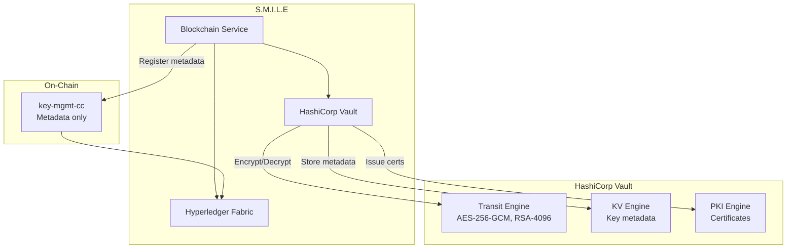
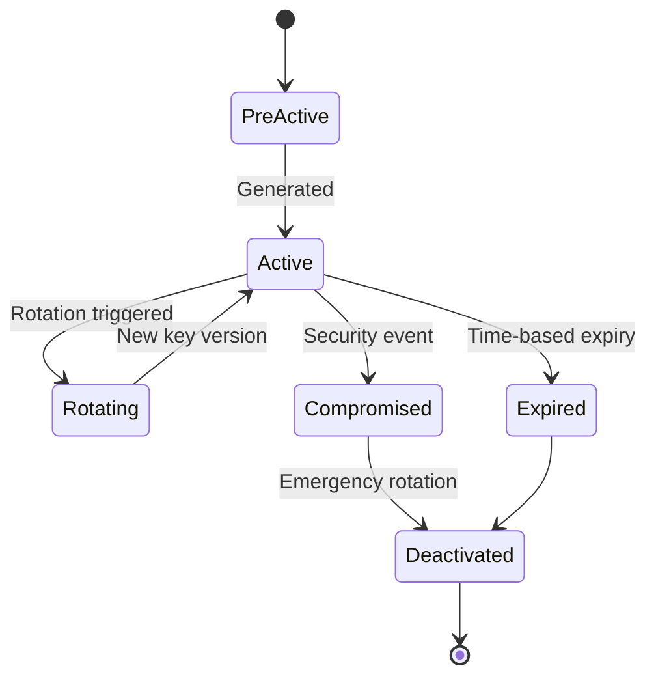
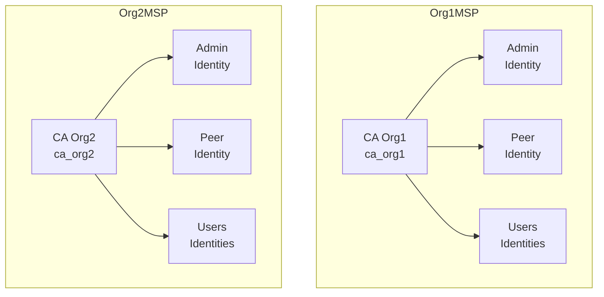
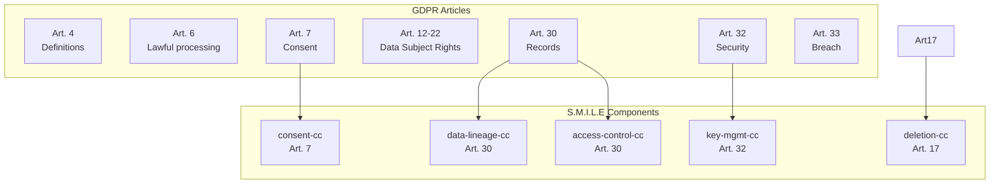
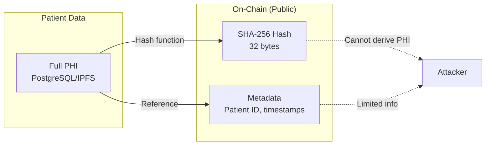
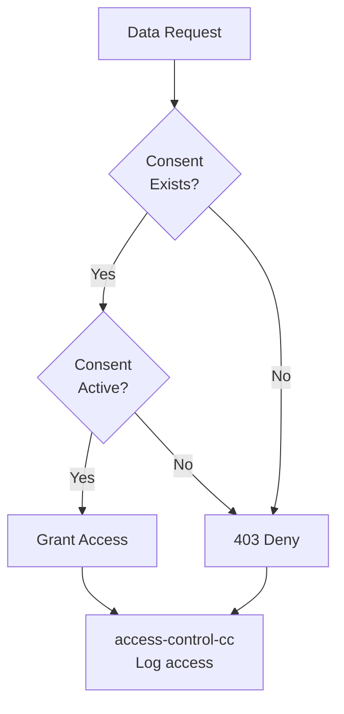

# S.M.I.L.E Security Analysis

## Threat Model, Cryptography, Attack Vectors, and Regulatory Compliance

---

## Table of Contents

1. [Threat Model](#1-threat-model)
2. [Cryptography Specifications](#2-cryptography-specifications)
3. [Attack Vectors and Mitigations](#3-attack-vectors-and-mitigations)
4. [Key Management](#4-key-management)
5. [Identity and Access Management](#5-identity-and-access-management)
6. [Regulatory Compliance Analysis](#6-regulatory-compliance-analysis)
7. [Privacy by Design](#7-privacy-by-design)
8. [Audit and Monitoring](#8-audit-and-monitoring)

---

## 1. Threat Model

### 1.1 Asset Classification

| Asset | Classification | Value | Threat Level |
|-------|---------------|-------|--------------|
| Medical Records | PHI/PII | Critical | High |
| Patient Consent Records | PHI/PII | Critical | High |
| Encryption Keys | Secret | Critical | Critical |
| AI Diagnostic Results | Medical Data | High | Medium |
| Access Audit Logs | Compliance | High | Medium |
| Network Certificates | Identity | High | High |
| IPFS Stored Images | Medical Data | Medium | Medium |

### 1.2 Threat Actor Categories



### 1.3 Attack Surface

| Component | Attack Surface | Entry Points |
|-----------|---------------|--------------|
| API Gateway | Public | REST API endpoints |
| Auth Service | Public | Login, OAuth, OTP |
| Medical Service | Internal | GRPC from gateway |
| Blockchain Service | Internal | Fabric Gateway SDK |
| Peer Nodes | Internal | Gossip protocol |
| Orderer Nodes | Internal | Raft consensus |
| CouchDB | Internal | HTTP API |
| IPFS | Internal/External | IPFS API |
| HashiCorp Vault | Internal | Vault API |

---

## 2. Cryptography Specifications

### 2.1 Hash Functions

| Use Case | Algorithm | Output | Standard |
|----------|-----------|--------|----------|
| Data Integrity | SHA-256 | 256 bits (32 bytes) | FIPS 180-4 |
| Consent Proof | SHA-256 | 256 bits | FIPS 180-4 |
| Audit Verification | SHA-256 | 256 bits | FIPS 180-4 |
| Deletion Proof | SHA-256 | 256 bits | FIPS 180-4 |
| Key Metadata | SHA-256 | 256 bits | FIPS 180-4 |

### 2.2 Symmetric Encryption

| Use Case | Algorithm | Key Size | Mode | Standard |
|----------|-----------|----------|------|----------|
| Data at Rest (PostgreSQL) | AES-256-GCM | 256 bits | GCM | NIST SP 800-175B |
| Data at Rest (Vault) | AES-256-GCM | 256 bits | GCM | NIST SP 800-175B |
| TLS Data | AES-256-GCM | 256 bits | GCM | TLS 1.3 |

### 2.3 Asymmetric Encryption

| Use Case | Algorithm | Key Size | Standard |
|----------|-----------|----------|---------|
| Key Wrapping | RSA-OAEP | 4096 bits | PKCS#1 v2.2 |
| Digital Signatures | ECDSA | P-256 | FIPS 186-4 |
| TLS Key Exchange | ECDH | P-256 | TLS 1.3 |

### 2.4 TLS Configuration

| Component | TLS Version | Cipher Suites | Certificate |
|-----------|-------------|---------------|-------------|
| Client → Gateway | 1.3 | TLS_AES_256_GCM_SHA384 | Let's Encrypt |
| Gateway → Services | 1.3 | TLS_AES_256_GCM_SHA384 | Internal CA |
| Service ↔ Fabric | 1.3 | TLS_AES_256_GCM_SHA384 | Fabric CA |
| CouchDB | 1.2 | TLS_ECDHE_RSA_WITH_AES_256_GCM_SHA384 | Fabric CA |
| IPFS | 1.2 | TLS_ECDHE_RSA_WITH_AES_256_GCM_SHA384 | Self-signed |
| Vault | 1.2 | TLS_ECDHE_RSA_WITH_AES_256_GCM_SHA384 | Vault PKI |

---

## 3. Attack Vectors and Mitigations

### 3.1 Insider Threat

**Scenario**: A database administrator with privileged access attempts to modify medical records.

**S.M.I.L.E Mitigation**:



| Mitigation | Implementation |
|------------|---------------|
| Immutable anchors | SHA-256 hashes stored on Fabric ledger |
| Verification | On-demand hash verification via blockchain-service |
| Separation of duties | No single admin can modify both DB and blockchain |
| Audit trail | access-control-cc logs all data modifications |

---

### 3.2 Data Tampering

**Scenario**: An attacker gains access to PostgreSQL and modifies patient examination data.

**Mitigations**:

| Layer | Protection |
|-------|------------|
| Network | Firewall, network segmentation |
| Application | RBAC, input validation |
| Database | Row-level security, audit logging |
| Blockchain | Hash anchoring + verification |
| Verification | Automated integrity checks |

---

### 3.3 Unauthorized Access (Consent Bypass)

**Scenario**: A clinic attempts to access patient records without valid consent.

**Mitigation Flow**:



---

### 3.4 Key Compromise

**Scenario**: Encryption keys stored in Vault are compromised.

**Mitigations**:

| Protection | Implementation |
|------------|---------------|
| Key separation | Actual keys never on-chain, only metadata |
| Key rotation | key-mgmt-cc rotation with version tracking |
| Hardware security | HSM support in Vault (production) |
| Access logging | RecordKeyAccess in key-mgmt-cc |
| Automatic deactivation | Compromised keys can be instantly deactivated |

---

### 3.5 Sybil Attack

**Scenario**: An attacker creates multiple identities to gain majority control.

**Mitigations**:

| Protection | Implementation |
|------------|---------------|
| Permissioned network | All identities verified by Fabric CA |
| MSP | Membership Service Provider enforces identity |
| PKI | X.509 certificates required |
| Endorsement | MAJORITY policy requires multiple orgs |

---

### 3.6 Replay Attack

**Scenario**: An attacker captures and replays a valid transaction.

**Mitigations**:

| Protection | Implementation |
|------------|---------------|
| Nonces | Client generates unique nonce per transaction |
| Transaction ID | Fabric tx_id includes nonce + timestamp |
| Channel isolation | Separate channels prevent cross-channel replay |

---

### 3.7 Network Eavesdropping

**Scenario**: An attacker intercepts network traffic.

**Mitigations**:

| Protection | Implementation |
|------------|---------------|
| TLS 1.3 | All external traffic encrypted |
| mTLS | Service-to-service authentication |
| VPN | Private network for Fabric components |

---

## 4. Key Management

### 4.1 Architecture Overview



### 4.2 Key Types

| Key Type | Algorithm | Storage | Rotation |
|----------|-----------|---------|----------|
| Data Encryption | AES-256-GCM | Vault Transit | 90 days |
| Key Wrapping | RSA-4096 | Vault Transit | 1 year |
| TLS Server | ECDSA P-256 | Vault PKI | 90 days |
| TLS Client | ECDSA P-256 | Vault PKI | 90 days |
| Fabric Signing | ECDSA P-256 | Fabric MSP | 1 year |

### 4.3 Key Lifecycle



### 4.4 Vault Policies

```hcl
# Key usage policy
path "transit/encrypt/smile-*" {
  capabilities = ["update"]
}

path "transit/decrypt/smile-*" {
  capabilities = ["update"]
}

# Key metadata (read-only for audit)
path "kv/data/smile/keys/*" {
  capabilities = ["read"]
}
```

---

## 5. Identity and Access Management

### 5.1 Fabric MSP Structure



### 5.2 Role-Based Access Control

| Role | Permissions |
|------|-------------|
| Patient | Read own records, grant/withdraw consent, request deletion |
| Doctor | Read patient records (with consent), create records, sign records |
| Admin | Manage users, configure system, view all audits |
| System | Anchor records, verify integrity (service account) |

### 5.3 Endorsement Policy

```yaml
# Example endorsement policy
version: 1
identities:
  user:
    role: member
  peer:
    role: peer
policy:
  1-of:
    - signed-by: user
    - 1-of:
        - signed-by: peer
```

For S.M.I.L.E:
```
AND('Org1MSP.peer', 'Org2MSP.peer')
→ Requires endorsement from BOTH organizations
```

---

## 6. Regulatory Compliance Analysis

### 6.1 HIPAA Compliance Mapping

| HIPAA Requirement | Section | S.M.I.L.E Implementation |
|-------------------|---------|--------------------------|
| Access Control | §164.312(a)(1) | RBAC + Fabric MSP |
| Audit Controls | §164.312(b) | access-control-cc |
| Integrity | §164.312(c)(1) | Hash anchoring + verification |
| Transmission Security | §164.312(e)(1) | TLS 1.3 |
| Person/entity authentication | §164.312(d) | X.509 + JWT |
| Minimum necessary | §164.502(b) | Consent-CC gates access |

### 6.2 GDPR Compliance Mapping



### 6.3 Decree 13/2023 Compliance (Vietnam)

| Decree Requirement | Article | S.M.I.L.E Implementation |
|-------------------|---------|-------------------------|
| Personal data protection principles | Art. 11 | Privacy by design |
| Consent requirement | Art. 13 | consent-cc |
| Data processing records | Art. 26 | data-lineage-cc |
| Encryption requirements | Art. 27 | AES-256-GCM, Vault |
| Key management | Art. 28 | key-mgmt-cc + Vault |
| Data deletion | Art. 30 | deletion-cc |

---

## 7. Privacy by Design

### 7.1 Data Minimization

| Principle | Implementation |
|-----------|---------------|
| Collect only necessary | Hash-only anchoring, no PHI on-chain |
| Purpose limitation | Consent-cc restricts use per purpose |
| Storage limitation | Deletion-cc implements right to erasure |

### 7.2 Privacy Architecture



### 7.3 Consent-Gated Access



---

## 8. Audit and Monitoring

### 8.1 Blockchain Audit Trail

All Fabric transactions create immutable audit records:

```json
{
  "tx_id": "0xabc123...",
  "type": "ENDORSER_TRANSACTION",
  "channel_id": "medicalrecords",
  "timestamp": "2024-03-15T10:30:00Z",
  "creator": {
    "msp_id": "Org1MSP",
    "id": "doctor-uuid-789"
  },
  "actions": [
    {
      "chaincode_id": "medical-anchor-cc",
      "function": "AnchorMedicalData",
      "args": ["data-id", "examination", "hash...", ...]
    }
  ]
}
```

### 8.2 Security Monitoring

| Event | Source | Alert |
|-------|--------|-------|
| Failed login attempts | Auth Service | Threshold > 5/min |
| Consent withdrawal | consent-cc | Immediate |
| Key rotation | key-mgmt-cc | Immediate |
| Deletion request | deletion-cc | Immediate |
| Unauthorized access | access-control-cc | Immediate |
| Blockchain tx failure | Fabric | Immediate |

### 8.3 Compliance Reporting

The `compliance_reports` table tracks regulatory compliance:

```sql
SELECT * FROM compliance_reports 
WHERE report_type = 'hipaa_audit' 
AND period_start >= '2024-01-01' 
AND period_end <= '2024-03-31';
```

---

## Summary: Security Controls Matrix

| Threat | Control | Implementation |
|---------|---------|---------------|
| Data tampering | Hash anchoring | SHA-256 on Fabric |
| Unauthorized access | Consent gating | consent-cc |
| Key compromise | Vault + rotation | key-mgmt-cc |
| Insider threat | Separation + audit | access-control-cc |
| Regulatory non-compliance | Chaincodes | 7 purpose-built contracts |
| Network attack | TLS/mTLS | TLS 1.3 |
| Identity spoofing | Fabric CA + MSP | X.509 certificates |

---

*Document Version: 1.0*  
*Last Updated: March 2026*  
*S.M.I.L.E - Smart Medical Intelligent Ledger for E-health*
