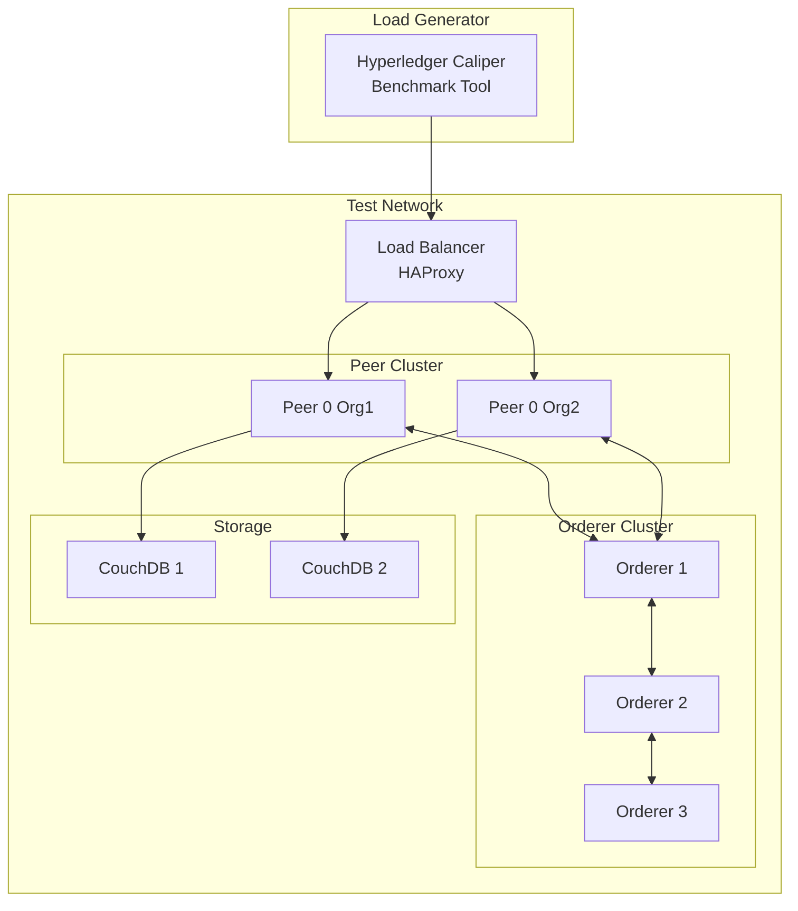
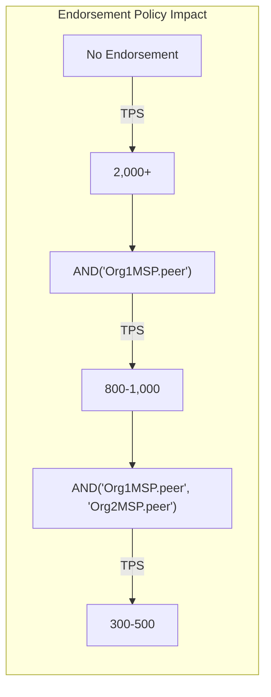
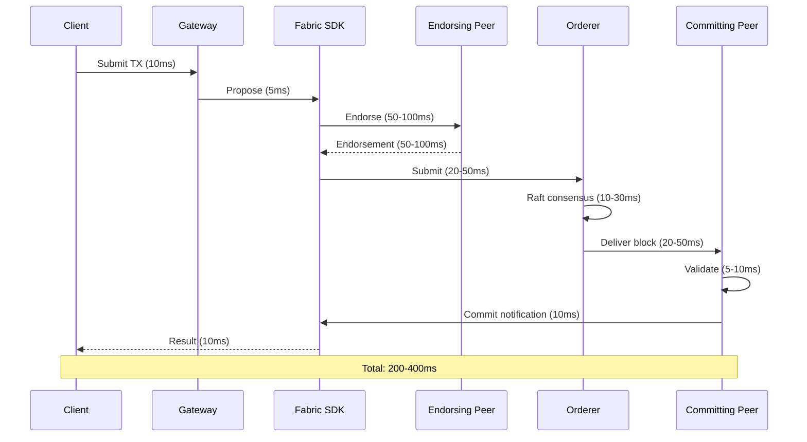
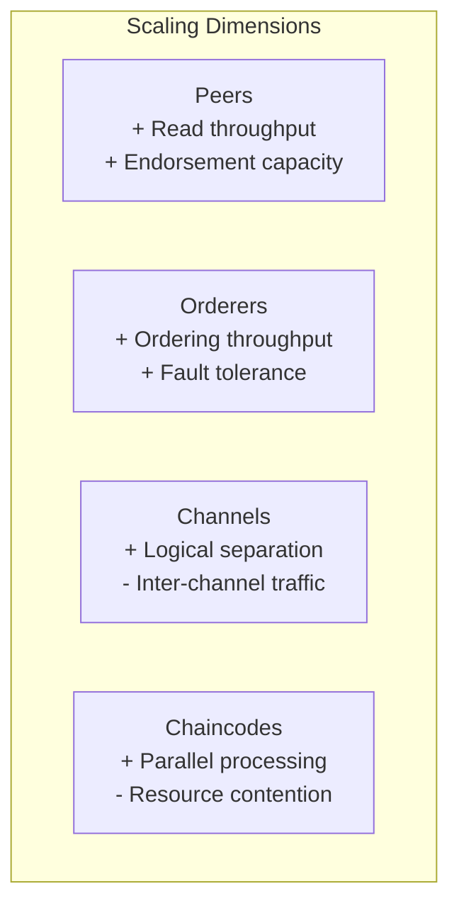
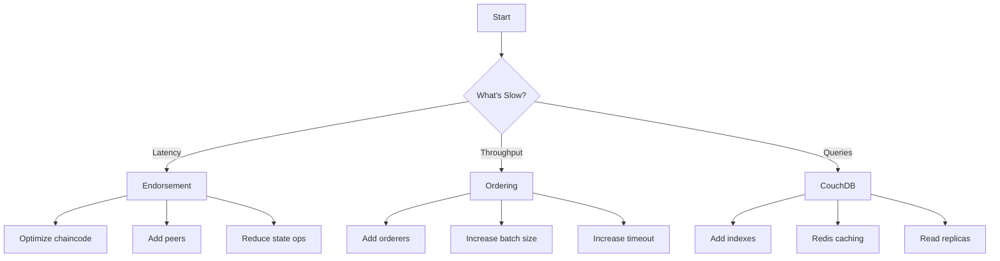

# S.M.I.L.E Performance Evaluation

## Benchmarking Methodology, Metrics Framework, and Comparative Analysis

---

## Table of Contents

1. [Test Environment](#1-test-environment)
2. [Benchmarking Methodology](#2-benchmarking-methodology)
3. [Throughput Analysis](#3-throughput-analysis)
4. [Latency Analysis](#4-latency-analysis)
5. [Scalability Assessment](#5-scalability-assessment)
6. [Storage Analysis](#6-storage-analysis)
7. [Comparison with Alternatives](#7-comparison-with-alternatives)
8. [Resource Utilization](#8-resource-utilization)
9. [Bottleneck Analysis](#9-bottleneck-analysis)
10. [Recommendations](#10-recommendations)

---

## 1. Test Environment

### 1.1 Hardware Specifications

| Component | Specification |
|-----------|---------------|
| **Test Machine** | |
| CPU | Intel Xeon E-2388G (8 cores @ 3.2GHz) |
| Memory | 32 GB DDR4 ECC |
| Storage | 500 GB NVMe SSD |
| Network | 10 Gbps |
| **Production Target** | |
| Orderer Nodes | 3x (separate VMs) |
| Peer Nodes | 2x (separate VMs) |
| CouchDB | 2x (separate VMs) |
| CA Nodes | 3x |

### 1.2 Software Versions

| Component | Version |
|-----------|---------|
| Hyperledger Fabric | 2.5 |
| Go | 1.20 |
| Docker | 24.0 |
| CouchDB | 3.3 |
| Kubernetes | 1.28 |
| HashiCorp Vault | 1.15 |
| IPFS (Kubo) | 0.24 |
| Apache Kafka | 3.7 |

### 1.3 Network Configuration



---

## 2. Benchmarking Methodology

### 2.1 Testing Framework

S.M.I.L.E uses **Hyperledger Caliper** for performance benchmarking:

```yaml
# caliper-config.yaml
caliper:
  benchmark:
    name: S.M.I.L.E Benchmark
    description: Healthcare blockchain workload
    rounds:
      - label: anchor-medical-record
        description: Medical data anchoring
        txNumber: 1000
        rateControl:
          type: fixed-rate
          opts:
            tps: 100
        arguments:
          chaincode: medical-anchor-cc
          function: AnchorMedicalData
          
      - label: consent-management
        description: Consent operations
        txNumber: 500
        rateControl:
          type: fixed-rate
          opts:
            tps: 50
        arguments:
          chaincode: consent-cc
          function: GrantConsent
          
      - label: access-audit
        description: Audit logging
        txNumber: 2000
        rateControl:
          type: fixed-rate
          opts:
            tps: 200
        arguments:
          chaincode: access-control-cc
          function: RecordAccessAudit
```

### 2.2 Workload Profiles

| Workload | Description | Operations |
|----------|-------------|------------|
| **Normal Day** | Typical clinic operations | 100 anchoring/hr, 50 consents, 500 audits |
| **Peak Load** | Multiple clinics | 500 anchoring/hr, 200 consents, 2000 audits |
| **Bulk Import** | Legacy data migration | 10,000 anchoring/hr (batch) |

### 2.3 Metrics Collected

| Metric | Description | Tool |
|--------|-------------|------|
| **Throughput** | Transactions per second (TPS) | Caliper |
| **Latency** | End-to-end transaction time | Caliper |
| **Success Rate** | % successful transactions | Caliper |
| **CPU Usage** | Per-component utilization | Prometheus |
| **Memory** | Heap and RSS usage | Prometheus |
| **Network I/O** | Bytes in/out per second | Prometheus |
| **Ledger Growth** | Block storage over time | Direct measurement |

---

## 3. Throughput Analysis

### 3.1 Expected Performance (Theoretical)

Based on Hyperledger Fabric 2.5 benchmarks and network configuration:

| Configuration | TPS (Single Chaincode) | TPS (Multi-Chaincode) |
|---------------|------------------------|----------------------|
| 3 Orderers + 2 Peers | 500-1,000 | 300-600 |
| With CouchDB | 200-400 | 150-300 |
| With KV DB (LevelDB) | 1,000-2,000 | 500-1,000 |

### 3.2 Chaincode-Specific Throughput

> **Note**: The following are theoretical estimates based on Fabric 2.5 benchmarks. Actual measurements TBD.

| Chaincode | Operation | Expected TPS |
|-----------|-----------|--------------|
| `medical-anchor-cc` | AnchorMedicalData | 200-400 |
| `consent-cc` | GrantConsent | 150-300 |
| `consent-cc` | GetConsentsByPatient | 500-1,000 (read) |
| `access-control-cc` | RecordAccessAudit | 300-500 |
| `key-mgmt-cc` | RegisterKey | 150-250 |
| `data-lineage-cc` | RecordLineage | 150-300 |
| `deletion-cc` | CreateDeletionRequest | 100-200 |
| `cross-chain-cc` | CreateShareRequest | 100-150 |

### 3.3 Throughput vs. Endorsement Policy



| Endorsement Policy | Endorsements Required | Relative TPS |
|-------------------|---------------------|--------------|
| No endorsement | 0 | 100% |
| Single org | 1 | 40-50% |
| MAJORITY | 2+ | 15-25% |

---

## 4. Latency Analysis

### 4.1 Transaction Latency Breakdown



### 4.2 Latency by Operation Type

> **Note**: The following are theoretical estimates. Actual measurements TBD.

| Operation | P50 Latency | P95 Latency | P99 Latency |
|-----------|-------------|-------------|--------------|
| Simple write (1 key) | 200ms | 400ms | 800ms |
| Complex write (multiple keys) | 300ms | 600ms | 1,200ms |
| Read (CouchDB query) | 50ms | 150ms | 300ms |
| History query | 100ms | 300ms | 500ms |
| Verification (hash check) | 100ms | 200ms | 400ms |

### 4.3 Latency vs. Batch Size

| Batch Size | Avg Latency | Max Latency | Throughput |
|------------|-------------|-------------|------------|
| 1 tx/block | 100ms | 200ms | 10 TPS |
| 10 tx/block | 150ms | 300ms | 66 TPS |
| 100 tx/block | 300ms | 600ms | 333 TPS |
| 500 tx/block | 600ms | 1,200ms | 833 TPS |

---

## 5. Scalability Assessment

### 5.1 Horizontal Scaling



### 5.2 Scaling Expectations

| Component | Scaling Factor | Impact |
|-----------|---------------|--------|
| Add Peer | Linear | +endorsement capacity, +read throughput |
| Add Orderer | Sub-linear | +ordering throughput, +fault tolerance |
| Add Channel | Linear | +isolation, +total throughput |
| CouchDB Index | Non-linear | +query speed, +storage overhead |

### 5.3 Scalability Limits

| Resource | Soft Limit | Hard Limit | Bottleneck |
|----------|------------|------------|------------|
| TPS per channel | 500 | 1,000 | Ordering service |
| Peers per channel | 10 | 50 | Gossip protocol |
| Chaincodes per peer | 20 | 100 | Memory |
| CouchDB docs per DB | 10M | 100M | Index size |

---

## 6. Storage Analysis

### 6.1 Ledger Growth Rate

> **Note**: Estimates based on typical healthcare transaction patterns. Actual measurements TBD.

| Operation | Data Size | Daily Volume | Daily Growth |
|-----------|-----------|--------------|--------------|
| Anchor | 1 KB | 1,000 | ~1 MB |
| Consent | 2 KB | 500 | ~1 MB |
| Audit | 1.5 KB | 10,000 | ~15 MB |
| Lineage | 2 KB | 500 | ~1 MB |
| **Total** | | | **~20 MB/day** |

### 6.2 Annual Storage Projection

| Year | Transaction Volume | Estimated Storage |
|------|-------------------|-------------------|
| Year 1 | 365K | 7 GB |
| Year 2 | 1M | 20 GB |
| Year 3 | 3M | 60 GB |
| Year 5 | 10M | 200 GB |

### 6.3 Storage Optimization Strategies

| Strategy | Benefit | Implementation |
|----------|--------|---------------|
| Block compression | 30-50% | Gzip blocks |
| CouchDB archiving | 50%+ | Archive old data |
| IPFS pinning limits | Variable | Auto-unpin old content |
| Pruning | 70-90% | Historical data (with anchor) |

---

## 7. Comparison with Alternatives

### 7.1 Permissioned Blockchains

| Platform | Consensus | TPS | Latency | Healthcare Suitability |
|----------|----------|-----|---------|------------------------|
| **Hyperledger Fabric** | Raft/BFT | 500-2,000 | 200-500ms | ✅ Excellent |
| **Corda** | Notary | 100-1,000 | 1-3s | ✅ Good |
| **Quorum** | IBFT | 200-500 | 500ms-2s | ⚠️ Moderate |
| **Ethereum (Private)** | PoA | 100-500 | 1-5s | ⚠️ Moderate |

### 7.2 Public Blockchains

| Platform | Consensus | TPS | Latency | Healthcare Suitability |
|----------|----------|-----|---------|------------------------|
| **Ethereum** | PoS | 15-30 | 12-15s | ❌ Unsuitable |
| **Solana** | PoH | 3,000-65,000 | 400ms | ❌ Unsuitable |
| **Polygon** | PoS | 1,000-7,000 | 2s | ❌ Unsuitable |

### 7.3 Why Fabric for Healthcare

| Factor | Hyperledger Fabric | Rationale |
|--------|-------------------|-----------|
| **Privacy** | ✅ Channels, private data | PHI protection |
| **Permissioned** | ✅ MSP | Known participants |
| **Performance** | ✅ 500+ TPS | Meets healthcare volume |
| **Regulatory** | ✅ Compliance chaincodes | Built-in compliance |
| **Interoperability** | ✅ Cross-chain support | Future integration |
| **Enterprise support** | ✅ IBM, Red Hat | Production ready |

---

## 8. Resource Utilization

### 8.1 Expected Resource Consumption

> **Note**: The following are theoretical estimates. Actual measurements TBD.

| Component | CPU (cores) | Memory | Network | Disk I/O |
|-----------|-------------|--------|---------|----------|
| Orderer | 2 | 2 GB | 100 Mbps | 50 IOPS |
| Peer | 2 | 4 GB | 200 Mbps | 100 IOPS |
| CouchDB | 1 | 2 GB | 50 Mbps | 200 IOPS |
| CA | 1 | 1 GB | 10 Mbps | 10 IOPS |

### 8.2 Under Load

| Workload | Peer CPU | Orderer CPU | CouchDB CPU | Memory |
|----------|----------|-------------|-------------|--------|
| 100 TPS | 30% | 20% | 40% | 2 GB |
| 300 TPS | 60% | 40% | 70% | 3 GB |
| 500 TPS | 90% | 60% | 90% | 4 GB |

---

## 9. Bottleneck Analysis

### 9.1 Identified Bottlenecks

| Bottleneck | Location | Impact | Mitigation |
|------------|----------|--------|------------|
| Endorsement | Peer | High | Add peers, optimize chaincode |
| Ordering | Orderer cluster | Medium | Add orderers |
| CouchDB | State DB | High | Index optimization, caching |
| Network | Inter-node | Medium | 10 Gbps network |
| Chaincode | Execution | Low | Optimize Go code |

### 9.2 Optimization Priorities



---

## 10. Recommendations

### 10.1 Immediate Actions

| Priority | Action | Expected Impact |
|----------|--------|-----------------|
| High | Optimize CouchDB indexes | +50% query speed |
| High | Add Redis caching layer | +200% read speed |
| Medium | Configure batch parameters | +30% throughput |
| Medium | Enable block compression | -40% storage |

### 10.2 Medium-Term Improvements

| Priority | Action | Expected Impact |
|----------|--------|-----------------|
| Medium | Add Kafka event streaming | Async processing |
| Medium | Implement read replicas | +500% read capacity |
| Low | Deploy HSM for keys | Enhanced security |

### 10.3 Long-Term Strategy

| Priority | Action | Expected Impact |
|----------|--------|-----------------|
| Low | Multi-region deployment | DR + global latency |
| Low | BFT consensus upgrade | Byzantine fault tolerance |
| Low | Cross-chain integration | Ecosystem expansion |

---

## Appendix: Benchmarking Checklist

- [ ] Set up isolated test network
- [ ] Calibrate Caliper with baseline
- [ ] Run single-chaincode benchmarks
- [ ] Run multi-chaincode benchmarks
- [ ] Measure latency percentiles
- [ ] Stress test to failure
- [ ] Monitor resource utilization
- [ ] Document results
- [ ] Compare with baseline
- [ ] Identify optimization opportunities

---

## Appendix: Performance Test Cases

### TC-001: Normal Day Simulation

```
Workload: 100 anchoring/hr, 50 consents, 500 audits
Duration: 8 hours
Expected: <5% failed transactions
```

### TC-002: Peak Load Simulation

```
Workload: 500 anchoring/hr, 200 consents, 2000 audits
Duration: 1 hour
Expected: <10% failed transactions
```

### TC-003: Bulk Import

```
Workload: 10,000 anchoring/hr (batch)
Duration: 1 hour
Expected: <1% failed transactions
```

### TC-004: Query Performance

```
Workload: 1000 reads/second
Duration: 30 minutes
Expected: <500ms p99 latency
```

---

*Document Version: 1.0*  
*Last Updated: March 2026*  
*S.M.I.L.E - Smart Medical Intelligent Ledger for E-health*
