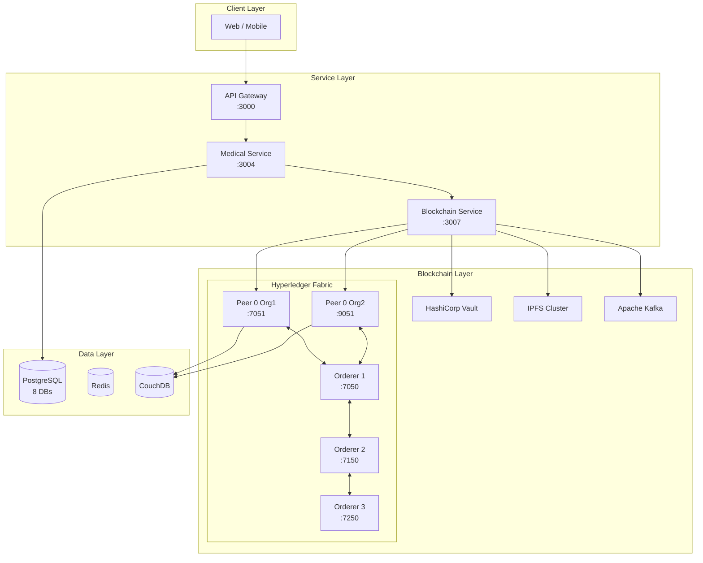

# S.M.I.L.E Blockchain Documentation

Comprehensive technical documentation for the Hyperledger Fabric blockchain layer of the S.M.I.L.E (Smart Medical Intelligent Ledger for E-health) platform.

---

## Overview

S.M.I.L.E is a next-generation Dental Practice Management System (DPMS) that integrates **Hyperledger Fabric v2.5** blockchain to ensure medical data integrity, patient consent enforcement, and regulatory compliance. The blockchain layer serves as the "truth layer" of the system, anchoring cryptographic hashes of medical records while keeping Protected Health Information (PHI) off-chain.

---

## Documentation Index

| # | Document | Description |
|---|----------|-------------|
| 1 | **[01-whitepaper.md](./01-whitepaper.md)** | Executive summary, problem statement, proposed solution, consensus mechanism, use cases, roadmap |
| 2 | **[02-system-architecture.md](./02-system-architecture.md)** | Complete Fabric network topology, node roles, channel architecture, integration layer, storage, event streaming |
| 3 | **[03-smart-contract-design.md](./03-smart-contract-design.md)** | Detailed specification of all 7 chaincodes: medical-anchor-cc, consent-cc, access-control-cc, key-mgmt-cc, data-lineage-cc, deletion-cc, cross-chain-cc |
| 4 | **[04-data-model.md](./04-data-model.md)** | On-chain data structures, transaction lifecycle, block format, composite keys, off-chain PostgreSQL and IPFS models |
| 5 | **[05-security-analysis.md](./05-security-analysis.md)** | Threat model, cryptography specs, attack vectors, key management, identity management, HIPAA/GDPR/Decree 13 compliance |
| 6 | **[06-performance-evaluation.md](./06-performance-evaluation.md)** | Benchmarking methodology, throughput/latency analysis, scalability assessment, comparison with alternatives |

---

## Quick Reference

### Blockchain Network

- **Platform**: Hyperledger Fabric v2.5
- **Consensus**: Raft (etcdraft) with 3 orderers
- **Organizations**: 2 peer orgs + 1 orderer org
- **Channels**: MedicalRecordsChannel, ConsentChannel

### Smart Contracts

| Chaincode | Purpose | Lines of Code |
|-----------|---------|---------------|
| `medical-anchor-cc` | Immutable hash anchoring for medical records | 415 |
| `consent-cc` | Patient consent lifecycle (GDPR/HIPAA) | 501 |
| `access-control-cc` | Tamper-evident audit trails | 345 |
| `key-mgmt-cc` | Encryption key metadata registry | 614 |
| `data-lineage-cc` | Data provenance tracking | 515 |
| `deletion-cc` | Right-to-erasure implementation | 585 |
| `cross-chain-cc` | Inter-organization data sharing | 854 |

### Technology Stack

| Component | Technology | Version |
|-----------|------------|---------|
| Blockchain | Hyperledger Fabric | 2.5 |
| Chaincode | Go | 1.20 |
| State DB | CouchDB | 3.3 |
| CA | Fabric CA | 1.5 |
| Key Vault | HashiCorp Vault | 1.15 |
| Storage | IPFS (Kubo) | 0.24 |
| Events | Apache Kafka | 3.7 |

---

## Architecture Diagram

---

## Key Features

### Privacy by Design

- Hash-only anchoring (no PHI on-chain)
- Consent-gated access control
- Channel isolation for sensitive data
- Private data collections

### Regulatory Compliance

- **HIPAA**: Audit trails, access control, encryption
- **GDPR**: Consent management, right to erasure, data portability
- **Vietnamese Decree 13/2023**: Key management, data protection

### Enterprise Ready

- Permissioned network with known participants
- Raft consensus for performance
- Horizontal scaling with additional peers
- Integration with existing healthcare systems

---

## Related Documentation

- [Main Architecture](../ARCHITECTURE.md)
- [Workflow Documentation](../WORKFLOW.md)
- [User Flows](../USER_FLOW.md)
- [Service Documentation](../services/)
- [Paper/Research](../paper/)

---

## Source Code

| Component | Location |
|-----------|----------|
| Chaincodes | `blockchain/chaincode/` |
| Network Config | `blockchain/network/` |
| Blockchain Service | `backend/service/blockchain-service/` |
| Docker Compose | `docker-compose-fabric.yml` |

---

## Version History

| Version | Date | Changes |
|---------|------|---------|
| 1.0 | March 2026 | Initial documentation suite |

---

*Last Updated: March 2026*  
*S.M.I.L.E - Smart Medical Intelligent Ledger for E-health*
