# ROLE_BENCHMARK.md — Benchmark nghiệp vụ các nền tảng y tế theo Role của S.M.I.L.E

> **Mục đích:** Tài liệu tham chiếu (benchmark) tổng hợp nghiệp vụ (use cases / workflows) của các app & nền tảng y tế khác trên thế giới và tại Việt Nam, được phân loại theo **5 role cốt lõi của dự án S.M.I.L.E**, nhằm đối chiếu tính năng hiện có và gợi ý hướng phát triển.

---

## 0. Bối cảnh & Nguồn dữ liệu

S.M.I.L.E là hệ thống **Quản lý phòng khám nha khoa (Dental Practice Management System / EHR)**, công nghệ: NestJS (backend microservices), Next.js 15 + React 19 (frontend), PostgreSQL/TypeORM, RabbitMQ, AI phân tích X-quang (MobileNetV3), thanh toán VNPay.

**Các role được định nghĩa trong code S.M.I.L.E:**
- Backend enum `backend/service/iam-service/src/accounts/domain/account.ts`: `ADMIN, DOCTOR, PATIENT, RECEPTIONIST, NURSE`
- Frontend `frontend/web/src/shared/constants/roles.ts`: thêm `DENTIST` (= DOCTOR), `CLINIC_ADMIN`, `SUPER_ADMIN`
- Personas trong `docs/USER_FLOW.md`: Patient, Dentist, Receptionist, Administrator

**Các nhóm nền tảng được khảo sát:**

| Nhóm | Nền tảng |
|------|----------|
| Dental PMS quốc tế | Open Dental, Dentrix, Curve Dental, Dentally, tab32, Denticon |
| E-health Việt Nam | Medpro, YouMed, eDoctor, IVIE (iSofHcare), MyVinmec, Medlatec, iSofH HIS |
| EHR / Booking quốc tế | Epic MyChart, athenahealth, Zocdoc, Practo, SimplePractice |

**Mapping role S.M.I.L.E ↔ role các nền tảng:**

| S.M.I.L.E | Dental PMS | EHR quốc tế | E-health VN |
|-----------|-----------|------------|-------------|
| `PATIENT` | Patient Portal | MyChart / athenaPatient | Bệnh nhân (app Medpro/YouMed/IVIE) |
| `DENTIST`/`DOCTOR` | Provider / Dentist / Hygienist | Physician / Clinician | Bác sĩ |
| `RECEPTIONIST` | Front Desk / Reception | Front desk / Scheduler | Lễ tân / Tiếp đón |
| `NURSE` | Hygienist / Dental Assistant | Nurse / MA (Rover) | Điều dưỡng |
| `ADMIN`/`CLINIC_ADMIN`/`SUPER_ADMIN` | Office Manager / Owner | Practice Manager / Admin | Quản trị phòng khám |

> ⚠️ **Lưu ý kiến trúc cần xử lý:** (1) Role `NURSE` chưa được gắn RBAC ở backend (`@Roles(NURSE)` không tồn tại trong các controller). (2) Lệch tên `DOCTOR` (backend) ↔ `DENTIST` (frontend). Benchmark nghiệp vụ hygienist/nurse bên dưới giúp định hình rõ nghiệp vụ cho role `NURSE`.

---

## 1. Role: PATIENT (Bệnh nhân)

### 1.1 Nghiệp vụ theo nền tảng

**Dental PMS quốc tế**
- **Open Dental Patient Portal:** xem lịch hẹn, số dư & thanh toán online (XCharge/PayConnect/Edge Express), xem treatment plan đã lưu, xem ảnh/PDF được chia sẻ, nhắn tin bảo mật với bác sĩ, xem tóm tắt khám (Summary of Care). Tab nào hiển thị do phòng khám cấu hình.
- **Dentrix Patient Engage / Patient Portal:** đặt lịch online 24/7 (Online Booking realtime), xác nhận/dời/huỷ qua SMS, điền form/hồ sơ online trước khám, virtual waiting room, thanh toán online.
- **Curve Dental (Curve GRO + Smart Forms):** tự đặt lịch mọi thiết bị, two-way texting, Text-to-Pay (nhận link thanh toán qua SMS), form online tự động cập nhật EHR (không cần username/password, gửi link bảo mật qua điện thoại/email).
- **Dentally Patient:** đặt lịch, form, thanh toán, xem hồ sơ; hỗ trợ portal bệnh nhân.
- **tab32 Patient:** portal/patient app, paperless onboarding (form online), thanh toán, reminders, booking.

**E-health Việt Nam**
- **Medpro:** đặt lịch khám 100+ bệnh viện/300+ cơ sở, lấy **số thứ tự trực tuyến**, đặt trong ngày, thanh toán viện phí trước → tại viện chỉ quét mã là vào phòng khám; hỗ trợ Kiosk y tế thông minh (Đề án 06/CP).
- **IVIE (iSofHcare):** tư vấn y tế từ xa (video với 2000+ bác sĩ/40 chuyên khoa), đặt lịch, **hồ sơ sức khỏe cho cả gia đình**, xem KQ xét nghiệm/chẩn đoán hình ảnh/đơn thuốc, mua thuốc online, hỏi đáp ẩn danh.
- **YouMed / eDoctor:** đặt khám, tư vấn online, mua thuốc, lưu hồ sơ, nhắc dùng thuốc.
- **MyVinmec / Medlatec:** đặt lịch, xem KQ xét nghiệm, thanh toán, quản lý hồ sơ người thân.

**EHR / Booking quốc tế**
- **Epic MyChart:** self-scheduling (Fast Pass waitlist tự động đề xuất lịch sớm hơn khi có huỷ), **eCheck-In** hoàn tất trước 7 ngày (ký consent, form, đóng copay), xem KQ xét nghiệm 24/7, secure messaging, E-Visits (khai báo triệu chứng bất đồng bộ), yêu cầu cấp lại đơn, thanh toán & trả góp, **proxy access** (quản lý hồ sơ con/người già), telehealth, Happy Together (gộp hồ sơ nhiều tổ chức).
- **athenaPatient:** self-scheduling, self check-in mobile, xem KQ/kế hoạch chăm sóc, secure messaging, thanh toán, **Family Access** (Full vs Billing-only), athenaTelehealth.
- **Zocdoc:** self-scheduling theo chuyên khoa/bảo hiểm, waitlist tự động nhận slot sớm (one-tap confirm), automated intake/check-in bỏ clipboard.
- **Practo:** đặt khám, tư vấn video 25+ chuyên khoa, **đơn thuốc số & mua thuốc giao tận nhà**, lưu hồ sơ sức khỏe, nhắc thuốc, đặt xét nghiệm.
- **SimplePractice Client Portal:** yêu cầu đặt lịch, điền form đồng thuận/tiền khám, xem tài liệu, secure messaging, thanh toán/thẻ lưu sẵn, telehealth, nộp thông tin bảo hiểm.

### 1.2 Bảng so sánh tính năng (PATIENT)

| Nghiệp vụ | Open Dental | Dentrix | Curve | Dentally | tab32 | Medpro | IVIE | MyChart | athena | Zocdoc | Practo | SMILE* |
|-----------|:---:|:---:|:---:|:---:|:---:|:---:|:---:|:---:|:---:|:---:|:---:|:---:|
| Đặt lịch online | ✅ | ✅ | ✅ | ✅ | ✅ | ✅ | ✅ | ✅ | ✅ | ✅ | ✅ | ✅ |
| Waitlist/lịch sớm | ❌ | ❌ | ❌ | ❌ | ❌ | ❌ | ❌ | ✅ | ❌ | ✅ | ❌ | ⚠️ |
| eCheck-in / form trước | ✅ | ✅ | ✅ | ✅ | ✅ | ⚠️ | ⚠️ | ✅ | ✅ | ✅ | ⚠️ | ⚠️ |
| Thanh toán online | ✅ | ✅ | ✅ | ✅ | ✅ | ✅ | ❌ | ✅ | ✅ | ❌ | ❌ | ✅ (VNPay) |
| Xem hồ sơ/KQ | ✅ | ✅ | ✅ | ✅ | ✅ | ✅ | ✅ | ✅ | ✅ | ❌ | ✅ | ✅ |
| Hồ sơ gia đình/proxy | ❌ | ❌ | ❌ | ❌ | ❌ | ⚠️ | ✅ | ✅ | ✅ | ❌ | ❌ | ❌ |
| Telehealth / tư vấn | ❌ | ❌ | ❌ | ❌ | ❌ | ❌ | ✅ | ✅ | ✅ | ❌ | ✅ | ❌ |
| Secure messaging | ✅ | ✅ | ✅ | ✅ | ✅ | ❌ | ✅ | ✅ | ✅ | ❌ | ✅ | ✅ (chat) |
| Đơn thuốc số/mua thuốc | ❌ | ❌ | ❌ | ❌ | ❌ | ❌ | ✅ | ✅ | ✅ | ❌ | ✅ | ❌ |

\* `SMILE` = trạng thái hiện tại ước lượng từ code (booking, VNPay, chat AI, hồ sơ bệnh án có sẵn).

### 1.3 Đối chiếu với S.M.I.L.E & Gợi ý
- **Đã có:** đặt lịch (`appointments`), thanh toán VNPay, chat AI hỗ trợ bệnh nhân, hồ sơ/medical records, consent (data consent trong USER_FLOW).
- **Nên bổ sung:**
  - **Proxy / hồ sơ gia đình** (quản lý người thân) — thiếu nhưng rất phổ biến ở VN (IVIE, MyChart).
  - **eCheck-in trước khám** + form đồng thuận online (giảm thời gian lễ tân).
  - **Waitlist tự động** đề xuất slot sớm khi huỷ (Zocdoc Fast Pass).
  - **Kê đơn điện tử + liên thông Đơn thuốc Quốc gia** (bắt buộc theo TT 26/2025 — xem mục 6).
  - **Telehealth/tư vấn từ xa** (IVIE, Practo, MyChart đều có).

### 1.4 Workflow Diagrams — PATIENT

#### 1.4.1 Đặt lịch khám Online (Booking Flow)

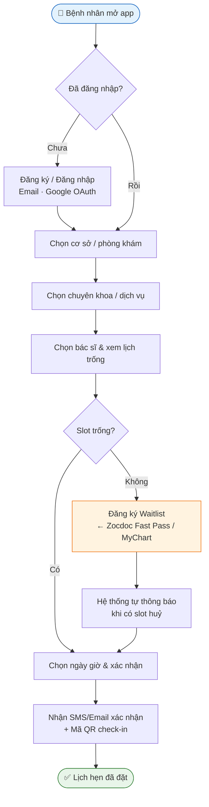

#### 1.4.2 Thanh toán Online (Payment Flow)

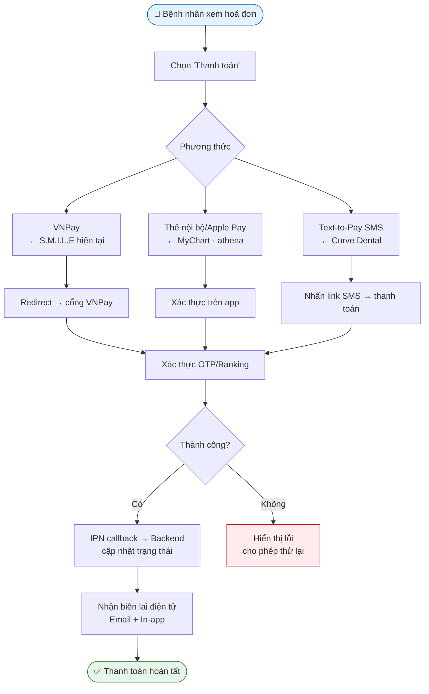

#### 1.4.3 eCheck-in trước khám (Pre-Visit Flow)

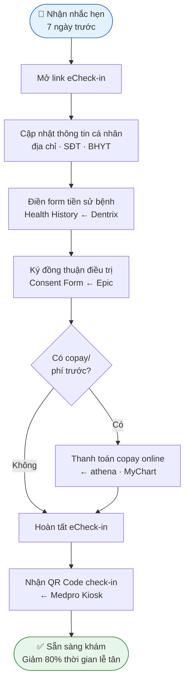

#### 1.4.4 Telehealth / Tư vấn từ xa

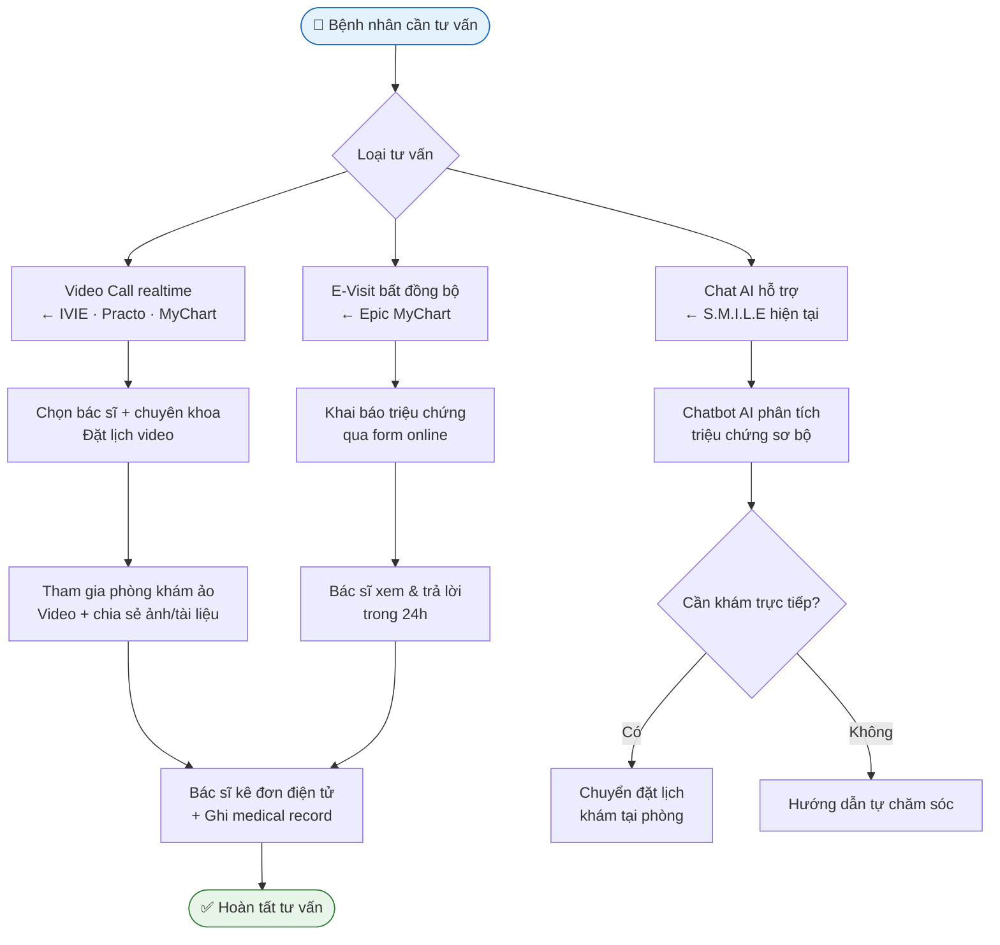

#### 1.4.5 Quản lý hồ sơ gia đình (Proxy Access)

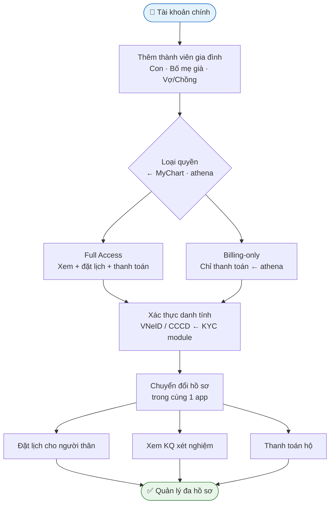

---

## 2. Role: DENTIST / DOCTOR (Nha sĩ / Bác sĩ)

### 2.1 Nghiệp vụ theo nền tảng

**Dental PMS quốc tế**
- **Open Dental:** Clinical Chart (charting răng), Treatment Plan module (lưu plan, ký), Perio, Imaging, e-Prescribe, nhật ký chăm sóc, lab cases.
- **Dentrix:** Charting, **Perio Chart** (navigation scripts PD/GM/CAL, auto-advance), **Clinical Notes** (70+ templates, ký số → lock, chỉ thêm addendum), **ePrescribe** (Veradigm, check tương tác thuốc/dị ứng, EPCS, tích hợp PDMP), **Health History** tích hợp prescriptions, Lab Case Manager.
- **Curve Dental:** charting đám mây, imaging tích hợp, treatment planning, note.
- **Dentally:** Chart, **Perio Exam (BPE/6-point pocket chart)**, CAL tự tính, % Bleeding on Probing realtime, treatment plans, estimates.
- **tab32:** cloud imaging built-in, treatment planning, e-Rx, lab cases, clinical notes.

**E-health Việt Nam**
- **IVIE / YouMed / eDoctor:** bác sĩ tư vấn video, kê đơn trực tuyến, xem lịch khám, quản lý ca khám.
- **iSofH HIS:** bác sĩ tra cứu lịch sử khám, nhập y lệnh/chỉ định/xét nghiệm/đơn thuốc → tự động chuyển phòng chức năng, nhận alert/nhắc lịch.

**EHR / Booking quốc tế**
- **Epic (Hyperspace/Haiku/Canto):** document với SmartTools (dot-phrases), CPOE (order sets, pended orders), **e-Rx + EPCS**, review KQ (In Basket), **co-sign** cho bác sĩ tập sự/verbal orders, signing/attestation, addenda.
- **athenahealth:** guided Exam-stage workflow (CC→HPI→ROS→Exam→A/P), order entry, **Surescripts eRx + EPCS**, Clinical Inbox (lab/results/documents), encounter Sign-off, bulk reassign.
- **Practo (Pro):** quản lý lịch, hồ sơ bệnh nhân, kê đơn số, teleconsult.
- **SimplePractice:** calendar/availability, notes (templates, load previous note, Wiley treatment planners), ePrescribe add-on, **co-sign cho pre-licensed clinician (supervisor)**, secure messaging.

### 2.2 Bảng so sánh tính năng (DENTIST/DOCTOR)

| Nghiệp vụ | OpenD | Dentrix | Curve | Dentally | tab32 | IVIE | Epic | athena | Practo | SMILE* |
|-----------|:---:|:---:|:---:|:---:|:---:|:---:|:---:|:---:|:---:|:---:|
| Charting răng/ lâm sàng | ✅ | ✅ | ✅ | ✅ | ✅ | ❌ | ✅ | ✅ | ❌ | ✅ |
| Perio charting | ✅ | ✅ | ⚠️ | ✅ | ❌ | ❌ | ❌ | ❌ | ❌ | ❌ |
| Treatment plan | ✅ | ✅ | ✅ | ✅ | ✅ | ❌ | ✅ | ✅ | ❌ | ✅ |
| Imaging tích hợp | ✅ | ✅ | ✅ | ✅ | ✅ | ❌ | ✅ | ✅ | ❌ | ✅ (X-ray AI) |
| e-Prescribe / EPCS | ✅ | ✅ | ❌ | ❌ | ⚠️ | ✅ | ✅ | ✅ | ✅ | ❌ |
| Clinical notes + ký/sign | ✅ | ✅ | ✅ | ✅ | ✅ | ⚠️ | ✅ | ✅ | ✅ | ✅ |
| Lab cases | ✅ | ✅ | ⚠️ | ⚠️ | ✅ | ❌ | ✅ | ✅ | ❌ | ⚠️ |
| Co-sign (supervisor) | ❌ | ❌ | ❌ | ❌ | ❌ | ❌ | ✅ | ✅ | ✅ | ❌ |
| Lịch/medical inbox | ✅ | ✅ | ✅ | ✅ | ✅ | ✅ | ✅ | ✅ | ✅ | ✅ |
| Telehealth | ❌ | ❌ | ❌ | ❌ | ❌ | ✅ | ✅ | ✅ | ✅ | ❌ |

### 2.3 Đối chiếu với S.M.I.L.E & Gợi ý
- **Đã có:** examination sessions, medical records, treatment plans (`treatment-plans`), X-ray upload + AI analysis (MobileNetV3), sign-off medical records, doctor schedules.
- **Nên bổ sung:**
  - **Perio charting** chuyên biệt (đặc thù nha khoa — Dentally/Dentrix làm rất tốt, S.M.I.L.E chưa có).
  - **e-Prescribe + EPCS + liên thông Đơn thuốc Quốc gia** (TT 26/2025).
  - **Co-sign workflow** (bác sĩ chính ký thay bác sĩ tập sự / nha sĩ trợ lý).
  - **Lab case management** (gửi lab mão/răng giả, theo dõi).
  - **Telehealth** tích hợp.

### 2.4 Workflow Diagrams — DENTIST / DOCTOR

#### 2.4.1 Khám & Phân tích AI (Examination + AI Flow)

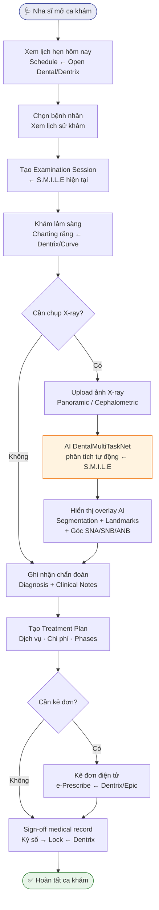

#### 2.4.2 Kê đơn điện tử (e-Prescribe Flow)

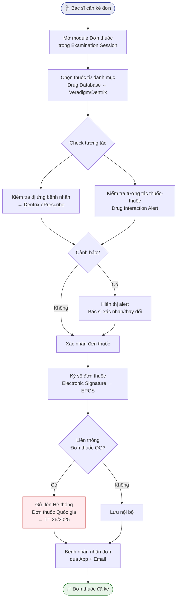

#### 2.4.3 Perio Charting (Nha chu)

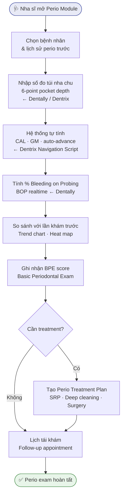

#### 2.4.4 Co-sign Workflow (Ký thay / Giám sát)

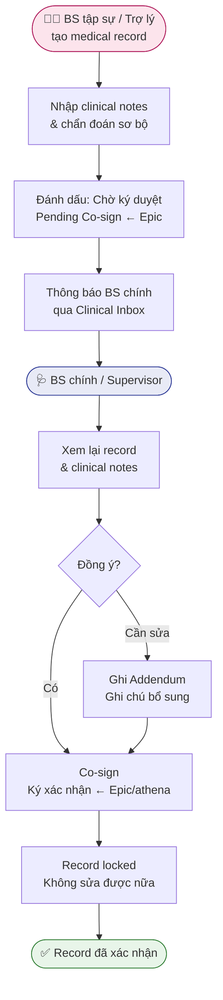

---

## 3. Role: RECEPTIONIST (Lễ tân / Tiếp đón)

### 3.1 Nghiệp vụ theo nền tảng

**Dental PMS quốc tế**
- **Open Dental:** Schedule, Patient Edit, Check-in/out, Billing, Payment, Reminder.
- **Dentrix:** Appointment Book, **Patient Engage** (reminders SMS/email/phone, two-way texting, online booking, virtual waiting room, form online), Ledger/QuickBill (billing statements, Dentrix Pay/Worldpay online payment, auto-post to ledger).
- **Curve Dental:** scheduling, Curve GRO (reminders, two-way texting, self-scheduling, Text-to-Pay), front-office streamlining.
- **Dentally:** Level 1 = reception: xem lịch, thêm/sửa lịch hẹn, thu tiền, xem chi tiết bệnh nhân.
- **tab32:** scheduling, **electronic eligibility (insurance verification)**, centralized billing/RCM, patient comms (two-way texting).

**E-health Việt Nam**
- **Medpro:** tiếp nhận, check-in bằng mã đặt lịch, hướng dẫn vào phòng khám, giảm nhân lực tiếp đón nhờ thanh toán trước + Kiosk.
- **IVIE:** bệnh nhân nhận SMS đặt lịch thành công → trình tiếp đón tại cơ sở.
- **iSofH HIS:** module Tiếp đón quản lý toàn bộ quy trình từ tiếp nhận → khám → thu phí.

**EHR / Booking quốc tế**
- **Epic (Prelude/Cadence):** registration (demographics, guarantor, coverage, duplicate check), **real-time insurance eligibility (RTE)**, Cadence scheduling (decision-tree, templates, blocks, waitlist), check-in/out (DAR), thu copay, Welcome kiosk.
- **athenahealth:** registration, **batch overnight eligibility** + RTE, scheduling, Check-in stage (form/consent, scan thẻ, thu copay, card-on-file), athenaCollector claim scrubbing.
- **Zocdoc:** automated intake, patient self-check-in, front-desk guide quản lý waitlist.
- **SimplePractice:** role **Scheduler** — xem lịch, contact info bệnh nhân, booking, reminders; **không thấy clinical notes** (phân quyền tách biệt).
- **Practo:** lễ tân/nhân viên đặt lịch, quản lý bệnh nhân.

### 3.2 Bảng so sánh tính năng (RECEPTIONIST)

| Nghiệp vụ | OpenD | Dentrix | Curve | Dentally | tab32 | Medpro | Epic | athena | Zocdoc | SMILE* |
|-----------|:---:|:---:|:---:|:---:|:---:|:---:|:---:|:---:|:---:|:---:|
| Lịch hẹn + check-in/out | ✅ | ✅ | ✅ | ✅ | ✅ | ✅ | ✅ | ✅ | ✅ | ✅ |
| Insurance eligibility | ⚠️ | ✅ | ❌ | ❌ | ✅ | ❌ | ✅ | ✅ | ❌ | ❌ |
| Reminders 2-way text | ✅ | ✅ | ✅ | ✅ | ✅ | ⚠️ | ✅ | ✅ | ✅ | ✅ |
| Thanh toán/ledger | ✅ | ✅ | ✅ | ✅ | ✅ | ✅ | ✅ | ✅ | ❌ | ✅ (VNPay) |
| Form online trước khám | ✅ | ✅ | ✅ | ✅ | ✅ | ⚠️ | ✅ | ✅ | ✅ | ⚠️ |
| Waitlist tự động | ❌ | ❌ | ❌ | ❌ | ❌ | ❌ | ✅ | ❌ | ✅ | ⚠️ |
| Kiosk check-in | ❌ | ✅ | ❌ | ❌ | ❌ | ✅ | ✅ | ⚠️ | ✅ | ❌ |
| Phân quyền tách clinical | ⚠️ | ⚠️ | ⚠️ | ✅ | ⚠️ | ❌ | ✅ | ✅ | ❌ | ⚠️ |

### 3.3 Đối chiếu với S.M.I.L.E & Gợi ý
- **Đã có:** patients CRUD, appointments, payment statuses, notifications (confirmation/reminder), clinic payment oversight (USER_FLOW Receptionist).
- **Nên bổ sung:**
  - **Insurance / bảo hiểm eligibility** (quan trọng nếu mở rộng thanh toán BHYT).
  - **Kiosk check-in** + QR code (Medpro/Đề án 06 rất phổ biến VN).
  - **Waitlist tự động** khi huỷ.
  - **Tách quyền rõ ràng:** receptionist KHÔNG truy cập clinical notes (SimplePractice Scheduler làm tốt).

### 3.4 Workflow Diagrams — RECEPTIONIST

#### 3.4.1 Check-in / Check-out bệnh nhân

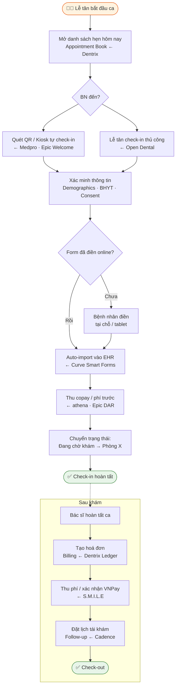

#### 3.4.2 Quản lý lịch hẹn & Waitlist

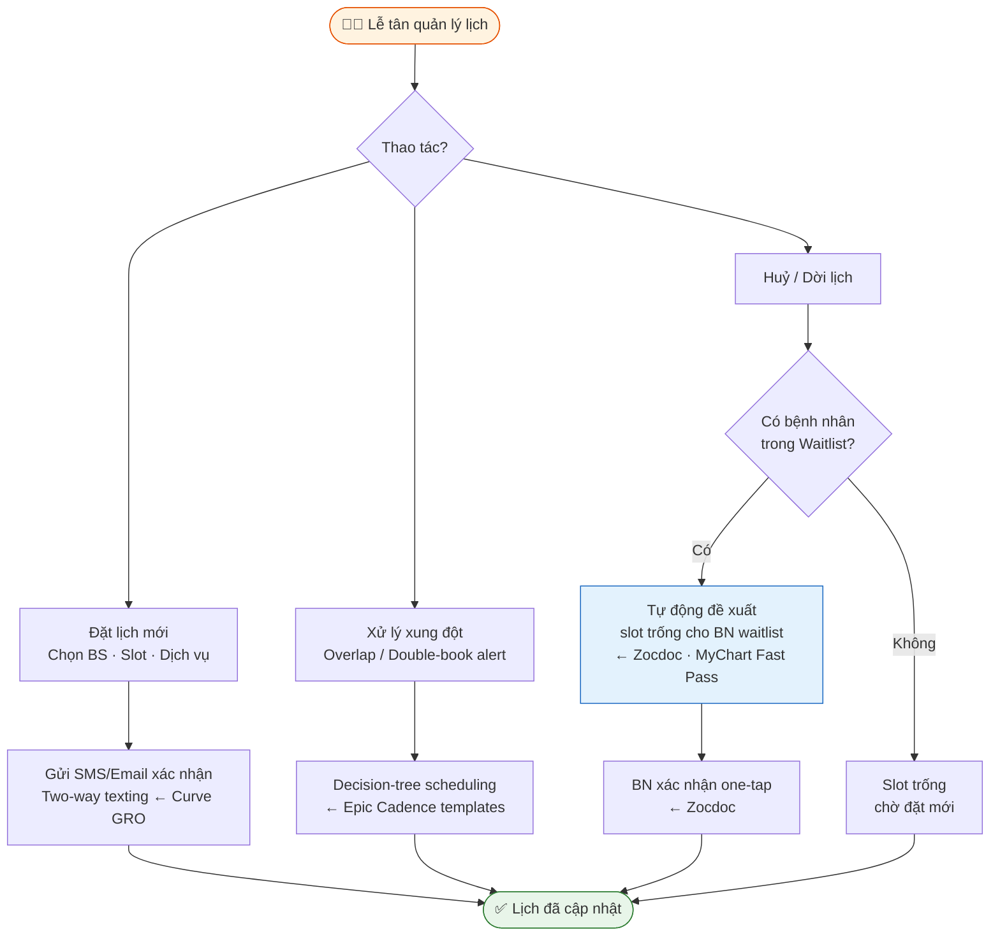

---

## 4. Role: NURSE (Điều dưỡng / Hygienist / Dental Assistant)

> ⚠️ Role `NURSE` hiện **chưa có `@Roles(NURSE)` ở backend S.M.I.L.E**. Benchmark dưới đây định hình nghiệp vụ nên gán cho role này.

### 4.1 Nghiệp vụ theo nền tảng

**Dental PMS quốc tế**
- **Dentrix:** Hygienist có user-rights template riêng (perio charting, charting, treatment room prep). Dental Assistant hỗ trợ chairside.
- **Dentally:** Level 2 (practitioner) bao gồm hygienist — truy cập chart, thêm treatment, treatment plan, estimates. Có **Perio Exam** riêng cho hygienist.
- **Open Dental:** Hygiene provider làm perio, prophy, charting.

**E-health Việt Nam**
- **iSofH HIS:** điều dưỡng nhận y lệnh, hỗ trợ khám, theo dõi; module có paramedical/nursing.
- Các app bệnh viện VN: điều dưỡng đo dấu hiệu sinh hiệu, chuẩn bị phòng, hướng dẫn bệnh nhân.

**EHR / Booking quốc tế**
- **Epic Rover (nurse/MA):** **BCMA** (quét vòng tay + mã thuốc, cảnh báo sai), nhập vitals, flowsheets, thu thập mẫu, clinical photos, secure chat, task lists (Brain).
- **athenahealth (Intake stage):** MA/nurse rooming, ghi vitals, chief complaint, cập nhật history/allergy/med list, **medication reconciliation**, "tee up" orders cho bác sĩ, triage qua Clinical Inbox.
- **SimplePractice:** không có nurse riêng (ambulatory behavioral health); MA đôi khi là Biller/Scheduler.

### 4.2 Bảng so sánh tính năng (NURSE / HYGIENIST)

| Nghiệp vụ | Dentrix (Hyg) | Dentally | Epic Rover | athena (MA) | iSofH | SMILE* |
|-----------|:---:|:---:|:---:|:---:|:---:|:---:|
| Perio / charting hỗ trợ | ✅ | ✅ | ❌ | ❌ | ❌ | ❌ |
| Vitals / rooming | ❌ | ❌ | ✅ | ✅ | ✅ | ❌ |
| Medication reconciliation | ❌ | ❌ | ✅ | ✅ | ⚠️ | ❌ |
| BCMA / an toàn thuốc | ❌ | ❌ | ✅ | ❌ | ⚠️ | ❌ |
| Chairside / lab prep | ✅ | ⚠️ | ❌ | ❌ | ⚠️ | ❌ |
| Task list / triage | ❌ | ❌ | ✅ | ✅ | ⚠️ | ❌ |
| Tách quyền khỏi provider | ✅ | ⚠️ | ✅ | ✅ | ⚠️ | ❌ |

### 4.3 Đối chiếu với S.M.I.L.E & Gợi ý
- **Chưa có** nghiệp vụ riêng cho NURSE. Gợi ý:
  - Định nghĩa `@Roles(NURSE)` và gán nghiệp vụ: **hỗ trợ phòng khám, chuẩn bị ca, nhập vitals/dấu hiệu sinh hiệu, medication reconciliation, chairside charting, theo dõi task**.
  - Với phòng khám nha: NURSE ≈ **Dental Assistant / Hygienist** → giao perio charting cơ bản, chuẩn bị dụng cụ, hướng dẫn bệnh nhân trước khám.
  - Có thể tái sử dụng `StaffDashboard({ staffRole: 'nurse' })` đã có ở frontend.

### 4.4 Workflow Diagrams — NURSE / HYGIENIST

#### 4.4.1 Rooming & Nhập Vitals (Pre-Exam Preparation)

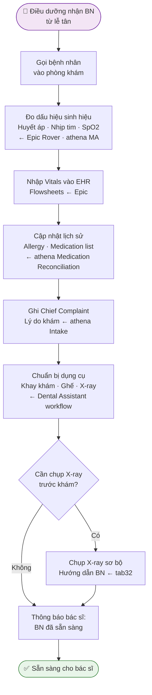

#### 4.4.2 Chairside & Hỗ trợ khám (Dental Assistant Flow)

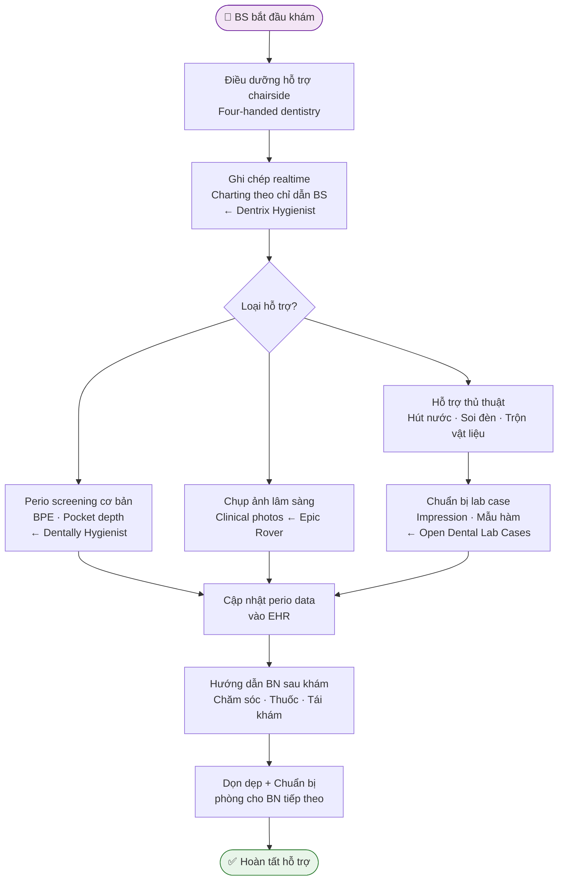

#### 4.4.3 Task Management & Triage (Quản lý công việc)

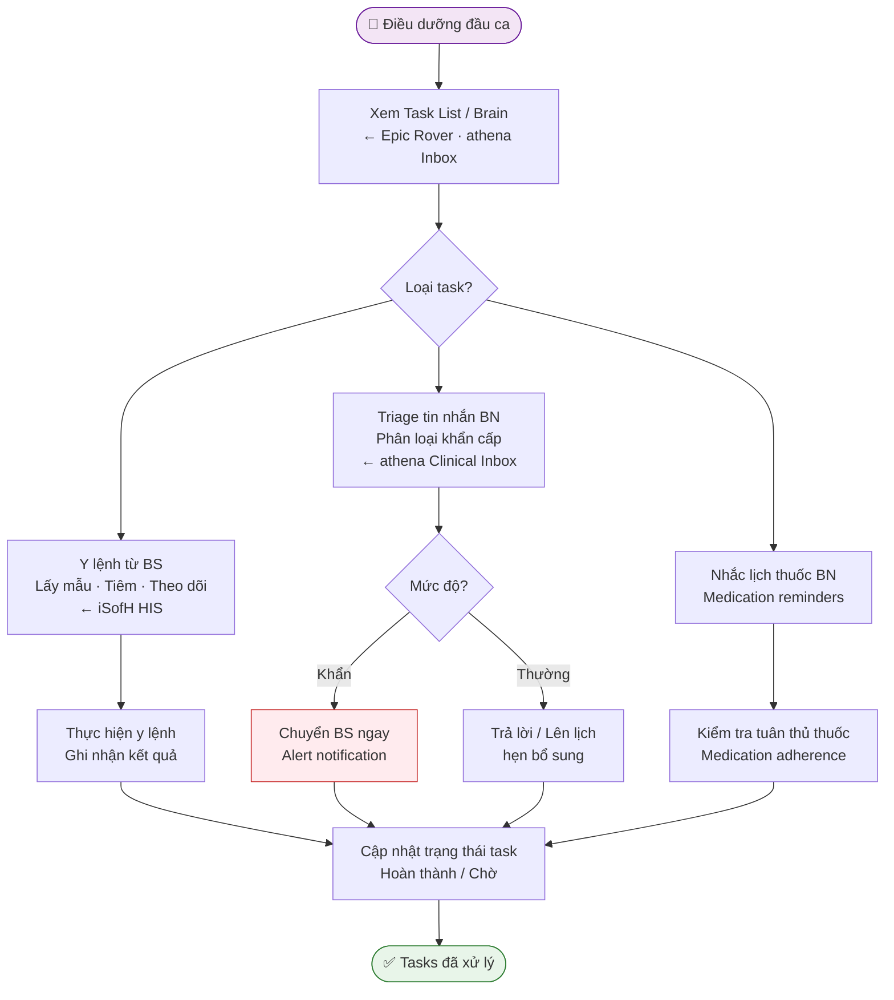

---

## 5. Role: ADMIN / CLINIC_ADMIN / SUPER_ADMIN (Quản trị / Quản lý phòng khám)

### 5.1 Nghiệp vụ theo nền tảng

**Dental PMS quốc tế**
- **Open Dental:** Security Groups (user groups, permissions), Reports, Fee Schedules, multi-location.
- **Dentrix:** **Office Manager** — Practice Setup > Passwords, User Rights templates (Hygienist/Front Desk/Office Manager/Owner/Associate), password admin, expiration; Audit Trail Report (track changes/deleted tx); Reports (production/collections).
- **Curve Dental:** roles/permissions (Assign Role, Define Custom Role), **hours of access** cho non-admin, multi-location/DSO, analytics dashboards.
- **Dentally:** Level 3 (Practice Manager) & Level 4 (Owner/Admin) — settings, NHS contracts, treatments/pricing, reports (NHS UDA/Claims), activity log giữ lại khi nhân viên nghỉ.
- **tab32:** DSO multi-location, centralized reporting/BI, user/permission, open data warehouse, audit.

**E-health Việt Nam**
- **iSofH HIS:** quản trị hệ thống, cấu hình quy trình, báo cáo tổng thể, quản lý thiết bị, tài chính/kế toán.
- **Medpro/YouMed:** admin quản lý cơ sở, bác sĩ, báo cáo.

**EHR / Booking quốc tế**
- **Epic:** Security Classes (security points + templates + sub-templates), **break-the-glass** cho restricted charts, EMP provisioning/deprovisioning, **immutable audit logs** (ai xem bệnh nhân nào, khi nào, thiết bị nào), Reporting Workbench, Radar/SlicerDicer analytics, cấu hình templates/order sets.
- **athenahealth:** role-based access (role = bundle permission), Practice Manager user admin (reset pw, unlock, enable/disable), Data View User Management, **admin page monitor PHR app access**, reports/Data View, multi-location.
- **SimplePractice:** Account Owner / Practice Manager / Clinician levels; **Account Activity log** (History + Sign In Events + **HIPAA Audit Log** xem ai mở tài liệu, IP/location), team roles (Scheduler/Biller/Supervisor), group practice.

### 5.2 Bảng so sánh tính năng (ADMIN)

| Nghiệp vụ | OpenD | Dentrix | Curve | Dentally | tab32 | Epic | athena | SimpleP | SMILE* |
|-----------|:---:|:---:|:---:|:---:|:---:|:---:|:---:|:---:|:---:|
| RBAC / user rights | ✅ | ✅ | ✅ | ✅ | ✅ | ✅ | ✅ | ✅ | ✅ |
| Custom roles | ✅ | ✅ | ✅ | ✅ | ✅ | ✅ | ✅ | ✅ | ⚠️ |
| Audit log (PHI access) | ✅ | ✅ | ⚠️ | ✅ | ✅ | ✅ | ✅ | ✅ | ✅ (audit-logs) |
| Break-the-glass | ❌ | ❌ | ❌ | ❌ | ❌ | ✅ | ❌ | ❌ | ❌ |
| Reporting / BI | ✅ | ✅ | ✅ | ✅ | ✅ | ✅ | ✅ | ✅ | ✅ (revenue/perf) |
| Multi-location | ✅ | ✅ | ✅ | ⚠️ | ✅ | ✅ | ✅ | ✅ | ⚠️ (clinics) |
| Fee schedule / pricing | ✅ | ✅ | ✅ | ✅ | ✅ | ✅ | ✅ | ✅ | ✅ |
| KYC / định danh | ❌ | ❌ | ❌ | ❌ | ❌ | ❌ | ❌ | ❌ | ✅ (kyc-mgmt) |

### 5.3 Đối chiếu với S.M.I.L.E & Gợi ý
- **Đã có:** users-management, roles-management, facility, performance, audit-logs, revenue-reports, kyc-management, refunds, clinics.
- **Nên bổ sung:**
  - **Break-the-glass emergency access** (Epic) — truy cập khẩn cấp có log + justification, phù hợp phòng khám đa khoa.
  - **Hours-of-access** theo vai trò (Curve) — giới hạn giờ làm việc non-admin.
  - **Audit log chi tiết quyền truy cập PHI** (ai xem record nào) thay vì chỉ action log.
  - **Multi-location / chuỗi phòng khám** quản lý tập trung (tab32 DSO model).

### 5.4 Workflow Diagrams — ADMIN

#### 5.4.1 Quản lý RBAC & Tài khoản nhân viên

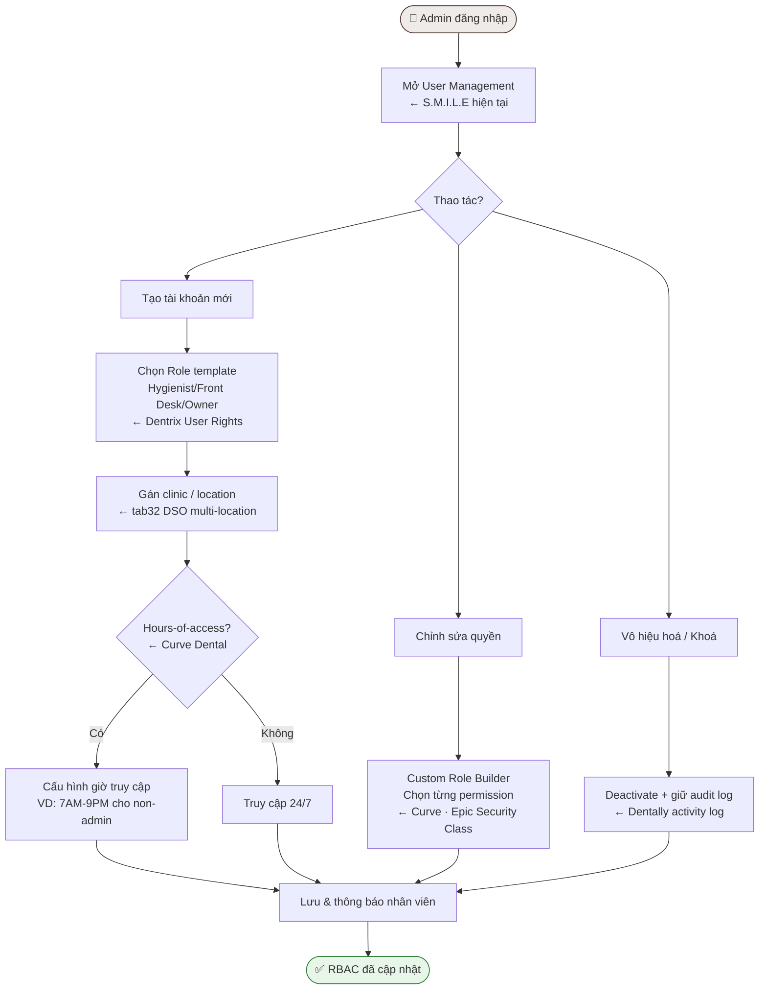

#### 5.4.2 Audit Log & Break-the-Glass

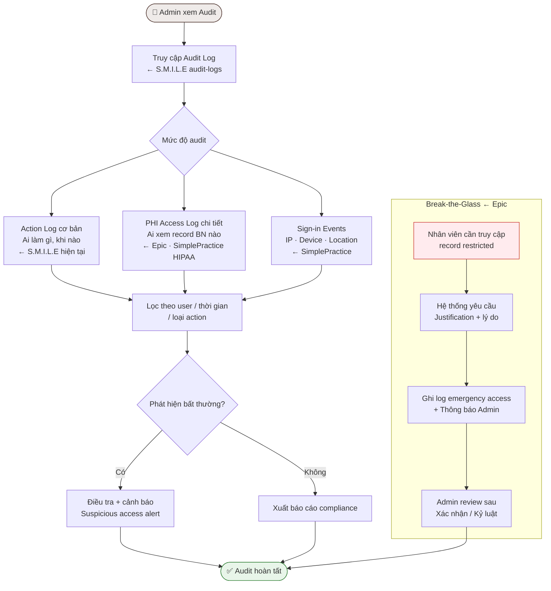

#### 5.4.3 Reporting & Business Intelligence

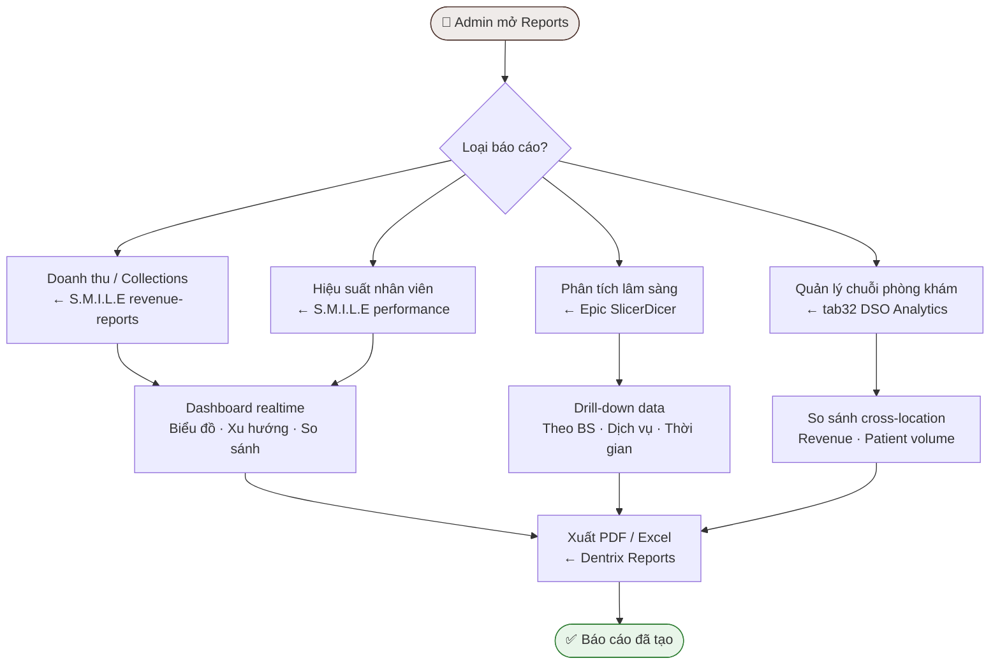

---

## 6. Luồng tích hợp liên vai trò (Cross-Role Patient Journey)

Dưới đây là sơ đồ phối hợp toàn diện giữa các vai trò (**Patient** ↔ **Receptionist** ↔ **Nurse** ↔ **Doctor/Dentist** ↔ **Admin**) trong suốt vòng đời một ca khám chữa bệnh nha khoa tiêu chuẩn:

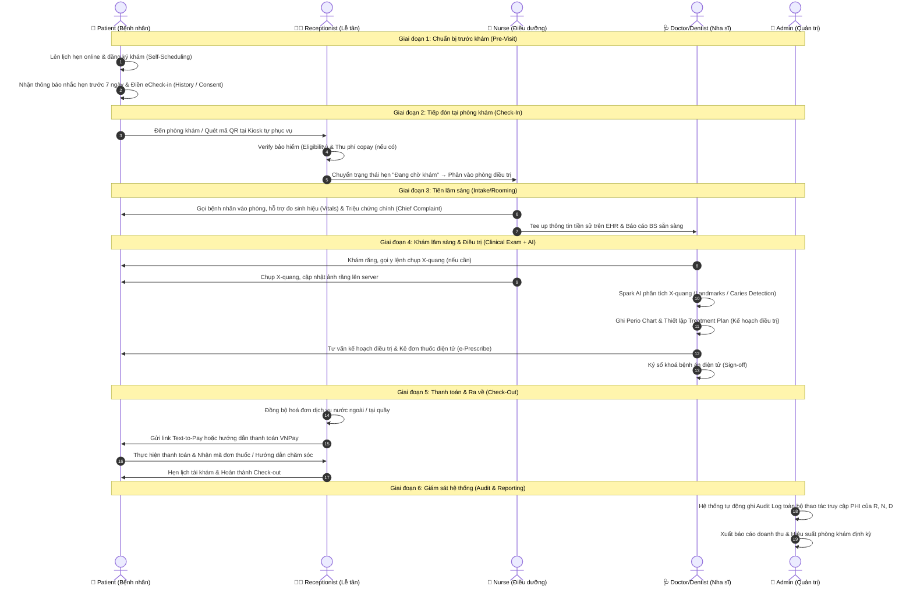

---

## 7. Bối cảnh quy định Việt Nam (ảnh hưởng thiết kế)

- **Thông tư 46/2018/TT-BYT:** Quy định hồ sơ bệnh án điện tử (cấu trúc, lưu trữ, ký số).
- **Thông tư 26/2025/TT-BYT** (ban hành 30/6/2025): Quy định đơn thuốc & kê đơn thuốc hóa dược, sinh phẩm ngoại trú. **Bắt buộc kê đơn điện tử:** bệnh viện từ 1/10/2025; toàn bộ cơ sở KCB từ **1/1/2026**. Bắt buộc có **số định danh cá nhân/CCCD/hộ chiếu**. Cơ sở ≥300 giường bắt buộc liên thông **Hệ thống Đơn thuốc Quốc gia**.
- **VNeID / Sổ sức khỏe điện tử:** định danh và liên thông hồ sơ sức khỏe cá nhân — S.M.I.L.E nên hỗ trợ KYC qua VNeID (đã có module `kyc-management`).
- **BHYT / thanh toán:** VNPay/MoMo phổ biến; cần tích hợp quyết toán BHYT nếu mở rộng.

> 💡 **Khuyến nghị ưu tiên cao:** e-Prescribe + liên thông Đơn thuốc Quốc gia (TT 26/2025) và KYC VNeID — cả hai đều có module nền tảng hoặc đang có sẵn ở S.M.I.L.E.

---

## 8. Tổng kết — Gap Analysis & Ưu tiên

| Nhóm tính năng | Mức độ ưu tiên | Nền tảng tham chiếu |
|----------------|---------------|---------------------|
| e-Prescribe + liên thông Đơn thuốc Quốc gia | 🔴 Cao (bắt buộc TT 26/2025) | Practo, Epic, athena, YouMed |
| KYC / định danh VNeID | 🔴 Cao | S.M.I.L.E đã có KYC module |
| Proxy / hồ sơ gia đình | 🟠 Trung bình | MyChart, IVIE, athena |
| Waitlist tự động (lịch sớm) | 🟠 Trung bình | Zocdoc, MyChart Fast Pass |
| Telehealth / tư vấn từ xa | 🟠 Trung bình | IVIE, Practo, Epic, athena |
| Perio charting (nha khoa) | 🟠 Trung bình | Dentally, Dentrix |
| Role NURSE + nghiệp vụ | 🟠 Trung bình | Epic Rover, athena MA, Dentally Hyg |
| eCheck-in / form trước khám | 🟡 Thấp–TB | Curve, Dentrix, Epic, athena |
| Kiosk check-in / QR | 🟡 Thấp–TB | Medpro, Epic |
| Break-the-glass | 🟡 Thấp–TB | Epic |
| Insurance eligibility (BHYT) | 🟡 Thấp–TB | Epic, athena, tab32 |
| Co-sign workflow | 🟡 Thấp–TB | Epic, athena, SimplePractice |
| Lab case management | 🟡 Thấp–TB | Open Dental, Dentrix, tab32 |

---

## 9. Nguồn tham khảo

**Dental PMS quốc tế**
- Open Dental Patient Portal: https://www.opendental.com/manual/portalpatientsees.html — https://www.opendental.com/manual/portalsettings.html — https://www.opendental.com/manual/treatmentplanmodule.html
- Dentrix Patient Engage: https://www.dentrix.com/products/eservices/patient-engage — ePrescribe: https://www.dentrix.com/products/eservices/eprescribe — Perio: https://www.dentrix.com/help/mergedProjects/Perio%20Chart/desktop/Using_Perio/Entering_perio_measurements.htm — Clinical Notes: https://www.dentrix.com/help/mergedProjects/Chart/desktop/Using_Notes/Adding_digital_signatures_to_clinical_notes.htm — User Rights: https://www.dentrix.com/help/mergedProjects/Office%20Manager/desktop/Practice_Setup/Password_Setup/Assigning_user_security_rights.htm — Ledger/QuickBill: https://www.dentrix.com/dental-solutions/dental-insurance-billing-and-collections/billing-and-payments-suite/
- Curve Dental: https://www.curvedental.com/dental-patient-engagement-software — https://www.curvedental.com/dental-scheduling-software — https://www.curvedental.com/online-dental-forms — https://www.curvedental.com/blog/dental-software-user-permissions
- Dentally Permissions: https://help.dentally.co/en/articles/3567068-permission-levels — Perio: https://help.dentally.com/en/articles/3565934-charting-a-perio-exam-periodontal-charting — NHS UDA: https://help.dentally.com/en/articles/4711703-understanding-your-nhs-uda-and-nhs-claim-reports
- tab32: https://www.tab32.com/ — https://tab32.com/platform/

**E-health Việt Nam**
- Medpro: https://medpro.vn/ — https://medpro.vn/tin-tuc/dat-lich-kham-lay-so-thu-tu-tren-medpro
- IVIE: https://ivie.vn/ — https://ivie.vn/dat-lich-kham-benh-chu-dong-tren-ung-dung-thong-minh-isofhcare-0
- iSofH / ISOFH HIS: https://isofh.com/san-pham-dich-vu/he-thong-quan-ly-thong-tin-benh-vien---hospital-in-20230612042944720.ivi

**EHR / Booking quốc tế**
- Epic / MyChart: https://www.mychart.org/Features — https://www.mychart.org/HappyTogether — https://epicsupport.sites.uiowa.edu/epic-resources/cadence-schedulingcheck-incheckout — https://www.mindbowser.com/epic-rover-guide/ — https://www.mindbowser.com/epic-in-basket-guide/ — https://www.accountablehq.com/post/epic-ehr-security-features-explained-access-controls-audit-logs-and-hipaa-compliance
- athenahealth: https://www.athenahealth.com/solutions/athenaone — https://www.athenahealth.com/solutions/patient-engagement/athenapatient-app — https://help.athenahealth.com/Ohelp/Content/Hospital/H_UG_User_Roles_and_Permissions_A.htm — https://www.athenahealth.com/resources/blog/5-ways-athenaone-makes-charting-easier
- Zocdoc: https://www.zocdoc.com/resources/blog/article/how-to-improve-patient-waitlist-management-and-fill-cancellations-faster/ — https://www.zocdoc.com/resources/blog/article/patient-self-scheduling/
- Practo: https://www.practo.com/ — https://www.practo.com/health-app
- SimplePractice: https://support.simplepractice.com/hc/en-us/articles/360033930231-Account-Activity-Tracking-changes-and-information-access-in-your-account — https://www.simplepractice.com/features/security/ — https://support.simplepractice.com/hc/en-us/articles/208631326-Staying-HIPAA-compliant-with-SimplePractice

**Quy định VN**
- TT 26/2025: https://datafiles.chinhphu.vn/cpp/files/vbpq/2025/7/26-byt.pdf
- Đơn thuốc điện tử bắt buộc: https://dantri.com.vn/suc-khoe/tu-ngay-110-tat-ca-cac-benh-vien-bat-buoc-ke-don-thuoc-dien-tu-20250705163506509.htm — https://youmed.vn/tin-tuc/ke-toa-dien-tu/
- HIPAA RBAC / Break-the-glass: https://hipaa.yale.edu/security/break-glass-procedure-granting-emergency-access-critical-ephi-systems — https://www.cmich.edu/docs/default-source/presidents-division/general-counsel/hipaa/hipaa-guidance-btg.pdf — https://www.ama-assn.org/practice-management/digital-health/are-break-glass-functions-required-employee-ehr-access
