# S.M.I.L.E — SRS diagrams

<!-- GENERATED — python3 scripts/diagrams/gen_mermaid.py -->

Rendered inline by GitHub. The PlantUML copies in this folder are the same
diagrams for the Word report; regenerate both with `make diagrams`.

## Entity relationship — overview

All 57 tables across the five service databases, primary keys only.
Solid links are enforced foreign keys; the cross-database ones are logical
references, since each service owns its own database.

```mermaid
erDiagram
  accounts ||--o{ oauth_connections : "account_id"
  accounts ||--o{ refresh_tokens : "account_id"
  accounts ||--o{ otp_tokens : "account_id"
  accounts ||--o{ users : "user_id"
  roles ||--o{ role_permissions : "role_id"
  permissions ||--o{ role_permissions : "permission_id"
  users ||--o{ user_roles : "user_id"
  roles ||--o{ user_roles : "role_id"
  users ||--o{ phone_verifications : "user_id"
  users ||--o{ kyc_verifications : "user_id"
  users ||--o{ kyc_verifications : "verified_by"
  users ||--o{ audit_logs : "user_id"
  users ||--o{ notification_preferences : "user_id"
  users ||--o{ notifications : "recipient_id"
  notification_templates ||--o{ notifications : "template_id"
  notifications ||--o{ notification_delivery_logs : "notification_id"
  users ||--o{ notification_push_subscriptions : "user_id"
  users ||--o{ patients : "user_id"
  patients ||--o{ patient_representatives : "patient_id"
  patients ||--o{ medical_history : "patient_id"
  patients ||--o{ medical_records : "patient_id"
  appointments ||--o{ medical_records : "appointment_id"
  clinics ||--o{ medical_records : "clinic_id"
  users ||--o{ medical_records : "doctor_id"
  medical_records ||--o{ medical_record_versions : "record_id"
  patients ||--o{ record_exports : "patient_id"
  medical_records ||--o{ record_exports : "record_id"
  appointments ||--o{ examination_sessions : "appointment_id"
  medical_records ||--o{ examination_sessions : "record_id"
  patients ||--o{ examination_sessions : "patient_id"
  users ||--o{ examination_sessions : "doctor_id"
  clinics ||--o{ examination_sessions : "clinic_id"
  examination_sessions ||--o{ examination_session_amendments : "session_id"
  medical_records ||--o{ examination_session_amendments : "record_id"
  patients ||--o{ examination_session_amendments : "patient_id"
  examination_sessions ||--o{ symptoms : "session_id"
  patients ||--o{ symptoms : "patient_id"
  examination_sessions ||--o{ diagnoses : "session_id"
  patients ||--o{ dental_charts : "patient_id"
  medical_records ||--o{ dental_charts : "record_id"
  patients ||--o{ dental_images : "patient_id"
  medical_records ||--o{ dental_images : "record_id"
  image_categories ||--o{ dental_images : "category_id"
  dental_images ||--o{ image_annotations : "image_id"
  dental_images ||--o{ pacs_sync_logs : "image_id"
  examination_sessions ||--o{ clinical_orders : "session_id"
  medical_records ||--o{ clinical_orders : "record_id"
  patients ||--o{ clinical_orders : "patient_id"
  clinical_orders ||--o{ lab_test_results : "order_id"
  examination_sessions ||--o{ treatment_plans : "session_id"
  patients ||--o{ treatment_plans : "patient_id"
  medical_records ||--o{ treatment_plans : "record_id"
  patient_representatives ||--o{ treatment_plans : "accepted_representative_id"
  medical_records ||--o{ treatment_history : "record_id"
  patients ||--o{ treatment_history : "patient_id"
  examination_sessions ||--o{ prescriptions : "session_id"
  medical_records ||--o{ prescriptions : "record_id"
  patients ||--o{ prescriptions : "patient_id"
  prescriptions ||--o{ prescription_items : "prescription_id"
  clinics ||--o{ treatment_rooms : "clinic_id"
  users ||--o{ doctor_specialties : "doctor_id"
  specialties ||--o{ doctor_specialties : "specialty_id"
  clinics ||--o{ clinic_specialties : "clinic_id"
  specialties ||--o{ clinic_specialties : "specialty_id"
  service_categories ||--o{ services : "category_id"
  specialties ||--o{ services : "specialty_id"
  clinics ||--o{ clinic_services : "clinic_id"
  services ||--o{ clinic_services : "service_id"
  users ||--o{ doctor_schedules : "doctor_id"
  clinics ||--o{ doctor_schedules : "clinic_id"
  work_shifts ||--o{ doctor_schedules : "shift_id"
  treatment_rooms ||--o{ doctor_schedules : "room_id"
  users ||--o{ doctor_leaves : "doctor_id"
  doctor_schedules ||--o{ schedule_changes : "schedule_id"
  patients ||--o{ appointments : "patient_id"
  users ||--o{ appointments : "doctor_id"
  clinics ||--o{ appointments : "clinic_id"
  treatment_rooms ||--o{ appointments : "room_id"
  services ||--o{ appointments : "service_id"
  appointments ||--o{ appointment_status_history : "appointment_id"
  appointments ||--o{ appointment_notification_logs : "appointment_id"
  appointments ||--o{ diagnostic_orders : "appointment_id"
  patients ||--o{ diagnostic_orders : "patient_id"
  users ||--o{ diagnostic_orders : "doctor_id"
  appointments ||--o{ payments : "appointment_id"
  users ||--o{ payments : "refund_requested_by"
  users ||--o{ payments : "refund_reviewed_by"
  accounts {
    uuid account_id PK
  }
  oauth_connections {
    uuid connection_id PK
  }
  refresh_tokens {
    uuid token_id PK
  }
  otp_tokens {
    uuid otp_id PK
  }
  users {
    uuid user_id PK
  }
  roles {
    uuid role_id PK
  }
  permissions {
    uuid permission_id PK
  }
  role_permissions {
    uuid id PK
  }
  user_roles {
    uuid id PK
  }
  phone_verifications {
    uuid verification_id PK
  }
  kyc_verifications {
    uuid kyc_id PK
  }
  audit_logs {
    uuid log_id PK
  }
  notification_templates {
    uuid template_id PK
  }
  notification_preferences {
    uuid preference_id PK
  }
  notifications {
    uuid notification_id PK
  }
  notification_delivery_logs {
    uuid log_id PK
  }
  notification_push_subscriptions {
    uuid subscription_id PK
  }
  patients {
    uuid patient_id PK
  }
  patient_representatives {
    uuid representative_id PK
  }
  medical_history {
    uuid history_id PK
  }
  medical_records {
    uuid record_id PK
  }
  medical_record_versions {
    uuid version_id PK
  }
  record_exports {
    uuid export_id PK
  }
  examination_sessions {
    uuid session_id PK
  }
  examination_session_amendments {
    uuid amendment_id PK
  }
  symptoms {
    uuid symptom_id PK
  }
  diagnoses {
    uuid diagnosis_id PK
  }
  dental_charts {
    uuid chart_id PK
  }
  image_categories {
    uuid category_id PK
  }
  dental_images {
    uuid image_id PK
  }
  image_annotations {
    uuid annotation_id PK
  }
  pacs_sync_logs {
    uuid sync_id PK
  }
  clinical_orders {
    uuid order_id PK
  }
  lab_test_results {
    uuid result_id PK
  }
  treatment_plans {
    uuid plan_id PK
  }
  treatment_history {
    uuid treatment_id PK
  }
  prescriptions {
    uuid prescription_id PK
  }
  prescription_items {
    uuid item_id PK
  }
  clinics {
    uuid clinic_id PK
  }
  treatment_rooms {
    uuid room_id PK
  }
  specialties {
    uuid specialty_id PK
  }
  doctor_specialties {
    uuid doctor_id PK
    uuid specialty_id PK
  }
  clinic_specialties {
    uuid clinic_id PK
    uuid specialty_id PK
  }
  work_shifts {
    uuid shift_id PK
  }
  service_categories {
    uuid category_id PK
  }
  services {
    uuid service_id PK
  }
  clinic_services {
    uuid clinic_service_id PK
  }
  doctor_schedules {
    uuid schedule_id PK
  }
  doctor_leaves {
    uuid leave_id PK
  }
  schedule_changes {
    uuid change_id PK
  }
  appointments {
    uuid appointment_id PK
  }
  appointment_status_history {
    uuid history_id PK
  }
  appointment_reminder_preferences {
    uuid preference_id PK
  }
  appointment_notification_logs {
    uuid log_id PK
  }
  diagnostic_orders {
    uuid order_id PK
  }
  idempotency_keys {
    varchar idempotency_key PK
  }
  payments {
    uuid payment_id PK
  }
```

## Entity relationship — Auth

`auth_service_db`

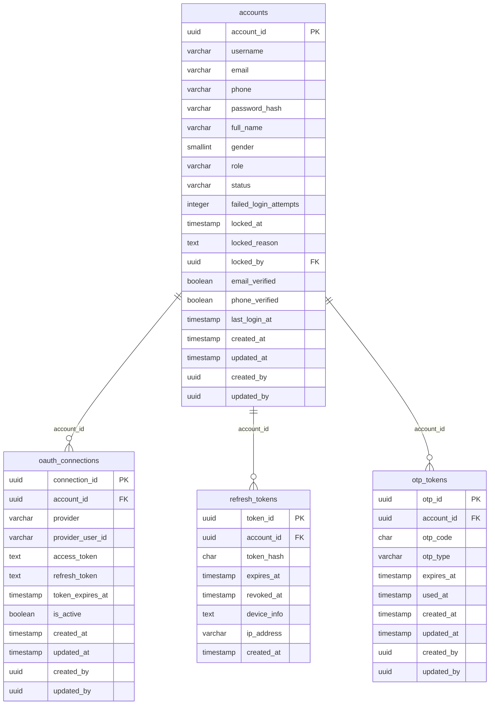

## Entity relationship — Account & Identity

`account_service_db`

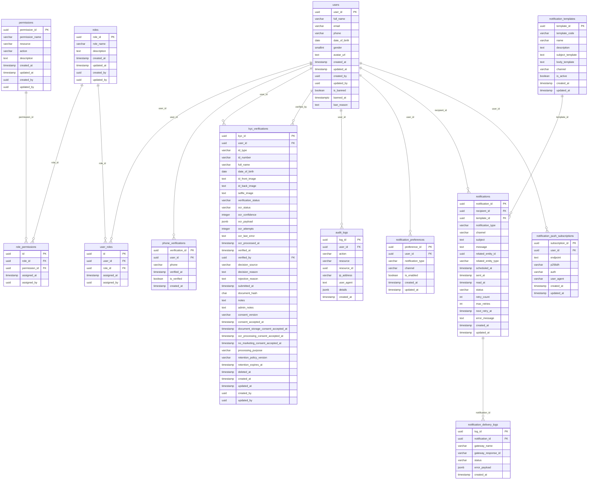

## Entity relationship — Medical Records

`core_medical_service_db`

```mermaid
erDiagram
  patients ||--o{ patient_representatives : "patient_id"
  patients ||--o{ medical_history : "patient_id"
  patients ||--o{ medical_records : "patient_id"
  medical_records ||--o{ medical_record_versions : "record_id"
  patients ||--o{ record_exports : "patient_id"
  medical_records ||--o{ record_exports : "record_id"
  medical_records ||--o{ examination_sessions : "record_id"
  patients ||--o{ examination_sessions : "patient_id"
  examination_sessions ||--o{ examination_session_amendments : "session_id"
  medical_records ||--o{ examination_session_amendments : "record_id"
  patients ||--o{ examination_session_amendments : "patient_id"
  examination_sessions ||--o{ symptoms : "session_id"
  patients ||--o{ symptoms : "patient_id"
  examination_sessions ||--o{ diagnoses : "session_id"
  patients ||--o{ dental_charts : "patient_id"
  medical_records ||--o{ dental_charts : "record_id"
  patients ||--o{ dental_images : "patient_id"
  medical_records ||--o{ dental_images : "record_id"
  image_categories ||--o{ dental_images : "category_id"
  dental_images ||--o{ image_annotations : "image_id"
  dental_images ||--o{ pacs_sync_logs : "image_id"
  examination_sessions ||--o{ clinical_orders : "session_id"
  medical_records ||--o{ clinical_orders : "record_id"
  patients ||--o{ clinical_orders : "patient_id"
  clinical_orders ||--o{ lab_test_results : "order_id"
  examination_sessions ||--o{ treatment_plans : "session_id"
  patients ||--o{ treatment_plans : "patient_id"
  medical_records ||--o{ treatment_plans : "record_id"
  patient_representatives ||--o{ treatment_plans : "accepted_representative_id"
  medical_records ||--o{ treatment_history : "record_id"
  patients ||--o{ treatment_history : "patient_id"
  examination_sessions ||--o{ prescriptions : "session_id"
  medical_records ||--o{ prescriptions : "record_id"
  patients ||--o{ prescriptions : "patient_id"
  prescriptions ||--o{ prescription_items : "prescription_id"
  patients {
    uuid patient_id PK
    uuid user_id FK
    varchar patient_code 
    varchar full_name 
    date date_of_birth 
    smallint gender 
    varchar phone 
    varchar email 
    text address 
    varchar ward 
    varchar district 
    varchar city 
    varchar emergency_contact 
    varchar emergency_phone 
    text allergies 
    text chronic_diseases 
    varchar insurance_number 
    varchar insurance_provider 
    timestamp created_at 
    timestamp updated_at 
  }
  patient_representatives {
    uuid representative_id PK
    uuid patient_id FK
    varchar full_name 
    varchar relationship 
    varchar phone 
    varchar email 
    varchar legal_document_type 
    varchar legal_document_number 
    boolean is_primary 
    boolean is_active 
    boolean authorized_for_treatment 
    boolean authorized_for_payment 
    boolean authorized_for_records 
    timestamp verified_at 
    uuid verified_by 
    timestamp created_at 
    timestamp updated_at 
  }
  medical_history {
    uuid history_id PK
    uuid patient_id FK
    varchar condition_name 
    varchar condition_type 
    date diagnosed_date 
    text treatment 
    text notes 
    timestamp created_at 
    timestamp updated_at 
  }
  medical_records {
    uuid record_id PK
    uuid patient_id FK
    uuid appointment_id FK
    uuid clinic_id FK
    uuid doctor_id FK
    date visit_date 
    text chief_complaint 
    text diagnosis 
    text treatment_plan 
    text notes 
    varchar record_status 
    varchar record_hash 
    timestamp finalized_at 
    uuid finalized_by 
    timestamp created_at 
    timestamp updated_at 
  }
  medical_record_versions {
    uuid version_id PK
    uuid record_id FK
    integer version_number 
    jsonb snapshot 
    uuid changed_by 
    text change_reason 
    timestamp created_at 
  }
  record_exports {
    uuid export_id PK
    uuid patient_id FK
    uuid record_id FK
    varchar export_type 
    varchar export_format 
    text file_url 
    uuid exported_by 
    timestamp expires_at 
    timestamp created_at 
  }
  examination_sessions {
    uuid session_id PK
    uuid appointment_id FK
    uuid record_id FK
    uuid patient_id FK
    uuid doctor_id FK
    uuid clinic_id FK
    timestamp session_date 
    text chief_complaint 
    text present_illness 
    text physical_examination 
    jsonb vital_signs 
    varchar status 
    timestamp started_at 
    timestamp completed_at 
    timestamp signed_at 
    uuid signed_by 
    timestamp created_at 
  }
  examination_session_amendments {
    uuid amendment_id PK
    uuid session_id FK
    uuid record_id FK
    uuid patient_id FK
    uuid doctor_id 
    text amendment_reason 
    text amendment_text 
    uuid amended_by 
    timestamp created_at 
  }
  symptoms {
    uuid symptom_id PK
    uuid session_id FK
    uuid patient_id FK
    varchar symptom_name 
    varchar body_location 
    varchar severity 
    date onset_date 
    varchar duration 
    text description 
    uuid recorded_by 
    timestamp created_at 
    timestamp updated_at 
  }
  diagnoses {
    uuid diagnosis_id PK
    uuid session_id FK
    varchar icd_code 
    varchar diagnosis_name 
    varchar diagnosis_type 
    varchar severity 
    text notes 
    timestamp created_at 
  }
  dental_charts {
    uuid chart_id PK
    uuid patient_id FK
    uuid record_id FK
    integer tooth_number 
    varchar tooth_status 
    jsonb surfaces 
    text notes 
    timestamp created_at 
    timestamp updated_at 
  }
  image_categories {
    uuid category_id PK
    varchar category_name 
    text description 
    timestamp created_at 
    timestamp updated_at 
  }
  dental_images {
    uuid image_id PK
    uuid patient_id FK
    uuid record_id FK
    uuid category_id FK
    varchar image_type 
    text image_url 
    text thumbnail_url 
    integer file_size_kb 
    varchar file_format 
    integer tooth_numbers 
    varchar view_angle 
    text description 
    text tags 
    jsonb metadata 
    varchar pacs_id 
    date taken_date 
    uuid taken_by 
    uuid uploaded_by 
    boolean is_archived 
    timestamp created_at 
    timestamp updated_at 
  }
  image_annotations {
    uuid annotation_id PK
    uuid image_id FK
    uuid annotated_by 
    varchar annotation_type 
    jsonb annotation_data 
    text note 
    timestamp created_at 
    timestamp updated_at 
  }
  pacs_sync_logs {
    uuid sync_id PK
    uuid image_id FK
    varchar sync_type 
    varchar pacs_server 
    varchar status 
    text error_message 
    timestamp synced_at 
    timestamp created_at 
    timestamp updated_at 
  }
  clinical_orders {
    uuid order_id PK
    uuid session_id FK
    uuid record_id FK
    uuid patient_id FK
    uuid ordered_by 
    varchar order_type 
    varchar test_type 
    text clinical_indication 
    integer teeth_numbers 
    varchar urgency 
    varchar status 
    timestamp ordered_date 
    timestamp scheduled_date 
    timestamp completed_date 
    text result_url 
    text report 
    timestamp created_at 
    timestamp updated_at 
  }
  lab_test_results {
    uuid result_id PK
    uuid order_id FK
    varchar test_name 
    text result_value 
    varchar result_unit 
    varchar reference_range 
    boolean is_abnormal 
    text notes 
    timestamp created_at 
  }
  treatment_plans {
    uuid plan_id PK
    uuid session_id FK
    uuid patient_id FK
    uuid record_id FK
    varchar plan_name 
    text objectives 
    integer duration_weeks 
    varchar status 
    numeric estimated_cost 
    char quote_currency 
    timestamp sent_at 
    uuid sent_to 
    varchar sent_via 
    timestamp confirmed_at 
    timestamp proposed_at 
    timestamp accepted_at 
    uuid accepted_by 
    timestamp declined_at 
    uuid declined_by 
    text decline_reason 
    uuid created_by 
    timestamp created_at 
    timestamp updated_at 
    varchar quote_version 
    text risk_disclosure 
    text alternative_options 
    varchar acceptance_scope 
    text accepted_scope_note 
    uuid accepted_representative_id FK
    varchar accepted_representative_name 
    varchar accepted_representative_relationship 
    varchar accepted_representative_phone 
  }
  treatment_history {
    uuid treatment_id PK
    uuid record_id FK
    uuid patient_id FK
    date treatment_date 
    integer tooth_numbers 
    varchar procedure_code 
    varchar procedure_name 
    text description 
    numeric cost 
    varchar status 
    uuid performed_by 
    timestamp created_at 
    timestamp updated_at 
  }
  prescriptions {
    uuid prescription_id PK
    uuid session_id FK
    uuid record_id FK
    uuid patient_id FK
    uuid doctor_id 
    date prescription_date 
    varchar status 
    text notes 
    timestamp issued_at 
    uuid issued_by 
    timestamp cancelled_at 
    text cancellation_reason 
    timestamp created_at 
    timestamp updated_at 
    boolean minor_patient_at_issue 
    integer patient_age_years_at_issue 
    integer patient_age_months_at_issue 
    varchar representative_name_snapshot 
    varchar representative_phone_snapshot 
    uuid representative_id_snapshot 
    varchar representative_relationship_snapshot 
  }
  prescription_items {
    uuid item_id PK
    uuid prescription_id FK
    varchar medication_name 
    varchar medication_code 
    varchar dosage 
    varchar route 
    varchar frequency 
    integer duration_days 
    integer quantity 
    text instructions 
    timestamp created_at 
  }
```

## Entity relationship — Clinic & Appointments

`core_clinic_service_db`

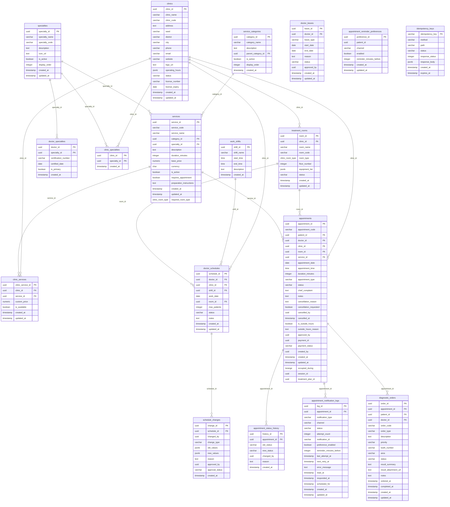

## Entity relationship — Payment

`payment_service_db`

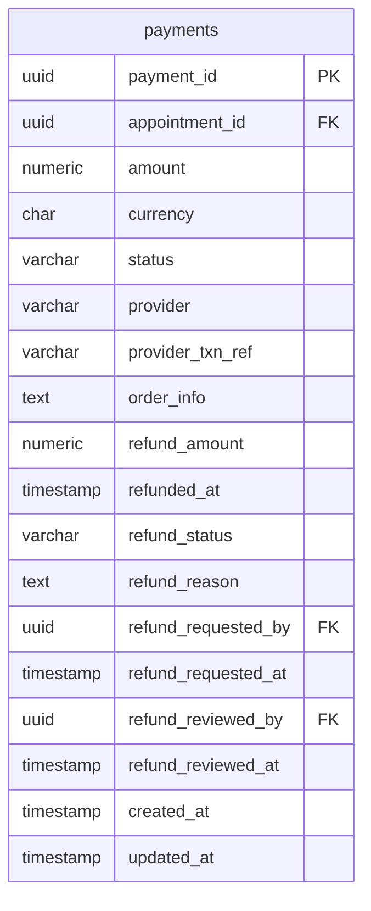

## Screen flow — Guest

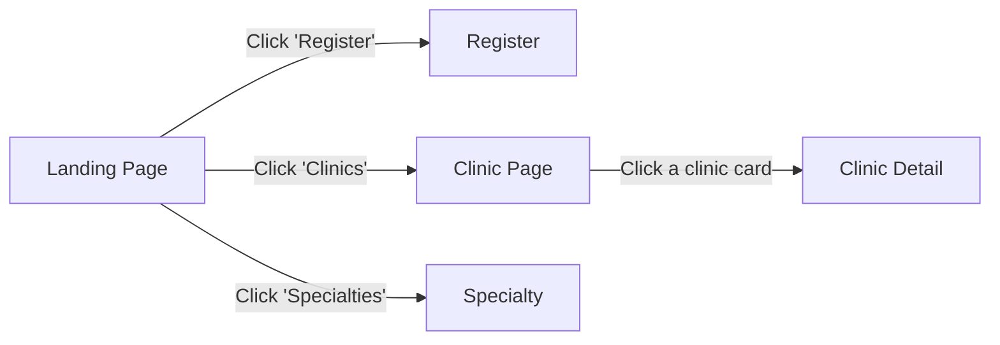

## Screen flow — Patient

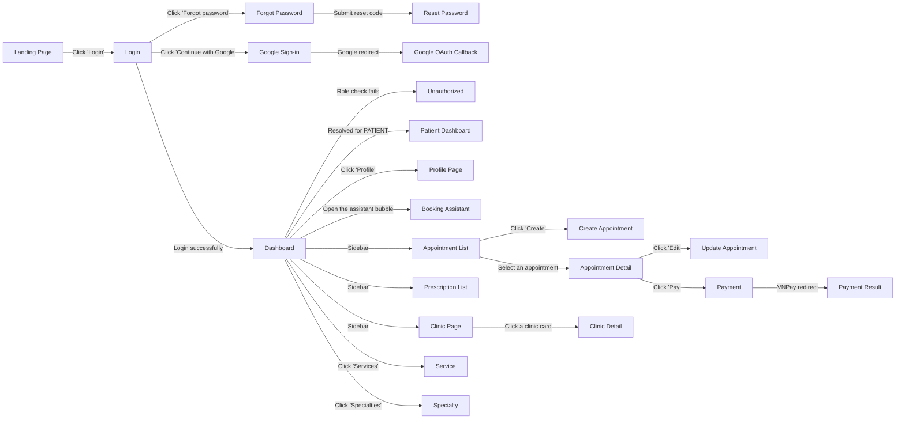

## Screen flow — Doctor

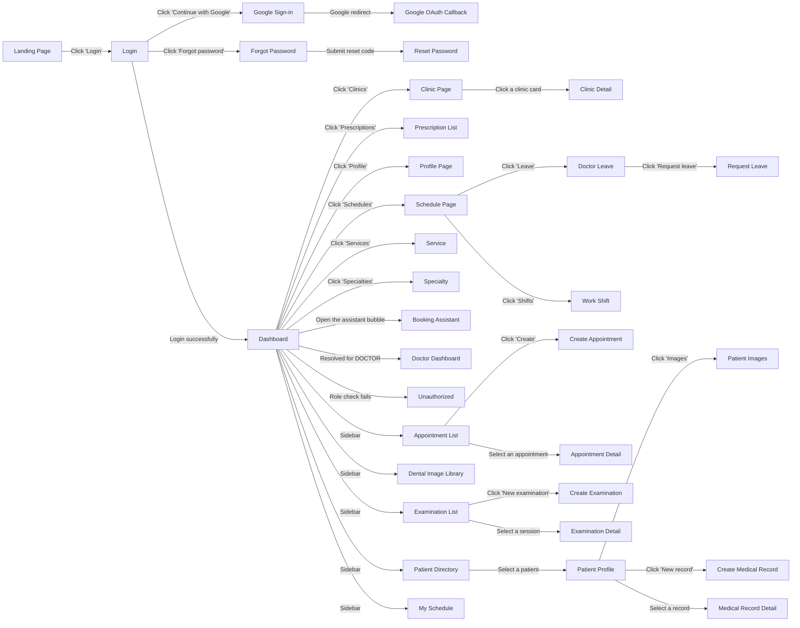

## Screen flow — Nurse

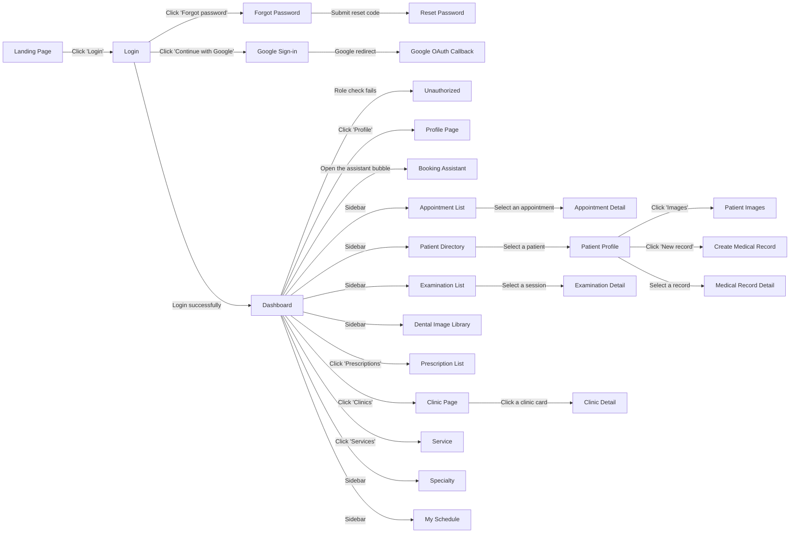

## Screen flow — Receptionist

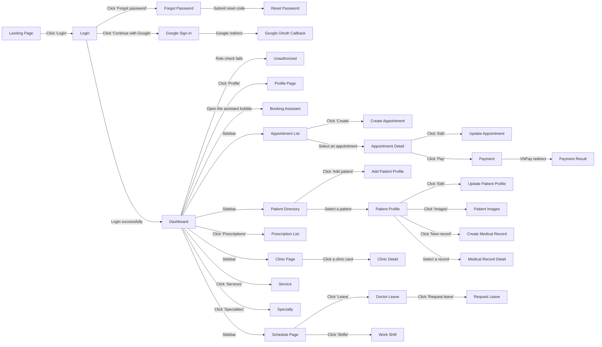

## Screen flow — Clinic Manager

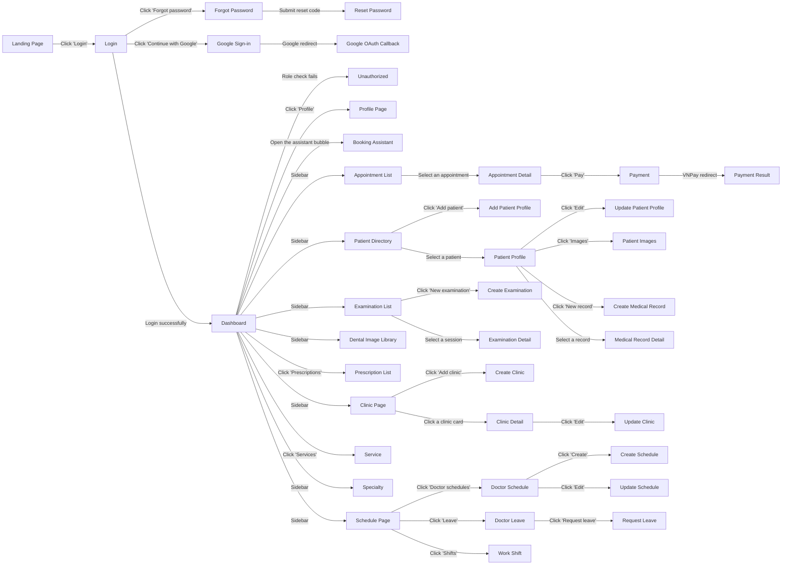

## Screen flow — Admin

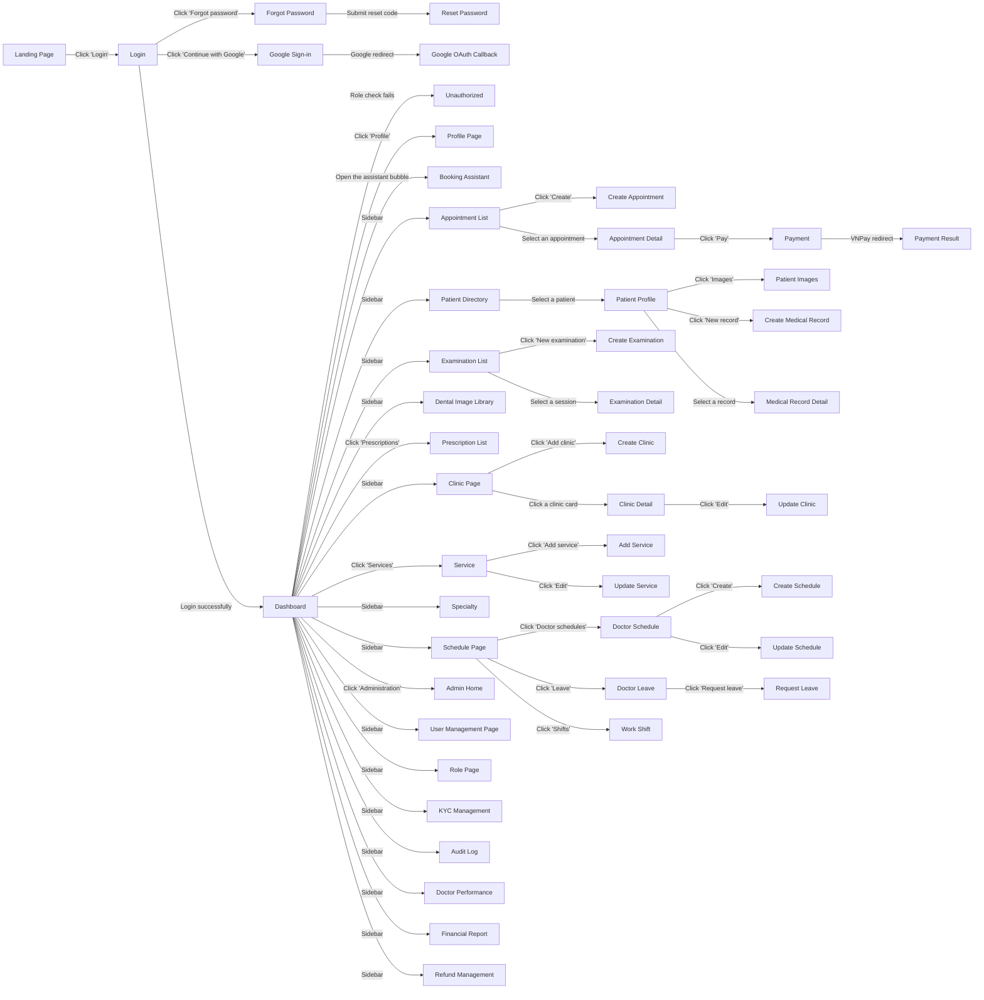
