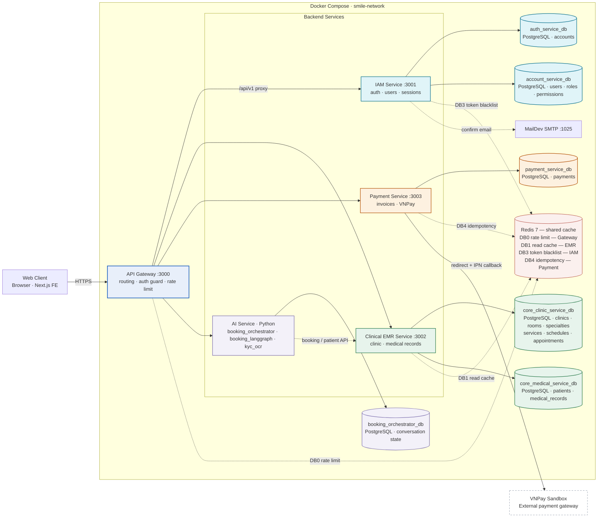

# S.M.I.L.E — Overall Architecture (Microservices)

> Software Design Document · Mục 2.1 — sơ đồ khớp với `docker-compose.yml` và script init database thực tế.

## Service nào sử dụng database nào

| Service | Database sở hữu | Nội dung (tables) | Redis logical DB |
|---|---|---|---|
| **API Gateway** :3000 | *(không có DB)* | — | DB0 — distributed rate limit |
| **IAM Service** :3001 | `auth_service_db` | accounts (login) | DB3 — access-token blacklist (logout) |
| | `account_service_db` | users, roles, permissions, user_roles, role_permissions | |
| **Clinical EMR Service** :3002 | `core_clinic_service_db` | clinics, rooms, specialties, services, schedules, appointments | DB1 — master-data read cache (TTL 300s) |
| | `core_medical_service_db` | patients, medical_records | |
| **Payment Service** :3003 | `payment_service_db` | payments | DB4 — idempotency + callback replay guard |
| **AI Service** (booking_orchestrator) | `booking_orchestrator_db` | conversation / booking state | — |

Nguyên tắc: **database-per-service** — mỗi database vẽ thành một node riêng, mũi tên chỉ thẳng từ service sở hữu vào từng DB; không service nào đọc chéo DB của service khác. (Về hạ tầng, cả 6 DB chạy chung 1 instance PostgreSQL 16 `smile-postgres` :5432.) Redis là **1 instance dùng chung**, tách biệt bằng logical DB (0/1/3/4).

## Diagram

Màu sắc = ranh giới ownership: service và database cùng màu.

## Quy ước

| Ký hiệu | Ý nghĩa |
|---|---|
| Mũi tên liền `-->` | Gọi đồng bộ (REST / SQL) |
| Mũi tên đứt `-.->` | Cache / side-channel (Redis, SMTP) |
| Cùng màu | Service và database thuộc cùng một ownership boundary |
| Khung `docker` | Ranh giới Docker Compose, network `smile-network` |
| Node viền đứt | Hệ thống bên ngoài (VNPay) |

## Điểm khác so với hình cũ (đã sửa)

1. **Redis không nằm trên đường ghi dữ liệu.** Hình cũ vẽ chuỗi Service → Redis → PostgresDB; thực tế Redis chỉ là cache dùng chung bên cạnh, mỗi service dùng một logical DB riêng. Đường ghi chính là Service → PostgreSQL trực tiếp.
2. **Database-per-service, 6 database tách biệt — mỗi DB một node riêng, mũi tên riêng từ service sở hữu.** Không dùng chung một PostgresDB: IAM sở hữu 2 DB (`auth_service_db`, `account_service_db`), Clinical EMR sở hữu 2 DB (`core_clinic_service_db`, `core_medical_service_db`), Payment và AI orchestrator mỗi bên 1 DB.
3. **Bổ sung external systems.** VNPay Sandbox (redirect + IPN callback từ Payment Service) và MailDev SMTP (IAM gửi confirm email).
4. **AI Service không cô lập.** Nhóm AI gọi Clinical EMR qua REST booking/patient API và có database riêng.
5. **Gateway là entry point duy nhất.** Client chỉ đi qua Gateway :3000; các service :3001–:3003 chỉ giao tiếp nội bộ trong `smile-network`.

## File liên quan

- Nguồn Mermaid thuần: [`microservice-architecture.mmd`](./microservice-architecture.mmd) — mở bằng [mermaid.live](https://mermaid.live), draw.io (Arrange → Insert → Advanced → Mermaid), hoặc VS Code extension *Markdown Preview Mermaid Support*.
- Cấu hình hạ tầng: [`docker-compose.yml`](../../docker-compose.yml)
- Export PNG: `npx -p @mermaid-js/mermaid-cli mmdc -i docs/diagrams/microservice-architecture.mmd -o architecture.png -s 3`
