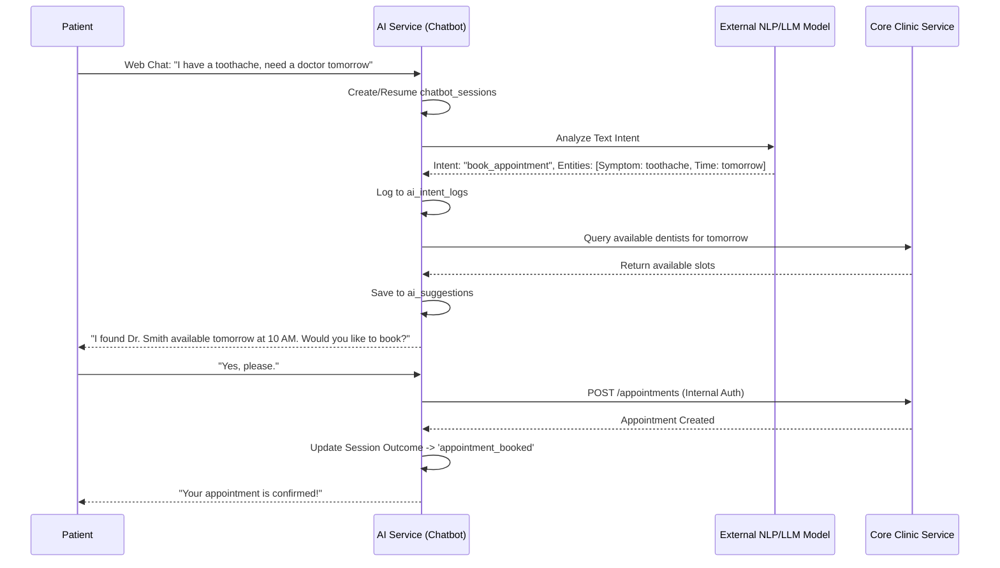
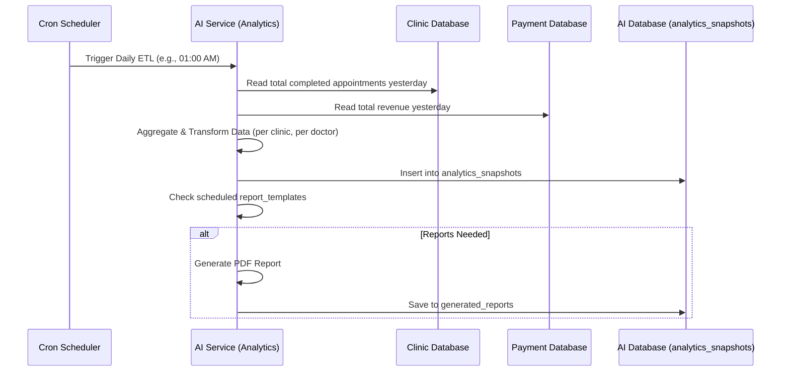

# AI & Analytics Service (ai-service)

## 1. Introduction
The AI & Analytics Service is an intelligence layer augmenting the S.M.I.L.E platform. It features an NLP-driven chatbot for automated patient interactions (scheduling, health inquiries) and a robust data analytics engine that aggregates multi-dimensional health and business metrics into dashboards.

## 2. Structure and Database Design
Core Database: `ai_service_db`
- **chatbot_sessions, chatbot_messages**: Records conversational flows, tracking user intent and resolving outcomes (e.g., whether the chat resulted in a booked appointment).
- **ai_intent_logs, ai_suggestions**: Logs NLP model extraction confidence, entities (like "Toothache", "Tomorrow at 9AM"), and tracks the conversion rate of AI suggestions.
- **analytics_snapshots**: Optimized, pre-aggregated OLAP-style table storing dimensions (Clinic, Specialty, Doctor) and metrics (Revenue, Utilization, Satisfaction) for fast dashboard rendering.
- **report_templates, generated_reports**: Handles scheduled background jobs for generating PDF/Excel reports to clinic administrators.

## 3. Modules
- **chatbot**: Manages the Webhook integrating with external dialogue platforms (e.g., Dialogflow, Rasa, or proprietary LLMs) and maintains conversation state.
- **analytics**: Aggregates data from `core_clinic_service_db` and `payment_service_db` via asynchronous events or ETL processes to generate `analytics_snapshots`.
- **reporting**: Contains CRON job definitions and PDF generation libraries to export analytics into accessible documents.

## 4. Workflows

### 4.1. AI Chatbot Appointment Booking

### 4.2. Nightly Analytics Aggregation

