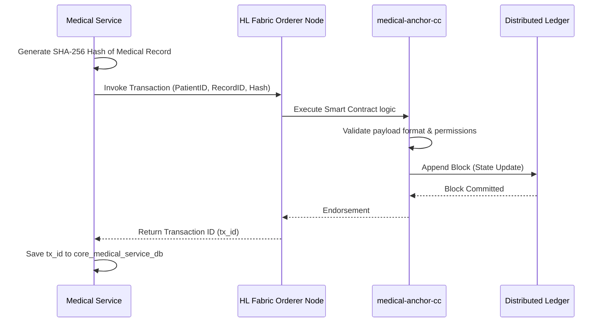
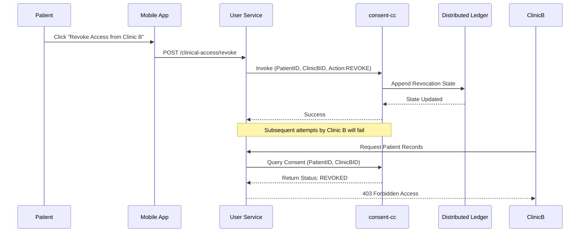

# Blockchain Network (blockchain)

## 1. Introduction
The Blockchain Network acts as the ultimate truth layer for the S.M.I.L.E platform. Leveraging **Hyperledger Fabric**, it ensures data immutability, patient consent enforcement, and secure forensic auditing. It is not used as a primary database but rather as a decentralized ledger anchoring cryptographic proofs (Hashes).

## 2. Structure and Chaincodes
The Blockchain layer is structured around distinct Smart Contracts (`chaincode`):
1. **`medical-anchor-cc`**: The primary contract. It receives a SHA-256 hash of a finalized Medical Record or an eKYC profile and stores it against a patient's UUID with a timestamp. This guarantees the record hasn't been tampered with post-creation.
2. **`consent-cc`**: Manages data-sharing agreements. If Patient A gives Clinic B permission to view their historic records, this contract records the Consent Token.
3. **`access-control-cc`**: Defines rules for retrieving data. Tied closely with `user-service` RBAC, ensuring only cryptographically authorized identities can fetch decrypt keys.
4. **`key-mgmt-cc`**: Handles the storage and rotation of public keys used by doctors for Digital Signatures and payload encryption.
5. **`data-lineage-cc`**: Tracks the provenance of data. If a record is shared or amended, intermediate hashes are logged here to construct a full lifecycle graph.
6. **`deletion-cc`**: Implements "Right to be Forgotten". It soft-deletes or anonymizes references in the ledger to comply with GDPR/HIPAA without breaking immutability rules.
7. **`cross-chain-cc`**: A bridge contract designed to interoperate with external nationwide healthcare blockchains.

## 3. Workflows

### 3.1. EMR Anchoring Workflow

### 3.2. Patient Consent Revocation Workflow

