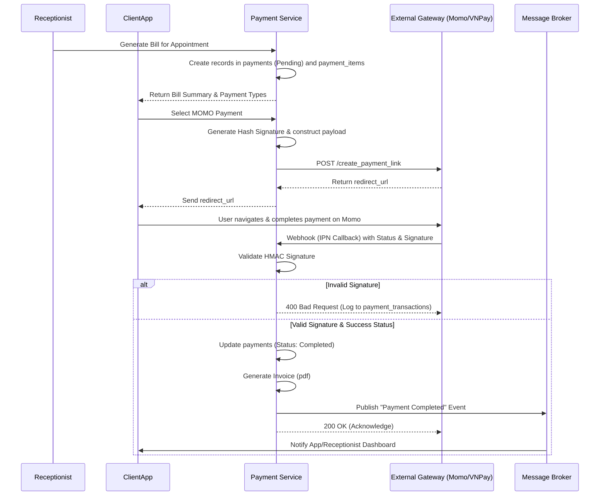

# Payment Service (payment-service)

## 1. Introduction
The Payment Service manages the comprehensive financial billing and payment procedures for S.M.I.L.E. From an initial appointment deposit to post-examination clinical and pharmacy billing. This service exposes integrated webhooks for popular Vietnamese payment gateways such as Momo and VNPay.

## 2. Structure and Database Design
Core Database: `payment_service_db`
- **payment_methods**: Defines accepted methods (CASH, MOMO, VNPAY, CREDIT_CARD).
- **payments, payment_items**: Manages the medical shopping cart. A cart can contain multiple line items (consultation fee, medications, lab tests). An `idempotency_key` is strictly enforced to prevent double-charging the patient.
- **invoices**: The finalized, formal billing record containing tax (VAT) calculations.
- **payment_transactions**: Detailed historical logging of gateway outbound requests, and inbound webhook callbacks (Success/Fail/Signature Invalid).
- **refunds**: Manages reconciliation and fund returns for patients who cancel services.

## 3. Modules
The source code is functionally centralized around financial operations:
- **payments**: A massive module governing CRUD operations for invoices and generating payment links.
  - Integrates IPN/Webhook validation (verifying HMAC signatures from VNPay/Momo to thwart spoofed requests).
  - Encapsulates SDK logic for each payment gateway (handling secrets, partner codes, environment configs).
- **home / utils / config**: Global configurations, currency formatting helpers (VND/USD string manipulation), and retry mechanisms for network-choked gateway calls.

## 4. Workflows

### 4.1. Online Payment via Momo/VNPay

