# S.M.I.L.E — Luồng Nghiệp Vụ Theo Vai Trò

> **Smart Medical Intelligent Ledger for E-health** — Hệ thống quản lý phòng khám nha khoa/Răng Hàm Mặt tại Việt Nam.
>
> - **Cập nhật:** 01/07/2026 (tổng hợp từ tài liệu luồng gốc, review role Doctor 30/06/2026 và bản chuẩn hóa 01/07/2026)
> - **Mục đích:** xác định luồng nghiệp vụ đúng chuẩn theo từng vai trò, căn cứ pháp lý, đối chiếu hiện trạng code và roadmap triển khai.
> - ⚠️ Tài liệu phân tích nghiệp vụ/kỹ thuật nội bộ, **không thay thế tư vấn pháp lý chính thức**.

## Mục lục

- [Phần A — Tổng quan](#phần-a--tổng-quan)
- [Phần B — Luồng theo vai trò](#phần-b--luồng-theo-vai-trò)
  - [B1. Patient — Bệnh nhân](#b1-patient--bệnh-nhân)
  - [B2. Receptionist — Lễ tân](#b2-receptionist--lễ-tân)
  - [B3. Nurse — Y tá / Phụ tá nha khoa](#b3-nurse--y-tá--phụ-tá-nha-khoa)
  - [B4. Doctor — Bác sĩ / Nha sĩ](#b4-doctor--bác-sĩ--nha-sĩ)
  - [B5. Admin — Quản trị](#b5-admin--quản-trị)
- [Phần C — Tương tác liên vai trò](#phần-c--tương-tác-liên-vai-trò)
- [Phần D — Căn cứ pháp lý & benchmark](#phần-d--căn-cứ-pháp-lý--benchmark)
- [Phần E — Use case toàn hệ thống](#phần-e--use-case-toàn-hệ-thống)
- [Phần F — Hiện trạng code & gap](#phần-f--hiện-trạng-code--gap)
- [Phần G — Data model & API đề xuất](#phần-g--data-model--api-đề-xuất)
- [Phần H — Roadmap triển khai](#phần-h--roadmap-triển-khai)
- [Phần I — Checklist review nghiệp vụ](#phần-i--checklist-review-nghiệp-vụ)

---

# Phần A — Tổng quan

## A1. Mục tiêu dự án

Số hóa toàn bộ quy trình vận hành phòng khám nha khoa: từ đăng ký tài khoản, đặt lịch khám, tiếp đón, khám bệnh, chẩn đoán, điều trị, đến thanh toán, tái khám và lưu trữ hồ sơ bệnh án điện tử (EMR) có kiểm soát/audit.

## A2. Quyết định phạm vi hiện tại

| Hạng mục | Quyết định |
|---|---|
| **Core flow P0/P1** | Đặt lịch, nhắc lịch, tiếp đón, check-in, khám, hồ sơ bệnh án, kế hoạch điều trị, kê đơn, thanh toán, tái khám, audit. |
| **KYC/CCCD** | ⏸️ **Tạm ngưng khỏi core flow.** Không dùng KYC làm cổng bắt buộc để đặt lịch/check-in/khám thường. Chỉ dùng cho các role làm việc (Doctor, Receptionist…) để xác minh giấy tờ, bằng cấp; phase sau mới cân nhắc cho patient (identity proofing, yêu cầu bản sao hồ sơ, đối soát thanh toán). |
| **AI** | ⏸️ **Tạm ngưng khỏi core flow.** Không dùng AI tự động chẩn đoán/kê đơn/quyết định điều trị. Nếu mở lại: AI chỉ là gợi ý, bác sĩ chịu trách nhiệm cuối. |
| **Kế toán/Cashier riêng** | ❌ Không tách role riêng. Lễ tân đảm nhiệm thanh toán, biên lai, hoàn tiền theo quyền, đối soát ca. |
| **Kho/vật tư** | ❌ Không đưa vào scope hiện tại. Nếu cần là phase mở rộng, không phải điều kiện để flow khám chạy đúng. |
| **Người bệnh < 18 tuổi** | ✅ Phải hỗ trợ người đại diện hợp pháp/người giám hộ trong đặt lịch, xác nhận treatment plan, thanh toán, yêu cầu hồ sơ. |
| **Blockchain** | Chỉ là lớp integrity bổ sung (hash sau khi record đã ký), **không** thay thế EMR hợp lệ. |

## A3. Vai trò người dùng

| Vai trò | Trách nhiệm chính | Không được làm |
|---|---|---|
| **Patient** (Bệnh nhân) | Đặt lịch, nhận nhắc lịch, cung cấp thông tin sức khỏe, xác nhận/từ chối kế hoạch điều trị, thanh toán, yêu cầu xem/cấp bản sao/tóm tắt hồ sơ. Dưới 18 tuổi: thao tác xác nhận qua người đại diện hợp pháp. | Xem dữ liệu nội bộ, audit log, ghi chú không thuộc phạm vi cung cấp cho người bệnh. |
| **Receptionist** (Lễ tân) | Tạo/xác nhận lịch, check-in, điều phối queue/phòng/ghế, nhắc lịch thủ công, thanh toán, biên lai, hoàn tiền theo quyền, đối soát ca. | Chẩn đoán, kê đơn, ký hồ sơ bệnh án, sửa nội dung lâm sàng đã ký. |
| **Nurse** (Y tá / Phụ tá nha khoa) | Chuẩn bị phòng, ghi sinh hiệu/tiền sử cơ bản, hỗ trợ bác sĩ, upload ảnh theo phân quyền. | Final diagnosis, final prescription, ký encounter thay bác sĩ. |
| **Doctor/Dentist** (Bác sĩ) | Khám, chẩn đoán, dental chart, chỉ định, lập treatment plan, kê đơn, ký/finalize encounter, chỉ định tái khám. | Xem/sửa ca không thuộc trách nhiệm; finalize khi thiếu dữ liệu bắt buộc; thu tiền/hoàn tiền. |
| **Admin/Clinic manager** | Quản trị người dùng/RBAC, chi nhánh, phòng, dịch vụ/giá, lịch làm việc, duyệt nghỉ, duyệt hoàn tiền, audit, báo cáo. | Sửa đè nội dung lâm sàng đã ký (chỉ qua amendment hợp lệ). |
| **System/Notification worker** | Gửi nhắc lịch, xác nhận, tái khám, cảnh báo vận hành, ghi delivery log. | Gửi marketing khi chưa có consent/preference phù hợp. |

## A4. Nguyên tắc nghiệp vụ chuẩn

1. **Appointment không thay thế Encounter/Examination session.** Lịch hẹn chỉ là cam kết thời gian; ca khám mới là đối tượng lâm sàng.
2. Mọi dữ liệu lâm sàng phải có ngữ cảnh: `patient_id`, `doctor_id`, `clinic_id`, `appointment_id`, `record_id`/`session_id`, thời gian tạo, người tạo, người ký/xác nhận.
3. Bác sĩ chỉ thao tác ca thuộc phạm vi hành nghề, lịch làm việc, chi nhánh và phân công hợp lệ.
4. Lễ tân điều phối tiếp nhận, check-in, queue, thanh toán; **không** final diagnosis/prescription.
5. Y tá/phụ tá có thể nhập nháp, upload ảnh, chuẩn bị phòng; bác sĩ phải xác nhận phần lâm sàng quan trọng.
6. **Hồ sơ đã ký/finalize không được update đè.** Sửa sau ký phải dùng amendment/version có lý do, người sửa, thời gian, audit.
7. Treatment plan phải có tư vấn phương án, rủi ro, chi phí dự kiến/quote và trạng thái đồng ý/từ chối của người bệnh trước khi thực hiện hạng mục không khẩn cấp.
8. **Nhắc lịch và tái khám là chức năng lõi**, không phải tiện ích phụ (nha khoa điều trị nhiều buổi).
9. Dữ liệu sức khỏe, ảnh nha khoa, X-quang, đơn thuốc, bệnh án phải **private**, có RBAC, audit truy cập, download/export có kiểm soát.
10. Thông báo chăm sóc điều trị và marketing phải **tách riêng** (consent/preference riêng cho marketing).
11. Người bệnh chưa thành niên: tư vấn, đồng ý điều trị, thanh toán, yêu cầu hồ sơ phải gắn người đại diện hợp pháp.
12. Giá dịch vụ/quote cần có **version/hiệu lực thời gian** để tránh lệch giữa lúc tư vấn, đồng ý và thanh toán.

## A5. Luồng tổng thể chuẩn (end-to-end)

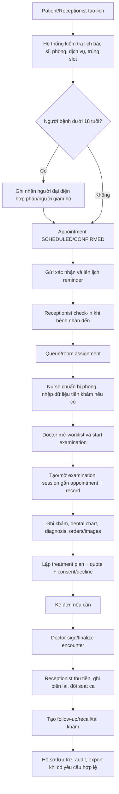

## A6. State machine Appointment

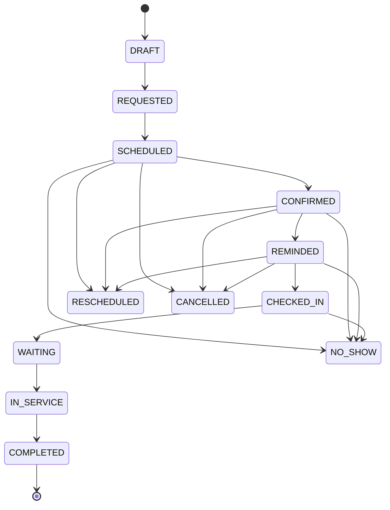

**Validation:**

- Chỉ tạo lịch nếu slot nằm trong lịch làm việc, bác sĩ không nghỉ, phòng/ghế khả dụng, không trùng appointment active.
- **Không yêu cầu KYC** để đặt lịch thường.
- `CHECKED_IN` do lễ tân hoặc actor được phân quyền tiếp nhận.
- Người bệnh < 18 tuổi: check-in / treatment consent / record request cần người đại diện hợp pháp hoặc thông tin người đưa trẻ.
- `IN_SERVICE` chỉ khi có examination session active.
- **`COMPLETED` không phụ thuộc payment** — hoàn tất lâm sàng và hoàn tất tài chính là hai state khác nhau.

## A7. Các state machine tham chiếu nhanh

| Đối tượng | Trạng thái | Ghi chú |
|---|---|---|
| **Examination session** | `DRAFT → IN_PROGRESS → READY_TO_SIGN → SIGNED/COMPLETED → AMENDED`; nhánh `CANCELLED` | Chi tiết tại [B4.3](#b43-state-machine-examination-session) |
| **Treatment plan** | `DRAFT → PROPOSED → ACCEPTED / PARTIALLY_ACCEPTED / DECLINED → IN_PROGRESS → COMPLETED`; nhánh `CANCELLED` | Chi tiết tại [B4.4](#b44-luồng-treatment-plan) |
| **Prescription** | `DRAFT → ISSUED/SIGNED → CANCELLED` (`DISPENSED` thuộc pharmacy/inventory, ngoài scope) | Chi tiết tại [B4.5](#b45-luồng-kê-đơn-prescription) |
| **Clinical order** | `ORDERED → IN_PROGRESS → COMPLETED` → kết quả trả về session | Loại: X-Ray, CBCT, xét nghiệm; mức độ: routine/urgent/stat |
| **Dental image** | `UPLOADED → LINKED_TO_ENCOUNTER/RECORD → REVIEWED/ANNOTATED → ARCHIVED` | Chi tiết tại [B4.6](#b46-luồng-ảnh-nha-khoa-x-quang-file-upload) |
| **Queue item** | `WAITING → CALLED → IN_ROOM → DONE`; `SKIPPED → (gọi lại) WAITING` | Chi tiết tại [B2.4](#b24-quản-lý-hàng-đợi-queue) |
| **Treatment room** | `AVAILABLE → OCCUPIED → CLEANING → AVAILABLE` (+ `MAINTENANCE`) | |
| **Payment** | `UNPAID/PENDING → PAID / FAILED → REFUNDED` | |
| **Refund** | `REQUESTED → UNDER_REVIEW → APPROVED → REFUNDING → REFUNDED`; nhánh `REJECTED` | |
| **Leave request** | `PENDING → APPROVED / REJECTED` (annual/sick/emergency) | |
| **User** | `ACTIVE ⇄ SUSPENDED`; `DEACTIVATED` (xóa mềm) | |
| **KYC** (⏸️ ngoài core) | `NOT_SUBMITTED → PENDING_REVIEW → VERIFIED / REJECTED`; OCR: `PENDING → PROCESSING → COMPLETED/FAILED/SKIPPED` | Chỉ dùng cho nhân sự nội bộ trong scope hiện tại |
| **Sterilization** (⏸️ ngoài core) | `DIRTY → CLEANING → STERILIZING → STERILE → STORED`; `FAILED → lặp lại` | Phase mở rộng |
| **Restock** (⏸️ ngoài core) | `REQUESTED → APPROVED → RECEIVED` | Phase mở rộng |

---

# Phần B — Luồng theo vai trò

## B1. Patient — Bệnh nhân

### B1.1 Luồng chuẩn

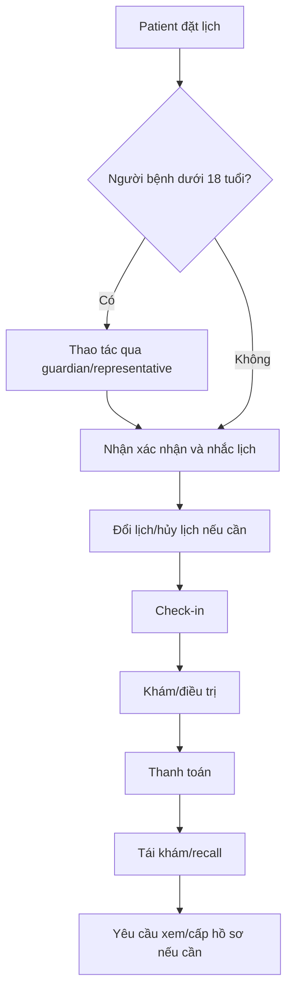

### B1.2 Đăng ký & đăng nhập

- Đăng ký bằng email/username hoặc Google OAuth.
- Xác nhận email (OTP).
- Đăng nhập → nhận JWT token.
- Khai báo thông tin sức khỏe cơ bản: tiền sử, dị ứng, thuốc đang dùng (Doctor/Nurse phải thấy trước khi điều trị/kê đơn).
- ⏸️ **KYC không phải cổng bắt buộc** cho đặt lịch/khám thường (xem [A2](#a2-quyết-định-phạm-vi-hiện-tại)).

### B1.3 Đặt lịch khám (Booking)

- Đặt thủ công: chọn phòng khám → bác sĩ → dịch vụ → ngày giờ.
- Hệ thống kiểm tra slot trống, lịch nghỉ bác sĩ, giờ làm việc, phòng/ghế khả dụng, không trùng appointment active.
- Thanh toán online (VNPay) / đặt cọc nếu phòng khám cấu hình.
- Đổi/hủy lịch: chỉ trong trạng thái hợp lệ và trong hạn cấu hình (N giờ); lưu history/reason. Quá hạn → liên hệ lễ tân ([B2.6](#b26-đổi--hủy-lịch-hộ-bệnh-nhân)).
- ⏸️ Chatbot AI đặt lịch (LangGraph): tạm ngưng khỏi core, phase sau.

### B1.4 Nhắc lịch & tái khám

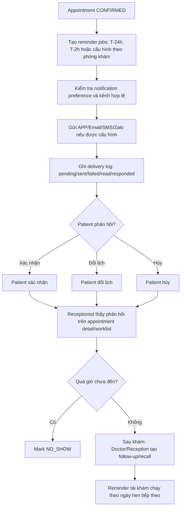

**Validation:**

- Nhắc lịch khám/tái khám là **thông báo dịch vụ**, không trộn marketing; marketing cần consent/preference riêng.
- Mỗi notification có `recipient_id`, `appointment_id`, `channel`, `template_id`, `status`, `sent_at`, `failure_reason`.
- Không gửi thông tin nhạy cảm quá mức qua SMS/Zalo/email — nội dung tối thiểu: thời gian, địa điểm, hướng dẫn liên hệ.

### B1.5 Người bệnh dưới 18 tuổi / người đại diện

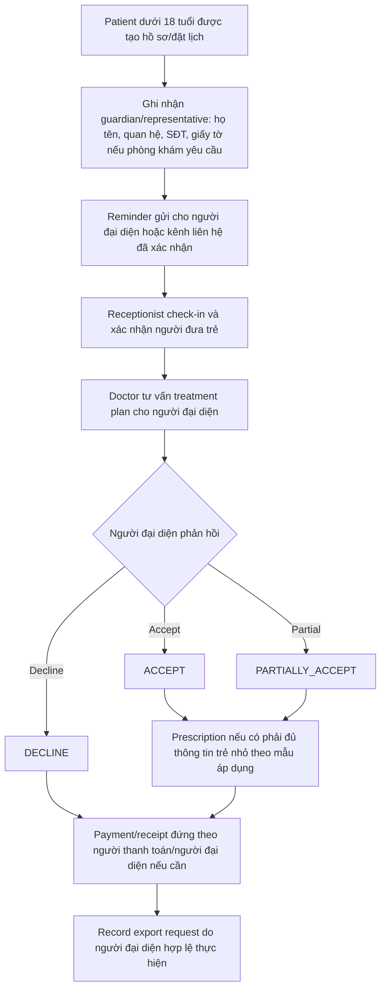

**Validation:**

- Không cho trẻ < 18 tuổi tự xác nhận treatment plan nếu chính sách phòng khám yêu cầu người đại diện.
- Consent/decline phải lưu `confirmed_by`, `relationship_to_patient`, `confirmed_at`.
- Reminder/record export gửi/cấp cho **đúng người có quyền**.
- Không dùng một guardian chung cho mọi lần khám nếu không có xác nhận quan hệ/ủy quyền hợp lệ.

### B1.6 Thanh toán (góc nhìn Patient)

- Thanh toán online (VNPay) hoặc tại quầy (tiền mặt/POS) — xem chi tiết [B2.7](#b27-thu-ngân--đối-soát-ca).
- Trạng thái: `PENDING → PAID / FAILED / REFUNDED`.
- Yêu cầu hoàn tiền → luồng RefundRequest ([B5.5](#b55-duyệt-hoàn-tiền-refundrequest)).
- Payment **không chặn** bác sĩ finalize hồ sơ lâm sàng.

### B1.7 Yêu cầu xem / cấp tóm tắt hồ sơ

- Patient (hoặc người đại diện hợp lệ) tạo `RecordAccessRequest` / yêu cầu `ClinicalSummary`.
- Staff có thẩm quyền approve → generate export → audit đầy đủ (xem [B4.7](#b47-hồ-sơ-bệnh-án-export--audit)).
- Căn cứ: Luật KCB 2023 Điều 69.4; Luật BVDLCN 2025 Điều 4.

### B1.8 Đánh giá dịch vụ (Feedback)

- Sau khi khám hoàn tất, patient có thể đánh giá → tổng hợp vào báo cáo hiệu suất bác sĩ ([B5.10](#b510-báo-cáo--dashboard-quản-trị)).

---

## B2. Receptionist — Lễ tân

**Phạm vi:** tiếp đón, check-in, quản lý hàng đợi & lịch hẹn cả phòng khám, đặt lịch hộ (walk-in), thu ngân tại quầy, điều phối phòng/bác sĩ, đối soát ca.

> Tiếp đón → Check-in → Hàng đợi → Điều phối phòng/bác sĩ → (sau khám) Thu ngân → Tiễn khách

### B2.1 Luồng chuẩn

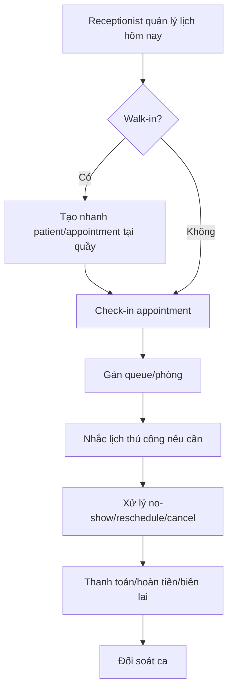

### B2.2 Bảng điều khiển ngày (Front-desk dashboard)

Lễ tân mở đầu ngày với màn hình tổng hợp:

- Danh sách lịch hẹn trong ngày theo bác sĩ/phòng/khung giờ.
- Trạng thái mỗi appointment (`SCHEDULED → … → COMPLETED`).
- Cảnh báo: bệnh nhân trễ hẹn, bác sĩ nghỉ đột xuất (liên kết [B4.8](#b48-lịch-làm-việc--nghỉ-phép)), phòng đang vệ sinh.

### B2.3 Check-in chi tiết

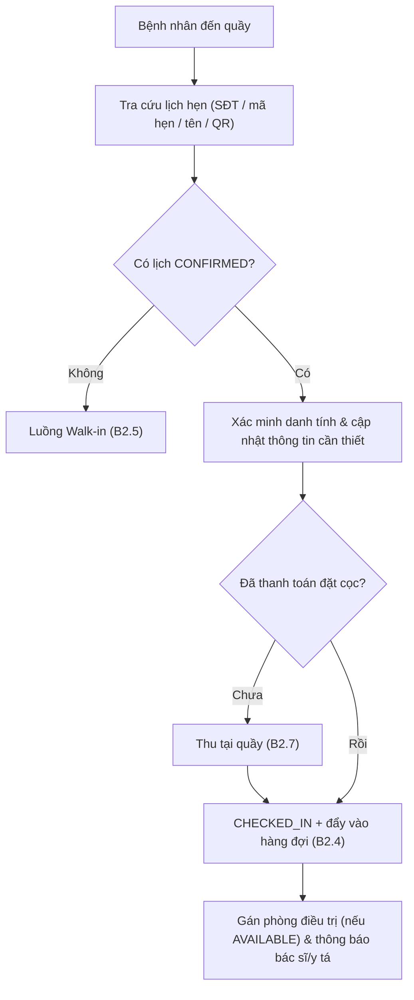

**Validation:**

- Không check-in lịch đã `CANCELLED` / `NO_SHOW` / `COMPLETED`.
- Xác minh thông tin **hành chính tối thiểu** (không yêu cầu KYC).
- Người bệnh < 18 tuổi: xác nhận người đưa trẻ/người đại diện.
- Queue phải gắn clinic/room/service/priority.

### B2.4 Quản lý hàng đợi (Queue)

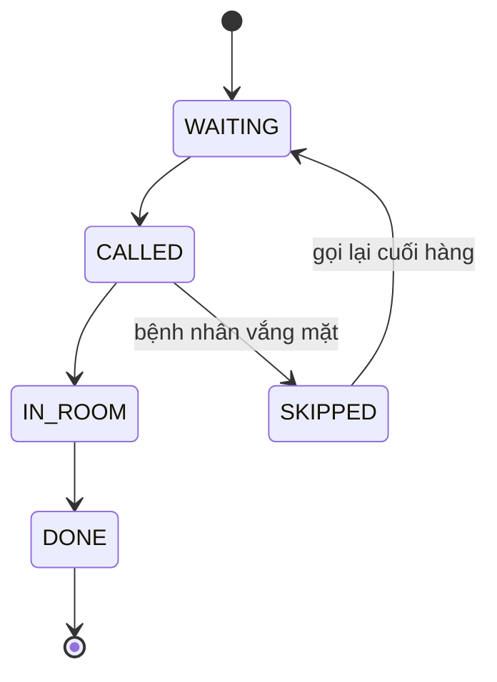

- Sắp thứ tự theo: giờ hẹn, mức ưu tiên (cấp cứu/STAT), thời gian chờ.
- Khi bác sĩ/y tá sẵn sàng → `CALLED` → hiển thị màn hình gọi số/loa.
- Đồng bộ với trạng thái phòng: `AVAILABLE → OCCUPIED → CLEANING → AVAILABLE`.

### B2.5 Đặt lịch hộ / Khách vãng lai (Walk-in)

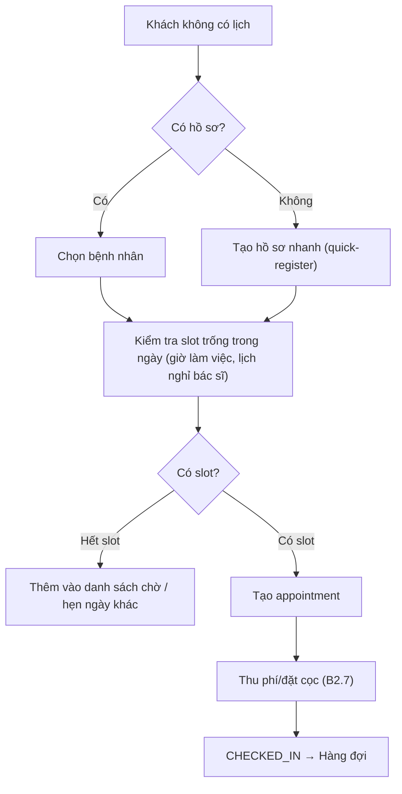

### B2.6 Đổi / Hủy lịch hộ bệnh nhân

- **Đổi lịch:** khi bệnh nhân quá hạn tự đổi hoặc gọi điện → lễ tân chọn slot mới, giải phóng slot cũ; lưu history/reason.
- **Hủy:** cập nhật `CANCELLED`; nếu đã thanh toán → mở RefundRequest trong hạn mức quầy hoặc chuyển Admin ([B5.5](#b55-duyệt-hoàn-tiền-refundrequest)).
- **Bác sĩ nghỉ đột xuất:** hệ thống đánh dấu các lịch bị ảnh hưởng → lễ tân liên hệ bệnh nhân đổi bác sĩ/đổi giờ.

### B2.7 Thu ngân & đối soát ca

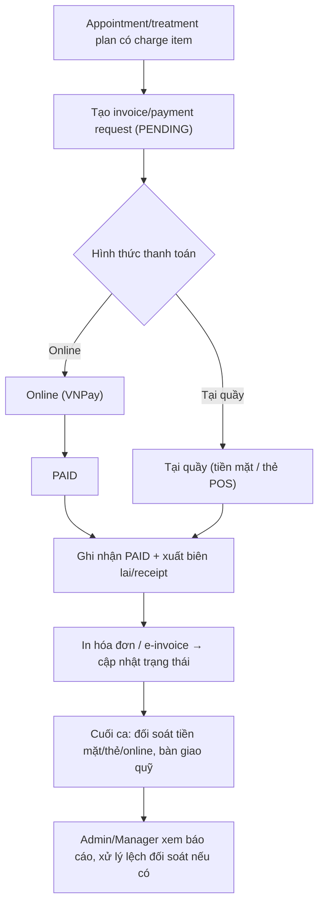

**Validation:**

- Payment **không chặn** bác sĩ finalize hồ sơ lâm sàng.
- Lễ tân là actor chính cho thanh toán tại quầy, biên lai, hoàn tiền theo quyền, đối soát ca.
- Hỗ trợ tối thiểu: `unpaid/pending/paid/failed/refunded`, receipt number, payment method, shift/reconciliation batch.
- Refund phải có reason, actor, timestamp; **vượt hạn mức quầy (Admin cấu hình) → chuyển Admin duyệt**.
- Căn cứ: Luật KCB Điều 9, Điều 18; NĐ 70/2025 (hóa đơn điện tử).

### B2.8 Tiễn khách & hậu khám

- Phiên khám `COMPLETED` & đã thanh toán → queue `DONE`, phòng `CLEANING`.
- Đặt lịch tái khám nếu Doctor có chỉ định (recall/follow-up).
- Phát đơn thuốc bản in (nếu cần) / hướng dẫn lấy thuốc.

### B2.9 Quyền & ràng buộc

| Hành động | Được phép | Ghi chú |
|---|:---:|---|
| Tạo/đổi/hủy lịch | ✅ | Mọi bệnh nhân của phòng khám |
| Check-in / gán phòng | ✅ | |
| Quản lý hàng đợi | ✅ | |
| Thu ngân, xuất biên lai | ✅ | |
| Hoàn tiền | ⚠️ | Chỉ trong hạn mức cấu hình |
| Xem nội dung bệnh án/chẩn đoán | 🚫/⚠️ | Chỉ thông tin hành chính, không xem chi tiết y khoa |
| Final diagnosis / prescription | 🚫 | Thuộc Doctor |
| Duyệt KYC | 🚫 | Thuộc Admin |

### B2.10 Màn hình gợi ý (Reception app)

| Màn hình | Chức năng |
|---|---|
| Dashboard ngày | Lịch hẹn, cảnh báo, KPI quầy |
| Tra cứu & Check-in | Tìm bệnh nhân, xác nhận đến |
| Hàng đợi | Bảng queue real-time, gọi số |
| Sơ đồ phòng | Trạng thái các treatment room |
| Đặt lịch nhanh | Walk-in / đổi / hủy |
| Thu ngân | Thanh toán quầy, biên lai, đối soát ca |

---

## B3. Nurse — Y tá / Phụ tá nha khoa

**Phạm vi:** chuẩn bị phòng & dụng cụ, đo sinh hiệu/tiền khám, hỗ trợ bác sĩ trong buổi điều trị, hậu điều trị, dọn phòng. *(Vật tư & vô trùng: ⏸️ phase mở rộng, ngoài scope hiện tại — xem [A2](#a2-quyết-định-phạm-vi-hiện-tại).)*

> Chuẩn bị phòng → Đón bệnh nhân & sinh hiệu → Hỗ trợ khám/điều trị → Hậu điều trị → Dọn phòng

### B3.1 Luồng chuẩn

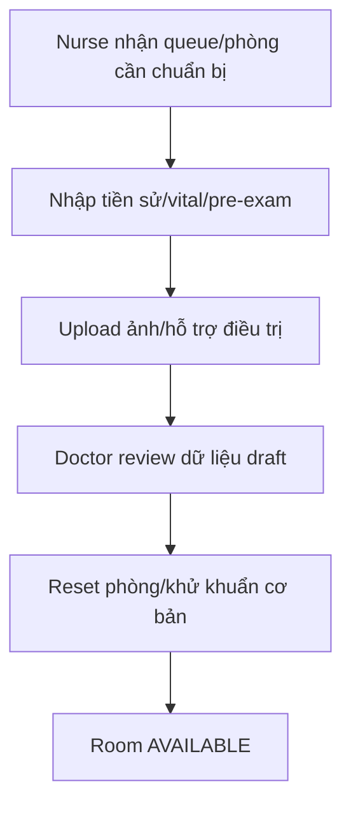

### B3.2 Chuẩn bị phòng điều trị (Pre-visit)

1. Nhận thông tin lịch từ hàng đợi (Receptionist) / dashboard.
2. Kiểm tra phòng: `TreatmentRoom.status = AVAILABLE?`
3. Chuẩn bị theo loại dịch vụ (nhổ răng / lấy cao / trám…).
4. Set up khay dụng cụ + vật tư tiêu hao.
5. Đánh dấu phòng `OCCUPIED` khi bệnh nhân vào.

### B3.3 Đo sinh hiệu & tiền khám

1. Gọi bệnh nhân từ hàng đợi (queue: `CALLED → IN_ROOM`).
2. Đo: huyết áp, mạch, nhiệt độ, SpO2 (tùy quy định) — *vital signs là optional; ưu tiên medical alerts/dị ứng/thuốc đang dùng*.
3. Ghi nhận vào phiên khám (examination session) → hiển thị cho Doctor.
4. Rà soát cảnh báo từ hồ sơ (dị ứng / bệnh nền).
5. Sinh hiệu bất thường (VD huyết áp quá cao) → **gắn cờ cảnh báo** cho Doctor cân nhắc hoãn thủ thuật.

**Validation:** mọi dữ liệu nurse nhập có người ghi, thời gian ghi; **doctor review trước khi sign** (nurse chỉ draft).

### B3.4 Hỗ trợ bác sĩ trong buổi khám/điều trị

- Phụ tá bốn tay (four-handed dentistry): hút nước bọt, truyền dụng cụ, trộn vật liệu.
- Hỗ trợ chụp X-Ray/CBCT khi Doctor chỉ định cận lâm sàng.
- Ghi chú điều dưỡng vào phiên khám (nếu được phân quyền).
- Theo dõi phản ứng bệnh nhân, báo Doctor khi có dấu hiệu bất thường.

### B3.5 Hậu điều trị (Post-visit)

1. Doctor kết thúc thủ thuật.
2. Hướng dẫn chăm sóc tại nhà (giấy/QR): vệ sinh, kiêng cữ, dấu hiệu cần quay lại.
3. Hỗ trợ cấp phát thuốc theo đơn đã `ISSUED` (nếu mô hình có quầy thuốc nội bộ — ngoài scope hiện tại).
4. Cập nhật queue `DONE` → phòng `CLEANING`.
5. Bàn giao bệnh nhân về quầy (Receptionist) để thanh toán/đặt tái khám.

### B3.6 Dọn & tái sẵn sàng phòng

1. Phòng `CLEANING`.
2. Khử khuẩn bề mặt + thay vật tư + bổ sung khay (checklist vệ sinh cơ bản).
3. `TreatmentRoom.status → AVAILABLE`.

### B3.7 ⏸️ Ngoài scope hiện tại (phase mở rộng)

<details>
<summary>Quản lý vật tư tiêu hao (Inventory) & Vô trùng dụng cụ (Sterilization)</summary>

**Inventory:** mỗi thủ thuật trừ tồn kho theo định mức → tồn ≤ ngưỡng → Restock Request: `REQUESTED → APPROVED (Admin) → RECEIVED`. Theo dõi hạn dùng, báo cáo tiêu hao theo ngày/dịch vụ.

**Sterilization:** `DIRTY → CLEANING → STERILIZING → STERILE → STORED` (lỗi chu trình → `FAILED` → lặp lại). Mỗi chu trình ghi: mẻ (batch), thiết bị (autoclave), thông số, người phụ trách, kết quả test sinh học. Truy xuất dụng cụ ↔ mẻ vô trùng phục vụ kiểm soát nhiễm khuẩn & audit.

</details>

### B3.8 Quyền & ràng buộc

| Hành động | Được phép | Ghi chú |
|---|:---:|---|
| Đo & ghi sinh hiệu | ✅ | Ghi vào phiên khám (draft) |
| Hỗ trợ chụp X-Ray/CBCT | ✅ | Theo chỉ định Doctor |
| Upload ảnh lâm sàng | ✅ | Theo phân quyền, link session/record |
| Ghi chú điều dưỡng | ⚠️ | Theo phân quyền; Doctor xác nhận phần quan trọng |
| Chẩn đoán / kê đơn / ký encounter | 🚫 | Thuộc Doctor |
| Cấp phát thuốc | ⚠️ | Đối chiếu đơn đã ISSUED (nếu có quầy thuốc nội bộ) |
| Xem toàn bộ bệnh án | ⚠️ | Chỉ phần liên quan chăm sóc |

### B3.9 Màn hình gợi ý (Nurse app)

| Màn hình | Chức năng |
|---|---|
| Lịch & hàng đợi | Bệnh nhân cần chuẩn bị, gọi vào phòng |
| Sinh hiệu | Nhập vital signs vào phiên khám |
| Hỗ trợ phiên khám | Ghi chú điều dưỡng, hỗ trợ cận lâm sàng |
| Phòng điều trị | Trạng thái & dọn phòng |

---

## B4. Doctor — Bác sĩ / Nha sĩ

**Nguyên tắc cốt lõi:** Doctor flow là một **chuỗi lâm sàng ngoại trú**, không phải CRUD page examinations. Doctor **không** bắt đầu từ "tạo examination tự do", mà từ **worklist các ca đã CHECKED_IN hoặc được phân công**. Chuỗi hợp pháp và có kiểm soát:

> Checked-in appointment → Doctor worklist → Examination/encounter (có `appointment_id` + `record_id`) → Dental chart + diagnosis + clinical orders + images → Treatment plan + quote + consent → Prescription (nếu cần) → Doctor sign/finalize → Appointment COMPLETED → Follow-up/recall + record export/audit

### B4.1 Luồng khám chuẩn

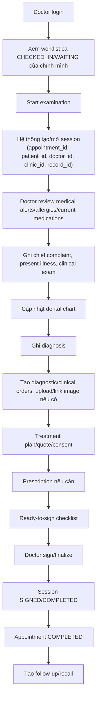

**Worklist chỉ hiển thị:** lịch hôm nay của chính doctor; appointment đã `CHECKED_IN`/`IN_PROGRESS`; bệnh nhân đang thuộc quan hệ điều trị. Hệ thống xác thực role, license/scope, clinic scope khi login.

**Validation:**

- Doctor **không** start ca chưa check-in.
- Doctor **không** start ca của bác sĩ khác nếu không có ủy quyền.
- Không tạo nhiều active session cho cùng appointment (idempotent — start lần 2 trả session hiện có).
- Không sign nếu thiếu clinical note tối thiểu hoặc thiếu diagnosis/reason.
- Sau sign **không update đè**; chỉ amendment.
- Receptionist xử lý `CHECKED_IN`/`NO_SHOW`/payment — Doctor không là actor chính cho các thao tác này.

### B4.2 Ready-to-sign checklist

Trước khi ký, hệ thống validate:

- [ ] Có clinical note cơ bản (chief complaint, exam).
- [ ] Có diagnosis hoặc lý do nếu chưa chẩn đoán.
- [ ] Đã review medical alerts/allergies/current meds.
- [ ] Orders/images đã link session (nếu có).
- [ ] Prescription/treatment plan hợp lệ (nếu có).

### B4.3 State machine Examination session

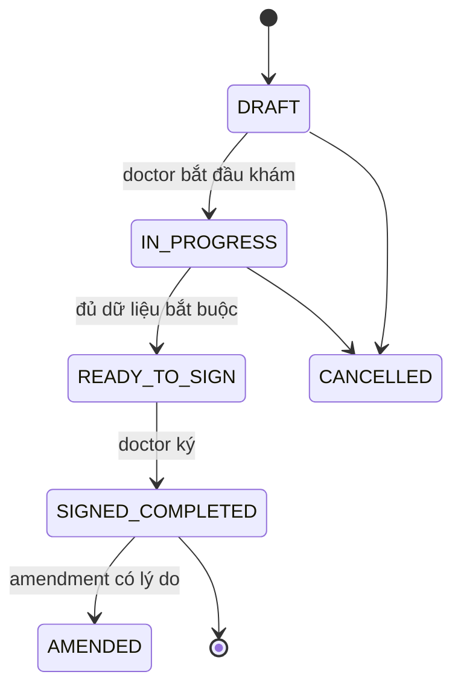

- `DRAFT`: có thể auto tạo khi appointment check-in.
- `SIGNED/COMPLETED`: khóa nội dung chính, không update đè.
- `AMENDED`: sửa hợp lệ bằng bản ghi bổ sung (append-only) — có lý do/người sửa/thời gian, version tăng dần.
- Khi session được tạo từ appointment → appointment chuyển `IN_PROGRESS`; khi doctor finalize → appointment chuyển `COMPLETED`.

### B4.4 Luồng Treatment plan

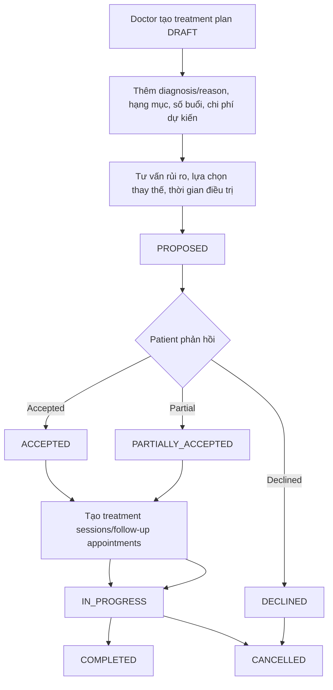

**Validation:**

- Phải có diagnosis/clinical reason; plan link `session_id`/`record_id`.
- Phải có **estimated cost/quote** (dùng đúng version bảng giá hiện hành) trước khi bệnh nhân/người đại diện xác nhận.
- Phải có **risk disclosure** và lựa chọn thay thế (Luật KCB Điều 9, 11, 13).
- **Không chuyển `IN_PROGRESS` nếu chưa accepted/partial accepted** (hạng mục không khẩn cấp).
- Lưu trạng thái consent/decline, timestamp, actor xác nhận; nếu decline, lưu lý do nếu bệnh nhân cung cấp (không ép).
- Nha khoa điều trị nhiều buổi → cần `TreatmentPlanItem` + `TreatmentSession`.

### B4.5 Luồng kê đơn (Prescription)

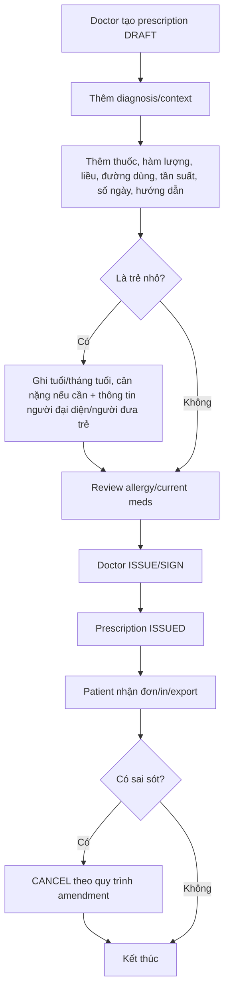

**Validation:**

- **Chỉ Doctor ký/xác nhận** — nurse/receptionist không final prescription.
- Prescription phải link **encounter/record**, không chỉ patient-level (đơn thuốc là thành phần hồ sơ bệnh án — Luật KCB Điều 69).
- Đủ trường theo **TT 26/2025/TT-BYT**: thuốc, liều, đường dùng, thời gian dùng, hướng dẫn, ngày kê, chữ ký/xác nhận.
- Trẻ nhỏ: đủ dữ liệu tuổi/tháng tuổi/người đại diện theo mẫu áp dụng.
- Đơn sau ký không sửa đè; tạo bản hủy/sửa có lý do.
- `DISPENSED` **không** thuộc Doctor flow — thuộc pharmacy/inventory nếu triển khai (ngoài scope).
- Ký số (digital signature) khi phát hành.

### B4.6 Luồng ảnh nha khoa, X-quang, file upload

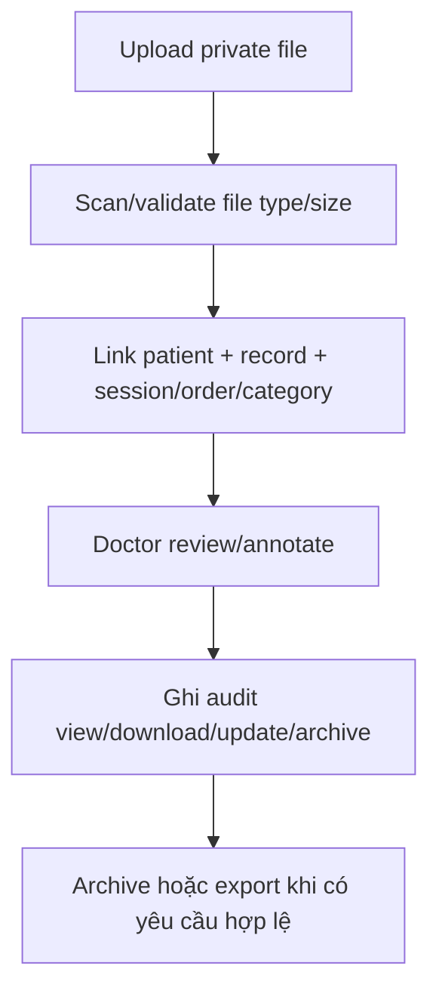

**Validation:**

- **Không public URL trực tiếp** cho ảnh bệnh nhân; download/view qua auth hoặc signed URL ngắn hạn.
- Log đầy đủ: ai xem, lúc nào, mục đích, file nào.
- Nếu phase sau mở AI image analysis: kết quả **chỉ là gợi ý**, phải có doctor confirmation.
- Căn cứ: Luật KCB Điều 69.2; Luật BVDLCN Điều 3/21/23/26; TT 13/2025 Điều 2.

### B4.7 Hồ sơ bệnh án, export & audit

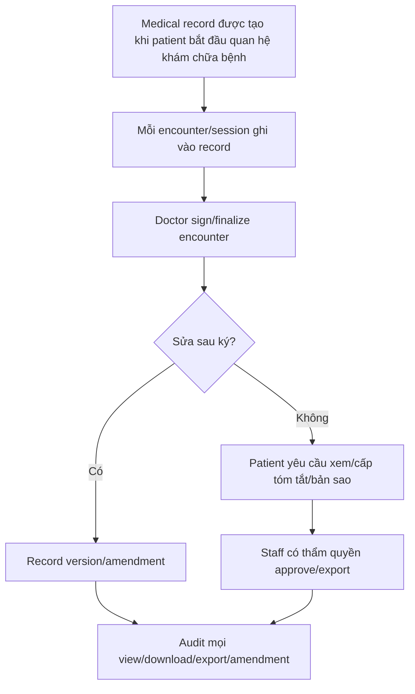

**Validation:**

- Không expose internal note/audit raw cho patient ngoài phạm vi cung cấp.
- Export phải có request, approver, reason, scope, generated file, expiry.
- Audit log không cho operator sửa/xóa thường quy.
- Căn cứ: Luật KCB Điều 69.1/69.2/69.4, Điều 7.10; TT 32/2023 Điều 52.

### B4.8 Lịch làm việc & nghỉ phép

- **My Schedule:** Doctor chỉ xem lịch của **chính mình** (không selector doctor khác trừ admin mode).
- **Leave request:** Doctor tạo yêu cầu nghỉ (`PENDING`), xem trạng thái; **Admin/Manager duyệt** `APPROVED / REJECTED` (annual/sick/emergency). Doctor không tự approve.
- Appointment availability chặn: lịch nghỉ, ngoài giờ làm việc, phòng không khả dụng.

### B4.9 Use case chi tiết (D-UC)

| ID | Use case | Trigger / Pre-condition | Validation bắt buộc | Output |
|---|---|---|---|---|
| D-UC01 | Xem worklist hôm nay | Login role Doctor, có lịch làm việc | Chỉ appointment của doctor hiện tại/được ủy quyền; không load toàn bộ clinic | Worklist checked-in/in-progress/upcoming |
| D-UC02 | Mở ca đã check-in | Appointment `CHECKED_IN`, đúng doctor/clinic | Không mở nếu cancelled/no-show/chưa check-in; audit access | Encounter context |
| D-UC03 | Tạo examination session từ appointment | Bấm Start examination; patient có record hoặc tạo được | Session có `appointment_id, record_id, patient_id, doctor_id, clinic_id`; không trùng active session; appointment → `IN_PROGRESS` | Session `IN_PROGRESS` |
| D-UC04 | Ghi thông tin khám | Session `IN_PROGRESS` | Required fields tối thiểu; `created_by/updated_by`; chưa signed thì được sửa | Clinical note draft |
| D-UC05 | Cập nhật dental chart | Session tồn tại | Chart link session/record; không ghi đè chart đã signed | Dental chart version |
| D-UC06 | Ghi chẩn đoán | Có clinical context | Diagnosis link `session_id`; doctor-only final; audit | Diagnosis record |
| D-UC07 | Tạo chỉ định/ảnh | Session active (Doctor/Nurse) | Order/image link session/record; file private; result quay về order/session; AI chỉ gợi ý | Order/image metadata |
| D-UC08 | Lập treatment plan | Có diagnosis/clinical reason | Plan link session/record; quote/risk; chưa điều trị nếu chưa consent | Plan `PROPOSED` |
| D-UC09 | Ghi nhận consent/refusal | Patient đã được tư vấn | Lưu accepted/partial/declined + chữ ký + timestamp; tách khỏi consent marketing | Consent record |
| D-UC10 | Kê đơn | Có encounter và diagnosis/context | Doctor ký; role khác không final; link encounter/record | Prescription `ISSUED/SIGNED` |
| D-UC11 | Hoàn tất/ký ca khám | Session đủ dữ liệu required | Không update đè sau signed; appointment → `COMPLETED` | Signed encounter |
| D-UC12 | Sửa hồ sơ sau ký | Encounter đã signed (Doctor/Admin theo quyền) | Amendment bắt buộc reason; version tăng; audit | Amendment/version |
| D-UC13 | Xem lịch cá nhân | Login Doctor | Không selector doctor khác nếu không phải admin/manager | Personal schedule |
| D-UC14 | Gửi yêu cầu nghỉ | Có ngày nghỉ hợp lệ | Không tự approve; không trùng lịch đã khóa nếu policy không cho | Leave request `PENDING` |

### B4.10 RACI cho các bước lớn

| Bước nghiệp vụ | Responsible | Accountable | Consulted | Informed | Ghi chú |
|---|---|---|---|---|---|
| Đặt lịch | Patient/Receptionist | Receptionist/Clinic ops | Doctor (nếu cần chọn chuyên khoa) | Patient | Doctor không quản lý toàn bộ booking |
| Check-in | Receptionist | Receptionist/Clinic ops | Nurse (điều phối ghế) | Doctor | Doctor chỉ thấy ca sau check-in |
| Nhận ca khám | Doctor | Doctor | Nurse | Receptionist | Chỉ doctor được phân công/ủy quyền |
| Ghi clinical note | Doctor | Doctor | Nurse (draft phần hỗ trợ) | Patient | Draft của nurse phải được doctor xác nhận |
| Dental chart | Doctor | Doctor | Nurse (hỗ trợ nhập liệu) | Patient | Core nha khoa, không để phụ trong Imaging |
| Diagnosis | Doctor | Doctor | AI chỉ gợi ý (nếu có) | Patient | Không auto-final bằng AI |
| Clinical/diagnostic order | Doctor | Doctor | Nurse/labo/radiology | Receptionist | Kết quả phải quay về encounter |
| Upload ảnh/X-quang | Doctor/Nurse | Doctor | IT/storage | Patient theo quyền | Dữ liệu sức khỏe, cần private/audit |
| Treatment plan | Doctor | Doctor | Receptionist/finance (giá) | Patient | Phải có quote/risk/consent |
| Đồng ý/từ chối plan | Patient | Patient | Doctor giải thích | Receptionist | Lưu timestamp, người ghi nhận, chữ ký |
| Prescription | Doctor | Doctor | Nurse (chuẩn bị draft) | Patient | Doctor ký; lễ tân không final |
| Payment/công nợ | Receptionist/Cashier | Clinic ops | Doctor (chỉ xem context) | Patient | Doctor không refund/thu tiền |
| Finalize encounter | Doctor | Doctor | Nurse (nếu cần bổ sung) | Patient | Sau finalize chỉ amendment/version |
| Export/tóm tắt hồ sơ | Admin/Authorized staff | Clinic | Doctor (tóm tắt chuyên môn) | Patient | Bám Luật KCB Điều 69.4 |

### B4.11 Quyết định thiết kế cần chốt

| Quyết định | Khuyến nghị | Lý do |
|---|---|---|
| Doctor tạo examination không qua appointment? | Chỉ cho walk-in/emergency/manual admin override, phải ghi reason | Bình thường phải trace từ checked-in appointment |
| `appointment_id` có nullable? | Nullable ở DB giai đoạn migrate, nhưng **required ở flow chuẩn** (enforce ở service) | Tránh break dữ liệu cũ |
| Một appointment có nhiều session? | Mặc định 1 encounter chính; nhiều buổi điều trị nằm dưới treatment plan (treatment sessions) | Tránh nhầm khám ban đầu và điều trị nhiều buổi |
| Payment trong Doctor workspace? | Doctor chỉ xem estimate/payment status tối thiểu; thu/refund thuộc receptionist | Tách trách nhiệm, giảm rủi ro quyền |
| `DISPENSED` xử lý ở đâu? | Không thuộc Doctor final flow; pharmacy/inventory nếu có | Doctor kê đơn/ký, không cấp phát |
| AI dental image ghi diagnosis? | Không. AI tạo suggestion, doctor confirm mới thành diagnosis | Trách nhiệm lâm sàng thuộc bác sĩ |
| Blockchain là core EMR? | Không. Chỉ hash/integrity sau khi record signed | Luật yêu cầu EMR hợp lệ, không yêu cầu blockchain |

---

## B5. Admin — Quản trị

**Phạm vi:** quản lý người dùng & phân quyền (RBAC), duyệt hoàn tiền, quản lý phòng khám/phòng/ca, cấu hình hệ thống, audit & báo cáo. *(Duyệt KYC: chỉ áp dụng cho nhân sự nội bộ trong scope hiện tại.)*

### B5.1 Luồng chuẩn

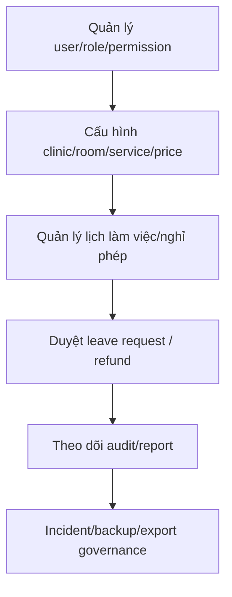

### B5.2 Quản lý người dùng (User Management)

- Tạo / sửa / khóa / mở / xóa mềm tài khoản: `ACTIVE ⇄ SUSPENDED → DEACTIVATED (xóa mềm)`.
- Gán vai trò (Patient/Doctor/Nurse/Receptionist/Admin), gán vào phòng khám.
- Reset mật khẩu, buộc đăng xuất phiên, bật/tắt 2FA bắt buộc theo vai trò.
- Mời nhân sự nội bộ qua email (invite flow).

### B5.3 Phân quyền RBAC (Role & Permission)

Ma trận RolePermission — Admin cấu hình quyền theo vai trò (⚠️ = quyền giới hạn theo điều kiện/hạn mức; Admin có thể tạo custom role):

| Quyền (ví dụ) | Patient | Reception | Nurse | Doctor | Admin |
|---|:---:|:---:|:---:|:---:|:---:|
| `appointment.create` | ✅ | ✅ | – | – | ✅ |
| `appointment.cancel.any` | – | ✅ | – | – | ✅ |
| `examination.write` | – | – | ⚠️ | ✅ | – |
| `prescription.issue` | – | – | – | ✅ | – |
| `payment.collect` | – | ✅ | – | – | ✅ |
| `refund.approve` | – | ⚠️ | – | – | ✅ |
| `kyc.approve` | – | – | – | – | ✅ |
| `report.view` | – | ⚠️ | – | ⚠️ | ✅ |
| `user.manage` | – | – | – | – | ✅ |

### B5.4 Duyệt KYC (nhân sự nội bộ — ⏸️ patient KYC ngoài core)

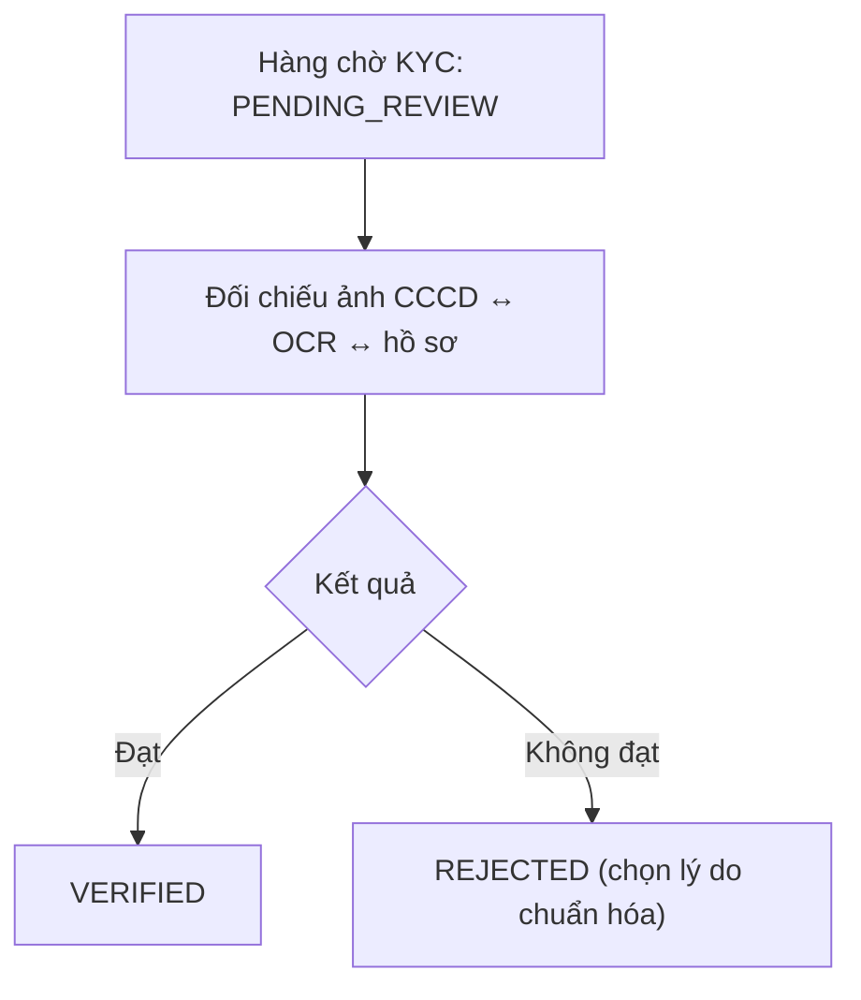

- Lọc theo nguồn quyết định: `AUTO` (tự duyệt theo ngưỡng OCR confidence) vs `MANUAL` (người duyệt).
- Xử lý case OCR `FAILED/SKIPPED` → nhập tay & xác minh.
- Scope hiện tại: xác minh giấy tờ/bằng cấp của **nhân sự làm việc** (Doctor, Receptionist…), không gate flow bệnh nhân.

### B5.5 Duyệt hoàn tiền (RefundRequest)

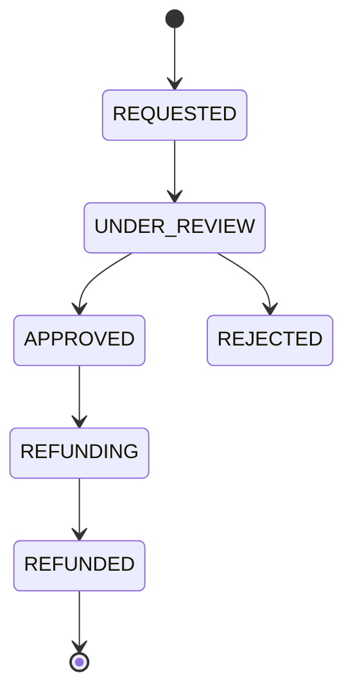

- Kiểm tra: phiếu gốc `PAID`, lý do hợp lệ, đối chiếu giao dịch VNPay.
- Ghi AuditLog: ai duyệt, số tiền, thời điểm.
- Trong hạn mức quầy → Receptionist tự xử lý; vượt hạn mức → Admin duyệt.

### B5.6 Quản lý cơ sở vật chất

- **Phòng khám (Clinic):** thông tin, giờ làm việc mặc định, dịch vụ cung cấp.
- **Phòng điều trị (TreatmentRoom):** số phòng, loại ghế/thiết bị, trạng thái (`AVAILABLE/OCCUPIED/CLEANING/MAINTENANCE`).
- **Ca làm việc (Work shift):** tạo ca, gán bác sĩ/y tá/lễ tân.
- **Nghỉ phép:** duyệt đơn `PENDING → APPROVED / REJECTED` (annual/sick/emergency).
- **Dịch vụ & bảng giá:** CRUD dịch vụ, gắn giá, thời lượng slot mặc định; **giá cần version/effective date** — không làm lệch quote đã accepted (muốn đổi phải tạo quote/amendment mới).

### B5.7 Cấu hình hệ thống (System Config)

| Nhóm cấu hình | Ví dụ tham số |
|---|---|
| Đặt lịch | Hạn đổi/hủy (N giờ), số slot/giờ |
| Thanh toán | Bật/tắt VNPay, tỉ lệ đặt cọc, hạn mức hoàn tiền quầy |
| Thông báo | Mốc nhắc lịch (T-24h/T-2h), kênh mặc định, preference/consent |
| Bảo mật | Bắt buộc 2FA theo vai trò, thời hạn JWT, chính sách mật khẩu |
| AI (⏸️ phase sau) | Bật chatbot, ngưỡng tự duyệt KYC (OCR confidence) |
| Blockchain (tùy chọn) | Bật lưu hash khi finalize hồ sơ |

### B5.8 Audit & Nhật ký (AuditLog)

> Mọi thao tác nhạy cảm → ghi AuditLog: **ai • làm gì • đối tượng • thời điểm • IP • trước/sau**

- Đối tượng theo dõi: đăng nhập, thay đổi quyền, xem/sửa bệnh án, upload/download/export file lâm sàng, sign/finalize, amendment, hoàn tiền, duyệt KYC.
- Tìm kiếm/lọc theo người dùng, loại hành động, khoảng thời gian; xuất file phục vụ thanh tra.
- Audit log không cho operator sửa/xóa thường quy.

### B5.9 Backup / Incident (theo TT 13/2025 & Luật BVDLCN)

- Backup định kỳ, restore test, encryption, retention, monitoring, disaster recovery cho clinical data/file.
- **Breach notification workflow trong 72h** khi thuộc trường hợp luật định (Luật BVDLCN Điều 23).

### B5.10 Báo cáo & Dashboard quản trị

| Báo cáo | Nội dung |
|---|---|
| Doanh thu | Theo ngày/tháng, phòng khám, dịch vụ, hình thức thanh toán; refund |
| Vận hành | Số lịch hẹn, tỉ lệ NO_SHOW/CANCELLED, thời gian chờ trung bình (queue) |
| Hiệu suất bác sĩ | Số ca, đánh giá (Feedback), tỉ lệ hoàn tất kế hoạch điều trị — doctor chỉ xem phần của mình |
| Lâm sàng | Phân bố chẩn đoán (ICD), tỉ lệ cận lâm sàng, đơn thuốc |
| KYC (nội bộ) | Tỉ lệ AUTO vs MANUAL, tỉ lệ REJECTED, thời gian xử lý |

### B5.11 Màn hình gợi ý (Admin console)

| Màn hình | Chức năng |
|---|---|
| Người dùng & vai trò | CRUD user, RBAC |
| Hàng chờ KYC (nội bộ) | Duyệt/từ chối |
| Hoàn tiền | Duyệt refund |
| Cơ sở & lịch | Phòng khám, phòng, ca, nghỉ phép, dịch vụ/giá |
| Cấu hình | Tham số hệ thống |
| Audit logs | Tra cứu nhật ký |
| Báo cáo | Dashboard & xuất báo cáo |

---

# Phần C — Tương tác liên vai trò

Phần này nối các luồng đơn lẻ thành bức tranh tổng thể: ai bàn giao cho ai, ở điểm nào, đồng bộ trạng thái gì.

## C1. Swimlane — Một lượt khám hoàn chỉnh

```mermaid
sequenceDiagram
    autonumber
    actor P as Patient
    actor R as Reception
    actor N as Nurse
    actor D as Doctor
    participant S as Admin/System

    P->>S: Đăng ký tài khoản
    P->>R: Đặt lịch (hoặc tự đặt online)
    S-->>P: Xác nhận + reminder T-24h/T-2h
    P->>R: Đến phòng khám
    R->>R: Check-in (CHECKED_IN) + vào hàng đợi
    R->>N: Gán phòng, gọi vào phòng
    N->>N: Đo sinh hiệu, tiền khám
    N->>D: Bàn giao bệnh nhân + dữ liệu tiền khám
    D->>D: Khám, chẩn đoán (ICD, dental chart)
    D->>N: Chỉ định cận lâm sàng
    N-->>D: Hỗ trợ chụp X-Ray/CBCT, kết quả trả về session
    D->>P: Tư vấn treatment plan (quote/risk)
    P-->>D: Đồng ý / từ chối / đồng ý một phần
    D->>P: Kê đơn (ISSUED/SIGNED)
    D->>D: Sign/finalize encounter
    D->>N: Kết thúc thủ thuật (queue DONE, phòng CLEANING)
    N->>R: Bàn giao bệnh nhân về quầy
    R->>P: Thu ngân (PAID) + biên lai
    R->>P: Đặt lịch tái khám nếu có chỉ định
    P->>S: Đánh giá dịch vụ
    S->>S: Lưu trữ, audit, (tùy chọn) hash blockchain
```

## C2. Bảng các điểm bàn giao (Handoff points)

| # | Từ | Đến | Sự kiện bàn giao | Trạng thái thay đổi |
|---|---|---|---|---|
| 1 | Patient | Reception | Đến phòng khám | Appt: `CONFIRMED → CHECKED_IN` |
| 2 | Reception | Nurse | Gán phòng, đẩy hàng đợi | Queue: `WAITING → CALLED`; Room: `AVAILABLE → OCCUPIED` |
| 3 | Nurse | Doctor | Đo xong sinh hiệu | Exam session: tạo & gắn vital signs |
| 4 | Doctor | Nurse | Chỉ định cận lâm sàng | ClinicalOrder: `ORDERED → IN_PROGRESS` |
| 5 | Doctor | Patient | Gửi đơn thuốc | Prescription: `ISSUED` |
| 6 | Doctor | Patient | Gửi kế hoạch điều trị | TreatmentPlan: `PROPOSED` |
| 7 | Patient | Doctor | Duyệt kế hoạch | TreatmentPlan: `ACCEPTED / PARTIALLY_ACCEPTED / DECLINED` |
| 8 | Doctor | Nurse | Kết thúc thủ thuật | Queue: `IN_ROOM → DONE`; Room: `OCCUPIED → CLEANING` |
| 9 | Nurse | Reception | Bàn giao bệnh nhân | — |
| 10 | Reception | Patient | Thu ngân | Payment: `PENDING → PAID` |
| 11 | Patient | Admin | Yêu cầu hoàn tiền | Refund: `REQUESTED → … → REFUNDED` |
| 12 | System | All | Nhắc lịch/tái khám | Notification gửi đi + delivery log |
| 13 | Patient | System | Nộp KYC (⏸️ nội bộ) | KYC: `PENDING_REVIEW` |
| 14 | System | Admin | KYC cần duyệt tay (⏸️ nội bộ) | KYC: `PENDING_REVIEW → VERIFIED/REJECTED` |

## C3. Đồng bộ trạng thái chéo (state coupling)

Thay đổi một bên kéo theo bên kia — nên dùng event-driven để tránh lệch:

- `Appointment.CHECKED_IN` ⇄ Queue: thêm `WAITING`
- `Queue.CALLED` ⇄ Room: `AVAILABLE → OCCUPIED`
- `Appointment.COMPLETED` ⇄ Queue: `DONE` ⇄ Room: `CLEANING`
- `TreatmentPlan.ACCEPTED` ⇄ sinh treatment sessions / follow-up appointments
- `Refund.REFUNDED` ⇄ Payment gốc: → `REFUNDED`
- ⚠️ Payment **không** gate finalize hồ sơ lâm sàng (hai state độc lập).

## C4. Luồng thông báo liên vai trò (Notification)

| Sự kiện kích hoạt | Người nhận | Kênh |
|---|---|---|
| Đặt lịch thành công | Patient | email/SMS/in-app |
| Nhắc lịch T-24h / T-2h | Patient | push/SMS |
| Check-in xong | Nurse, Doctor | in-app |
| Có chỉ định cận lâm sàng | Nurse | in-app |
| Kế hoạch điều trị gửi tới | Patient | email/in-app |
| Patient duyệt/từ chối kế hoạch | Doctor | in-app |
| Thanh toán thành công/thất bại | Patient, Reception | in-app/email |
| Yêu cầu hoàn tiền mới | Admin | in-app/email |
| Bác sĩ nghỉ đột xuất | Reception, Patient bị ảnh hưởng | in-app/SMS |
| KYC nội bộ cần duyệt tay | Admin | in-app |

## C5. Gợi ý triển khai kỹ thuật

- Đồng bộ trạng thái chéo dùng **event-driven** (publish/subscribe) để tránh lệch trạng thái Appointment ↔ Queue ↔ Room.
- Hàng đợi & trạng thái phòng cập nhật **real-time** (WebSocket/SSE) cho dashboard lễ tân & y tá.
- Mọi handoff ở bảng C2 ghi **AuditLog** để truy vết.
- Notification tách thành **service riêng**, nhận event và fan-out theo cấu hình kênh từng người dùng.
- Orchestration `start-examination` đặt ở appointment module hoặc application service trung gian — **không** để frontend tự POST rời rạc vào `/examination-sessions` rồi tự cập nhật appointment status (dễ sai transaction).

---

# Phần D — Căn cứ pháp lý & benchmark

## D1. Văn bản pháp lý & mốc hiệu lực

| Mã | Văn bản | Hiệu lực | Ý nghĩa thiết kế | Link |
|---|---|---|---|---|
| PL-01 | Luật Khám bệnh, chữa bệnh 15/2023/QH15 | 01/01/2024 | Quyền người bệnh, nghĩa vụ người hành nghề, hồ sơ bệnh án, bảo mật, phạm vi hành nghề, giá dịch vụ | [vanban.chinhphu.vn](https://vanban.chinhphu.vn/?docid=207396&pageid=27160) |
| PL-02 | Nghị định 96/2023/NĐ-CP | 01/01/2024 | Giấy phép hành nghề, giấy phép hoạt động, điều kiện cơ sở KCB, phòng khám chuyên khoa | [vanban.chinhphu.vn](https://vanban.chinhphu.vn/?docid=209491&pageid=27160) |
| PL-03 | Thông tư 32/2023/TT-BYT | 01/01/2024 | Phạm vi hành nghề (có RHM), mẫu hồ sơ bệnh án, nguyên tắc ghi hồ sơ, thời gian/người ghi | [thuvienphapluat.vn](https://thuvienphapluat.vn/van-ban/The-thao-Y-te/Thong-tu-32-2023-TT-BYT-huong-dan-Luat-Kham-benh-chua-benh-593360.aspx) |
| PL-04 | Thông tư 13/2025/TT-BYT (hồ sơ bệnh án điện tử) | 21/07/2025 | EMR lập/cập nhật/ký/lưu trữ/khai thác điện tử; cơ sở khác bệnh viện hoàn thành EMR **chậm nhất 31/12/2026** | [thuvienphapluat.vn](https://thuvienphapluat.vn/van-ban/The-thao-Y-te/Thong-tu-13-2025-TT-BYT-huong-dan-trien-khai-ho-so-benh-an-dien-tu-660113.aspx) |
| PL-05 | Luật Bảo vệ dữ liệu cá nhân 91/2025/QH15 | 01/01/2026 | Dữ liệu sức khỏe là dữ liệu nhạy cảm: đúng mục đích, tối thiểu, minh bạch, bảo mật, căn cứ xử lý, xử lý sự cố | [thuvienphapluat.vn](https://thuvienphapluat.vn/van-ban/Bo-may-hanh-chinh/Luat-Bao-ve-du-lieu-ca-nhan-2025-so-91-2025-QH15-625628.aspx) |
| PL-06 | Thông tư 26/2025/TT-BYT (đơn thuốc ngoại trú) | 01/07/2025 | Thẩm quyền kê đơn, mẫu đơn thuốc, kê đơn thuốc hóa dược/sinh phẩm ngoại trú | [thuvienphapluat.vn](https://thuvienphapluat.vn/van-ban/The-thao-Y-te/Thong-tu-26-2025-TT-BYT-don-thuoc-va-viec-ke-don-thuoc-hoa-duoc-trong-dieu-tri-ngoai-tru-643684.aspx) |
| PL-07 | Nghị định 70/2025/NĐ-CP (hóa đơn, chứng từ) | 01/06/2025 | Hóa đơn điện tử, hóa đơn từ máy tính tiền, đối soát thanh toán | [vanban.chinhphu.vn](https://vanban.chinhphu.vn/?docid=213179&pageid=27160) |
| PL-08 | Nghị định 356/2025/NĐ-CP (hướng dẫn Luật BVDLCN) | — | Cần theo dõi khi thiết kế hồ sơ tuân thủ | [vanban.chinhphu.vn](https://vanban.chinhphu.vn/?classid=1&docid=214590&pageid=27160) |

## D2. Mapping pháp lý → yêu cầu hệ thống

### D2.1 Quyền người bệnh & tư vấn trước điều trị

| Điều luật | Ý nghĩa | Yêu cầu hệ thống |
|---|---|---|
| Luật KCB Điều 9 | Người bệnh được cung cấp thông tin về tình trạng, phương pháp điều trị, dịch vụ và **giá** | Doctor ghi được chẩn đoán, phương án, lựa chọn thay thế, rủi ro, chi phí dự kiến |
| Luật KCB Điều 11 | Quyền lựa chọn phương pháp sau khi được tư vấn | Treatment plan có trạng thái đồng ý/từ chối/từng phần, timestamp, người xác nhận |
| Luật KCB Điều 13 | Quyền từ chối khám chữa bệnh | Use case PatientDeclinedPlan/RefusalOfTreatment, lưu lý do và người ghi nhận |
| Luật KCB Điều 17 | Nghĩa vụ cung cấp trung thực thông tin sức khỏe | Tiền sử, dị ứng, thuốc đang dùng, cảnh báo y khoa — Doctor thấy trước khi điều trị/kê đơn |
| Luật KCB Điều 18 | Nghĩa vụ chi trả chi phí KCB | Payment/receipt/đối soát |

### D2.2 Hành nghề đúng phạm vi

| Điều luật | Ý nghĩa | Yêu cầu hệ thống |
|---|---|---|
| Luật KCB Điều 7.7 | Cấm hành nghề sai phạm vi/thời gian/địa điểm đăng ký | Doctor chỉ thao tác ca thuộc chi nhánh/lịch/phạm vi được phân công; không ký thay |
| TT 32/2023 (phạm vi hành nghề) | Có phạm vi hành nghề bác sĩ RHM | Profile bác sĩ lưu license/practice scope/specialty; backend check khi gán dịch vụ/chỉ định/ký |

### D2.3 Hồ sơ bệnh án & EMR

| Điều luật | Ý nghĩa | Yêu cầu hệ thống |
|---|---|---|
| Luật KCB Điều 69.1 | Ngoại trú vẫn phải lập/cập nhật hồ sơ bệnh án; giấy = điện tử về pháp lý | Không dùng appointment thay medical record; mỗi lần khám cần Encounter gắn MedicalRecord |
| Luật KCB Điều 69.2 | Hồ sơ phải lưu giữ và giữ bí mật | Ảnh, X-quang, đơn thuốc, note phải private, RBAC, audit access |
| Luật KCB Điều 69.4 | Người bệnh được đọc/xem/sao chụp/tóm tắt theo yêu cầu hợp lệ | RecordAccessRequest, RecordExport, ClinicalSummary, workflow approve/log |
| Luật KCB Điều 7.10 | Cấm tẩy xóa/sửa hồ sơ làm sai lệch | Sau ký/finalize không update đè; chỉ amendment/version có lý do |
| TT 32/2023 Điều 52 | Ghi chính xác, trung thực, đầy đủ, rõ thời gian/người ghi | Mọi clinical entry có `created_by/created_at/signed_by/signed_at/amended_from` + audit trail |
| TT 13/2025 Điều 1–4 | EMR vòng đời đầy đủ; hạ tầng bảo mật/backup; chữ ký/xác nhận điện tử; deadline 31/12/2026 | EMR không chỉ CRUD; ký điện tử; backup/restore/encryption/DR; định vị S.M.I.L.E là EMR-ready |

### D2.4 Dữ liệu cá nhân, dữ liệu sức khỏe & AI/file

| Điều luật | Ý nghĩa | Yêu cầu hệ thống |
|---|---|---|
| Luật BVDLCN Điều 3 | Đúng mục đích, tối thiểu, minh bạch, bảo mật | Không bắt CCCD/KYC cho đặt lịch/khám thường |
| Luật BVDLCN Điều 4 | Quyền chủ thể dữ liệu | Patient portal request xem/chỉnh sửa dữ liệu; bệnh án đi qua amendment/audit |
| Luật BVDLCN Điều 11 | Sự đồng ý | Tách consent điều trị / nhắc lịch / marketing / chia sẻ bên thứ ba |
| Luật BVDLCN Điều 19 | Trường hợp xử lý không cần đồng ý | Lưu legal basis: điều trị, nghĩa vụ pháp lý, hợp đồng, cấp cứu, consent |
| Luật BVDLCN Điều 21 | Đánh giá tác động (DPIA) | Artifact DPIA/compliance nội bộ cho dữ liệu sức khỏe |
| Luật BVDLCN Điều 23 | Thông báo vi phạm trong 72h | Incident/breach workflow + audit sự cố |
| Luật BVDLCN Điều 26 | Dữ liệu sức khỏe: không cung cấp bên thứ ba nếu không có căn cứ | AI/OCR/cloud storage/third-party phải có consent/legal basis + log chia sẻ |

### D2.5 Kê đơn ngoại trú

| Điều luật | Ý nghĩa | Yêu cầu hệ thống |
|---|---|---|
| TT 26/2025 Điều 2–6 | Kê đơn thuốc hóa dược/sinh phẩm ngoại trú | Prescription: bác sĩ kê, chẩn đoán/context, thuốc, liều, đường dùng, số ngày, hướng dẫn, ngày kê, ký/xác nhận |
| Luật KCB Điều 69 | Đơn thuốc/chỉ định là thành phần hồ sơ bệnh án | Prescription link encounter/record, không chỉ patient/doctor rời rạc |

## D3. Benchmark hệ thống nha khoa tại Việt Nam

| Hệ thống | Link | Nhóm chức năng đáng học |
|---|---|---|
| DentalFlow | https://dentalflow.vn/ | Bệnh án điện tử, lịch hẹn, hóa đơn điện tử, chi nhánh, CSKH đa kênh, báo cáo, phân quyền (kho/labo ngoài scope S.M.I.L.E) |
| SimlyDent | https://simlydent.vn/ | EMR theo cấu trúc bệnh án, ký điện tử, backup, in mẫu, CRM/omni chat, AI Agent, hoa hồng bác sĩ |
| MayDental | https://maydental.vn/ | Đặt lịch/tái khám, timeline điều trị, CSKH SMS/Email, công nợ, thu chi, báo cáo |
| TDental | https://tdental.vn/ | Hồ sơ khách hàng, lịch hẹn/tái khám, công nợ, chi nhánh, công đoạn điều trị, phân quyền |
| Edental | https://edental.vn/ | Lịch hẹn online, tự động nhắc lịch, công nợ, hồ sơ điều trị, SMS marketing, doanh thu/lợi nhuận |

**Kết luận benchmark:**

- **Nhắc lịch/tái khám** xuất hiện thường xuyên → đưa vào core.
- **Treatment plan nhiều buổi, công nợ/biên lai/đối soát ca** là nghiệp vụ thực tế → giữ trong scope. Labo/kho phổ biến ở sản phẩm lớn nhưng ngoài scope hiện tại.
- **EMR, ký/xác nhận, backup, bảo mật, audit** đang thành bắt buộc do lộ trình EMR 2025–2026.
- **KYC/AI không phải core** của phần mềm nha khoa; nếu dùng phải có phạm vi rõ.

---

# Phần E — Use case toàn hệ thống

| UC | Actor chính | Use case | Căn cứ pháp lý | Validation tối thiểu |
|---|---|---|---|---|
| UC-01 | Patient/Receptionist | Tạo lịch khám | PL-05 Đ3/11; PL-01 Đ9 | Không bắt KYC; dữ liệu tối thiểu; kiểm tra slot/bác sĩ/phòng |
| UC-02 | System | Gửi xác nhận lịch | PL-05 Đ3 | Nội dung tối thiểu, log delivery, không trộn marketing |
| UC-03 | System/Receptionist | Nhắc lịch trước giờ khám | PL-05 Đ3/11/26 | Có preference, delivery log, retry/failure handling |
| UC-04 | Patient/Receptionist | Đổi lịch/hủy lịch | PL-05 Đ4 | Chỉ trong trạng thái hợp lệ, lưu history/reason |
| UC-05 | Receptionist | Check-in | PL-01 Đ17 | Xác minh hành chính tối thiểu; không check-in lịch invalid |
| UC-06 | Receptionist/Nurse | Queue và gán phòng | NĐ 96 | Phòng/ghế khả dụng, room state chính xác |
| UC-07 | Nurse | Nhập tiền sử/dị ứng/vital/pre-exam | PL-03 Đ52 | Có người ghi, thời gian ghi; doctor review trước sign |
| UC-08 | Doctor | Start examination | PL-01 Đ7.7; PL-02; PL-03 | Đúng phân công, appointment đã check-in, session có appointment_id/record_id |
| UC-09 | Doctor | Ghi khám và dental chart | PL-01 Đ69; PL-03 Đ52 | Đầy đủ, chính xác, timestamp, creator; link session |
| UC-10 | Doctor | Chẩn đoán | PL-01 Đ7.7; PL-03 | Doctor-only final; link session/record; AI không final |
| UC-11 | Doctor/Nurse | Upload ảnh/file lâm sàng | PL-01 Đ69.2; PL-05 Đ26 | Private storage, file validation, audit view/download, link session/record |
| UC-12 | Doctor | Chỉ định cận lâm sàng | PL-01 Đ7.7; PL-03 | Clinical reason, result, reviewed_by/reviewed_at |
| UC-13 | Doctor + Patient | Treatment plan và consent | PL-01 Đ9/11/13 | Quote/risk/alternative/consent/decline/partial accept |
| UC-14 | Doctor | Kê đơn ngoại trú | PL-06; PL-01 Đ69 | Doctor sign, đủ thông tin thuốc, link encounter/record |
| UC-15 | Doctor | Sign/finalize encounter | PL-04 Đ3; PL-03 Đ52 | Checklist đủ dữ liệu; sau sign khóa update đè |
| UC-16 | Doctor/Admin | Amendment/version sau ký | PL-01 Đ7.10; PL-03 Đ52 | Bắt buộc reason, tạo version, audit |
| UC-17 | Receptionist/Patient | Thanh toán, biên lai, đối soát ca | PL-01 Đ9/18; PL-07 | Không chặn finalize lâm sàng; receipt, method, actor, refund reason, reconciliation batch |
| UC-18 | Doctor/Receptionist | Tạo lịch tái khám/recall | PL-01 Đ9/17; PL-05 | Link treatment plan/session, reminder job, preference |
| UC-19 | Patient/Admin | Yêu cầu xem/cấp tóm tắt hồ sơ | PL-01 Đ69.4; PL-05 Đ4 | Request/approve/export/audit, đúng phạm vi |
| UC-20 | Admin | RBAC, phân quyền, audit | PL-01 Đ69.2; PL-05 | Least privilege, audit access, no shared account |
| UC-21 | Admin/Doctor | Lịch làm việc/nghỉ phép bác sĩ | PL-01 Đ7.7; PL-02 | Không đặt lịch ngoài scope/ngày nghỉ; manager duyệt nghỉ |
| UC-22 | Admin/System | Backup/restore/incident | PL-04 Đ2; PL-05 Đ23 | Backup định kỳ, restore test, breach notification 72h |
| UC-23 | Receptionist/Patient/Guardian | Người bệnh < 18 tuổi & người đại diện | PL-01; PL-05; PL-06 | Guardian/relationship/contact; consent/record request/payment gắn người xác nhận hợp lệ |
| UC-24 | Admin/Receptionist/Doctor | Bảng giá dịch vụ & quote version | PL-01 Đ9; PL-07 | Quote đúng version giá; payment không lệch quote đã xác nhận nếu chưa có amendment |
| UC-25 | Admin/System | Privacy notice, consent/preference thông báo | PL-05 Đ3/11/26 | Tách nhắc lịch với marketing; lưu mục đích, kênh, trạng thái đồng ý |

---

# Phần F — Hiện trạng code & gap

> Kết quả review code (nhánh `origin/dev`, rà soát 30/06–01/07/2026; **cập nhật 11/07/2026 theo các commit fix RBAC/sign-finalize/admin trên `feat/admin-flow`**). Kết luận nhanh: các điểm nối cốt lõi từng thiếu (`appointment_id`, sign/finalize, RBAC backend, scope dữ liệu theo role) **đã được vá phần lớn**; gap còn lại tập trung ở reminder tự động, quote/bảng giá version, guardian < 18 tuổi, và audit truy cập dữ liệu lâm sàng (xem/tải hồ sơ, ảnh).

## F1. Chức năng hiện có & đánh giá

| Nhóm | Hiện có | Đánh giá / Gap |
|---|---|---|
| Auth/User/RBAC | Login/register, user/profile, roles/permissions, protected route FE, admin users/roles | ✅ FE middleware guard đã bật lại; `JwtAuthGuard`+`RolesGuard` áp cho gần như mọi controller `clinical-emr-service` (trừ `health`) — còn thiếu ownership check (doctor A/doctor B) ở một số service |
| Appointment | Tạo lịch, availability, book theo specialty/doctor, confirm, cancel, check-in, status history, by patient/doctor, reminder endpoint | Khá mạnh; cần chuẩn hóa state `WAITING/IN_SERVICE/REMINDED`, auto reminder scheduler, queue, ownership theo role |
| Notification | Notification service, bell, template/preference/delivery log (IAM) | Cần nối event confirmed/reminder/follow-up/no-show; tách reminder với marketing |
| Patient | Danh sách, chi tiết, tạo/sửa, medical history, profile | Cần patient portal scope rõ + request xem/cấp hồ sơ |
| Guardian/Representative | ✅ `PatientRepresentativesModule` (relationship, `authorized_for_treatment/payment/records`, `verified_at/by`); enforce ở treatment-plan `accept()` và prescription `issue()` cho bệnh nhân minor (snapshot tên/quan hệ/SĐT + test coverage) | Chưa nối vào booking, check-in, payment, record export; chưa có màn hình FE quản lý representative riêng (mới có `EncounterLegalReminderPanel` trong examination workspace) |
| Medical record/EMR | Medical records, versions, record exports, treatment history | Còn CRUD; cần sign/finalize, amendment version tăng đúng, audit view/export |
| Examination | Sessions, symptoms, diagnoses, clinical/diagnostic orders, lab results | ✅ Session đã có `appointment_id`, route `appointment/:appointment_id`, `finalize` + `amendments`; còn thiếu `room_id` và route complete/cancel tường minh |
| Doctor workspace | Màn examinations detail (symptoms, plan, prescription, orders) | ✅ Worklist đã scope theo doctor hiện tại + ngày (`DOCTOR_WORKLIST`); plan/prescription/order vẫn cần rà lại theo session để tránh trộn nhiều lần khám |
| Treatment plan | CRUD/status, propose/accept(+`acceptance_scope`)/decline | ✅ Consent/partial-accept đã có; còn thiếu quote/risk fields và complete/cancel tường minh, treatment sessions nhiều buổi |
| Prescription | Prescriptions + items, issue/cancel | ✅ Có `@Roles`, `issue`/`cancel`; cần xác nhận đủ trường TT26/2025 và enforce link encounter/record ở DTO |
| Dental images | Images, categories, annotations, PACS sync logs, imaging page | ✅ FE/BE endpoint đã khớp (`/dental-images`); còn cần audit log view/download + xác nhận storage private/signed URL |
| Schedule/leave | Doctor schedules, leaves, work shifts, schedule changes | ✅ Leave approval đã gửi `approved_by` thật (không còn hardcode); cần xác nhận chặn đặt lịch khi nghỉ/ngoài giờ |
| Room/facility | Clinics, treatment rooms | Cần queue + room lifecycle `AVAILABLE → OCCUPIED → CLEANING` |
| Payment | VNPay/mock, payment history, refund, payment status | ✅ Tất cả route đã yêu cầu `JwtAuthGuard`; refund approve/reject + danh sách refund yêu cầu `ADMIN`; vẫn cần biên lai/đối soát ca đầy đủ |
| Admin/report/audit | Admin dashboard, audit logs, refund queue (duyệt/từ chối), account lifecycle (deactivate/reset password/force-logout), facility & schedule hub, revenue/refund/operational/KYC reports, audit RBAC & account actions | ✅ Các màn hình K1/K4/K8/K9/K10 đã lên; còn thiếu clinical access audit (xem/tải hồ sơ, ảnh) |
| KYC | Nhiều module KYC/OCR/admin KYC | ⏸️ Tạm ngưng khỏi core; không được gate booking/check-in/exam |
| AI | Booking chat, chat page, endpoint analyze image (FE) | ⏸️ Tạm ngưng khỏi core; không dùng cho diagnosis/prescription P0/P1 |

## F2. Đối chiếu theo role — flow đã hoàn chỉnh chưa?

### F2.1 Patient

| Bước chuẩn | Hiện trạng | Gap |
|---|---|---|
| Đặt lịch theo dịch vụ/bác sĩ/khung giờ | Có availability + booking | Bỏ mọi gate KYC còn sót ở UI/logic; form thông tin tối thiểu |
| Nhận xác nhận & nhắc lịch | Có endpoint confirmation/reminder | **Chưa có scheduler auto T-24h/T-2h**; chưa map preference/consent reminder vs marketing |
| Đổi/hủy lịch | Có cancel/reschedule | Cần state history nhất quán + rule deadline/cancellation policy |
| Check-in | Có endpoint | Lễ tân là actor chính; patient portal chưa cần tự check-in |
| Xem kết quả/đơn/tóm tắt hồ sơ | Có record export module | Cần workflow request/approve/export theo PL-01 Đ69.4 |
| Người bệnh < 18 tuổi | ✅ Guardian flow đã enforce ở treatment plan accept + prescription issue | Chưa mở rộng sang đặt lịch/check-in/payment/record export |

### F2.2 Receptionist

| Bước chuẩn | Hiện trạng | Gap |
|---|---|---|
| Quản lý lịch hôm nay | Appointments page/detail | Cần dashboard theo ngày/clinic, filter status, queue |
| Check-in | Có endpoint + UI action | Rule chỉ receptionist/authorized staff; room/queue assignment |
| Walk-in | Create appointment tại quầy dùng lại được | Cần flow riêng: quick-register patient → appointment → check-in |
| Nhắc lịch thủ công | Appointment detail có send reminder | Cần log delivery, template, failure/retry |
| No-show/reschedule/cancel | Có status/cancel | Cần policy + trigger follow-up |
| Thanh toán/hoàn tiền/biên lai | Có payment/refund | Cần receptionist permission, receipt number, payment method, shift reconciliation |

→ **Kết luận:** chưa thành workspace vận hành hoàn chỉnh — thiếu queue, room assignment, màn thu ngân/biên lai/đối soát ca, recall.

### F2.3 Nurse

| Bước chuẩn | Hiện trạng | Gap |
|---|---|---|
| Nhận queue/phòng cần chuẩn bị | Có treatment rooms, chưa rõ queue task | Cần nurse worklist |
| Nhập tiền sử/vital/pre-exam | Có medical history/vital trong examination | Cần phân quyền nurse draft + doctor review |
| Upload ảnh/hỗ trợ điều trị | Có dental images module | Endpoint mismatch, storage/audit chưa đủ |
| Reset phòng | Chưa có module rõ | Chỉ cần room state + checklist vệ sinh cơ bản (không cần kho/vật tư) |

→ **Kết luận:** Nurse mới có mảnh dữ liệu, chưa có actor flow độc lập.

### F2.4 Doctor (role cần ưu tiên hardening trước)

| Bước chuẩn | Hiện trạng | Gap |
|---|---|---|
| Worklist ca checked-in của chính mình | `examinations/new` gọi `DOCTOR_WORKLIST(doctorId)` theo `currentUser` + ngày hôm nay | ✅ Đã scope theo current doctor/date; cần verify filter status `CHECKED_IN/WAITING` phía backend |
| Start examination từ appointment | Có create examination session, payload gửi `appointment_id` | ✅ Session đã có `appointment_id`; cần xác nhận service enforce "chỉ start khi appointment đã CHECKED_IN" |
| Ghi khám session-centric | Có examination workspace | Plan/prescription/order nhiều chỗ query theo patient → vẫn cần rà lại để tránh trộn encounter |
| Dental chart | Có backend dental-charts | Đưa vào core workspace, link session/record |
| Treatment plan | Có CRUD + propose/accept(`acceptance_scope`)/decline | ✅ Consent/partial-accept đã có; thiếu quote/risk fields, complete/cancel, treatment session nhiều buổi |
| Prescription | Có CRUD/items + issue/cancel, `@Roles(ADMIN, DOCTOR)` | ✅ Issue/cancel đã có; cần xác nhận đủ trường TT26 và doctor-only final ở service |
| Sign/finalize encounter | Có `PATCH :session_id/finalize`, `signed_at/signed_by`, `POST/GET :session_id/amendments` | ✅ Endpoint đã có; cần verify ready-to-sign checklist (B4.2) và khóa update sau finalize ở service |
| Follow-up/recall | Tạo appointment mới được | Cần use case rõ sau khám/treatment plan |

### F2.5 Admin/Manager

| Bước chuẩn | Hiện trạng | Gap |
|---|---|---|
| User/role/permission | Có, + account lifecycle (deactivate/reset password/force-logout) | ✅ `RolesGuard`/`JwtAuthGuard` đã áp cho gần như mọi controller clinical |
| Clinic/room/service/price | Có, admin facility hub (K5) | Cần price/quote version, effective date |
| Lịch làm việc/nghỉ phép | Có schedule/leave, duyệt leave gửi `approved_by` thật | ✅ Tách request doctor / approval manager đã rõ hơn |
| Audit/report | Có audit logs, refund queue, revenue/refund/operational/KYC reports, audit RBAC & account actions (K8/K9) | ✅ Refund workflow + account/RBAC audit đã lên; còn thiếu clinical access audit, export audit, incident workflow |

## F3. Đối chiếu code chi tiết (trọng tâm Doctor)

### F3.1 Auth, role, navigation

| Thành phần | Hiện trạng | Gap/rủi ro |
|---|---|---|
| `frontend/web/src/middleware.ts` | ✅ Guard đã bật lại — redirect `/login` khi thiếu cookie `access_token`, redirect `/dashboard` khi vào trang auth đã login | Vẫn chỉ là lớp UX; RBAC thật nằm ở backend (xem hàng dưới) |
| `ProtectedRoute.tsx` | Có check accessToken/user/requiredRoles/Permissions | Chỉ có tác dụng nếu page được wrap đúng; nhiều page chưa khai required role |
| `shared/constants/nav.ts` | Doctor nav: Dashboard, Appointments, Patients, Imaging, Examinations, My Schedule, Performance, Assistant | Hợp lý, nhưng cần scope dữ liệu và action theo role |
| `shared/constants/routes.ts` | `DOCTOR_ROUTES = [MY_SCHEDULE, DOCTOR_LEAVES]` | Vẫn không khớp nav Doctor; thiếu appointments/patients/imaging/examinations |
| `AppNavigation.tsx` (cũ) | Nhiều item không bật required roles | Role nào cũng thấy mục nhạy cảm nếu component còn dùng |
| `gateway-service/proxy.middleware.ts` | `requiresTrustedIdentity()` bắt buộc token cho booking-langgraph, `/api/v1/appointments`, `/api/v1/patient-representatives`; header `x-auth-*` client gửi lên **luôn bị xoá** trước khi set lại theo JWT đã verify | Các route clinical khác (`/patients`, `/medical-records`, `/examination-sessions`, `/dental-images`…) vẫn không bị gateway ép token — nhưng không còn spoof được identity qua header, và service phía sau tự verify JWT (xem hàng dưới) |
| `clinical-emr-service/auth/roles/roles.guard.ts` + `jwt-auth.guard.ts` | ✅ `@UseGuards(JwtAuthGuard, RolesGuard)` áp ở class-level cho gần như mọi controller (trừ `health`); `JwtAuthGuard` tự verify chữ ký HS256 từ `Authorization` header, không chỉ tin header gateway | Đây là điểm vá P0 lớn nhất so với bản review 01/07 — cần audit lại xem còn controller/route nào thiếu decorator không |

### F3.2 Appointment → Examination (đã nối, còn vài việc nhỏ)

| Thành phần | Hiện trạng | Gap/rủi ro |
|---|---|---|
| `examinations/new/page.tsx` | Worklist gọi `DOCTOR_WORKLIST(doctorId)` theo `currentUser`; chọn appointment, autofill, POST `/examination-sessions` gửi `appointment_id` | ✅ Đã scope theo doctor + gửi appointment_id; cần verify chỉ cho chọn appointment `CHECKED_IN` |
| `examination-session.entity.ts` | Có `appointment_id, record_id, patient_id, doctor_id, clinic_id, status, started_at, completed_at, signed_at, signed_by` | ✅ appointment_id + sign fields đã có; vẫn thiếu `room_id` và amendment version field trên entity chính (amendment nằm ở bảng riêng) |
| `CreateExaminationSessionDto` | Có `appointment_id` | ✅ Trace được ca khám từ lịch đã check-in |
| `ExaminationSessionsController` | CRUD, findByPatientId, findByDoctorId, `findByAppointmentId` (`appointment/:appointment_id`), `finalize`, `amendments` | ✅ Route FE cần đã có; chưa có route `complete`/`cancel` tường minh (dùng chung `update`/`finalize`) |

### F3.3 Các module clinical khác

| Module | Hiện trạng | Gap/rủi ro |
|---|---|---|
| DiagnosesController | `@UseGuards(JwtAuthGuard, RolesGuard)` + `@Roles(ADMIN, DOCTOR)`, CRUD, find by session/icd | ✅ Roles đã enforce; route `:diagnosis_id` (1 segment) và `session/:session_id` (2 segment) không cùng số segment nên không thực sự shadow nhau |
| PrescriptionsController | `@Roles(ADMIN, DOCTOR)`, CRUD, find by patient/doctor/session/record, `issue`/`cancel` | ✅ Roles + issue/cancel đã có; cần xác nhận enforce link `record_id`/session ở DTO |
| TreatmentPlansController | `@Roles(ADMIN, DOCTOR)`, CRUD, `propose`/`accept` (`acceptance_scope`)/`decline` | ✅ Propose/accept/decline đã có; vẫn thiếu `complete`/`cancel` tường minh và trường quote/risk |
| `MedicalRecordsService` | `update()` vẫn `Object.assign` + save (dùng cho draft); `createVersion()` tính `version_number = (latest ?? 0) + 1` | ✅ Version tăng đúng thay vì hardcode `1`; cần xác nhận `update()` không được gọi sau khi record đã sign (chỉ amendment mới hợp lệ) |
| Dental images | FE và BE cùng dùng `/dental-images/*`; controller có `@UseGuards(JwtAuthGuard, RolesGuard)` + `@Roles` theo từng route (ADMIN/DOCTOR/NURSE) | ✅ Endpoint mismatch đã fix; vẫn cần audit log view/download và xác nhận storage private/signed URL |
| Dental chart | Có module dental-charts | Cần verify UI gắn vào examination workspace — chart là core nha khoa, không phải phụ trong Imaging |
| Schedule/leave | Routes tạo/list/update/by-doctor; leave approval gửi `approved_by` thật từ FE (không còn hardcode `'CURRENT_USER_ID'`) | ✅ Actor check theo current user đã fix; cần verify My Schedule không còn cho chọn doctor khác ngoài admin |
| Doctor dashboard | Report/appointments đã scope theo `currentUser.userId` ở `/appointments` (dùng `BY_DOCTOR` khi role là doctor) | ✅ Không còn dùng selector chọn doctor từ seed ở list appointments; cần audit riêng trang `/performance` |

### F3.4 Bằng chứng code theo dòng

| Nhận định | Bằng chứng |
|---|---|
| FE middleware guard đã bật lại | `frontend/web/src/middleware.ts` — redirect dựa trên cookie `access_token` + `PUBLIC_ROUTES`/`AUTH_ROUTES`, không còn cờ bypass |
| Gateway giữ nguyên phạm vi trusted-identity, nhưng luôn xoá header client gửi trước | `gateway-service/src/proxy/proxy.middleware.ts:79-86` (`requiresTrustedIdentity`), `:163-181` (xoá `x-auth-*` rồi set lại theo JWT đã verify) |
| Clinical-emr service tự verify JWT, không chỉ tin gateway | `clinical-emr-service/src/auth/jwt-auth.guard.ts` (verify HS256 qua `extractActorFromAuthorization`) |
| Session đã có `appointment_id` + sign fields | `examination-session.entity.ts:18-20` (`appointment_id`), `:66-70` (`signed_at`, `signed_by`) |
| Route BE FE cần đã có | `examination-sessions.controller.ts:58-64` (`appointment/:appointment_id`), `:85-88` (`finalize`), `:72-83` (`amendments`) |
| Doctor worklist đã scope theo doctor | `examinations/new/page.tsx:81-86` (`DOCTOR_WORKLIST(doctorId)` với `doctorId = currentUser.userId`) |
| Tạo session gửi appointment_id | `examinations/new/page.tsx:113` (`appointment_id: appointmentId`) |
| Examinations **list** (không phải `new`) vẫn load toàn bộ, chưa scope theo doctor | `examinations/page.tsx:42` gọi `/examination-sessions` không kèm filter doctor — **gap còn tồn tại** |
| Appointments list đã scope theo doctor khi role là doctor | `appointments/page.tsx:47-59` (`isDoctor ? BY_DOCTOR(currentDoctorId) : LIST`) |
| Dental image endpoint đã khớp | FE `endpoint.ts:420-433` và BE `dental-images.controller.ts:23` cùng dùng `dental-images` |
| Record version tính đúng | `medical-records.service.ts:95` (`versionNumber = (latestVersion?.version_number ?? 0) + 1`) |
| Leave approval không còn hardcode actor | `schedule.api.ts:132-134` (`approveLeave(leaveId, { approvedBy })` gửi `approved_by` thật) |
| Check-in giới hạn staff role ở service layer | `appointments.service.ts:728-745` (`isPrivilegedStaffRole` + `ForbiddenException` nếu patient tự check-in) |

## F4. Gap ưu tiên toàn hệ thống

| Priority | Gap | Vì sao quan trọng | Validation |
|---|---|---|---|
| ~~P0~~ ✅ | Bắt buộc auth toàn bộ medical routes (clinical guard) | Dữ liệu sức khỏe nhạy cảm, không dựa UI-only | `JwtAuthGuard` tự verify JWT ở service, không phụ thuộc gateway; gateway vẫn chỉ ép trusted identity cho booking/appointments/patient-representatives |
| ~~P0~~ ✅ | Role/ownership backend cho clinical data | Mỗi role có phạm vi khác nhau | `RolesGuard` áp cho gần hết controller; **ownership** (doctor A vs doctor B trên cùng session) vẫn cần audit riêng |
| ~~P0~~ ✅ | `appointment_id` trong examination session | Trace ca khám từ lịch check-in | Entity/DTO/controller đã có; cần xác nhận service chặn start khi chưa `CHECKED_IN` và chặn trùng active session |
| ~~P0~~ ✅ | Doctor worklist scoped | Tránh lộ dữ liệu, sai workflow | `examinations/new` và `/appointments` list đã scope theo doctor hiện tại; `/examinations` **list** vẫn chưa scope — còn lại |
| ~~P0~~ ✅ | Sign/finalize encounter | Yêu cầu EMR/hồ sơ bệnh án | `finalize` + `amendments` endpoint đã có; cần verify chặn update sau sign ở service |
| **P0** | Reminder tự động + manual reminder có log | Đặt lịch không nhắc lịch = thiếu flow vận hành | Confirmed → reminder job; delivery log đầy đủ — **chưa thấy scheduler, vẫn là gap** |
| **P0** | Bảng giá/quote tối thiểu | Treatment plan và payment cùng nguồn giá | Quote lưu service, price, effective version, created_by, accepted_by — **chưa xác nhận có version/effective date, vẫn là gap** |
| ~~P0~~ | Sửa route order static-before-dynamic trong controllers clinical | Shadow route | Re-check: các route tĩnh/động khác số lượng segment (`:id` 1 segment vs `patient/:id` 2 segment) không thực sự đụng nhau trong NestJS — hạ xuống P2/code-style, không phải bug chức năng |
| P1 | Session-centric workspace | Tránh trộn dữ liệu nhiều lần khám | Diagnosis/order/prescription/plan query theo session/record |
| ~~P1~~ ✅ | Treatment plan consent/quote/risk | Quyền được tư vấn/lựa chọn | `propose`/`accept` (`acceptance_scope`)/`decline` đã có; vẫn thiếu field quote/risk tường minh |
| ~~P1~~ ✅ | Prescription issue/cancel | TT26/2025 | `issue`/`cancel` đã có, `@Roles(ADMIN, DOCTOR)`; cần xác nhận đủ trường TT26 |
| ~~P1~~ ✅ | Guardian/representative flow | Nha khoa thường có trẻ em | Enforce ở treatment plan accept + prescription issue cho minor; **chưa** mở rộng sang booking/check-in/payment/record export |
| P1 | Dental image private upload/download/audit | Ảnh/X-quang là dữ liệu sức khỏe | Endpoint + `@Roles` đã khớp; audit log view/download vẫn chưa xác nhận |
| P1 | Record export request | Quyền xem/tóm tắt hồ sơ | Request/approve/export/audit |
| P1 | Audit log cho clinical access/update/export | Truy vết dữ liệu sức khỏe | RBAC/account/refund audit đã có; access log cho xem/tải hồ sơ-ảnh vẫn thiếu |
| P2 | Treatment sessions nhiều buổi + follow-up/recall | Điều trị theo plan nhiều lần | Mỗi buổi link plan item + appointment + session |
| P2 | Receipt/e-invoice nâng cao | Vận hành thật/pháp lý tài chính | Charge item → receipt/invoice → payment → reconciliation |
| P2 | Labo order/handoff; AI hỗ trợ (disclaimer + doctor confirm); doctor performance giới hạn dữ liệu | Nhu cầu thực tế phase sau | — |
| Out of scope | Kho/vật tư | Nhóm không làm scope này | Không đưa vào P0/P1/P2 trừ khi đổi scope |

---

# Phần G — Data model & API đề xuất

## G1. Data model tối thiểu cho Doctor flow

| Entity | Quan hệ bắt buộc | Trạng thái/field quan trọng | Ghi chú |
|---|---|---|---|
| Appointment | patient_id, doctor_id, clinic_id, room_id? | SCHEDULED…COMPLETED/CANCELLED/NO_SHOW | Đầu vào vận hành, không thay thế hồ sơ |
| MedicalRecord | patient_id | record_status, created_by, updated_by | Hồ sơ mẹ của bệnh nhân |
| **Encounter/ExaminationSession** | **appointment_id**, record_id, patient_id, doctor_id, clinic_id | DRAFT/IN_PROGRESS/READY_TO_SIGN/SIGNED/AMENDED/CANCELLED; signed_at, signed_by | **Object trung tâm của Doctor flow** |
| ClinicalNote | session_id, record_id | chief complaint, present illness, exam, alerts reviewed | Về lâu dài nên tách note/version |
| DentalChart | session_id, record_id, patient_id | tooth, surface, condition, planned/performed procedure, version | Core nha khoa |
| Diagnosis | session_id, record_id, doctor_id | diagnosis text, ICD code, status, signed flag | Không chỉ query patient-level |
| ClinicalOrder/DiagnosticOrder | session_id, appointment_id?, record_id | type, priority, status, result, reviewed_by | Result phải quay về session |
| DentalImage | session_id, record_id, patient_id, uploaded_by | storage key, category, visibility, archived, ai_result? | Không lưu public URL nếu có PHI |
| TreatmentPlan | session_id, record_id, patient_id, doctor_id | proposed/accepted/declined/in_progress/completed | Cần quote/risk/consent |
| TreatmentPlanItem | plan_id, service_id?, tooth? | quantity, expected sessions, estimated price | Điều trị nhiều hạng mục |
| TreatmentConsent | plan_id, patient_id | accepted/partial/declined, signed_at, signed_by, witness? | Tách khỏi marketing/data consent |
| Prescription | session_id, record_id, doctor_id | draft/issued/signed/cancelled, signature_id | Theo TT26/2025 |
| RecordAmendment | record_id, session_id?, previous_version_id | reason, changed_by, changed_at | Chống update đè hồ sơ đã ký |
| Guardian/Representative | patient_id | họ tên, relationship, contact, giấy tờ? | Cho bệnh nhân < 18 tuổi |
| AuditLog | actor, target_type, target_id | view/create/update/sign/download/export/amend | Bắt buộc cho dữ liệu sức khỏe |

**Mapping với code hiện tại:** `ExaminationSessionEntity` đã có record_id/patient_id/doctor_id/clinic_id/status/completed_at nhưng **chưa có** appointment_id/signed_at/signed_by/amended_from; `MedicalRecordsService.update()` đang Object.assign + save; `createVersion()` hardcode versionNumber = 1.

## G2. API contract đề xuất (P0/P1)

| API | Method | Actor | Mục đích | Validation |
|---|---|---|---|---|
| `/api/v1/doctors/me/worklist?date=YYYY-MM-DD` | GET | Doctor | Worklist của bác sĩ hiện tại | Auth, role Doctor, scope theo current user |
| `/api/v1/appointments/:id/start-examination` | POST | Doctor | Tạo/mở session từ appointment | `CHECKED_IN`, đúng doctor, không trùng active session |
| `/api/v1/examination-sessions/appointment/:appointment_id` | GET | Doctor/Admin | Tìm session theo appointment | Static route trước `:session_id`, scope check |
| `/api/v1/examination-sessions/:id/ready-to-sign` | POST | Doctor | Validate checklist trước ký | Required fields, diagnosis/context, alerts reviewed |
| `/api/v1/examination-sessions/:id/sign` | POST | Doctor | Ký/finalize encounter | Doctor assigned, chưa signed, chữ ký hợp lệ |
| `/api/v1/examination-sessions/:id/amendments` | POST | Doctor/Admin | Amendment sau ký | Session signed, bắt buộc reason, version mới |
| `/api/v1/examination-sessions/:id/dental-chart` | GET/PUT | Doctor | Dental chart trong encounter | Chỉ sửa khi chưa signed hoặc qua amendment |
| `/api/v1/examination-sessions/:id/diagnoses` | GET/POST | Doctor | Diagnosis theo session | Không query patient-level cho flow chính |
| `/api/v1/examination-sessions/:id/treatment-plans` | GET/POST | Doctor | Plan theo session | Diagnosis/context, quote/risk |
| `/api/v1/treatment-plans/:id/consent` | POST | Patient/Doctor ghi nhận | Đồng ý/từ chối plan | Consent điều trị riêng; timestamp/signature |
| `/api/v1/examination-sessions/:id/prescriptions` | GET/POST | Doctor | Kê đơn theo session | Draft trước, sign riêng |
| `/api/v1/prescriptions/:id/sign` | POST | Doctor | Issue prescription | Đủ trường TT26/2025, doctor-only |
| `/api/v1/examination-sessions/:id/dental-images` | GET/POST | Doctor/Nurse | Upload/list ảnh theo session | Private storage, audit, content type/size check |

## G3. Validation matrix

### G3.1 Theo nhóm rule

| Nhóm | Rule | Vì sao cần |
|---|---|---|
| Auth | Mọi medical route yêu cầu trusted identity | Gateway hiện chưa bắt token toàn bộ medical routes |
| Role | Doctor mới final diagnosis/prescription/session | Trách nhiệm chuyên môn thuộc bác sĩ |
| Ownership | Doctor chỉ xem ca của mình/được ủy quyền | Tránh lộ hồ sơ giữa bác sĩ/chi nhánh |
| Appointment status | Chỉ start exam từ `CHECKED_IN` | Đúng luồng tiếp đón |
| Idempotency | Start exam lần 2 trả session hiện có | Tránh nhiều encounter cho một appointment |
| Record linkage | Session phải có `record_id` | Luật KCB Đ69 |
| Session linkage | Diagnosis/prescription/order/image/plan link session/record | Tránh lẫn dữ liệu nhiều lần khám |
| Required clinical data | Không sign nếu thiếu minimum note/diagnosis/reason | TT32 Đ52 |
| Signature/finalize | Sau signed không update đè | Luật KCB Đ7.10 |
| Amendment | Sửa sau ký có reason/version/actor/time | Audit, chống sai lệch |
| Consent | Plan cần accepted/declined/partial | Luật KCB Đ9/11/13 |
| Prescription | Đủ thuốc/liều/đường dùng/thời gian/hướng dẫn/ngày kê/ký | TT26/2025 |
| File upload | Private, size/type scan, signed URL, audit download | Luật KCB Đ69.2, Luật BVDLCN |
| AI | Output là suggestion, doctor confirm final | Trách nhiệm lâm sàng |
| KYC | Không bắt CCCD cho booking thường | Tối thiểu hóa dữ liệu (BVDLCN Đ3) |

### G3.2 Theo actor (kịch bản test)

| Actor | Kịch bản | Expected |
|---|---|---|
| Guest/Unauthenticated | Gọi medical routes | 401 |
| Patient | Xem appointment/record của người khác | 403/404 scoped |
| Patient | Đặt lịch không KYC | Thành công nếu dữ liệu tối thiểu + slot hợp lệ |
| Patient < 18 tuổi | Confirm treatment plan/export record không có guardian | Bị chặn / yêu cầu bổ sung người đại diện |
| Receptionist | Check-in appointment hợp lệ | `CHECKED_IN`, history ghi actor/time |
| Receptionist | Ký diagnosis/prescription | Bị chặn |
| Receptionist | Refund/void payment | Cần reason/actor/timestamp; vượt ngưỡng cần approval |
| Nurse | Upload ảnh/nhập draft | Thành công nếu được phân quyền, link session/record |
| Nurse | Final prescription/encounter | Bị chặn |
| Doctor | Xem worklist | Chỉ ca assigned/authorized |
| Doctor | Start appointment chưa check-in | Bị chặn |
| Doctor | Sign encounter thiếu dữ liệu | Bị chặn với checklist lỗi |
| Doctor | Sửa encounter đã sign | Bị chặn; phải dùng amendment |
| Admin | Xem audit clinical | Chỉ admin/manager; mọi access được audit |
| Admin/Receptionist | Sửa giá sau khi quote đã accepted | Không lệch quote đã accepted; tạo quote/amendment mới |
| System | Gửi reminder | Tạo delivery log; không gửi marketing nếu chưa consent |

---

# Phần H — Roadmap triển khai

## H1. Phase P0 — Flow khám ngoại trú tối thiểu nhưng đúng

```mermaid
flowchart TD
   A["Patient hoặc Receptionist tạo appointment"]
   B["Hệ thống kiểm tra availability"]
   C{"Patient dưới 18 tuổi?"}
   D["Ghi guardian/representative"]
   E["Appointment CONFIRMED"]
   F["System tạo reminder jobs"]
   G["System gửi reminder T-24h/T-2h, ghi delivery log"]
   H["Receptionist check-in"]
   I["Appointment CHECKED_IN/WAITING"]
   J["Doctor thấy ca trong worklist của mình"]
   K["Doctor start examination"]
   L["Hệ thống tạo examination session có appointment_id + record_id"]
   M["Doctor ghi khám, diagnosis, treatment plan/prescription nếu cần"]
   N["Treatment plan dùng quote từ bảng giá/version hiện hành"]
   O["Doctor sign/finalize encounter"]
   P["Receptionist xử lý payment/biên lai nếu có"]
   Q["Doctor/Reception tạo follow-up/recall"]
   R["System gửi reminder tái khám theo lịch"]

   A --> B --> C
   C -- Có --> D --> E
   C -- Không --> E
   E --> F --> G --> H --> I --> J --> K --> L --> M --> N --> O --> P --> Q --> R
```

**P0 cần đủ:** auth/role/ownership · appointment state đủ cho check-in và doctor start · reminder job/log · examination session link appointment · sign/finalize và không update đè · guardian tối thiểu cho < 18 tuổi · quote/price version tối thiểu · payment cơ bản không chặn clinical finalize.

**P0 implementation slice hợp lý nhất (nếu chỉ chọn một lát cắt):**

> Doctor scoped worklist → Start examination từ checked-in appointment → Create/open session có `appointment_id` + `record_id` → Ghi note/diagnosis cơ bản → Sign/finalize session → Appointment `COMPLETED`

**Acceptance criteria cho P0:**

1. Doctor A không thấy appointment/session của Doctor B.
2. Doctor không start exam nếu appointment chưa `CHECKED_IN`.
3. Start exam tạo đúng **một** session cho appointment.
4. Session có `appointment_id, record_id, patient_id, doctor_id, clinic_id`.
5. Doctor ký/finalize được session khi đủ dữ liệu tối thiểu.
6. Sau signed, update thường bị chặn; muốn sửa phải tạo amendment.
7. Appointment chuyển `IN_PROGRESS` khi start và `COMPLETED` khi finalize.
8. Audit log ghi ít nhất view/start/sign/update/amend.

## H2. Phase P1 — Flow nha khoa vận hành tốt

```mermaid
flowchart TD
   A["Treatment plan nhiều hạng mục"]
   B["Quote/estimated cost"]
   C["Consent/partial accept/decline"]
   D["Treatment sessions nhiều buổi"]
   E["Follow-up appointments"]
   F["Biên lai/payment status/đối soát ca"]
   G["Record export request"]

   A --> B --> C --> D --> E --> F --> G
```

**P1 cần đủ:** dental chart trong workspace · prescription chuẩn TT26/2025 · dental image private storage/audit · record export · notification preference · room/queue cơ bản.

## H3. Phase P2 — Flow phòng khám nha khoa hoàn chỉnh

```mermaid
flowchart TD
   A["Room cleaning/sterilization checklist"]
   B["Doctor commission/performance"]
   C["E-invoice/receipt reporting nếu cần"]
   D["Advanced compliance dashboard"]
   E["Optional KYC/AI với legal basis rõ ràng"]

   A --> B --> C --> D --> E
```

**P2 mới nên mở lại:** KYC (identity proofing/export/portal) · AI (consent/legal basis, risk control, doctor confirmation) · Blockchain (integrity proof, không thay thế EMR).

## H4. Phase kỹ thuật chi tiết (trọng tâm Doctor)

| Phase | Nội dung chính |
|---|---|
| **0 — Chốt flow & quyền** | Cập nhật business flow Doctor theo sequence chuẩn ([B4](#b4-doctor--bác-sĩ--nha-sĩ)); gỡ KYC khỏi cổng booking; chốt role matrix (Doctor: xem/khám/ký ca được phân công; Receptionist: check-in/payment/room ops; Nurse: hỗ trợ/draft/upload; Admin: schedule/leave approval/audit) |
| **1 — Auth/RBAC & route hardening** | Re-enable FE middleware auth guard; chuẩn hóa `DOCTOR_ROUTES` khớp nav; gateway bắt buộc trusted identity cho **toàn bộ** medical routes; clinical service thêm RolesGuard đọc `x-auth-user-id`/`x-auth-role`, enforce `@Roles`; sửa route order static-before-dynamic (examination sessions, diagnoses, prescriptions, treatment plans, dental images, dental charts, diagnostic orders, lab results, schedules/leaves); relation-to-patient/ownership check |
| **2 — Nối Appointment ↔ Examination** | DB migration thêm `appointment_id`; entity/DTO/service/controller support; route `GET /examination-sessions/appointment/:id` + `POST /appointments/:id/start-examination`; validation (CHECKED_IN, đúng doctor, không trùng active session); FE: CTA "Start examination" chỉ khi CHECKED_IN, examinations/new chỉ hiện appointment hợp lệ của doctor hiện tại |
| **3 — Doctor examination workspace** | Chuyển session-centric (chief complaint/present illness/exam, alerts, dental chart, diagnosis, orders, images, prescription, plan); mọi tab query theo `session_id`/`record_id`; thêm Ready-to-sign checklist |
| **4 — Legal hardening EMR** | Thêm `signed_at/signed_by/signature_id/finalized_at/finalized_by`; amendment/version (không update đè, version tăng, bắt buộc reason); audit log (view/download/export/upload/sign/amend); record export/summary workflow |
| **5 — Treatment plan, prescription, images** | Plan: quote/cost, risk disclosure, consent/decline/partial, plan item/session. Prescription: issue/sign/cancel endpoints, doctor-only final, link encounter. Images: thống nhất `/api/v1/dental-images`, signed access upload/download, link session/record, audit, AI chỉ là draft suggestion |
| **6 — Schedule/leave đúng role** | My Schedule chỉ xem lịch mình; leave: doctor request + admin approve (bỏ hardcode `CURRENT_USER_ID`); availability chặn lịch nghỉ/ngoài giờ/phòng không khả dụng |
| **7 — Verification/tests** | Backend unit/integration; API contract FE↔BE; frontend flow end-to-end; negative tests theo actor; legal/audit tests |

## H5. Backlog để tạo issue

| Priority | Issue | Module |
|:---:|---|---|
| P0 | Enforce auth cho toàn bộ medical routes qua gateway + clinical guard | Gateway, clinical-emr |
| P0 | Thêm `appointment_id` vào examination session + start exam từ checked-in appointment | Clinical-emr, FE appointments/examinations |
| P0 | Scope appointment/examination list theo current doctor | Frontend, backend |
| P0 | Sửa route order static-before-dynamic trong controllers clinical | Clinical-emr |
| P0 | Tạo sign/finalize encounter, chặn update đè sau ký | Clinical-emr, frontend |
| P1 | Session-centric examination workspace | Frontend, clinical-emr |
| P1 | Treatment plan consent/quote/risk/partial decline | Clinical-emr, frontend |
| P1 | Prescription issue/sign/cancel, doctor-only final | Clinical-emr, frontend |
| P1 | Đồng bộ dental image endpoints + upload/download private | Clinical-emr, frontend, file service |
| P1 | Audit log cho clinical access/update/export | IAM/audit, clinical-emr |
| P2 | Treatment sessions nhiều buổi, follow-up/recall | Clinical-emr, appointment |
| P2 | Labo/material usage/inventory handoff | Clinical-emr, inventory/labo |
| P2 | AI dental image support với disclaimer + doctor confirmation | AI, clinical-emr, frontend |

## H6. Test cases nên tạo ngay

| Test ID | Test | Expected |
|---|---|---|
| T-DOC-001 | Doctor gọi worklist | Chỉ trả ca của current doctor |
| T-DOC-002 | Doctor start exam appointment `SCHEDULED` | 400/409, message cần check-in trước |
| T-DOC-003 | Doctor start exam appointment của doctor khác | 403 |
| T-DOC-004 | Start exam hai lần cùng appointment | Lần hai trả session hiện có, không tạo trùng |
| T-DOC-005 | Tạo diagnosis không có `session_id` | 400 |
| T-DOC-006 | Nurse final prescription | 403 |
| T-DOC-007 | Sign session thiếu clinical minimum | 422/400 với checklist lỗi |
| T-DOC-008 | Update session đã signed bằng PATCH thường | 409, yêu cầu amendment |
| T-DOC-009 | Upload dental image rồi download không token | 401 |
| T-DOC-010 | Doctor xem image của patient không thuộc ca mình | 403 |
| T-DOC-011 | Treatment plan chuyển `IN_PROGRESS` khi chưa consent | 409 |
| T-DOC-012 | Record version sau amendment | Version tăng, có reason/actor/time |

---

# Phần I — Checklist review nghiệp vụ

Khi nhóm review flow, trả lời các câu sau:

**Đặt lịch & nhắc lịch**

- [ ] Đặt lịch có tạo reminder tự động chưa? Reminder có tách khỏi marketing chưa?
- [ ] Appointment có đủ state `CHECKED_IN, WAITING, IN_SERVICE, COMPLETED, NO_SHOW` chưa?
- [ ] KYC/AI có đang vô tình chặn core flow không? KYC/CCCD có bị thu quá sớm/quá mức so với mục đích không?

**Doctor & hồ sơ**

- [ ] Doctor có bắt đầu từ worklist ca đã check-in không, hay tự tạo ca khám rời rạc?
- [ ] Mỗi ca khám có `appointment_id, record_id, patient_id, doctor_id, clinic_id` rõ ràng không?
- [ ] Doctor có chỉ thấy bệnh nhân/ca khám thuộc trách nhiệm của mình không?
- [ ] Dental chart có nằm trong luồng khám chính không?
- [ ] Diagnosis, orders, images, prescription, treatment plan có link cùng session/record không?
- [ ] Encounter sau khi ký có bị update đè không, hay dùng amendment/version?

**Treatment plan & prescription**

- [ ] Treatment plan có giải thích phương án, rủi ro, chi phí (quote) và consent/decline/partial accept không?
- [ ] Quote/treatment plan có khóa version giá tại thời điểm bệnh nhân/người đại diện xác nhận không?
- [ ] Đơn thuốc có bác sĩ ký/xác nhận và đủ trường theo TT26/2025 không?
- [ ] Prescription cho trẻ nhỏ có đủ thông tin tuổi/tháng tuổi/người đại diện theo mẫu áp dụng không?

**Bảo mật & dữ liệu**

- [ ] File ảnh/X-quang có private storage, signed access và audit không?
- [ ] Patient có workflow yêu cầu xem/cấp hồ sơ theo PL-01 Điều 69.4 không?
- [ ] Doctor/nurse/receptionist/admin có backend permission rõ không?
- [ ] Nếu có AI, kết quả có được đánh dấu là gợi ý và cần bác sĩ xác nhận không?

**Vận hành & thanh toán**

- [ ] Payment có tách khỏi clinical finalize không? Payment có đang ép về appointment-level trong khi nha khoa cần treatment plan/công nợ/nhiều đợt không?
- [ ] Người bệnh dưới 18 tuổi có guardian/representative trong booking, consent, payment và record export không?

---

## Kết luận

Hệ thống hiện có nhiều module đúng hướng (appointment, payment, patient, examination, treatment plan, prescription, dental images, schedule, notification, admin). Bản cập nhật 11/07/2026 xác nhận phần lớn điểm nối cốt lõi từng thiếu (rà soát 01/07) **đã được vá** trên `feat/admin-flow`:

1. ✅ Appointment đã nối với examination session qua `appointment_id` (entity, DTO, route `appointment/:appointment_id`).
2. Doctor workspace: worklist + danh sách appointment đã session/doctor-scoped; trang `/examinations` (list) vẫn load toàn bộ — còn lại việc nhỏ.
3. Reminder/recall **vẫn chưa** thành flow tự động có log/preference — gap còn nguyên.
4. ✅ EMR đã có sign/finalize/amendment (`PATCH :session_id/finalize`, `amendments`); version record tính đúng thay vì hardcode. Audit truy cập xem/tải hồ sơ-ảnh vẫn thiếu.
5. Treatment plan/prescription đã có propose/accept/decline và issue/cancel với `@Roles`; guardian bắt buộc cho bệnh nhân minor ở 2 flow này. Trường quote/risk tường minh và validation TT26 đầy đủ vẫn cần rà lại.
6. ✅ RBAC backend đã harden: `JwtAuthGuard`+`RolesGuard` áp cho gần như mọi controller `clinical-emr-service`; ownership (doctor A/doctor B) vẫn cần audit riêng.
7. ✅ Flow người bệnh < 18 tuổi/người đại diện đã có trong code (`PatientRepresentativesModule`, enforce ở treatment-plan accept + prescription issue) — chưa mở rộng sang booking/check-in/payment/record export.
8. Quote/bảng giá **vẫn chưa** khóa version xuyên suốt từ tư vấn đến thanh toán — gap còn nguyên.

**Còn lại cần làm trước khi coi P0 là "xong":** reminder tự động (T-24h/T-2h) có delivery log, quote/bảng giá có version + effective date, mở rộng guardian sang booking/check-in/payment/record export, scope lại trang `/examinations` (list) theo doctor, và audit log cho truy cập dữ liệu lâm sàng (xem/tải hồ sơ, ảnh). Sau đó mới mở rộng sang **P1/P2**: treatment nhiều buổi, image storage/audit đầy đủ, record export, e-invoice, rồi mới cân nhắc KYC/AI.

---

# Phần J — Ma trận phân quyền theo trang

> Bảng tổng hợp nhanh: role nào được truy cập/thao tác trang/tính năng nào.
> Nguồn đối chiếu: B2.9/B2.10, B3.8/B3.9, B4.9, B5.3, B5.11, F3.1 và `frontend/web/src/shared/constants/roles.ts`, `nav.ts`, `middleware.ts`.

## J1. Roles & nhóm quyền

| Role code | Tên hiển thị | Nhóm |
|---|---|---|
| `ADMIN` | Quản trị hệ thống | `ADMIN_ROLES` |
| `CLINIC_ADMIN` | Quản lý phòng khám | `ADMIN_ROLES` |
| `SUPER_ADMIN` | Super Admin | `ADMIN_ROLES` |
| `DOCTOR` / `DENTIST` | Bác sĩ / Nha sĩ | `CLINICAL_ROLES`, `STAFF_ROLES` |
| `RECEPTIONIST` | Lễ tân | `STAFF_ROLES` |
| `NURSE` | Y tá / Phụ tá | `STAFF_ROLES` |
| `PATIENT` | Bệnh nhân | — |

> **Lưu ý:** `DOCTOR` (backend) và `DENTIST` (frontend) cùng là một role — cần chuẩn hóa (xem F1, F3.1).

## J2. Ma trận trang → role

**Ký hiệu:** ✅ Được phép đầy đủ | ⚠️ Giới hạn theo điều kiện | 🚫 Không được phép | ⏸️ Phase sau

| Nhóm | Trang / Route | Patient | Receptionist | Nurse | Doctor | Admin |
|---|---|:---:|:---:|:---:|:---:|:---:|
| **Public** | `/` (Landing) | ✅ | ✅ | ✅ | ✅ | ✅ |
| **Auth** | `/login`, `/register`, `/forgot-password` | ✅ | ✅ | ✅ | ✅ | ✅ |
| **Dashboard** | `/dashboard` | ✅ Patient view | ✅ Front-desk view | ✅ Nurse view | ✅ Worklist view | ✅ Admin view |
| **Hồ sơ** | `/profile` | ✅ | ✅ | ✅ | ✅ | ✅ |
| **Hỗ trợ** | `/chat` (AI Assistant ⏸️) | ✅ | ✅ | ✅ | ✅ | ✅ |
| **Lịch hẹn** | `/appointments` (danh sách) | 🚫 | ✅ toàn clinic | ✅ | ✅ ca của mình | ✅ |
| **Lịch hẹn** | `/appointments/new` (tạo) | ✅ | ✅ | 🚫 | 🚫 | ✅ |
| **Lịch hẹn** | `/appointments/[id]` (chi tiết) | ✅ ca mình | ✅ | ✅ | ✅ ca mình | ✅ |
| **Lịch hẹn** | `/appointments/[id]/edit` (sửa) | 🚫 | ✅ | 🚫 | 🚫 | ✅ |
| **Lịch hẹn** | `/appointments/[id]/payment` | ✅ | ✅ | 🚫 | 🚫 | ✅ |
| **Bệnh nhân** | `/patients` (danh sách) | 🚫 | ✅ | ⚠️ | ✅ ca được giao | ✅ |
| **Bệnh nhân** | `/patients/new` (tạo) | 🚫 | ✅ | 🚫 | 🚫 | ✅ |
| **Bệnh nhân** | `/patients/[id]` (chi tiết hành chính) | 🚫 | ✅ | ⚠️ | ✅ ca được giao | ✅ |
| **Bệnh nhân** | `/patients/[id]/medical-records/[id]` | 🚫 | 🚫 | 🚫 | ✅ ca được giao | ✅ |
| **Bệnh nhân** | `/patients/[id]/images` | 🚫 | 🚫 | ✅ | ✅ | ✅ |
| **Khám bệnh** | `/examinations` (danh sách) | 🚫 | 🚫 | 🚫 | ✅ ca mình | ✅ |
| **Khám bệnh** | `/examinations/new` (tạo session) | 🚫 | 🚫 | 🚫 | ✅ | 🚫 |
| **Khám bệnh** | `/examinations/[id]` (workspace) | 🚫 | 🚫 | ⚠️ vitals/upload | ✅ | ✅ |
| **Hình ảnh** | `/dental-images` | 🚫 | 🚫 | ✅ upload | ✅ | ✅ |
| **Lịch làm việc** | `/schedules` (overview) | 🚫 | ✅ | ✅ | ✅ | ✅ |
| **Lịch làm việc** | `/schedules/my-schedule` | 🚫 | 🚫 | 🚫 | ✅ chỉ lịch mình | 🚫 |
| **Lịch làm việc** | `/schedules/leaves` (nghỉ phép) | 🚫 | ✅ | ✅ | ✅ | ✅ |
| **Lịch làm việc** | `/schedules/doctors` (quản lý) | 🚫 | 🚫 | 🚫 | 🚫 | ✅ |
| **Dịch vụ** | `/services` | 🚫 | ✅ xem | ✅ xem | ✅ xem | ✅ CRUD |
| **Phòng khám** | `/clinics` | 🚫 | ✅ xem | ✅ xem | ✅ xem | ✅ CRUD |
| **Chuyên khoa** | `/specialties` | ✅ xem | ✅ xem | ✅ xem | ✅ xem | ✅ CRUD |
| **Hiệu suất** | `/performance` | 🚫 | 🚫 | 🚫 | ✅ chỉ mình | 🚫 |
| **Admin** | `/admin` | 🚫 | 🚫 | 🚫 | 🚫 | ✅ |
| **Admin** | `/admin/users-management` | 🚫 | 🚫 | 🚫 | 🚫 | ✅ |
| **Admin** | `/admin/roles-management` | 🚫 | 🚫 | 🚫 | 🚫 | ✅ |
| **Admin** | `/admin/kyc-management` ⏸️ | 🚫 | 🚫 | 🚫 | 🚫 | ✅ |
| **Admin** | `/admin/refunds` | 🚫 | 🚫 | 🚫 | 🚫 | ✅ |
| **Admin** | `/admin/facility` | 🚫 | 🚫 | 🚫 | 🚫 | ✅ |
| **Admin** | `/admin/audit-logs` | 🚫 | 🚫 | 🚫 | 🚫 | ✅ |
| **Admin** | `/admin/performance` | 🚫 | 🚫 | 🚫 | 🚫 | ✅ |
| **Admin** | `/admin/revenue-reports` | 🚫 | 🚫 | 🚫 | 🚫 | ✅ |

## J3. Gap bảo mật hiện tại (cần fix trước khi production)

| Gap | Chi tiết | File liên quan | Priority |
|---|---|---|:---:|
| FE middleware bypass | `DISABLE_AUTH_GUARD = true` — toàn bộ server-side guard bị tắt | `frontend/web/src/middleware.ts:15` | **P0** |
| Thiếu role check trên page | Chỉ `/admin/*` và `/appointments/:id/payment` có `<ProtectedRoute requiredRoles>` — phần lớn pages không enforce | `ProtectedRoute.tsx`, từng page | **P0** |
| Gateway không bắt medical routes | `requiresTrustedIdentity()` chỉ cover `/appointments` và booking; các route `/patients`, `/medical-records`, `/examination-sessions`, `/dental-images` đi qua được khi không có token | `gateway-service/src/proxy/proxy.middleware.ts:79-82` | **P0** |
| BE `@Roles` chưa enforce | `RolesGuard` chưa đăng ký toàn cục trong `clinical-emr-service` — `@Roles(...)` decorator chỉ là metadata | `clinical-emr-service/roles.decorator.ts` | **P0** |
| `DOCTOR_ROUTES` không khớp nav | `routes.ts` chỉ khai `[MY_SCHEDULE, DOCTOR_LEAVES]` nhưng nav Doctor có thêm Appointments, Patients, Imaging, Examinations, Performance, Assistant | `shared/constants/routes.ts` | P1 |

## J4. Mapping nhanh role → nav menu

| Role | Sidebar items chính |
|---|---|
| **Patient** | Dashboard, Đặt lịch, Lịch hẹn của mình, Thanh toán, Hồ sơ, Chat |
| **Receptionist** | Dashboard, Appointments (toàn clinic), Patients, Schedules, Services, Clinics, Hồ sơ |
| **Nurse** | Dashboard, Appointments, Dental Images, Schedules, Hồ sơ |
| **Doctor** | Dashboard, Appointments (ca mình), Patients (ca được giao), Examinations, Dental Images, My Schedule, Leaves, Performance, Chat |
| **Admin** | Dashboard, /admin/* (tất cả), Schedules/Doctors, Services, Clinics, Hồ sơ |
